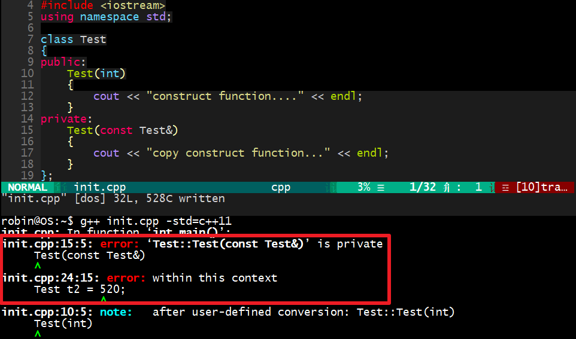

[C++ 教程 | 爱编程的大丙 (subingwen.cn)](https://subingwen.cn/cplusplus/)

# C++11新特性

# 原始字面量

[原始字面量 | 爱编程的大丙 (subingwen.cn)](https://subingwen.cn/cpp/R/)

在 C++11 中添加了定义原始字符串的字面量，定义方式为：R “xxx(原始字符串)xxx” 其中（）两边的字符串可以省略。原始字面量 R 可以直接表示字符串的实际含义，而不需要额外对字符串做转译或连接等操作。

比如：编程过程中，使用的字符串中常带有一些特殊字符，对于这些字符往往要做专门的处理，使用了原始字面量就可以轻松的解决这个问题了，比如打印路径：

```c++
#include<iostream>
#include<string>
using namespace std;
int main()
{
    string str = "D:\hello\world\test.text";
    cout << str << endl;
    string str1 = "D:\\hello\\world\\test.text";
    cout << str1 << endl;
    string str2 = R"(D:\hello\world\test.text)";
    cout << str2 << endl;

    return 0;
}
```

输出的结果为:

```c++
D:helloworld    est.text
D:\hello\world\test.text
D:\hello\world\test.text
```

- 在 `D:\hello\world\test.text` 中 `\h` 和 `\w` 转译失败，对应的字符会原样输出
- 在 `D:\\hello\\world\\test.text` 中路径的间隔符为 `\` 但是这个字符又是转译字符，因此需要使用转译字符将其转译，最终才能得到一个没有特殊含义的普通字符 `\`
- 在 `R"(D:\hello\world\test.text)"` 使用了原始字面量 R（）中的内容就是描述路径的原始字符串，无需做任何处理

通过测试可以看到，使用原始字面量 R 可以直接得到其原始意义的字符串，再看一个输出 HTML 标签的例子：

```c++
#include<iostream>
#include<string>
using namespace std;
int main()
{
    string str = "<html>\
        <head>\
        <title>\
        海贼王\
        </title>\
        </head>\
        <body>\
        <p>\
        我是要成为海贼王的男人!!!\
        </p>\
        </body>\
        </html>";
    cout << str << endl;
    return 0;
}
```

在 C++11 之前如果一个字符串分别写到了不同的行里边，需要加连接符，这种方式不仅繁琐，还破坏了表达式的原始含义，如果使用原始字面量就变得简单很多，很强直观，可读性强。

```c++
#include<iostream>
#include<string>
using namespace std;
int main()
{
    string str = R"(<html>
        <head>
        <title>
        海贼王
        </title>
        </head>
        <body>
        <p>
        我是要成为海贼王的男人!!!
        </p>
        </body>
        </html>)";
    cout << str << endl;

    return 0;
}
```

最后强调一个细节：`在R “xxx(raw string)xxx” 中，原始字符串必须用括号（）括起来，括号的前后可以加其他字符串，所加的字符串会被忽略，并且加的字符串必须在括号两边同时出现。`

```c++
#include<iostream>
#include<string>
using namespace std;
int main()
{
    string str1 = R"(D:\hello\world\test.text)";
    cout << str1 << endl;
    string str2 = R"luffy(D:\hello\world\test.text)luffy";
    cout << str2 << endl;
#if 0
    string str3 = R"luffy(D:\hello\world\test.text)robin";	// 语法错误，编译不通过
    cout << str3 << endl;
#endif

    return 0;
}
```

测试代码输出的结果为：

```
D:\hello\world\test.text
D:\hello\world\test.text
```

通过输出的信息可以得到如下结论：使用原始字面量 R “xxx (raw string) xxx”，（）两边的字符串在解析的时候是会被忽略的，因此一般不用指定。如果在（）前后指定了字符串，那么前后的字符串必须相同，否则会出现语法错误。

# 指针空值类型 - nullptr

[指针空值类型 - nullptr | 爱编程的大丙 (subingwen.cn)](https://subingwen.cn/cpp/nullptr/)

在 C++ 程序开发中，为了提高程序的健壮性，一般会在定义指针的同时完成初始化操作，或者在指针的指向尚未明确的情况下，都会给指针初始化为 `NULL`，避免产生`野指针（没有明确指向的指针，操作也这种指针极可能导致程序发生异常）`。C++98/03 标准中，将一个指针初始化为空指针的方式有 2 种：

```c++
char *ptr = 0;
char *ptr = NULL;
```

在底层源码中 `NULL` 这个宏是这样定义的:

```c++
#ifndef NULL
    #ifdef __cplusplus
        #define NULL 0
    #else
        #define NULL ((void *)0)
    #endif
#endif
```

也就是说如果源码是 **C++ 程序 `NULL` 就是 `0`**，如果是 **C 程序 `NULL` 表示 `(void*)0`**。那么为什么要这样做呢？ 是由于 C++ 中，`void *` 类型无法隐式转换为其他类型的指针，此时使用 `0` 代替 `((void *)0)`，用于解决空指针的问题。这个 0（0x0000 0000）表示的就是虚拟地址空间中的 0 地址，这块地址是只读的。

C++ 中将 NULL 定义为字面常量 0，并不能保证在所有场景下都能很好的工作，比如，函数重载时，`NULL` 和 `0` 无法区分：

```c++
#include <iostream>
using namespace std;

void func(char *p){
    cout << "void func(char *p)" << endl;
}

void func(int p){
    cout << "void func(int p)" << endl;
}

int main(){
    func(NULL);   // 想要调用重载函数 void func(char *p)
    func(250);    // 想要调用重载函数 void func(int p)

    return 0;
}
```

测试代码打印的结果为：

```
void func(int p)
void func(int p)
```

通过打印的结果可以看到，虽然调用 `func(NULL);` 最终链接到的还是 `void func(int p)` 和预期是不一样的，其实这个原因前边已经说的很明白了，在 C++ 中 `NULL` 和 `0` 是等价的。

出于兼容性的考虑，C++11 标准并没有对 NULL 的宏定义做任何修改，而是另其炉灶，引入了一个新的关键字 `nullptr`。

`nullptr 专用于初始化空类型指针，不同类型的指针变量都可以使用 nullptr 来初始化`：

```c++
int*    ptr1 = nullptr;
char*   ptr2 = nullptr;
double* ptr3 = nullptr;
```

对应上面的代码编译器会分别将 `nullptr` 隐式转换成` int*`、`char*` 以及 `double*` 指针类型。

使用 `nullptr` 可以很完美的解决上边提到的函数重载问题:

```c++
#include <iostream>
using namespace std;

void func(char *p){
    cout << "void func(char *p)" << endl;
}

void func(int p){
    cout << "void func(int p)" << endl;
}

int main(){
    func(nullptr);
    func(250);
    return 0;
}
```

测试代码输出的结果:

```
void func(char *p)
void func(int p)
```

通过输出的结果可以看出，nullptr 无法隐式转换为整形，但是可以隐式匹配指针类型。在 C++11 标准下，相比 NULL 和 0，使用 nullptr 初始化空指针可以令我们编写的程序更加健壮。

# 常量表达式修饰符 - constexpr

## const

在 C++11 之前只有 `const` 关键字，从功能上来说这个关键字有双重语义：`变量只读`，`修饰常量`，举一个简单的例子：

```c++
void func(const int num)
{
    const int count = 24;
    int array[num];            // error，num是一个只读变量，不是常量
    int array1[count];         // ok，count是一个常量

    int a1 = 520;
    int a2 = 250;
    const int& b = a1;
    b = a2;                         // error
    a1 = 1314;
    cout << "b: " << b << endl;     // 输出结果为1314
}
```

- 函数 `void func(const int num)` 的参数 `num` 表示这个变量是只读的，但不是常量，因此使用 `int array[num]; `这种方式定义一个数组，编译器是会报错的，提示 `num不可用作为常量来使用`。
- `const int count = 24;` 中的 `count` 却是一个常量，因此可以使用这个常量来定义一个静态数组。

另外，`变量只读并不等价于常量`，二者是两个概念不能混为一谈，分析一下这句测试代码 `const int& b = a1;`：

- `b` 是一个常量的引用，所以 b 引用的变量是不能被修改的，也就是说 `b = a2; `这句代码语法是错误的。
- 在 `const` 对于变量 `a1` 是没有任何约束的，`a1` 的值变了 `b` 的值也就变了
- 引用 `b` 是只读的，但是并不能保证它的值是不可改变的，也就是说它不是常量。

## constexpr

在 C++11 中添加了一个新的关键字 `constexpr`，这个关键字是用来修饰常量表达式的。所谓`常量表达式，指的就是由多个（≥1）常量（值不会改变）组成并且在编译过程中就得到计算结果的表达式。`

在介绍 [gcc/g++ 工作流程的时候说过](https://subingwen.cn/linux/gcc/#2-gcc-工作流程)，C++ 程序从编写完毕到执行分为四个阶段：`预处理`、 `编译`、`汇编`和`链接` 4 个阶段，得到可执行程序之后就可以运行了。需要额外强调的是，`常量表达式和非常量表达式的计算时机不同，非常量表达式只能在程序运行阶段计算出结果，但是常量表达式的计算往往发生在程序的编译阶段，这可以极大提高程序的执行效率`，因为表达式只需要在编译阶段计算一次，节省了每次程序运行时都需要计算一次的时间。

那么问题来了，编译器如何识别表达式是不是常量表达式呢？在 C++11 中添加了 `constexpr` 关键字之后就可以在程序中使用它来修改常量表达式，用来提高程序的执行效率。在使用中建议将 `const` 和 `constexpr` 的功能区分开，即`凡是表达“只读”语义的场景都使用 const，表达“常量”语义的场景都使用 constexpr。`

在定义常量时，`const` 和 `constexpr` 是等价的，都可以在程序的编译阶段计算出结果，例如：

```c++
const int m = f();  // 不是常量表达式，m的值只有在运行时才会获取。
const int i=520;    // 是一个常量表达式
const int j=i+1;    // 是一个常量表达式

constexpr int i=520;    // 是一个常量表达式
constexpr int j=i+1;    // 是一个常量表达式
```

对于 C++ 内置类型的数据，可以直接用 `constexpr` 修饰，但如果是自定义的数据类型（用 `struct` 或者 `class` 实现），直接用 `constexpr` 修饰是不行的。

```c++
C++
// 此处的constexpr修饰是无效的
constexpr struct Test
{
    int id;
    int num;
};
```

如果要定义一个结构体 / 类常量对象，可以这样写：

```c++
struct Test{
    int id;
    int num;
};

int main(){
    constexpr Test t{ 1, 2 };
    constexpr int id = t.id;
    constexpr int num = t.num;
    // error，不能修改常量
    t.num += 100;
    cout << "id: " << id << ", num: " << num << endl;

    return 0;
}
```

在第 13 行的代码中 `t.num += 100;` 的操作是错误的，对象 `t` 是一个常量，因此它的成员也是常量，常量是不能被修改的。

## 常量表达式函数

为了提高 C++ 程序的执行效率，我们可以将程序中值不需要发生变化的变量定义为常量，也可以使用 constexpr 修饰函数的返回值，这种函数被称作常量表达式函数，这些函数主要包括以下几种：普通函数/类成员函数、类的构造函数、模板函数。

### 修饰函数

`constexpr` 并不能修改任意函数的返回值，使得这些函数成为常量表达式函数，必须要满足以下几个条件：

1、函数必须要有返回值，并且 return 返回的表达式必须是常量表达式。

```c++
// error，不是常量表达式函数
constexpr void func1(){
    int a = 100;
    cout << "a: " << a << endl;
}

// error，不是常量表达式函数
constexpr int func1(){
    int a = 100;
    return a;
}
```

- 函数 `func1()` 没有返回值，不满足常量表达式函数要求
- 函数 `func2()` 返回值不是常量表达式，不满足常量表达式函数要求

2、函数在使用之前，必须有对应的定义语句。

```c++
#include <iostream>
using namespace std;

constexpr int func1();
int main(){
    constexpr int num = func1();	// error
    return 0;
}

constexpr int func1(){
    constexpr int a = 100;
    return a;
}
```

在测试程序 `constexpr int num = func1();` 中，还没有定义 `func1()` 就直接调用了，应该将 `func1()` 函数的定义放到 `main()` 函数的上边。

3、整个函数的函数体中，不能出现非常量表达式之外的语句（using 指令、typedef 语句以及 static_assert 断言、return 语句除外）。

```c++
// error
constexpr int func1()
{
    constexpr int a = 100;
    constexpr int b = 10;
    for (int i = 0; i < b; ++i)
    {
        cout << "i: " << i << endl;
    }
    return a + b;
}

// ok
constexpr int func2()
{
    using mytype = int;
    constexpr mytype a = 100;
    constexpr mytype b = 10;
    constexpr mytype c = a * b;
    return c - (a + b);
}
```

因为 `func1()` 是一个常量表达式函数，在函数体内部是不允许出现非常量表达式以外的操作，因此函数体内部的 `for` 循环是一个非法操作。

以上三条规则不仅对应普通函数适用，对应类的成员函数也是适用的：

```c++
class Test{
public:
    constexpr int func(){
        constexpr int var = 100;
        return 5 * var;
    }
};

int main(){
    Test t;
    constexpr int num = t.func();
    cout << "num: " << num << endl;

    return 0;
}
```

### 修饰模板函数

C++11 语法中，constexpr 可以修饰函数模板，但由于模板中类型的不确定性，因此函数模板实例化后的模板函数是否符合常量表达式函数的要求也是不确定的。`如果 constexpr 修饰的模板函数实例化结果不满足常量表达式函数的要求，则 constexpr 会被自动忽略，即该函数就等同于一个普通函数。`

```c++
#include <iostream>
using namespace std;

struct Person {
    const char* name;
    int age;
};

// 定义函数模板
template<typename T>
constexpr T dispaly(T t) {
    return t;
}

int main()
{
    struct Person p { "luffy", 19 };
    //普通函数
    struct Person ret = dispaly(p);
    cout << "luffy's name: " << ret.name << ", age: " << ret.age << endl;

    //常量表达式函数
    constexpr int ret1 = dispaly(250);
    cout << ret1 << endl;

    constexpr struct Person p1 { "luffy", 19 };
    constexpr struct Person p2 = dispaly(p1);
    cout << "luffy's name: " << p2.name << ", age: " << p2.age << endl;
    return 0;
}
```

在上面示例程序中定义了一个函数模板 `display()`，但由于其返回值类型未定，因此在实例化之前无法判断其是否符合常量表达式函数的要求：

- `struct Person ret = dispaly(p);` 由于参数 `p` 是变量，所以实例化后的函数不是常量表达式函数，此时 `constexpr` 是无效的
- `constexpr int ret1 = dispaly(250);` 参数是常量，符合常量表达式函数的要求，此时 `constexpr` 是有效的
- `constexpr struct Person p2 = dispaly(p1);` 参数是常量，符合常量表达式函数的要求，此时 `constexpr` 是有效的

### 修饰构造函数

如果想用直接得到一个常量对象，也可以使用 `constexpr` 修饰一个构造函数，这样就可以得到一个常量构造函数了。常量构造函数有一个要求：`构造函数的函数体必须为空，并且必须采用初始化列表的方式为各个成员赋值。`

```C++
#include <iostream>
using namespace std;

struct Person {
    constexpr Person(const char* p, int age) :name(p), age(age)
    {
    }
    const char* name;
    int age;
};

int main()
{
    constexpr struct Person p1("luffy", 19);
    cout << "luffy's name: " << p1.name << ", age: " << p1.age << endl;
    return 0;
}
```

# 自动类型推导

在 C++11 中增加了很多新的特性，比如可以使用 auto 自动推导变量的类型，还能够结合 decltype 来表示函数的返回值。使用新的特性可以让我们写出更加简洁，更加现代的代码。

## auto

在 C++11 之前 auto 和 static 是对应的，表示变量是自动存储的，但是非 static 的局部变量默认都是自动存储的，因此这个关键字变得非常鸡肋，在 C++11 中他们赋予了新的含义，使用这个关键字能够像别的语言一样自动推导出变量的实际类型。

### 推导规则

C++11 中 auto 并不代表一种实际的数据类型，只是一个类型声明的 “占位符”，auto 并不是万能的在任意场景下都能够推导出变量的实际类型，**使用auto声明的变量必须要进行初始化，以让编译器推导出它的实际类型，在编译时将auto占位符替换为真正的类型。**使用语法如下：

```C++
auto 变量名 = 变量值;
```

根据上述语法，来列举一些简单的例子：

```C++
auto x = 3.14;      // x 是浮点型 double
auto y = 520;       // y 是整形 int
auto z = 'a';       // z 是字符型 char
auto nb;            // error，变量必须要初始化
auto double nbl;    // 语法错误, 不能修改数据类型   
```

不仅如此，auto 还可以和指针、引用结合起来使用也可以带上 const、volatile 限定符，在不同的场景下有对应的推导规则，规则内容如下：

- **当变量不是指针或者引用类型时，推导的结果中不会保留 const、volatile 关键字**
- **当变量是指针或者引用类型时，推导的结果中会保留 const、volatile 关键字**

先来看一组变量带指针和引用并使用 auto 进行类型推导的例子：

```c++
int temp = 110;
auto *a = &temp;	
auto b = &temp;		
auto &c = temp;		
auto d = temp;		
```

- 变量 `a` 的数据类型为 `int*`，因此 auto 关键字被推导为 `int类型`
- 变量 `b` 的数据类型为 `int*`，因此 auto 关键字被推导为 `int*` 类型
- 变量 `c` 的数据类型为 `int&`，因此 auto 关键字被推导为 `int类型`
- 变量 `d` 的数据类型为 `int`，因此 auto 关键字被推导为 `int` 类型

在来看一组带 const 限定的变量，使用 auto 进行类型推导的例子:

```c++
int tmp = 250;
const auto a1 = tmp;
auto a2 = a1;
const auto &a3 = tmp;
auto &a4 = a3;
```

- 变量 `a1` 的数据类型为 `const int`，因此 auto 关键字被推导为 `int` 类型
- 变量 `a2` 的数据类型为 `int`，但是 a2 没有声明为指针或引用因此 const 属性被去掉，`auto` 被推导为 `int`
- 变量 `a3` 的数据类型为 `const int&`，a3 被声明为引用因此 const 属性被保留，auto 关键字被推导为 `int` 类型
- 变量 `a4` 的数据类型为 `const int&`，a4 被声明为引用因此 const 属性被保留，auto 关键字被推导为 `const int` 类型

### auto 的限制

auto 关键字并不是万能的，在以下这些场景中是不能完成类型推导的：

1、不能作为函数参数使用。因为只有在函数调用的时候才会给函数参数传递实参，auto 要求必须要给修饰的变量赋值，因此二者矛盾。

```c++
int func(auto a, auto b)	// error
{	
    cout << "a: " << a <<", b: " << b << endl;
}
```

2、不能用于类的非静态成员变量的初始化

```c++
class Test
{
    auto v1 = 0;                    // error
    static auto v2 = 0;             // error,类的静态非常量成员不允许在类内部直接初始化
    static const auto v3 = 10;      // ok
}
```

3、不能使用 auto 关键字定义数组

```c++
int func()
{
    int array[] = {1,2,3,4,5};  // 定义数组
    auto t1 = array;            // ok, t1被推导为 int* 类型
    auto t2[] = array;          // error, auto无法定义数组
    auto t3[] = {1,2,3,4,5};;   // error, auto无法定义数组
}
```

4、无法使用 auto 推导出模板参数

```c++
template <typename T>
struct Test{}

int func()
{
    Test<double> t;
    Test<auto> t1 = t;           // error, 无法推导出模板类型
    return 0;
}
```

### auto 的应用

了解了 auto 的限制之后，我们就可以避开这些场景快乐的编程了，下面列举几个比较常用的场景：

1、用于STL的容器遍历。

在 C++11 之前，定义了一个 stl 容器之后，遍历的时候常常会写出这样的代码：

```c++
#include <map>
int main(){
    map<int, string> person;
    map<int, string>::iterator it = person.begin();
    for (; it != person.end(); ++it){
        // do something
    }
    return 0;
}
```

可以看到在定义迭代器变量 it 的时候代码是很长的，写起来就很麻烦，使用了 auto 之后，就变得清爽了不少：

```c++
#include <map>
int main(){
    map<int, string> person;
    // 代码简化
    for (auto it = person.begin(); it != person.end(); ++it) {
        // do something
    }
    return 0;
}
```

2、用于泛型编程，在使用模板的时候，很多情况下我们不知道变量应该定义为什么类型，比如下面的代码：

```c++
#include <iostream>
#include <string>
using namespace std;

class T1{
public:
    static int get(){
        return 10;
    }
};

class T2{
public:
    static string get(){
        return "hello, world";
    }
};

template <class A>
void func(void){
    auto val = A::get();
    cout << "val: " << val << endl;
}

int main(){
    func<T1>();
    func<T2>();
    return 0;
}
```

在这个例子中定义了泛型函数 func，在函数中调用了类 A 的静态方法 get () ，这个函数的返回值是不能确定的，如果不使用 auto，就需要再定义一个模板参数，并且在外部调用时手动指定 get 的返回值类型，具体代码如下：

```c++
#include <iostream>
#include <string>
using namespace std;

class T1{
public:
    static int get(){
        return 0;
    }
};

class T2{
public:
    static string get(){
        return "hello, world";
    }
};

template <class A, typename B>        // 添加了模板参数 B
void func(void){
    B val = A::get();
    cout << "val: " << val << endl;
}

int main(){
    func<T1, int>();                  // 手动指定返回值类型 -> int
    func<T2, string>();               // 手动指定返回值类型 -> string
    return 0;
}
```

## decltype

在某些情况下，不需要或者不能定义变量，但是希望得到某种类型，这时候就可以使用 C++11 提供的 decltype 关键字了，它的作用是在编译器编译的时候推导出一个表达式的类型，语法格式如下：

```c++
decltype (表达式)
```

decltype 是 “declare type” 的缩写，意思是 “声明类型”。decltype 的推导是在编译期完成的，它只是用于表达式类型的推导，并不会计算表达式的值。来看一组简单的例子：

```c++
int a = 10;
decltype(a) b = 99;                 // b -> int
decltype(a+3.14) c = 52.13;         // c -> double
decltype(a+b*c) d = 520.1314;       // d -> double
```

可以看到 decltype 推导的表达式可简单可复杂，在这一点上 auto 是做不到的，auto 只能推导已初始化的变量类型

### 推导规则

通过上面的例子我们初步感受了一下 decltype 的用法，但不要认为 decltype 就这么简单，在它简单的背后隐藏着很多的细节，下面分三个场景依次讨论一下：

1、表达式为普通变量或者普通表达式或者类表达式，在这种情况下，使用 decltype 推导出的类型和表达式的类型是一致的。

```c++
#include <iostream>
#include <string>
using namespace std;

class Test {
public:
    string text;
    static const int value = 110;
};

int main() {
    int x = 99;
    const int &y = x;
    decltype(x) a = x;
    decltype(y) b = x;
    decltype(Test::value) c = 0;

    Test t;
    decltype(t.text) d = "hello, world";

    return 0;
}
```

- 变量 `a` 被推导为 `int` 类型
- 变量 `b` 被推导为 `const int &` 类型
- 变量 `c` 被推导为 `const int` 类型
- 变量 `d` 被推导为 `string` 类型

2、表达式是函数调用，使用 decltype 推导出的类型和函数返回值一致。

```c++
class Test{...};
//函数声明
int func_int();                 // 返回值为 int
int& func_int_r();              // 返回值为 int&
int&& func_int_rr();            // 返回值为 int&&

const int func_cint();          // 返回值为 const int
const int& func_cint_r();       // 返回值为 const int&
const int&& func_cint_rr();     // 返回值为 const int&&

const Test func_ctest();        // 返回值为 const Test

//decltype类型推导
int n = 100;
decltype(func_int()) a = 0;		
decltype(func_int_r()) b = n;	
decltype(func_int_rr()) c = 0;	
decltype(func_cint())  d = 0;	
decltype(func_cint_r())  e = n;	
decltype(func_cint_rr()) f = 0;	
decltype(func_ctest()) g = Test();	
```

- 变量 `a` 被推导为 `int` 类型
- 变量 `b` 被推导为 `int&` 类型
- 变量 `c` 被推导为 `int&&` 类型
- 变量 `d` 被推导为 `int` 类型
- 变量 `e` 被推导为 `const int &` 类型
- 变量 `f` 被推导为 `const int &&` 类型
- 变量 `g` 被推导为 `const Test` 类型

函数 func_cint () 返回的是一个纯右值（在表达式执行结束后不再存在的数据，也就是临时性的数据），`对于纯右值而言，只有类类型可以携带const、volatile限定符，除此之外需要忽略掉这两个限定符`，因此推导出的变量 d 的类型为 int 而不是 const int。

3、表达式是一个左值，或者被括号 `( )` 包围，使用 decltype 推导出的是表达式类型的引用（如果有 const、volatile 限定符不能忽略）。

```c++
#include <iostream>
#include <vector>
using namespace std;

class Test{
public:
    int num;
};

int main() {
    const Test obj;
    //带有括号的表达式
    decltype(obj.num) a = 0;
    decltype((obj.num)) b = a;
    //加法表达式
    int n = 0, m = 0;
    decltype(n + m) c = 0;
    decltype(n = n + m) d = n;
    return 0;
}
```

- `obj.num` 为类的成员访问表达式，符合场景 1，因此 `a `的类型为 `int`
- `obj.num` 带有括号，符合场景 3，因此 `b` 的类型为 `const int&`。
- `n+m` 得到一个右值，符合场景 1，因此 `c` 的类型为 `int`
- `n=n+m` 得到一个左值 n，符合场景 3，因此 `d` 的类型为 `int&`

### decltype 的应用

关于 decltype 的应用多出现在泛型编程中。比如我们编写一个类模板，在里边添加遍历容器的函数，操作如下：

```c++
#include <list>
using namespace std;

template <class T>
class Container{
public:
    void func(T& c){
        for (m_it = c.begin(); m_it != c.end(); ++m_it){
            cout << *m_it << " ";
        }
        cout << endl;
    }
private:
    ??? m_it;  // 这里不能确定迭代器类型
};

int main(){
    const list<int> lst;
    Container<const list<int>> obj;
    obj.func(lst);
    return 0;
}
```

在程序的第 17 行出了问题，关于迭代器变量一共有两种类型：`只读（T::const_iterator）`和`读写（T::iterator）`，有了 decltype 就可以完美的解决这个问题了，当 T 是一个 非 const 容器得到一个 T::iterator，当 T 是一个 const 容器时就会得到一个 `T::const_iterator`。

```c++
#include <list>
#include <iostream>
using namespace std;

template <class T>
class Container
{
public:
    void func(T& c)
    {
        for (m_it = c.begin(); m_it != c.end(); ++m_it)
        {
            cout << *m_it << " ";
        }
        cout << endl;
    }
private:
    decltype(T().begin()) m_it;  // 这里不能确定迭代器类型
};

int main()
{
    const list<int> lst{ 1,2,3,4,5,6,7,8,9 };
    Container<const list<int>> obj;
    obj.func(lst);
    return 0;
}
```

##  返回类型后置

在泛型编程中，可能需要通过参数的运算来得到返回值的类型，比如下面这个场景：

```c++
#include <iostream>
using namespace std;
// R->返回值类型, T->参数1类型, U->参数2类型
template <typename R, typename T, typename U>
R add(T t, U u) {
    return t + u;
}

int main() {
    int x = 520;
    double y = 13.14;
    // auto z = add<decltype(x + y), int, double>(x, y);
    auto z = add<decltype(x + y)>(x, y);	// 简化之后的写法
    cout << "z: " << z << endl;
    return 0;
}
```

关于返回值，从上面的代码可以推断出和表达式 `t+u` 的结果类型是一样的，因此可以通过通过 decltype 进行推导，关于模板函数的参数 `t` 和 `u` 可以通过实参自动推导出来，因此在程序中就也可以不写。虽然通过上述方式问题被解决了，但是解决方案有点过于理想化，因为对于调用者来说，是不知道函数内部执行了什么样的处理动作的。

因此如果要想解决这个问题就得直接在 `add` 函数身上做文章，先来看第一种写法：

```c++
template <typename T, typename U>
decltype(t+u) add(T t, U u) {
    return t + u;
}
```

当我们在编译器中将这几行代码改出来后就直接报错了，因此 decltype 中的 t 和 u 都是函数参数，直接这样写相当于变量还没有定义就直接用上了，这时候变量还不存在，有点心急了。

**在C++11中增加了返回类型后置语法，说明白一点就是将decltype和auto结合起来完成返回类型的推导**。其语法格式如下:

```c++
// 符号 -> 后边跟随的是函数返回值的类型
auto func(参数1, 参数2, ...) -> decltype(参数表达式)
```

通过对上述返回类型后置语法代码的分析，得到结论：`auto 会追踪 decltype() 推导出的类型`，因此上边的 `add()` 函数可以做如下的修改：

```c++
#include <iostream>
using namespace std;

template <typename T, typename U>
// 返回类型后置语法
auto add(T t, U u) -> decltype(t+u) {
    return t + u;
}

int main() {
    int x = 520;
    double y = 13.14;
    // auto z = add<int, double>(x, y);
    auto z = add(x, y);		// 简化之后的写法
    cout << "z: " << z << endl;
    return 0;
}
```

为了进一步说明这个语法，我们再看一个例子：

```c++
#include <iostream>
using namespace std;

int& test(int &i) {
    return i;
}

double test(double &d) {
    d = d + 100;
    return d;
}

template <typename T>
// 返回类型后置语法
auto myFunc(T& t) -> decltype(test(t)) {
    return test(t);
}

int main() {
    int x = 520;
    double y = 13.14;
    // auto z = myFunc<int>(x);
    auto z = myFunc(x);             // 简化之后的写法
    cout << "z: " << z << endl;

    // auto z = myFunc<double>(y);
    auto z1 = myFunc(y);            // 简化之后的写法
    cout << "z1: " << z1 << endl;
    return 0;
}
```

在这个例子中，通过 decltype 结合返回值后置语法很容易推导出来 `test(t)` 函数可能出现的返回值类型，并将其作用到了函数 `myFunc()` 上。

```
// 输出结果
z: 520
z1: 113.14
```

# final

C++ 中增加了 final 关键字来限制某个类不能被继承，或者某个虚函数不能被重写，和 Jave 的 final 关键字的功能是类似的。如果使用 final 修饰函数，只能修饰虚函数，并且**要把final关键字放到类或者函数的后面**。

## 修饰函数

如果使用 `final` 修饰函数，只能修饰虚函数，这样就能阻止子类重写父类的这个函数了：

```c++
class Base {
public:
    virtual void test() {
        cout << "Base class...";
    }
};

class Child : public Base {
public:
    void test() final {
        cout << "Child class...";
    }
};

class GrandChild : public Child{
public:
    // 语法错误, 不允许重写
    void test() {
        cout << "GrandChild class...";
    }
};
```

在上面的代码中一共有三个类：

- 基类：Base
- 子类：Child
- 孙子类：GrandChild

`test()` 是基类中的一个虚函数，在子类中重写了这个方法，但是不希望孙子类中继续重写这个方法了，因此在子类中将 `test()` 方法标记为 `final`，孙子类中对这个方法就只有使用的份了。

## 修饰类

使用 `final` 关键字修饰过的类是不允许被继承的，也就是说这个类不能有派生类。

```c++
class Base {
public:
    virtual void test() {
        cout << "Base class...";
    }
};

class Child final: public Base {
public:
    void test() {
        cout << "Child class...";
    }
};

// error, 语法错误
class GrandChild : public Child {
public:
};
```

Child 类是被 final 修饰过的，因此 Child 类不允许有派生类 GrandChild 类的继承是非法的，Child 是个断子绝孙的类。

# override

override 关键字确保在派生类中声明的重写函数与基类的虚函数有相同的签名，同时也明确表明将会重写基类的虚函数，这样就可以保证重写的虚函数的正确性，也提高了代码的可读性，和 final 一样**这个关键字要写到方法的后面**。使用方法如下：

```c++
class Base {
public:
    virtual void test() {
        cout << "Base class...";
    }
};

class Child : public Base {
public:
    void test() override {
        cout << "Child class...";
    }
};

class GrandChild : public Child {
public:
    void test() override {
        cout << "Child class...";
    }
};
```

上述代码中第 13 行和第 22 行就是显示指定了要重写父类的 `test()` 方法，使用了 `override` 关键字之后，假设在重写过程中因为误操作，写错了函数名或者函数参数或者返回值编译器都会提示语法错误，提高了程序的正确性，降低了出错的概率。

# 模板的优化

## 模板的右尖括号

在泛型编程中，模板实例化有一个非常繁琐的地方，那就是连续的两个右尖括号（>>）会被编译器解析成右移操作符，而不是模板参数表的结束。我们先来看一段关于容器遍历的代码，在创建的类模板 Base 中提供了遍历容器的操作函数 traversal():

```c++
// test.cpp
#include <iostream>
#include <vector>
using namespace std;

template <typename T>
class Base {
public:
    void traversal(T& t) {
        auto it = t.begin();
        for (; it != t.end(); ++it) {
            cout << *it << " ";
        }
        cout << endl;
    }
};


int main() {
    vector<int> v{ 1,2,3,4,5,6,7,8,9 };
    Base<vector<int>> b;
    b.traversal(v);

    return 0;
}
```

如果使用 `C++98/03` 标准来编译上边的这段代码，就会得到如下的错误提示：

```
test.cpp:25:20: error: '>>' should be '> >' within a nested template argument list
     Base<vector<int>> b;
```

根据错误提示中描述模板的两个右尖括之间需要添加空格，这样写起来就非常的麻烦，`C++11改进了编译器的解析规则，尽可能地将多个右尖括号（>）解析成模板参数结束符`，方便我们编写模板相关的代码。

上面的这段代码，在支持 C++11 的编译器中编译是没有任何问题的，如果使用 g++ 直接编译需要加参数 `-std=c++11`：

```shell
$ g++ test.cpp -std=c++11 -o app
```

## 默认模板参数

在 C++98/03 标准中，类模板可以有默认的模板参数：

```c++
#include <iostream>
using namespace std;

template <typename T=int, T t=520>
class Test {
public:
    void print() {
        cout << "current value: " << t << endl;
    }
};

int main() {
    Test<> t;
    t.print();

    Test<int, 1024> t1;
    t1.print();

    return 0;
}
```

但是不支持函数的默认模板参数，`在C++11中添加了对函数模板默认参数的支持`:

```c++
#include <iostream>
using namespace std;

template <typename T=int>	// C++98/03不支持这种写法, C++11中支持这种写法
void func(T t) {
    cout << "current value: " << t << endl;
}

int main() {
    func(100);
    return 0;
}
```

通过上面的例子可以得到如下结论：当所有模板参数都有默认参数时，函数模板的调用如同一个普通函数。但对于类模板而言，哪怕所有参数都有默认参数，在使用时也必须在模板名后跟随 `<>` 来实例化。

另外：函数模板的默认模板参数在使用规则上和其他的默认参数也有一些不同，它没有必须写在参数表最后的限制。这样当默认模板参数和模板参数自动推导结合起来时，书写就显得非常灵活了。我们可以指定函数模板中的一部分模板参数使用默认参数，另一部分使用自动推导，比如下面的例子：

```c++
#include <iostream>
#include <string>
using namespace std;

template <typename R = int, typename N>
R func(N arg) {
    return arg;
}

int main() {
    auto ret1 = func(520);
    cout << "return value-1: " << ret1 << endl;

    auto ret2 = func<double>(52.134);
    cout << "return value-2: " << ret2 << endl;

    auto ret3 = func<int>(52.134);
    cout << "return value-3: " << ret3 << endl;

    auto ret4 = func<char, int>(100);
    cout << "return value-4: " << ret4 << endl;

    return 0;
}
```

测试代码输出的结果为:

```
return value-1: 520
return value-2: 52.134
return value-3: 52
return value-4: d
```

根据得到的日志输出，分析一下示例代码中调用的模板函数：

- ```
  auto ret = func(520);
  ```

  - 函数返回值类型使用了默认的模板参数，函数的参数类型是自动推导出来的为 `int` 类型。

- ```
  auto ret1 = func<double>(52.134);
  ```

  - 函数的返回值指定为 `double` 类型，函数参数是通过实参推导出来的，为 `double` 类型

- ```
  auto ret3 = func<int>(52.134);
  ```

  - 函数的返回值指定为 `int` 类型，函数参数是通过实参推导出来的，为 `double` 类型

- ```
  auto ret4 = func<char, int>(100);
  ```

  - 函数的参数为指定为 `int` 类型，函数返回值指定为 `char` 类型，不需要推导

当默认模板参数和模板参数自动推导同时使用时（优先级从高到低）：

- `如果可以推导出参数类型则使用推导出的类型`
- `如果函数模板无法推导出参数类型，那么编译器会使用默认模板参数`
- `如果无法推导出模板参数类型并且没有设置默认模板参数，编译器就会报错。`

看一下下面的例子：

```c++
#include <iostream>
#include <string>
using namespace std;

// 函数模板定义
template <typename T, typename U = char>
void func(T arg1 = 100, U arg2 = 100)
{
    cout << "arg1: " << arg1 << ", arg2: " << arg2 << endl;
}

int main()
{
    // 模板函数调用
    func('a');
    func(97, 'a');
    // func();    //编译报错
    return 0;
}
```

程序输出的结果为:

```
arg1: a, arg2: d
arg1: 97, arg2: a
```

分析一下调用的模板函数 func()：

- func('a')：参数 T 被自动推导为 char 类型，U 使用的默认模板参数为 char 类型

- func(97, 'a');：参数 T 被自动推导为 int 类型，U 使用推导出的类型为 char

- func();：参数 T 没有指定默认模板类型，并且无法自动推导，编译器会直接报错
  - 模板参数类型的自动推导是根据模板函数调用时指定的实参进行推断的，没有实参则无法推导
  - **模板参数类型的自动推导不会参考函数模板中指定的默认参数**。

# using的使用

在 C++ 中 using 用于声明命名空间，使用命名空间也可以防止命名冲突。在程序中声明了命名空间之后，就可以直接使用命名空间中的定义的类了。在 C++11 中赋予了 using 新的功能，让 C++ 变得更年轻，更灵活。

## 定义别名

在 C++ 中可以通过 typedef 重定义一个类型，语法格式如下：

```c++
typedef 旧的类型名 新的类型名;
// 使用举例
typedef unsigned int uint_t;
```

被重定义的类型并不是一个新的类型，仅仅只是原有的类型取了一个新的名字。和以前的声明语句一样，这里的声明符也可以包含类型修饰，从而也能由基本数据类型构造出复合类型来。C++11 中规定了一种新的方法，使用别名声明 (alias declaration) 来定义类型的别名，即使用 using。

在使用的时候，关键字 using 作为别名声明的开始，其后紧跟别名和等号，其作用是把等号左侧的名字规定成等号右侧类型的别名。**类型别名和类型的名字等价，只要是类型的名字能出现的地方，就能使用类型别名。使用typedef定义的别名和使用using定义的别名在语义上是等效的。**

使用 using 定义别名的语法格式是这样的：

```c++
C++
using 新的类型 = 旧的类型;
// 使用举例
using uint_t = int;
```

通过 using 和 typedef 的语法格式可以看到二者的使用没有太大的区别，假设我们定义一个函数指针，using 的优势就能凸显出来了，看一下下面的例子：

```c++
C++
// 使用typedef定义函数指针
typedef int(*func_ptr)(int, double);

// 使用using定义函数指针
using func_ptr1 = int(*)(int, double);
```

如果不是特别熟悉函数指针与 typedef，第一眼很难看出 func_ptr 其实是一个别名，其本质是一个函数指针，指向的函数返回类型是 int，函数参数有两个分别是 int，double 类型。

使用 using 定义函数指针别名的写法看起来就非常直观了，**把别名的名字强制分离到了左边，而把别名对应的实际类型放在了右边**，比较清晰，可读性比较好。

## 模板的别名

使用 typedef 重定义类似很方便，但是它有一点限制，比如无法重定义一个模板，比如我们需要一个固定以 int 类型为 key 的 map，它可以和很多类型的 value 值进行映射，如果使用 typedef 这样直接定义就非常麻烦:

```c++
C++
typedef map<int, string> m1;
typedef map<int, int> m2;
typedef map<int, double> m3;
```

在这种情况下我们就不自觉的想到了模板：

```c++
C++
template <typename T>
typedef map<int, T> type;	// error, 语法错误
```

使用 typename 不支持给模板定义别名，这个简单的需求仅通过 typedef 很难办到，需要添加一个外敷类：

```c++
C++
#include <iostream>
#include <functional>
#include <map>
using namespace std;

template <typename T>
// 定义外敷类
struct MyMap
{
    typedef map<int, T> type;
};

int main(void)
{
    MyMap<string>::type m;
    m.insert(make_pair(1, "luffy"));
    m.insert(make_pair(2, "ace"));

    MyMap<int>::type m1;
    m1.insert(1, 100);
    m1.insert(2, 200);

    return 0;
}
```

通过上边的例子可以直观的感觉到，需求简单但是实现起来并不容易。**在 C++11 中，新增了一个特性就是可以通过使用 using 来为一个模板定义别名**，对于上面的需求可以写成这样：

```c++
C++
template <typename T>
using mymap = map<int, T>;
```

完整的示例代码如下:

```c++
C++
#include <iostream>
#include <functional>
#include <map>
using namespace std;

template <typename T>
using mymap = map<int, T>;

int main(void)
{
    // map的value指定为string类型
    mymap<string> m;
    m.insert(make_pair(1, "luffy"));
    m.insert(make_pair(2, "ace"));

    // map的value指定为int类型
    mymap<int> m1;
    m1.insert(1, 100);
    m1.insert(2, 200);

    return 0;
}
```

上面的例子中通过使用 using 给模板指定别名，就可以基于别名非常方便的给 value 指定相应的类型，这样使编写的程序变得更加灵活，看起来也更加简洁一些。

最后在强调一点：using 语法和 typedef 一样，并不会创建出新的类型，它们只是给某些类型定义了新的别名。using 相较于 typedef 的优势在于定义函数指针别名时看起来更加直观，并且可以给模板定义别名。

# 委托构造和继承构造函数

## 委托构造函数

委托构造函数允许使用同一个类中的一个构造函数调用其它的构造函数，从而简化相关变量的初始化。下面举例说明：

```c++
#include <iostream>
using namespace std;

class Test
{
public:
    Test() {};
    Test(int max)
    {
        this->m_max = max > 0 ? max : 100;
    }

    Test(int max, int min)
    {
        this->m_max = max > 0 ? max : 100;              // 冗余代码
        this->m_min = min > 0 && min < max ? min : 1;   
    }

    Test(int max, int min, int mid)
    {
        this->m_max = max > 0 ? max : 100;             // 冗余代码
        this->m_min = min > 0 && min < max ? min : 1;  // 冗余代码
        this->m_middle = mid < max && mid > min ? mid : 50;
    }

    int m_min;
    int m_max;
    int m_middle;
};

int main()
{
    Test t(90, 30, 60);
    cout << "min: " << t.m_min << ", middle: " 
         << t.m_middle << ", max: " << t.m_max << endl;
    return 0;
}
```

在上面的程序中有三个构造函数，但是这三个函数中都有重复的代码，在 C++11 之前构造函数是不能调用构造函数的，加入了委托构造之后，我们就可以轻松地完成代码的优化了：

```c++
#include <iostream>
using namespace std;

class Test
{
public:
    Test() {};
    Test(int max)
    {
        this->m_max = max > 0 ? max : 100;
    }

    Test(int max, int min):Test(max)
    {
        this->m_min = min > 0 && min < max ? min : 1;
    }

    Test(int max, int min, int mid):Test(max, min)
    {
        this->m_middle = mid < max && mid > min ? mid : 50;
    }

    int m_min;
    int m_max;
    int m_middle;
};

int main()
{
    Test t(90, 30, 60);
    cout << "min: " << t.m_min << ", middle: " 
         << t.m_middle << ", max: " << t.m_max << endl;
    return 0;
}
```

在修改之后的代码中可以看到，重复的代码全部没有了，并且在一个构造函数中调用了其他的构造函数用于相关数据的初始化，相当于是一个链式调用。在使用委托构造函数的时候还需要注意一些几个问题：

- 这种链式的构造函数调用**不能形成一个闭环（死循环）**，否则会在运行期抛异常。
- 如果要进行多层构造函数的链式调用，建议将构造函数的调用的写在初始列表中而**不是函数体内部，否则编译器会提示形参的重复定义**。

```c++
Test(int max)
{
    this->m_max = max > 0 ? max : 100;
}

Test(int max, int min)
{
    Test(max);	// error, 此处编译器会报错, 提示形参max被重复定义
    this->m_min = min > 0 && min < max ? min : 1;
}
```

- 在初始化列表中调用了代理构造函数初始化某个类成员变量之后，就不能在初始化列表中再次初始化这个变量了。

```c++
// 错误, 使用了委托构造函数就不能再次m_max初始化了
Test(int max, int min) : Test(max), m_max(max)
{
    this->m_min = min > 0 && min < max ? min : 1;
}
```

## 继承构造函数

C++11 中提供的继承构造函数可以让派生类直接使用基类的构造函数，而无需自己再写构造函数，尤其是在基类有很多构造函数的情况下，可以极大地简化派生类构造函数的编写。先来看没有继承构造函数之前的处理方式：

```c++
#include <iostream>
#include <string>
using namespace std;

class Base
{
public:
    Base(int i) :m_i(i) {}
    Base(int i, double j) :m_i(i), m_j(j) {}
    Base(int i, double j, string k) :m_i(i), m_j(j), m_k(k) {}

    int m_i;
    double m_j;
    string m_k;
};

class Child : public Base
{
public:
    Child(int i) :Base(i) {}
    Child(int i, double j) :Base(i, j) {}
    Child(int i, double j, string k) :Base(i, j, k) {}
};

int main()
{
    Child c(520, 13.14, "i love you");
    cout << "int: " << c.m_i << ", double: " 
         << c.m_j << ", string: " << c.m_k << endl;
    return 0;
}
```

通过测试代码可以看出，在子类中初始化从基类继承的类成员，需要在子类中重新定义和基类一致的构造函数，这是非常繁琐的，C++11 中通过添加继承构造函数这个新特性完美的解决了这个问题，使得代码更加精简。

继承构造函数的使用方法是这样的：通过使用 **using 类名::构造函数名**（其实类名和构造函数名是一样的）来声明使用基类的构造函数，这样子类中就可以不定义相同的构造函数了，直接使用基类的构造函数来构造派生类对象。

```c++
#include <iostream>
#include <string>
using namespace std;

class Base
{
public:
    Base(int i) :m_i(i) {}
    Base(int i, double j) :m_i(i), m_j(j) {}
    Base(int i, double j, string k) :m_i(i), m_j(j), m_k(k) {}

    int m_i;
    double m_j;
    string m_k;
};

class Child : public Base
{
public:
    using Base::Base;
};

int main()
{
    Child c1(520, 13.14);
    cout << "int: " << c1.m_i << ", double: " << c1.m_j << endl;
    Child c2(520, 13.14, "i love you");
    cout << "int: " << c2.m_i << ", double: " 
         << c2.m_j << ", string: " << c2.m_k << endl;
    return 0;
}
```

在修改之后的子类中，没有添加任何构造函数，而是添加了 `using Base::Base;` 这样就可以在子类中直接继承父类的所有的构造函数，通过他们去构造子类对象了。

另外如果在子类中隐藏了父类中的同名函数，也可以通过 `using` 的方式在子类中使用基类中的这些父类函数：

```c++
#include <iostream>
#include <string>
using namespace std;

class Base
{
public:
    Base(int i) :m_i(i) {}
    Base(int i, double j) :m_i(i), m_j(j) {}
    Base(int i, double j, string k) :m_i(i), m_j(j), m_k(k) {}

    void func(int i)
    {
        cout << "base class: i = " << i << endl;
    }
    
    void func(int i, string str)
    {
        cout << "base class: i = " << i << ", str = " << str << endl;
    }

    int m_i;
    double m_j;
    string m_k;
};

class Child : public Base
{
public:
    using Base::Base;
    using Base::func;
    void func()
    {
        cout << "child class: i'am luffy!!!" << endl;
    }
};

int main()
{
    Child c(250);
    c.func();
    c.func(19);
    c.func(19, "luffy");
    return 0;
}
```

上述示例代码输出的结果为：

```
child class: i'am luffy!!!
base class: i = 19
base class: i = 19, str = luffy
```

子类中的 `func()` 函数隐藏了基类中的两个 `func()` 因此默认情况下通过子类对象只能调用无参的 `func()`，在上面的子类代码中添加了 `using Base::func;` 之后，就可以通过子类对象直接调用父类中被隐藏的带参 `func()` 函数了。

# 列表初始化

关于 C++ 中的变量，数组，对象等都有不同的初始化方法，在这些繁琐的初始化方法中没有任何一种方式适用于所有的情况。为了统一初始化方式，并且让初始化行为具有确定的效果，在 C++11 中提出了列表初始化的概念。

## 统一的初始化

在 C++98/03 中，对应普通数组和可以直接进行内存拷贝（memcpy ()）的对象是可以使用列表初始化来初始化数据的

```c++
// 数组的初始化
int array[] = { 1,3,5,7,9 };
double array1[3] = { 1.2, 1.3, 1.4 };

// 对象的初始化
struct Person
{
    int id;
    double salary;
}zhang3{ 1, 3000 };
```

在 C++11 中，列表初始化变得更加灵活了，来看一下下面这段初始化类对象的代码：

```c++
#include <iostream>
using namespace std;

class Test
{
public:
    Test(int) {}
private:
    Test(const Test &);
};

int main(void)
{
    Test t1(520);
    Test t2 = 520; 
    Test t3 = { 520 };
    Test t4{ 520 };
    int a1 = { 1314 };
    int a2{ 1314 };
    int arr1[] = { 1, 2, 3 };
    int arr2[]{ 1, 2, 3 };
    return 0;
}
```

具体地来解读一下上面代码中使用的各种初始化方式：

- `t1`：最中规中矩的初始化方式，通过提供的带参构造进行对象的初始化
- `t2`：语法错误，因为提供的拷贝构造函数是私有的。如果拷贝构造函数是公共的，`520` 会通过隐式类型转换被 `Test(int)` 构造成一个匿名对象，然后再通过对这个匿名对象进行拷贝构造得到 `t2`（这个错误在 VS 中不会出现，在 Linux 中使用 g++ 编译会提示描述的这个错误，截图如下。）



- `t3` 和 `t4`：使用了 C++11 的初始化方式来初始化对象，效果和 `t1` 的方式是相同的。
  - 在初始时，{} 前面的等号是否书写对初始化行为没有任何影响。
  - `t3` 虽然使`用了等号，但是它仍然是列表初始化`，因此私有的拷贝构造对它没有任何影响。
- `t1、arr1` 和 `t2、arr2`：这两个是基础数据类型的列表初始化方式，可以看到，和对象的初始化方式是统一的。
- `t4`、`a2`、`arr2` 的写法，是 C++11 中新添加的语法格式，`使用这种方式可以直接在变量名后边跟上初始化列表，来进行变量或者对象的初始化。`

既然使用列表初始化可以对普通类型以及对象进行直接初始化，那么在使用 new 操作符创建新对象的时候可以使用列表初始化进行对象的初始化吗？答案是肯定的，来看下面的例子：

```c++
int * p = new int{520};
double b = double{52.134};
int * array = new int[3]{1,2,3};
```

- `指针p` 指向了一个 new 操作符返回的内存，通过列表初始化将内存数据初始化为了 520
- `变量b` 是对匿名对象使用列表初始之后，再进行拷贝初始化。
- `数组array` 在堆上动态分配了一块内存，通过列表初始化的方式直接完成了多个元素的初始化。

除此之外，列表初始化还可以直接用在函数返回值上：

```c++
#include <iostream>
#include <string>
using namespace std;

class Person
{
public:
    Person(int id, string name)
    {
        cout << "id: " << id << ", name: " << name << endl;
    }
};

Person func()
{
    return { 9527, "华安" };
}

int main(void)
{
    Person p = func();
    return 0;
}
```

代码中的 `return { 9527, "华安" };` 就相当于 `return (9527, "华安" );`，直接返回了一个匿名对象。通过上面的几个例子可以看出在 C++11 使用列表初始化是非常便利的，它统一了各种对象的初始化方式，而且还让代码的书写更加简单清晰。

## 列表初始化细节

###  聚合体

在 C++11 中，列表初始化的使用范围被大大增强了，但是一些模糊的概念也随之而来，在前面的例子可以得知，列表初始化可以用于自定义类型的初始化，但是对于一个自定义类型，列表初始化可能有两种执行结果

```c++
#include <iostream>
#include <string>
using namespace std;

struct T1
{
    int x;
    int y;
}a = { 123, 321 };

struct T2
{
    int x;
    int y;
    T2(int, int) : x(10), y(20) {}
}b = { 123, 321 };

int main(void)
{
    cout << "a.x: " << a.x << ", a.y: " << a.y << endl;
    cout << "b.x: " << b.x << ", b.y: " << b.y << endl;
    return 0;
}
```

程序执行的结果是这样的:

```
a.x: 123, a.y: 321
b.x: 10, b.y: 20
```

在上边的程序中都是用列表初始化的方式对对象进行了初始化，但是得到结果却不同，对象 b 并没有被初始化列表中的数据初始化，这是为什么呢？

- **对象 a 是对一个自定义的聚合类型进行初始化，它将以拷贝的形式使用初始化列表中的数据来初始化 T1 结构体中的成员。**
- **在结构体 T2 中自定义了一个构造函数，因此实际的初始化是通过这个构造函数完成的。**

现在很多小伙伴可能就一头雾水了，同样是自定义结构体并且在创建对象的时候都使用了列表初始化来初始化对象，为什么在类内部对对象的初始化方式却不一样呢？**因为如果使用列表初始化对对象初始化时，还需要判断这个对象对应的类型是不是一个聚合体，如果是初始化列表中的数据就会拷贝到对象中。**

那么，使用列表初始化时，对于什么样的类型 C++ 会认为它是一个聚合体呢？

1、普通数组本身可以看做是一个聚合类型

```c++
int x[] = {1,2,3,4,5,6};
double y[3][3] = {
    {1.23, 2.34, 3.45},
    {4.56, 5.67, 6.78},
    {7.89, 8.91, 9.99},
};
char carry[] = {'a', 'b', 'c', 'd', 'e', 'f'};
std::string sarry[] = {"hello", "world", "nihao", "shijie"};
```

2、满足以下条件的类（class、struct、union）可以被看做是一个聚合类型：

- 无用户自定义的构造函数。
- 无私有或保护的非静态数据成员。
  - 场景 1: 类中有私有成员，无法使用列表初始化进行初始化

```c++
struct T1
{
    int x;
    long y;
protected:
    int z;
}t{ 1, 100, 2};		// error, 类中有私有成员, 无法使用初始化列表初始化
```

- 场景 2：类中有非静态成员可以通过列表初始化进行初始化，但它不能初始化静态成员变量。	

```c++
struct T2
{
    int x;
    long y;
protected:
    static int z;
}t{ 1, 100， 2};		// error
```

**结构体中的静态变量 z 不能使用列表初始化进行初始化，它的初始化遵循静态成员的初始化方式。**

```c++
struct T2
{
    int x;
    long y;
protected:
    static int z;
}t{ 1, 100};		// ok
// 静态成员的初始化
int T2::z = 2;
```

- 无基类。
- 无虚函数。

- 类中不能有使用 `{}` 和 `=` 直接初始化的非静态数据成员（从 c++14 开始就支持了）。

```c++
#include <iostream>
#include <string>
using namespace std;

struct T2
{
    int x;
    long y;
protected:
    static int z;
}t1{ 1, 100 };		// ok
// 静态成员的初始化
int T2::z = 2;

struct T3
{
    int x;
    double y = 1.34;
    int z[3]{1,2,3};
};

int main(void)
{
    T3 t{520, 13.14, {6,7,8}};		// error, c++11不支持,从c++14开始就支持了
    return 0;
}
```

**从C++14开始，使用列表初始化也可以初始化在类中使用{}和=初始化过的非静态数据成员。**

## 非聚合体

对于聚合类型的类可以直接使用列表初始化进行对象的初始化，如果不满足聚合条件还想使用列表初始化其实也是可以的，**需要在类的内部自定义一个构造函数, 在构造函数中使用初始化列表对类成员变量进行初始化**:

```c++
#include <iostream>
#include <string>
using namespace std;

struct T1
{
    int x;
    double y;
    // 在构造函数中使用初始化列表初始化类成员
    T1(int a, double b, int c) : x(a), y(b), z(c){}
    virtual void print()
    {
        cout << "x: " << x << ", y: " << y << ", z: " << z << endl;
    }
private:
    int z;
};

int main(void)
{
    T1 t{ 520, 13.14, 1314 };	// ok, 基于构造函数使用初始化列表初始化类成员
    t.print();
    return 0;
}
```

另外，需要额外注意的是**聚合类型的定义并非递归的**，也就是说**当一个类的非静态成员是非聚合类型时，这个类也可能是聚合类型**，比如下面的这个例子：

```c++
#include <iostream>
#include <string>
using namespace std;

struct T1
{
    int x;
    double y;
private:
    int z;
};

struct T2
{
    T1 t1;
    long x1;
    double y1;
};

int main(void)
{
    T2 t2{ {}, 520, 13.14 };
    return 0;
}
```

可以看到，T1 并非一个聚合类型，因为它有一个 Private 的非静态成员。但是尽管 T2 有一个非聚合类型的非静态成员 t1，T2 依然是一个聚合类型，可以直接使用列表初始化的方式进行初始化。

最后强调一下 t2 对象的初始化过程，对于非聚合类型的成员 t1 做初始化的时候，可以直接写一对空的大括号 `{}`，这相当于调用是 T1 的无参构造函数。

**对于一个聚合类型，使用列表初始化相当于对其中的每个元素分别赋值，而对于非聚合类型，则需要先自定义一个合适的构造函数，此时使用列表初始化将会调用它对应的构造函数。**

## std::initializer_list

在 C++ 的 STL 容器中，可以进行任意长度的数据的初始化，使用初始化列表也只能进行固定参数的初始化，如果想要做到和 STL 一样有任意长度初始化的能力，可以使用 `std::initializer_list` 这个轻量级的类模板来实现。

先来介绍一下这个类模板的一些特点：

- 它是一个轻量级的容器类型，内部定义了迭代器 `iterator` 等容器必须的概念，`遍历时得到的迭代器是只读的。`
- 对于 `std::initializer_list<T>` 而言，它可以接收任意长度的初始化列表，但是要求元素必须是同种类型 T
- 在 `std::initializer_list` 内部有三个成员接口：`size()`, `begin()`, `end()`。
- `std::initializer_list` 对象只能被整体初始化或者赋值。

### 作为普通函数参数

如果想要自定义一个函数并且接收任意个数的参数（变参函数），只需要将函数参数指定为 `std::initializer_list`，使用初始化列表 `{ }` 作为实参进行数据传递即可。

```c++
#include <iostream>
#include <string>
using namespace std;

void traversal(std::initializer_list<int> a)
{
    for (auto it = a.begin(); it != a.end(); ++it)
    {
        cout << *it << " ";
    }
    cout << endl;
}

int main(void)
{
    initializer_list<int> list;
    cout << "current list size: " << list.size() << endl;
    traversal(list);

    list = { 1,2,3,4,5,6,7,8,9,0 };
    cout << "current list size: " << list.size() << endl;
    traversal(list);
    cout << endl;
    
    list = { 1,3,5,7,9 };
    cout << "current list size: " << list.size() << endl;
    traversal(list);
    cout << endl;

    ////////////////////////////////////////////////////
    ////////////// 直接通过初始化列表传递数据 //////////////
    ////////////////////////////////////////////////////
    traversal({ 2, 4, 6, 8, 0 });
    cout << endl;

    traversal({ 11,12,13,14,15,16 });
    cout << endl;


    return 0;
}
```

示例代码输出的结果：

```
current list size: 0

current list size: 10
1 2 3 4 5 6 7 8 9 0

current list size: 5
1 3 5 7 9

2 4 6 8 0

11 12 13 14 15 16
```

**std::initializer_list拥有一个无参构造函数**，因此，它可以直接定义实例，此时将**得到一个空的std::initializer_list**，因为在遍历这种类型的容器的时候得到的是一个只读的迭代器，因此我们不能修改里边的数据，只能通过值覆盖的方式进行容器内部数据的修改。虽然如此，在效率方面也无需担心，**std::initializer_list的效率是非常高的，它的内部并不负责保存初始化列表中元素的拷贝，仅仅存储了初始化列表中元素的引用**。

### 作为构造函数参数

自定义的类如果在构造对象的时候想要接收任意个数的实参，可以给构造函数指定为 **std::initializer_list**类型，在自定义类的内部还是使用容器来存储接收的多个实参。

