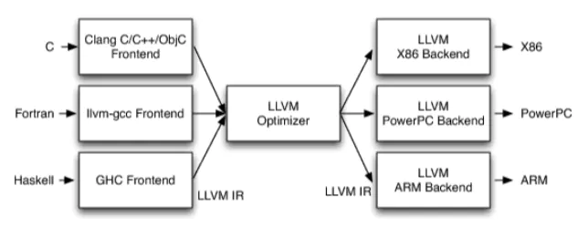

# 第一阶段 基础语法入门

# 环境搭建

## 相关概念

https://www.jianshu.com/p/1367dad95445

### LLVM

LLVM是构架[编译器](https://baike.baidu.com/item/编译器/8853067)(compiler)的框架系统，以C++编写而成，用于优化以任意程序语言编写的程序的编译时间(compile-time)、链接时间(link-time)、运行时间(run-time)以及空闲时间(idle-time)，对开发者保持开放，并兼容已有脚本。



### Clang

LLVM项目的一个子项目，基于LLVM架构的C/C++/Objective-C编译器前端。


LLVM整体架构，前端用的是clang，广义的LLVM是指整个LLVM架构，一般狭义的LLVM指的是LLVM后端（包含代码优化和目标代码生成）。

源代码（c/c++）经过clang--> 中间代码(经过一系列的优化，优化用的是Pass) --> 机器码

0.找到main.m文件

1.预处理器，处理include、import、宏定义

2.编译器编译，编译成ir中间代码

 3.后端，生成目标代码

4.汇编

5.链接其他动态库静态库

 6.编译成适合某个架构的代码

### MinGW-w64

- C/C++编译器

- Minimalist GNU on Windows，将经典的开源 C语言 编译器 GCC 移植到了 Windows 平台下，并且包含了 Win32API ，**MinGW 就是 GCC 的 Windows 版本 。**

- MinGW 本身已经很久没有更新了,后来就有了MinGW-w64

### gcc

GNU Compiler Collection  GNU编译器套件，GNU编译器套件包括C、C++、 Objective-C、 Fortran、Java、Ada和Go语言前端，也包括了这些语言的库（如libstdc++，libgcj等。）

### GNU

GNU's Not Unix! 是一个操作系统


## vscode

安装MinGW-w64 https://sourceforge.net/projects/mingw-w64/files/
，配置好环境变量

必备插件：

1. C/C++ for Visual Studio Code 来自微软官方，代码补全，跳转
2. C++ Intellisense 代码补全，跳转，代码引用

配置https://zhuanlan.zhihu.com/p/92175757

cmakehttps://zhuanlan.zhihu.com/p/139599430

**.vscode文件夹下有launch和task.json等配置文件**

### launch.json

tasks用于在launch前执行任务，launch用于读取执行文件

tasks.json ，tasks可以被用来做编译，而launch用来执行编译好的文件

```json
{
    // See https://go.microsoft.com/fwlink/?LinkId=733558 
    // for the documentation about the tasks.json format
    "version": "2.0.0",
    "tasks": [
        {
            "type": "shell",
            "label": "g++.exe build active file",//任务的名字，就是刚才在命令面板中选择的时候所看到的，可以自己设置
            "command": "D:/mingw-w64/x86_64-8.1.0-win32-seh-rt_v6-rev0/mingw64/bin/g++.exe",
            "args": [//编译时候的参数
                "-g",//添加gdb调试选项
                "${file}",
                "-o",//指定生成可执行文件的名称
                "${fileDirname}\\${fileBasenameNoExtension}.exe"
            ],
            "options": {
                "cwd": "F:/ShangGuiGuJavaEE/Environment/MinGW/bin"
            },
            "problemMatcher": [
                "$gcc"
            ],
            "group": {
                "kind": "build",
                "isDefault": true//表示快捷键Ctrl+Shift+B可以运行该任务
            }
        }
    ]
}
```


launch.json

```json
{
    "version": "0.2.0",
    "configurations": [

        {
            "name": "(gdb) Launch",    // 配置名称，将会在启动配置的下拉菜单中显示
            "type": "cppdbg",         // 配置类型，这里只能为cppdbg
            "request": "launch",    // 请求配置类型，可以为launch（启动）或attach（附加）
            "program": "${fileDirname}/${fileBasenameNoExtension}.exe",// 将要进行调试的程序的路径
            "args": [],                // 程序调试时传递给程序的命令行参数，一般设为空即可
            "stopAtEntry": false,     // 设为true时程序将暂停在程序入口处，一般设置为false
            "cwd": "${workspaceRoot}",// 调试程序时的工作目录，一般为${workspaceRoot}即代码所在目录
            "environment": [],
            "externalConsole": true,// 调试时是否显示控制台窗口，一般设置为true显示控制台
            "MIMode": "gdb",
            "miDebuggerPath": "F:\\ShangGuiGuJavaEE\\Environment\\MinGW\\bin\\gdb64.exe",// miDebugger的路径，注意这里要与MinGw的路径对应
            "preLaunchTask": "g++",    // 调试会话开始前执行的任务，一般为编译程序，c++为g++, c为gcc
            "setupCommands": [
                {
                    "description": "Enable pretty-printing for gdb",
                    "text": "-enable-pretty-printing",
                    "ignoreFailures": true
                }
            ]
        }
    ]
}
```


c_cpp_properties.json

```json
{
    "configurations": [
        {
            "name": "Win32",
            "includePath": [
                "${workspaceFolder}/**"
            ],
            "defines": [
                "_DEBUG",
                "UNICODE",
                "_UNICODE"
            ],
            //此处是编译器路径，以后可直接在此修改
            "compilerPath": "D:/mingw-w64/x86_64-8.1.0-win32-seh-rt_v6-rev0/mingw64/bin/g++.exe",
            "cStandard": "c11",
            "cppStandard": "c++17",
            "intelliSenseMode": "gcc-x64"
        }
    ],
    "version": 4
}
```


# C++初识

## HelloWorld

Hello.cpp

```c++
#include <iostream>
using namespace std;
int main(){
    cout << "Hello World"<<endl;
    return 0;
}
```

## 注释

//

/**/

## 变量

数据类型 变量名 = 变量初始值

int a = 10;

存在的意义：给一段内存空间起名，方便我们管理内存空间

## 常量

**1.#define 宏常量**

#define 常量名 常量值

**2.const修饰的**

const 数据类型 变量名 = 常量值

## 关键字

| asm        | do           | if               | return      | typedef  |
| ---------- | ------------ | ---------------- | ----------- | -------- |
| auto       | double       | inline           | short       | typeid   |
| bool       | dynamic_cast | int              | signed      | typename |
| break      | else         | long             | sizeof      | union    |
| case       | enum         | mutable          | static      | unsigned |
| catch      | explicit     | namespace        | static_cast | using    |
| char       | export       | new              | struct      | virtual  |
| class      | extern       | operator         | switch      | void     |
| const      | false        | private          | template    | volatile |
| const_cast | float        | protected        | this        | wchar_t  |
| continue   | for          | public           | throw       | while    |
| default    | friend       | register         | true        |          |
| delete     | goto         | reinterpret_cast | try         |          |

## 标识符命名规则

**作用**：C++规定给标识符（变量、常量）命名时，有一套自己的规则

* 标识符不能是关键字
* 标识符只能由字母、数字、下划线组成
* 第一个字符必须为字母或下划线
* 标识符中字母区分大小写

> 建议：给标识符命名时，争取做到见名知意的效果，方便自己和他人的阅读

# 数据类型

C++规定在创建一个变量或者常量时，必须要指定出相应的数据类型，否则无法给变量分配内存

## 整型

**作用**：整型变量表示的是==整数类型==的数据

C++中能够表示整型的类型有以下几种方式，**区别在于所占内存空间不同**：

| **数据类型**        | **占用空间**                                    | 取值范围         |
| ------------------- | ----------------------------------------------- | ---------------- |
| short(短整型)       | 2字节                                           | (-2^15 ~ 2^15-1) |
| int(整型)           | 4字节                                           | (-2^31 ~ 2^31-1) |
| long(长整形)        | Windows为4字节，Linux为4字节(32位)，8字节(64位) | (-2^31 ~ 2^31-1) |
| long long(长长整形) | 8字节                                           | (-2^63 ~ 2^63-1) |

## sizeof关键字

**作用：**利用sizeof关键字可以==统计数据类型所占内存大小==

**语法：** `sizeof( 数据类型 / 变量)`

**示例：**

```C++
int main() {

	cout << "short 类型所占内存空间为： " << sizeof(short) << endl;
	cout << "int 类型所占内存空间为： " << sizeof(int) << endl;
	cout << "long 类型所占内存空间为： " << sizeof(long) << endl;
	cout << "long long 类型所占内存空间为： " << sizeof(long long) << endl;
	return 0;
}
```


> **整型结论**：==short < int <= long <= long long==

## 实型（浮点型）

**作用**：用于==表示小数==

浮点型变量分为两种：

1. 单精度float 
2. 双精度double

两者的**区别**在于表示的有效数字范围不同。

| **数据类型** | **占用空间** | **有效数字范围** |
| ------------ | ------------ | ---------------- |
| float        | 4字节        | 7位有效数字      |
| double       | 8字节        | 15～16位有效数字 |

**示例：**

```C++
int main() {
	float f1 = 3.14f;
	double d1 = 3.14;
	cout << f1 << endl;
	cout << d1<< endl;
	cout << "float  sizeof = " << sizeof(f1) << endl;
	cout << "double sizeof = " << sizeof(d1) << endl;
	//科学计数法
	float f2 = 3e2; // 3 * 10 ^ 2 
	cout << "f2 = " << f2 << endl;
	float f3 = 3e-2;  // 3 * 0.1 ^ 2
	cout << "f3 = " << f3 << endl;
	system("pause");
	return 0;
}
```

## 字符型

字符型变量用于显示单个字符

char ch = 'a';

注意1：在显示字符型变量时，用单引号将字符括起来，不要用双引号

注意2：单引号内只能有一个字符，不可以是字符串

- C和C++中字符型变量只占用==1个字节==。
- 字符型变量并不是把字符本身放到内存中存储，而是将对应的ASCII编码放入到存储单元

示例：

```C++
int main() {
	
	char ch = 'a';
	cout << ch << endl;
	cout << sizeof(char) << endl;

	//ch = "abcde"; //错误，不可以用双引号
	//ch = 'abcde'; //错误，单引号内只能引用一个字符

	cout << (int)ch << endl;  //查看字符a对应的ASCII码
	ch = 97; //可以直接用ASCII给字符型变量赋值
	cout << ch << endl;

	system("pause");

	return 0;
}
```

ASCII码表格：

| **ASCII**值 | **控制字符** | **ASCII**值 | **字符** | **ASCII**值 | **字符** | **ASCII**值 | **字符** |
| ----------- | ------------ | ----------- | -------- | ----------- | -------- | ----------- | -------- |
| 0           | NUT          | 32          | (space)  | 64          | @        | 96          | 、       |
| 1           | SOH          | 33          | !        | 65          | A        | 97          | a        |
| 2           | STX          | 34          | "        | 66          | B        | 98          | b        |
| 3           | ETX          | 35          | #        | 67          | C        | 99          | c        |
| 4           | EOT          | 36          | $        | 68          | D        | 100         | d        |
| 5           | ENQ          | 37          | %        | 69          | E        | 101         | e        |
| 6           | ACK          | 38          | &        | 70          | F        | 102         | f        |
| 7           | BEL          | 39          | ,        | 71          | G        | 103         | g        |
| 8           | BS           | 40          | (        | 72          | H        | 104         | h        |
| 9           | HT           | 41          | )        | 73          | I        | 105         | i        |
| 10          | LF           | 42          | *        | 74          | J        | 106         | j        |
| 11          | VT           | 43          | +        | 75          | K        | 107         | k        |
| 12          | FF           | 44          | ,        | 76          | L        | 108         | l        |
| 13          | CR           | 45          | -        | 77          | M        | 109         | m        |
| 14          | SO           | 46          | .        | 78          | N        | 110         | n        |
| 15          | SI           | 47          | /        | 79          | O        | 111         | o        |
| 16          | DLE          | 48          | 0        | 80          | P        | 112         | p        |
| 17          | DCI          | 49          | 1        | 81          | Q        | 113         | q        |
| 18          | DC2          | 50          | 2        | 82          | R        | 114         | r        |
| 19          | DC3          | 51          | 3        | 83          | S        | 115         | s        |
| 20          | DC4          | 52          | 4        | 84          | T        | 116         | t        |
| 21          | NAK          | 53          | 5        | 85          | U        | 117         | u        |
| 22          | SYN          | 54          | 6        | 86          | V        | 118         | v        |
| 23          | TB           | 55          | 7        | 87          | W        | 119         | w        |
| 24          | CAN          | 56          | 8        | 88          | X        | 120         | x        |
| 25          | EM           | 57          | 9        | 89          | Y        | 121         | y        |
| 26          | SUB          | 58          | :        | 90          | Z        | 122         | z        |
| 27          | ESC          | 59          | ;        | 91          | [        | 123         | {        |
| 28          | FS           | 60          | <        | 92          | /        | 124         | \|       |
| 29          | GS           | 61          | =        | 93          | ]        | 125         | }        |
| 30          | RS           | 62          | >        | 94          | ^        | 126         | `        |
| 31          | US           | 63          | ?        | 95          | _        | 127         | DEL      |

ASCII 码大致由以下**两部分组**成：

* ASCII 非打印控制字符： ASCII 表上的数字 **0-31** 分配给了控制字符，用于控制像打印机等一些外围设备。
* ASCII 打印字符：数字 **32-126** 分配给了能在键盘上找到的字符，当查看或打印文档时就会出现。

## 转义字符

**作用：**用于表示一些==不能显示出来的ASCII字符==

现阶段我们常用的转义字符有：` \n  \\  \t`

| **转义字符** | **含义**                                | **ASCII**码值（十进制） |
| ------------ | --------------------------------------- | ----------------------- |
| \a           | 警报                                    | 007                     |
| \b           | 退格(BS) ，将当前位置移到前一列         | 008                     |
| \f           | 换页(FF)，将当前位置移到下页开头        | 012                     |
| **\n**       | **换行(LF) ，将当前位置移到下一行开头** | **010**                 |
| \r           | 回车(CR) ，将当前位置移到本行开头       | 013                     |
| **\t**       | **水平制表(HT)  （跳到下一个TAB位置）** | **009**                 |
| \v           | 垂直制表(VT)                            | 011                     |
| **\\\\**     | **代表一个反斜线字符"\"**               | **092**                 |
| \'           | 代表一个单引号（撇号）字符              | 039                     |
| \"           | 代表一个双引号字符                      | 034                     |
| \?           | 代表一个问号                            | 063                     |
| \0           | 数字0                                   | 000                     |
| \ddd         | 8进制转义字符，d范围0~7                 | 3位8进制                |
| \xhh         | 16进制转义字符，h范围0~9，a~f，A~F      | 3位16进制               |

示例：

```C++
int main() {
	cout << "\\" << endl;
	cout << "\tHello" << endl;
	cout << "\n" << endl;
	system("pause");
	return 0;
}
```


## 字符串型

**作用**：用于表示一串字符

**两种风格**

1. **C风格字符串**： `char 变量名[] = "字符串值"`

   示例：

   ```C++
   int main() {
   
   	char str1[] = "hello world";
   	cout << str1 << endl;
       
   	system("pause");
   
   	return 0;
   }
   ```

> 注意：C风格的字符串要用双引号括起来

1. **C++风格字符串**：  `string  变量名 = "字符串值"`

   示例：

   ```C++
   int main() {
   
   	string str = "hello world";
   	cout << str << endl;
   	
   	system("pause");
   
   	return 0;
   }
   ```


> 注意：C++风格字符串，需要加入头文件==#include\<string>==

##  布尔类型 bool

**作用：**布尔数据类型代表真或假的值 

bool类型只有两个值：

* true  --- 真（本质是1）
* false --- 假（本质是0）

**bool类型占==1个字节==大小**

示例：

```c++
int main() {

    bool flag = true;
    cout << flag << endl; // 1

    flag = false;
    cout << flag << endl; // 0

    cout << "size of bool = " << sizeof(bool) << endl; //1

    system("pause");

    return 0;
}
```

## 数据的输入

**作用：用于从键盘获取数据**

**关键字：**cin

**语法：** `cin >> 变量 `

示例：

```c++
#include <iostream>
using namespace std;
int main(){

	//整型输入
	int a = 0;
	cout << "请输入整型变量：" << endl;
	cin >> a;
	cout << a << endl;

	//浮点型输入
	double d = 0;
	cout << "请输入浮点型变量：" << endl;
	cin >> d;
	cout << d << endl;

	//字符型输入
	char ch = 0;
	cout << "请输入字符型变量：" << endl;
	cin >> ch;
	cout << ch << endl;

	//字符串型输入
	string str;
	cout << "请输入字符串型变量：" << endl;
	cin >> str;
	cout << str << endl;

	//布尔类型输入
	bool flag = true;
	cout << "请输入布尔型变量：" << endl;
	cin >> flag;
	cout << flag << endl;
	system("pause");
	return EXIT_SUCCESS;
}
```

# 运算符

**算术运算符**

| **运算符** | **术语**   | **示例**    | **结果**  |
| ---------- | ---------- | ----------- | --------- |
| +          | 正号       | +3          | 3         |
| -          | 负号       | -3          | -3        |
| +          | 加         | 10 + 5      | 15        |
| -          | 减         | 10 - 5      | 5         |
| *          | 乘         | 10 * 5      | 50        |
| /          | 除         | 10 / 5      | 2         |
| %          | 取模(取余) | 10 % 3      | 1         |
| ++         | 前置递增   | a=2; b=++a; | a=3; b=3; |
| ++         | 后置递增   | a=2; b=a++; | a=3; b=2; |
| --         | 前置递减   | a=2; b=--a; | a=1; b=1; |
| --         | 后置递减   | a=2; b=a--; | a=1; b=2; |

**赋值运算符**

| **运算符** | **术语** | **示例**   | **结果**  |
| ---------- | -------- | ---------- | --------- |
| =          | 赋值     | a=2; b=3;  | a=2; b=3; |
| +=         | 加等于   | a=0; a+=2; | a=2;      |
| -=         | 减等于   | a=5; a-=3; | a=2;      |
| *=         | 乘等于   | a=2; a*=2; | a=4;      |
| /=         | 除等于   | a=4; a/=2; | a=2;      |
| %=         | 模等于   | a=3; a%2;  | a=1;      |

**比较运算符**

用于表达式的比较，并返回一个真值或假值

| **运算符** | **术语** | **示例** | **结果** |
| ---------- | -------- | -------- | -------- |
| ==         | 相等于   | 4 == 3   | 0        |
| !=         | 不等于   | 4 != 3   | 1        |
| <          | 小于     | 4 < 3    | 0        |
| \>         | 大于     | 4 > 3    | 1        |
| <=         | 小于等于 | 4 <= 3   | 0        |
| \>=        | 大于等于 | 4 >= 1   | 1        |

注意：C和C++ 语言的比较运算中， ==“真”用数字“1”来表示， “假”用数字“0”来表示。== 

**逻辑运算符**

用于根据表达式的值返回真值或假值

| **运算符** | **术语** | **示例** | **结果**                                                 |
| ---------- | -------- | -------- | -------------------------------------------------------- |
| !          | 非       | !a       | 如果a为假，则!a为真；  如果a为真，则!a为假。             |
| &&         | 与       | a && b   | 如果a和b都为真，则结果为真，否则为假。                   |
| \|\|       | 或       | a \|\| b | 如果a和b有一个为真，则结果为真，二者都为假时，结果为假。 |

# 程序流程结构

C/C++支持最基本的三种程序运行结构：==顺序结构、选择结构、循环结构==

* 顺序结构：程序按顺序执行，不发生跳转
* 选择结构：依据条件是否满足，有选择的执行相应功能
* 循环结构：依据条件是否满足，循环多次执行某段代码

同Java

**goto语句**  可以无条件跳转语句

**语法：** `goto 标记;`

**解释：**如果标记的名称存在，执行到goto语句时，会跳转到标记的位置

```c++
int main() {

	cout << "1" << endl;

	goto FLAG;

	cout << "2" << endl;
	cout << "3" << endl;
	cout << "4" << endl;

	FLAG:

	cout << "5" << endl;
	
	system("pause");

	return 0;
}
```

注意：在程序中不建议使用goto语句，以免造成程序流程混乱

#  数组

**特点1：**数组中的每个==数据元素都是相同的数据类型==

**特点2：**数组是由==连续的内存==位置组成的

##  一维数组

一维数组**定义**的三种方式：

1. ` 数据类型  数组名[ 数组长度 ]; `
2. `数据类型  数组名[ 数组长度 ] = { 值1，值2 ...};`
3. `数据类型  数组名[ ] = { 值1，值2 ...};`

**一维数组数组名**

一维数组名称的**用途**：

1. 可以统计整个数组在内存中的长度
2. 可以获取数组在内存中的首地址

```c++
#include <iostream>
using namespace std;
int main() {

	//数组名用途
	//1、可以获取整个数组占用内存空间大小
	int arr[10] = { 1,2,3,4,5,6,7,8,9,10 };

	cout << "整个数组所占内存空间为： " << sizeof(arr) << endl; //40
	cout << "每个元素所占内存空间为： " << sizeof(arr[0]) << endl;//4
	cout << "数组的元素个数为： " << sizeof(arr) / sizeof(arr[0]) << endl;

	//2、可以通过数组名获取到数组首地址
	cout << "数组首地址为： " << arr << endl;//0x61fdf0
	cout << "数组中第一个元素地址为： " << &arr[0] << endl;//0x61fdf0
	cout << "数组中第二个元素地址为： " << &arr[1] << endl;//0x61fdf4

	//arr = 100; 错误，数组名是常量，因此不可以赋值


	system("pause");

	return 0;
}
```

> 注意：数组名是常量，不可以赋值

> 总结1：直接打印数组名，可以查看数组所占内存的首地址

>总结2：对数组名进行sizeof，可以获取整个数组占内存空间的大小

**冒泡排序**

```c++
int main() {
	int arr[9] = { 4,2,8,0,5,7,1,3,9 };
	for (int i = 0; i < 9 - 1; i++){
		for (int j = 0; j < 9 - 1 - i; j++){
			if (arr[j] > arr[j + 1]){
				int temp = arr[j];
				arr[j] = arr[j + 1];
				arr[j + 1] = temp;
			}
		}
	}
	for (int i = 0; i < 9; i++){
		cout << arr[i] << endl;
	}
	system("pause");
	return 0;
}
```

## 二维数组

二维数组定义的四种方式：

1. ` 数据类型  数组名[ 行数 ][ 列数 ]; `
2. `数据类型  数组名[ 行数 ][ 列数 ] = { {数据1，数据2 } ，{数据3，数据4 } };`
3. `数据类型  数组名[ 行数 ][ 列数 ] = { 数据1，数据2，数据3，数据4};`
4. ` 数据类型  数组名[  ][ 列数 ] = { 数据1，数据2，数据3，数据4};`

建议：以上4种定义方式，利用==第二种更加直观，提高代码的可读性==

在定义二维数组时，如果初始化了数据，可以省略行数

**二维数组数组名**

* 查看二维数组所占内存空间
* 获取二维数组首地址

```c++
#include <iostream>
using namespace std;
int main() {

	//二维数组数组名
	int arr[2][3] =
	{
		{1,2,3},
		{4,5,6}
	};

	cout << "二维数组大小： " << sizeof(arr) << endl;
	cout << "二维数组一行大小： " << sizeof(arr[0]) << endl;
	cout << "二维数组元素大小： " << sizeof(arr[0][0]) << endl;

	cout << "二维数组行数： " << sizeof(arr) / sizeof(arr[0]) << endl;
	cout << "二维数组列数： " << sizeof(arr[0]) / sizeof(arr[0][0]) << endl;

	//地址
	cout << "二维数组首地址：" << arr << endl;
	cout << "二维数组第一行地址：" << arr[0] << endl;
	cout << "二维数组第二行地址：" << arr[1] << endl;

	cout << "二维数组第一个元素地址：" << &arr[0][0] << endl;
	cout << "二维数组第二个元素地址：" << &arr[0][1] << endl;

	system("pause");

	return 0;
}
```

结果：

```
二维数组大小： 24
二维数组一行大小： 12
二维数组元素大小： 4
二维数组行数： 2
二维数组列数： 3
二维数组首地址：0x61fe00
二维数组第一行地址：0x61fe00
二维数组第二行地址：0x61fe0c
二维数组第一个元素地址：0x61fe00
二维数组第二个元素地址：0x61fe04
```

> 总结1：二维数组名就是这个数组的首地址

> 总结2：对二维数组名进行sizeof时，可以获取整个二维数组占用的内存空间大小

# 函数

函数定义类似Java...

## 值传递

Java函数也是值传递

* 所谓值传递，就是函数调用时实参将数值传入给形参
* 值传递时，==如果形参发生，并不会影响实参==

```c++
void swap(int num1, int num2)
{
	cout << "交换前：" << endl;
	cout << "num1 = " << num1 << endl;
	cout << "num2 = " << num2 << endl;

	int temp = num1;
	num1 = num2;
	num2 = temp;

	cout << "交换后：" << endl;
	cout << "num1 = " << num1 << endl;
	cout << "num2 = " << num2 << endl;

	//return ; 当函数声明时候，不需要返回值，可以不写return
}

int main() {

	int a = 10;
	int b = 20;

	swap(a, b);

	cout << "mian中的 a = " << a << endl;
	cout << "mian中的 b = " << b << endl;

	system("pause");

	return 0;
}
```


交换前：
num1 = 10
num2 = 20
交换后：
num1 = 20
num2 = 10
mian中的 a = 10
mian中的 b = 20

## 函数的声明

 告诉编译器函数名称及如何调用函数。函数的实际主体可以单独定义。

*  函数的**声明可以多次**，但是函数的**定义只能有一次**

```c++
//声明可以多次，定义只能一次
//声明
int max(int a, int b);
int max(int a, int b);
//定义
int max(int a, int b)
{
	return a > b ? a : b;
}
```

## 函数的分文件编写

**作用：**让代码结构更加清晰

函数分文件编写一般有4个步骤

1. 创建后缀名为.h的头文件  
2. 创建后缀名为.cpp的源文件
3. 在头文件中写函数的声明
4. 在源文件中写函数的定义

**示例：**

```C++
//swap.h文件
#include<iostream>
using namespace std;

//实现两个数字交换的函数声明，类型Java的接口
void swap(int a, int b);

```

```C++
//swap.cpp文件
#include "swap.h"

void swap(int a, int b)
{
	int temp = a;
	a = b;
	b = temp;

	cout << "a = " << a << endl;
	cout << "b = " << b << endl;
}
```

```C++
//main函数文件
#include "swap.h"
int main() {

	int a = 100;
	int b = 200;
	swap(a, b);

	system("pause");

	return 0;
}

```


# 指针

**指针的作用：** 可以通过指针间接访问内存

* 内存编号是从0开始记录的，一般用十六进制数字表示
* 可以利用指针变量保存地址

## 指针变量的定义和使用

指针变量定义语法： `数据类型 * 变量名；`

1、指针的定义

```c++
int a = 10; //定义整型变量a
//指针定义语法： 数据类型 * 变量名 ;
int *p;
//指针变量赋值
p = &a; //指针指向变量a的地址
cout << &a << endl; //打印数据a的地址
cout << p << endl;  //打印指针变量p
```

2、指针的使用

通过*操作指针变量指向的内存

```C++
cout << "*p = " << *p << endl;
```

指针变量和普通变量的区别

* 普通变量存放的是数据,指针变量存放的是地址
* 指针变量可以通过" * "操作符，操作指针变量指向的内存空间，这个过程称为**解引用**

总结1： 我们可以通过 **& 符号 获取变量的地址,*用来解引用**

总结2：利用指针可以记录地址

总结3：对指针变量解引用，可以操作指针指向的内存

## 指针所占内存空间

提问：指针也是种数据类型，那么这种数据类型占用多少内存空间？

```c++
int a = 10;

int* p;
p = &a; //指针指向数据a的地址

cout << *p << endl; //* 解引用
cout << sizeof(p) << endl;
cout << sizeof(char *) << endl;
cout << sizeof(float *) << endl;
cout << sizeof(double *) << endl;
```

所有指针类型在32位操作系统（或32位编译器）下是4个字节，64位的就是8个字节

## 空指针和野指针

**空指针**：指针变量指向内存中编号为0的空间

**用途：**初始化指针变量

**注意：**空指针指向的内存是不可以访问的

```c++
//1.空指针用于给指针遍历进行初始化
int* p = NULL;
//2.空指针是不可以进行访问的
//0到255之间的内存编号是给系统占用的，因此不可以访问
cout << *p << endl;
```

**野指针**：指针变量指向非法的内存空间

```c++
    //指针变量p指向内存地址编号为0x1100的空间
	int* p2 = (int*)0x1100;

	//访问野指针报错 
	cout << *p2 << endl;//引发了异常: 读取访问权限冲突。
```

空指针和野指针都不是我们申请的空间，因此不要访问。

## const修饰指针

const修饰指针有三种情况

1. const修饰指针   --- 常量指针
2. const修饰常量   --- 指针常量
3. const即修饰指针，又修饰常量

const修饰谁，谁就不能修改

```c++
int a = 10;
int b = 10;

//const修饰的是指针，指针指向可以改，指针指向的值不可以更改，当然下面的p1中途指向别人了，那么b是可以修改的
const int * p1 = &a; 
p1 = &b; //正确
//*p1 = 100;  报错
```


```C++
//const修饰的是常量，指针指向不可以改，指针指向的值可以更改
int * const p2 = &a;
//p2 = &b; //错误
*p2 = 100; //正确
```


```C++
//const既修饰指针又修饰常量,指向和值都不可以改
const int * const p3 = &a;
//p3 = &b; //错误
//*p3 = 100; //错误
```

技巧：看const右侧紧跟着的是指针还是常量, 是指针就是常量指针，是常量就是指针常量

## 指针和数组

**作用：**利用指针访问数组中元素


```C++
int arr[] = { 1,2,3,4,5,6,7,8,9,10 };
int* p = arr;  //指向数组的指针
cout << "第一个元素： " << arr[0] << endl;
cout << "指针访问第一个元素： " << *p << endl;

for (int i = 0; i < 10; i++) {
    //利用指针遍历数组
    cout << *p << endl;
    p++;//指针向后偏移4个字节，因为int* 就占用4个字节
}
```

## 指针和函数

**作用：**利用指针作函数参数，可以修改实参的值

```c++
#include<iostream>
using namespace std;
//值传递
void swap1(int a, int b){
	int temp = a;
	a = b;
	b = temp;
}
//地址传递
void swap2(int* p1, int* p2){
	int temp = *p1;
	*p1 = *p2;
	*p2 = temp;
}

int main() {
	int a = 10;
	int b = 20;
	swap1(a, b); // 值传递不会改变实参
	swap2(&a, &b); //地址传递会改变实参
	cout << "a = " << a << endl;
	cout << "b = " << b << endl;
	return 0;
}
```

**如果不想修改实参，就用值传递，如果想修改实参，就用地址传递**

## 指针、数组、函数的案例

**案例描述：**封装一个函数，利用冒泡排序，实现对整型数组的升序排序

例如数组：int arr[10] = { 4,3,6,9,1,2,10,8,7,5 };

```c++
#include<iostream>
using namespace std;

//冒泡排序函数
void bubbleSort(int* arr, int len) {  //int * arr 也可以写为int arr[]
	for (int i = 0; i < len - 1; i++){
		for (int j = 0; j < len - 1 - i; j++){
			if (arr[j] > arr[j + 1]){
				int temp = arr[j];
				arr[j] = arr[j + 1];
				arr[j + 1] = temp;
			}
		}
	}
}

//打印数组函数
void printArray(int arr[], int len){
	for (int i = 0; i < len; i++){
		cout << arr[i] << endl;
	}
}

int main() {
	int arr[10] = { 4,3,6,9,1,2,10,8,7,5 };
	int len = sizeof(arr) / sizeof(int);
	bubbleSort(arr, len);
	printArray(arr, len);
	return 0;
}
```

数组中，p[i] = *(p+i)

**总结：当数组名传入到函数作为参数时，被退化为指向首元素的指针**

## 指向指针的指针（多级间接寻址）

指向指针的指针是一种多级间接寻址的形式，或者说是一个指针链。

指针的指针就是将指针的地址存放在另一个指针里面。

通常，一个指针包含一个变量的地址。当我们定义一个指向指针的指针时，第一个指针包含了第二个指针的地址，第二个指针指向包含实际值的位置。


一个指向指针的指针变量必须如下声明，即在变量名前放置两个星号。例如，下面声明了一个指向 int 类型指针的指针：

```c++
int** var;
```

当一个目标值被一个指针间接指向到另一个指针时，访问这个值需要使用两个星号运算符，如下面实例所示：

```c++
#include <iostream>
using namespace std;

int main (){
    int var;
    int* ptr;
    int** pptr;

    var = 3000;

    // 获取 var 的地址
    ptr = &var;

    // 使用运算符 & 获取 ptr 的地址
    pptr = &ptr;

    // 使用 pptr 获取值
    cout << "var 值为 :" << var << endl;//3000
    cout << "*ptr 值为:" << *ptr << endl;//3000
    cout << "**pptr 值为:" << **pptr << endl;//3000

    return 0;
}
```


# 结构体

结构体属于**用户自定义的数据类型**，允许用户存储不同的数据类型

## 定义和使用

**语法：**`struct 结构体名 { 结构体成员列表 }；`

通过结构体创建变量的方式有三种：

* struct 结构体名 变量名
* struct 结构体名 变量名 = { 成员1值 ， 成员2值...}
* 定义结构体时顺便创建变量

```c++
#include<iostream>
using namespace std;
//结构体定义
struct Student{
	//成员列表
	string name;  //姓名
	int age;      //年龄
	int score;    //分数
}stu3; //结构体变量创建方式3 

int main() {
	//结构体变量创建方式1
	struct Student stu1; //struct 关键字可以省略
	stu1.name = "张三";
	stu1.age = 18;
	stu1.score = 100;
	cout << "姓名：" << stu1.name << " 年龄：" << stu1.age << " 分数：" << stu1.score << endl;

	//结构体变量创建方式2
	struct Student stu2 = { "李四",19,60 };
	cout << "姓名：" << stu2.name << " 年龄：" << stu2.age << " 分数：" << stu2.score << endl;

	stu3.name = "王五";
	stu3.age = 18;
	stu3.score = 80;
	cout << "姓名：" << stu3.name << " 年龄：" << stu3.age << " 分数：" << stu3.score << endl;

	return 0;
}
```

总结1：定义结构体时的关键字是struct，不可省略

总结2：创建结构体变量时，关键字struct可以省略

总结3：结构体变量利用操作符 ''.''  访问成员

## 结构体数组

**作用：**将自定义的结构体放入到数组中方便维护

**语法：**` struct  结构体名 数组名[元素个数] = {  {} , {} , ... {} }`

```c++
#include<iostream>
using namespace std;

struct Student{
	string name;  //姓名
	int age;      //年龄
	int score;    //分数
};

int main() {
	//结构体数组
	struct Student arr[3] ={
		{"张三",18,80 },
		{"李四",19,60 },
		{"王五",20,70 }
	};
	for (int i = 0; i < 3; i++){
		cout << "姓名：" << arr[i].name << " 年龄：" << arr[i].age << " 分数：" << arr[i].score << endl;
	}
	system("pause");
	return 0;
}
```

## 结构体指针

**作用：**通过指针访问结构体中的成员

利用操作符 `-> `可以通过结构体指针访问结构体属性

```c++
#include<iostream>
using namespace std;
//结构体定义
struct Student{
	string name;  //姓名
	int age;      //年龄
	int score;    //分数
};

int main() {
	struct Student stu = { "张三",18,100, };
	struct Student* p = &stu;
	p->score = 80; //指针通过 -> 操作符可以访问成员

	cout << "姓名：" << p->name << " 年龄：" << p->age << " 分数：" << p->score << endl;

	system("pause");
	return 0;
}
```

总结：结构体指针可以通过 -> 操作符 来访问结构体中的成员

## 结构体嵌套结构体

**作用：** 结构体中的成员可以是另一个结构体

**例如：**每个老师辅导一个学员，一个老师的结构体中，记录一个学生的结构体

```c++
#include<iostream>
using namespace std;
//学生结构体定义
struct Student{
	//成员列表
	string name;  //姓名
	int age;      //年龄
	int score;    //分数
};

//教师结构体定义
struct Teacher{
	//成员列表
	int id; //职工编号
	string name;  //教师姓名
	int age;   //教师年龄
	struct Student stu; //子结构体 学生
};


int main() {
	struct Teacher t1;
	t1.id = 10000;
	t1.name = "老王";
	t1.age = 40;

	t1.stu.name = "张三";
	t1.stu.age = 18;
	t1.stu.score = 100;

	cout << "教师 职工编号： " << t1.id << " 姓名： " << t1.name << " 年龄： " << t1.age << endl;
	cout << "辅导学员 姓名： " << t1.stu.name << " 年龄：" << t1.stu.age << " 考试分数： " << t1.stu.score << endl;

	system("pause");
	return 0;
}
```

**c++中箭头和点的区别**

箭头的左边必须是指针,而点的左边必须是实体,或者类对象.

## 结构体做函数参数 

**作用：**将结构体作为参数向函数中传递

传递方式有两种：

* 值传递
* 地址传递

```c++
#include<iostream>
using namespace std;
//学生结构体定义
struct Student {
	//成员列表
	string name;  //姓名
	int age;      //年龄
	int score;    //分数
};

//值传递
void printStudent(Student stu) {
	stu.age = 28;
	cout << "子函数中 姓名：" << stu.name << " 年龄： " << stu.age << " 分数：" << stu.score << endl;
}

//地址传递
void printStudent2(Student* stu) {
	stu->age = 28;
	cout << "子函数中 姓名：" << stu->name << " 年龄： " << stu->age << " 分数：" << stu->score << endl;
}

int main() {
	Student stu = { "张三",18,100 };
	//值传递
	printStudent(stu);
	cout << "主函数中 姓名：" << stu.name << " 年龄： " << stu.age << " 分数：" << stu.score << endl;
	cout << endl;
	//地址传递
	printStudent2(&stu);
	cout << "主函数中 姓名：" << stu.name << " 年龄： " << stu.age << " 分数：" << stu.score << endl;
	system("pause");
	return 0;
}
```

总结：如果不想修改主函数中的数据，用值传递，反之用地址传递

## 结构体中 const使用场景

**作用：**用const来防止误操作

```c++
#include<iostream>
using namespace std;
//学生结构体定义
struct Student {
	//成员列表
	string name;  //姓名
	int age;      //年龄
	int score;    //分数
};
//函数形参改为指针，可以减少内存空间，而且不会赋值新的副本出来
//const使用场景
void printStudent(const Student* stu) { //加const防止函数体中的误操作

	//stu->age = 100; //操作失败，因为加了const修饰
	cout << "姓名：" << stu->name << " 年龄：" << stu->age << " 分数：" << stu->score << endl;

}

int main() {
	Student stu = { "张三",18,100 };
	printStudent(&stu);

	system("pause");
	return 0;
}
```

说明:函数形参用指针的地址传递的好处是，可以不用向值传递那样再拷贝一份值，节省内存空间

# 内存分区模型

C++程序在执行时，将内存大方向划分为**4个区域**

- 代码区：存放函数体的二进制代码，由操作系统进行管理的
- 全局区：存放全局变量和静态变量以及常量
- 栈区：由编译器自动分配释放, 存放函数的参数值,局部变量等
- **堆区：由程序员分配和释放,若程序员不释放,程序结束时由操作系统回收**

**内存四区意义：**

不同区域存放的数据，赋予不同的生命周期, 给我们更大的灵活编程

## 程序运行前

​	在程序编译后，生成了exe可执行程序，**未执行该程序前**分为两个区域

​	**代码区：**

​		存放 CPU 执行的机器指令

​		代码区是**共享**的，共享的目的是对于频繁被执行的程序，只需要在内存中有一份代码即可

​		代码区是**只读**的，使其只读的原因是防止程序意外地修改了它的指令

​	**全局区：**

​		全局变量和静态变量存放在此.

​		全局区还包含了常量区, 字符串常量和其他常量也存放在此.

​		**该区域的数据在程序结束后由操作系统释放**

**示例：**

```c++
//全局变量
int g_a = 10;
int g_b = 10;

//全局常量
const int c_g_a = 10;
const int c_g_b = 10;

int main() {

	//局部变量
	int a = 10;
	int b = 10;

	//打印地址
	cout << "局部变量a地址为： " << (int)&a << endl;
	cout << "局部变量b地址为： " << (int)&b << endl;

	cout << "全局变量g_a地址为： " <<  (int)&g_a << endl;
	cout << "全局变量g_b地址为： " <<  (int)&g_b << endl;

	//静态变量
	static int s_a = 10;
	static int s_b = 10;

	cout << "静态变量s_a地址为： " << (int)&s_a << endl;
	cout << "静态变量s_b地址为： " << (int)&s_b << endl;

	cout << "字符串常量地址为： " << (int)&"hello world" << endl;
	cout << "字符串常量地址为： " << (int)&"hello world1" << endl;

	cout << "全局常量c_g_a地址为： " << (int)&c_g_a << endl;
	cout << "全局常量c_g_b地址为： " << (int)&c_g_b << endl;

	const int c_l_a = 10;
	const int c_l_b = 10;
	cout << "局部常量c_l_a地址为： " << (int)&c_l_a << endl;
	cout << "局部常量c_l_b地址为： " << (int)&c_l_b << endl;

	system("pause");

	return 0;
}
```


```
局部变量a地址为： 5241892
局部变量b地址为： 5241880
全局变量g_a地址为： 14467072
全局变量g_b地址为： 14467076
静态变量s_a地址为： 14467084
静态变量s_b地址为： 14467088
字符串常量地址为： 14458388
字符串常量地址为： 14458420
全局常量c_g_a地址为： 14457780
全局常量c_g_b地址为： 14458228
局部常量c_l_a地址为： 5241868
局部常量c_l_b地址为： 5241856
```


总结：

* C++中在程序运行前分为全局区和代码区
* 代码区特点是共享和只读
* 全局区中存放全局变量、静态变量、常量
* 常量区中存放 const修饰的全局常量  和 字符串常量

- 局部变量放在栈区

## 程序运行后

**栈区：**

​		由编译器自动分配释放, 存放函数的参数值,局部变量等

​		注意事项：**不要返回局部变量的地址**，栈区开辟的数据由编译器自动释放

```c++
#include<iostream>
using namespace std;
//栈区数据注意事项--不要返回局部变量的地址
//栈区的数据由编译器管理开辟和释放
int* func(){//形参数据也会放在栈区
	int a = 10;//局部变量放在栈区，栈区的数据在函数执行完成后自动释放
	return &a;//返回局部变量a的地址
}

int main() {
	int* p = func();

	cout << *p << endl;//第一次可以打印正确的数字，因为编译器做了保留
	cout << *p << endl;

	system("pause");
	return 0;
}
```

**堆区：**

​		由程序员分配释放,若程序员不释放,程序结束时由操作系统回收

​		在C++中主要利用new在堆区开辟内存

```c++
#include<iostream>
using namespace std;
int* func(){
	//利用new关键字，可以将数据开辟到堆区
	//这里的指针本质也是局部变量，放在栈上，指针保存的数据放在堆区
	int* a = new int(10);//地址
	return a;
}

int main() {

	int* p = func();

	cout << *p << endl;
	cout << *p << endl;

	system("pause");
	return 0;
}
```

**总结：**

堆区数据由程序员管理开辟和释放

堆区数据利用new关键字进行开辟内存

## new操作符

​	C++中利用**new**操作符在堆区开辟数据

​	堆区开辟的数据，由程序员手动开辟，手动释放，释放利用操作符 ==delete==

​	语法：` new 数据类型`

​	利用new创建的数据，会返回该数据对应的类型的指针

```c++
#include<iostream>
using namespace std;
//1.new的基本语法
int* func() {
	//在堆区创建整形数据
	//new返回的是 该数据类型的指针
	int* p = new int(10);
	return p;

}
void test01() {
	int* p = func();
	cout << *p << endl;
	//堆区的数据 由程序员管理开辟，程序员管理释放
	// delete关键字来释放
	delete p;
	//cout << *p << endl;//内存已经释放，再次访问就是非法操作，报错
}
//2.在堆区利用new开辟数组
void test02() {
	int* arr = new int[10];
	for (int i = 0; i < 10; i++) {
		arr[i] = i + 100;
	}
	for (int i = 0; i < 10; i++) {
		cout << arr[i] << endl;
	}
	//释放数组时，要加[]才可以
	delete[] arr;
}
int main() {
	//test01();

	test02();
	return 0;
}
```


# 引用

## 引用的基本使用

**作用： **给变量起别名

**语法：** `数据类型 &别名 = 原名`

```c++
#include<iostream>
using namespace std;
//数据类型 &别名 = 原名
int main() {
	int a = 10;
	int& b = a;

	cout << "a = " << a << endl;
	cout << "b = " << b << endl;

	b = 100;

	cout << "a = " << a << endl;
	cout << "b = " << b << endl;

	system("pause");
	return 0;
}
```

## 引用注意事项

* 引用必须初始化
* 引用在初始化后，不可以改变

```c++
#include<iostream>
using namespace std;

int main() {

	int a = 10;
	int b = 20;
	//int &c; //错误，引用必须初始化
	int& c = a; //一旦初始化后，就不可以更改
	c = b; //这是赋值操作，不是更改引用

	cout << "a = " << a << endl;
	cout << "b = " << b << endl;
	cout << "c = " << c << endl;

	system("pause");

	return 0;
}
```

## 引用做函数参数

**作用：**函数传参时，可以利用引用的技术让形参修饰实参

**优点：**可以简化指针修改实参

```c++
#include<iostream>
using namespace std;
//1. 值传递
void mySwap01(int a, int b) {
	int temp = a;
	a = b;
	b = temp;
}
//2. 地址传递
void mySwap02(int* a, int* b) {
	int temp = *a;
	*a = *b;
	*b = temp;
}
//3. 引用传递，看成给变量起别名
void mySwap03(int& a, int& b) {
	int temp = a;
	a = b;
	b = temp;
}
int main() {
	int a = 10;
	int b = 20;

	mySwap01(a, b);
	cout << "a:" << a << " b:" << b << endl;

	mySwap02(&a, &b);
	cout << "a:" << a << " b:" << b << endl;

	mySwap03(a, b);
	cout << "a:" << a << " b:" << b << endl;


	system("pause");
	return 0;
}

```

总结：通过引用参数产生的效果同按地址传递是一样的。引用的语法更清楚简单

## 引用做函数返回值

作用：引用是可以作为函数的返回值存在的

注意：**不要返回局部变量引用**

用法：函数调用作为左值

```c++
#include<iostream>
using namespace std;
//返回局部变量引用
int& test01() {
	int a = 10; //局部变量,在栈区
	return a;
}

//返回静态变量引用
int& test02() {
	static int a = 20;
	return a;
}

int main() {

	//不能返回局部变量的引用
	int& ref = test01();
	cout << "ref = " << ref << endl;//第一次是正确的，编译器做了保留
	cout << "ref = " << ref << endl;//第二次错误，a的内存已经释放

	//如果函数做左值，那么必须返回引用
	int& ref2 = test02();
	cout << "ref2 = " << ref2 << endl;
	cout << "ref2 = " << ref2 << endl;

	test02() = 1000;

	cout << "ref2 = " << ref2 << endl;
	cout << "ref2 = " << ref2 << endl;

	system("pause");

	return 0;
}
```

## 引用的本质

本质：**引用的本质在c++内部实现是一个指针常量.**

讲解示例：

```c++
//发现是引用，转换为 int* const ref = &a;
void func(int& ref){
	ref = 100; // ref是引用，转换为*ref = 100
}
int main(){
	int a = 10;
    
    //自动转换为 int* const ref = &a; 指针常量是指针指向不可改，也说明为什么引用不可更改
	int& ref = a; 
	ref = 20; //内部发现ref是引用，自动帮我们转换为: *ref = 20;
    
	cout << "a:" << a << endl;
	cout << "ref:" << ref << endl;
    
	func(a);
	return 0;
}
```

再回顾下，const修饰谁，谁就不能修改，const修饰的是ref，所以ref指向的地址不能改，ref=20是将20赋值换a，ref还是没改

结论：C++推荐用引用技术，因为语法方便，引用本质是指针常量，但是所有的指针操作编译器都帮我们做了。用得是时候，我们就把引用当做别名就行，是语法糖。

## 常量引用

**作用：**常量引用主要用来修饰形参，防止误操作

在函数形参列表中，可以加**const修饰形参**，防止形参改变实参

```c++
//引用使用的场景，通常用来修饰形参
void showValue(const int& v) {
	//v += 10;
	cout << v << endl;
}

int main() {

	//int& ref = 10;  引用本身需要一个合法的内存空间，因此这行错误
	//加入const就可以了，编译器优化代码，int temp = 10; const int& ref = temp;
	const int& ref = 10;

	//ref = 100;  //加入const后不可以修改变量
	cout << ref << endl;

	//函数中利用常量引用防止误操作修改实参
	int a = 10;
	showValue(a);

	system("pause");

	return 0;
}
```

# 函数提高

## 函数默认参数

在C++中，函数的形参列表中的形参是可以有默认值的。

语法：` 返回值类型  函数名 （参数= 默认值）{}`

- 默认参数放最后
- 函数和实现，只能有一个有默认参数

```c++
int func(int a, int b = 10, int c = 10) {
	return a + b + c;
}

//1. 如果某个位置参数有默认值，那么从这个位置往后，从左向右，必须都要有默认值
//2. 如果函数声明有默认值，函数实现的时候就不能有默认参数
int func2(int a = 10, int b = 10);
int func2(int a, int b) {
	return a + b;
}

int main() {

	cout << "ret = " << func(20, 20) << endl;
	cout << "ret = " << func(100) << endl;

	system("pause");

	return 0;
}
```

## 函数占位参数

C++中函数的形参列表里可以有占位参数，用来做占位，调用函数时必须填补该位置

**语法：** `返回值类型 函数名 (数据类型){}`

在现阶段函数的占位参数存在意义不大，但是后面的课程中会用到该技术

```c++
//函数占位参数 ，占位参数也可以有默认参数 int = 10
void func(int a, int) {
	cout << "this is func" << endl;
}

int main() {
	func(10,10); //占位参数必须填补
	system("pause");
	return 0;
}
```

## 函数重载

**作用：**函数名可以相同，提高复用性

**函数重载满足条件：**

* 同一个作用域下
* 函数名称相同
* 函数参数**类型不同**  或者 **个数不同** 或者 **顺序不同**

**注意:**  函数的返回值不可以作为函数重载的条件

```c++
#include<iostream>
using namespace std;

//函数重载需要函数都在同一个作用域下
void func(){
	cout << "func 的调用！" << endl;
}
void func(int a){
	cout << "func (int a) 的调用！" << endl;
}
void func(double a){
	cout << "func (double a)的调用！" << endl;
}
void func(int a, double b){
	cout << "func (int a ,double b) 的调用！" << endl;
}
void func(double a, int b){
	cout << "func (double a ,int b)的调用！" << endl;
}
//函数返回值不可以作为函数重载条件
//int func(double a, int b)
//{
//	cout << "func (double a ,int b)的调用！" << endl;
//}
int main() {

	func();
	func(10);
	func(3.14);
	func(10, 3.14);
	func(3.14, 10);

	system("pause");
	return 0;
}
```

**函数重载注意事项**

* 引用作为重载条件
* 函数重载碰到函数默认参数

```c++
#include<iostream>
using namespace std;

//函数重载注意事项
//1、引用作为重载条件
void func(int& a) {//int &a = 10;不合法
	cout << "func (int &a) 调用 " << endl;
}

void func(const int& a) {//const int &a = 10;合法
	cout << "func (const int &a) 调用 " << endl;
}

//2、函数重载碰到函数默认参数
void func2(int a, int b = 10) {
	cout << "func2(int a, int b = 10) 调用" << endl;
}

void func2(int a) {
	cout << "func2(int a) 调用" << endl;
}

int main() {
	int a = 10;
	func(a); //调用无const
	func(10);//调用有const

	//func2(10); //碰到默认参数产生歧义，需要避免
	system("pause");
	return 0;
}
```

# 类和对象

C++面向对象的三大特性为：**封装、继承、多态**

C++认为**万事万物都皆为对象**，对象上有其属性和行为

**例如：**

​	人可以作为对象，属性有姓名、年龄、身高、体重...，行为有走、跑、跳、吃饭、唱歌...

​	车也可以作为对象，属性有轮胎、方向盘、车灯...,行为有载人、放音乐、放空调...

​	具有相同性质的==对象==，我们可以抽象称为**类**，人属于人类，车属于车类

## 封装

### 封装的意义

封装是C++面向对象三大特性之一

封装的意义：

* 将属性和行为作为一个整体，表现生活中的事物
* 将属性和行为加以权限控制

**封装意义一：**

​	在设计类的时候，属性和行为写在一起，表现事物

**语法：** `class 类名{   访问权限： 属性  / 行为  };`

**示例1：**设计一个圆类，求圆的周长

```c++
#include<iostream>
using namespace std;
//圆周率
const double PI = 3.14;
//1、封装的意义
//将属性和行为作为一个整体，用来表现生活中的事物

//封装一个圆类，求圆的周长
//class代表设计一个类，后面跟着的是类名
class Circle {
public:  //访问权限  公共的权限
	int m_r;//属性:半径
	//行为:获取到圆的周长
	double calculateZC(){
		return  2 * PI * m_r;//获取圆的周长
	}
};
int main() {
	//通过圆类，创建圆的对象
	// c1就是一个具体的圆
	Circle c1;
	c1.m_r = 10; //给圆对象的半径 进行赋值操作
	cout << "圆的周长为： " << c1.calculateZC() << endl;

	system("pause");
	return 0;
}
```

示例2:学生类

```c++
#include<iostream>
using namespace std;
//学生类
class Student {
public:
	void setName(string name) {
		m_name = name;
	}
	void setID(int id) {
		m_id = id;
	}
	void showStudent() {
		cout << "name:" << m_name << " ID:" << m_id << endl;
	}
public:
	string m_name;
	int m_id;
};

int main() {
	Student stu;
	stu.setName("德玛西亚");
	stu.setID(250);
	stu.showStudent();

	system("pause");
	return 0;
}

```

**封装意义二：**

类在设计时，可以把属性和行为放在不同的权限下，加以控制

访问权限有三种：

1. public        公共权限  
2. protected 保护权限
3. private      私有权限

```c++
#include<iostream>
using namespace std;
//三种权限
//公共权限  public     类内可以访问  类外可以访问
//保护权限  protected  类内可以访问  类外不可以访问
//私有权限  private    类内可以访问  类外不可以访问

class Person{
	//姓名  公共权限
public:
	string m_Name;

	//汽车  保护权限
protected:
	string m_Car;

	//银行卡密码  私有权限
private:
	int m_Password;

public:
	void func(){
		m_Name = "张三";
		m_Car = "拖拉机";
		m_Password = 123456;
	}
};

int main() {
	Person p;
	p.m_Name = "李四";
	//p.m_Car = "奔驰";  //保护权限类外访问不到
	//p.m_Password = 123; //私有权限类外访问不到

	system("pause");
	return 0;
}
```

### struct和class区别

struct和class都可以表示类

在C++中 struct和class唯一的**区别**就在于 **默认的访问权限不同**

区别：

* struct 默认权限为公共
* class   默认权限为私有

```c++
#include<iostream>
using namespace std;

class C1{
	int  m_A; //默认是私有权限
};

struct C2{
	int m_A;  //默认是公共权限
};

int main() {
	C1 c1;
	//c1.m_A = 10; //错误，访问权限是私有

	C2 c2;
	c2.m_A = 10; //正确，访问权限是公共

	system("pause");
	return 0;
}
```

### 成员属性设置为私有

**优点1：**将所有成员属性设置为私有，可以自己控制读写权限

**优点2：**对于写权限，我们可以检测数据的有效性

```c++
#include<iostream>
using namespace std;
//成员属性设置为私有
//1.可以自己控制读写权限
//2.对于写可以检测数据的有效性
class Person {
private:
	string m_name;
	int m_age;
	string m_lover;
public:
	void setName(string name) {
		m_name = name;
	}
	string getName() {
		return m_name;
	}
	int getAge() {
		m_age = 10;
		return m_age;
	}
	void setLover(string lover) {
		m_lover = lover;
	}
};
int main() {
	Person p;
	p.setName("张三");
	cout << "姓名为:" << p.getName() << endl;
	system("pause");
	return 0;
}
```

## 对象的初始化和清理

每个对象都会有初始设置以及 对象销毁前的清理数据的设置。

### 构造函数和析构函数

### 定义

对象的**初始化和清理**也是两个非常重要的安全问题

​	一个对象或者变量没有初始状态，对其使用后果是未知

​	同样的使用完一个对象或变量，没有及时清理，也会造成一定的安全问题

c++利用了**构造函数**和**析构函数**解决上述问题，这两个函数将会被编译器自动调用，完成对象初始化和清理工作。

对象的初始化和清理工作是编译器强制要我们做的事情，因此如果**我们不提供构造和析构，编译器会提供**

**编译器提供的构造函数和析构函数是空实现。**

* 构造函数：主要作用在于创建对象时为对象的成员属性赋值，构造函数由编译器自动调用，无须手动调用。
* 析构函数：主要作用在于对象**销毁前**系统自动调用，执行一些清理工作。

**构造函数语法：**`类名(){}`

1. 构造函数，没有返回值也不写void
2. 函数名称与类名相同
3. 构造函数可以有参数，因此可以发生重载
4. 程序在调用对象时候会自动调用构造，无须手动调用,而且只会调用一次

**析构函数语法：** `~类名(){}`

1. 析构函数，没有返回值也不写void
2. 函数名称与类名相同,在名称前加上符号  ~
3. 析构函数不可以有参数，因此不可以发生重载
4. 程序在对象销毁前会自动调用析构，无须手动调用,而且只会调用一次

```c++
#include<iostream>
using namespace std;
class Person{
public:
	//我们不提供的话，编译器会自动提供一个空实现的构造和析构
	//构造函数
	Person(){
		cout << "Person的构造函数调用" << endl;
	}
	//析构函数
	~Person(){
		cout << "Person的析构函数调用" << endl;
	}
};

void test01(){
	Person p;
}

int main() {
	test01();
	system("pause");
	return 0;
}
```

### 构造函数的分类及调用

两种分类方式：

​	按参数分为： 有参构造和无参构造

​	按类型分为： 普通构造和拷贝构造

三种调用方式：

​	括号法

​	显示法

​	隐式转换法

```c++
#include<iostream>
using namespace std;
//1、构造函数分类
// 按照参数分类分为 有参和无参构造   无参又称为默认构造函数
// 按照类型分类分为 普通构造和拷贝构造

class Person {
public:
	//无参（默认）构造函数
	Person() {
		cout << "无参构造函数!" << endl;
	}
	//有参构造函数
	Person(int a) {
		age = a;
		cout << "有参构造函数!" << endl;
	}
	//拷贝构造函数
	Person(const Person& p) {
		age = p.age;
		cout << "拷贝构造函数!" << endl;
	}
	//析构函数
	~Person() {
		cout << "析构函数!" << endl;
	}
public:
	int age;
};

//2、构造函数的调用
//调用无参构造函数
void test01() {
	Person p; //调用无参构造函数
}

//调用有参的构造函数
void test02() {

	//2.1  括号法，常用
	Person p1(10);
	//注意1：调用无参构造函数不能加括号，如果加了编译器认为这是一个函数声明
	//Person p2();

	//2.2 显式法
	Person p2 = Person(10);
	Person p3 = Person(p2);
	//Person(10)单独写就是匿名对象  当前行结束之后，马上析构

	//2.3 隐式转换法
	Person p4 = 10; // Person p4 = Person(10); 
	Person p5 = p4; // Person p5 = Person(p4); 

	//注意2：不能利用 拷贝构造函数 初始化匿名对象 编译器认为是对象声明
	//Person(p5);
}

int main() {
	test01();
	//test02();
	system("pause");
	return 0;
}
```

### 拷贝构造函数调用时机

C++中拷贝构造函数调用时机通常有三种情况

* 使用一个已经创建完毕的对象来初始化一个新对象
* 值传递的方式给函数参数传值
* 以值方式返回局部对象

```c++
#include<iostream>
using namespace std;
class Person {
public:
	Person() {
		cout << "无参构造函数!" << endl;
		mAge = 0;
	}
	Person(int age) {
		cout << "有参构造函数!" << endl;
		mAge = age;
	}
	Person(const Person& p) {
		cout << "拷贝构造函数!" << endl;
		mAge = p.mAge;
	}
	//析构函数在释放内存之前调用
	~Person() {
		cout << "析构函数!" << endl;
	}
public:
	int mAge;
};

//1. 使用一个已经创建完毕的对象来初始化一个新对象
void test01() {
	Person man(100); //p对象已经创建完毕
	Person newman(man); //调用拷贝构造函数
	Person newman2 = man; //拷贝构造

	//Person newman3;
	//newman3 = man; //不是调用拷贝构造函数，赋值操作
}

//2. 值传递的方式给函数参数传值
//相当于Person p1 = p;
void doWork(Person p1) {}
void test02() {
	Person p; //无参构造函数
	doWork(p);
}

//3. 以值方式返回局部对象
Person doWork2(){
	Person p1;
	cout << (int*)&p1 << endl;
	return p1;
}

void test03(){
	Person p = doWork2();
	cout << (int*)&p << endl;
}


int main() {

	//test01();
	//test02();
	test03();

	system("pause");
	return 0;
}
```

结果：

```
无参构造函数!
00B3F718
拷贝构造函数!
析构函数!
00B3F748
析构函数!
```

注意：如果用其他编译器，两个地址可能是一样的，里面做了优化

### 构造函数调用规则

默认情况下，c++编译器至少给一个类添加3个函数

1．默认构造函数(无参，函数体为空)

2．默认析构函数(无参，函数体为空)

3．默认拷贝构造函数，对属性进行值拷贝

构造函数调用规则如下：

* 如果用户定义有参构造函数，c++不在提供默认无参构造，但是会提供默认拷贝构造


* 如果用户定义拷贝构造函数，c++不会再提供其他构造函数

```c++
#include<iostream>
using namespace std;
class Person {
public:
	//无参（默认）构造函数
	Person() {
		cout << "无参构造函数!" << endl;
	}
	//有参构造函数
	Person(int a) {
		age = a;
		cout << "有参构造函数!" << endl;
	}
	//拷贝构造函数
	Person(const Person& p) {
		age = p.age;
		cout << "拷贝构造函数!" << endl;
	}
	//析构函数
	~Person() {
		cout << "析构函数!" << endl;
	}
public:
	int age;
};

void test01(){
	Person p1(18);
	//如果不写拷贝构造，编译器会自动添加拷贝构造，并且做浅拷贝操作
	Person p2(p1);
	cout << "p2的年龄为： " << p2.age << endl;
}

void test02(){
	//如果用户提供有参构造，编译器不会提供默认构造，会提供拷贝构造
	Person p1; //此时如果用户自己没有提供默认构造，会出错
	Person p2(10); //用户提供的有参
	Person p3(p2); //此时如果用户没有提供拷贝构造，编译器会提供

	//如果用户提供拷贝构造，编译器不会提供其他构造函数
	Person p4; //此时如果用户自己没有提供默认构造，会出错
	Person p5(10); //此时如果用户自己没有提供有参，会出错
	Person p6(p5); //用户自己提供拷贝构造
}

int main() {
	//test01();
	test02();

	system("pause");
	return 0;
}
```


### 深拷贝与浅拷贝

深浅拷贝是面试经典问题，也是常见的一个坑

浅拷贝：简单的赋值拷贝操作

深拷贝：在堆区重新申请空间，进行拷贝操作


```c++
#include<iostream>
using namespace std;
class Person {
public:
	//无参（默认）构造函数
	Person() {
		cout << "无参构造函数!" << endl;
	}
	//有参构造函数
	Person(int age, int height) {
		cout << "有参构造函数!" << endl;
		m_age = age;
		m_height = new int(height);

	}
	//自己实现拷贝构造函数，来解决浅拷贝带来的问题
	Person(const Person& p) {
		cout << "拷贝构造函数!" << endl;
		//如果不利用深拷贝在堆区创建新内存，会导致浅拷贝带来的重复释放堆区问题
		m_age = p.m_age;
		//m_height = p.m_height;//编译器默认就是实现的这行代码
		//深拷贝
		m_height = new int(*p.m_height);
	}

	//析构函数，将堆区开辟数据做释放操作
	~Person() {
		cout << "析构函数!" << endl;
		if (m_height != NULL){
			delete m_height;
		}
	}
public:
	int m_age;
	int* m_height;
};

void test01(){
	Person p1(18, 180);
	Person p2(p1);
	cout << "p1的年龄： " << p1.m_age << " 身高： " << *p1.m_height << endl;
	cout << "p2的年龄： " << p2.m_age << " 身高： " << *p2.m_height << endl;
}

int main() {
	test01();
	system("pause");
	return 0;
}
```


总结：**如果属性有在堆区开辟的，一定要自己提供拷贝构造函数，防止浅拷贝带来的问题**

### 初始化列表

**作用：**

C++提供了初始化列表语法，用来初始化属性

**语法：**`构造函数()：属性1(值1),属性2（值2）... {}`

```c++
#include<iostream>
using namespace std;
class Person {
public:
	////传统方式初始化
	//Person(int a, int b, int c) {
	//	m_A = a;
	//	m_B = b;
	//	m_C = c;
	//}

	//初始化列表方式初始化
	Person(int a, int b, int c) :m_A(a), m_B(b), m_C(c) {}
	void PrintPerson() {
		cout << "mA:" << m_A << endl;
		cout << "mB:" << m_B << endl;
		cout << "mC:" << m_C << endl;
	}
private:
	int m_A;
	int m_B;
	int m_C;
};

int main() {
	Person p(1, 2, 3);
	p.PrintPerson();
	system("pause");
	return 0;
}
```

### 类对象作为类成员

C++类中的成员可以是另一个类的对象，我们称该成员为 对象成员

例如：

```C++
class A {}
class B
{
    A a；
}
```

B类中有对象A作为成员，A为对象成员

那么当创建B对象时，A与B的构造和析构的顺序是谁先谁后？

```c++
#include<iostream>
using namespace std;
class Phone{
public:
	Phone(string name){
		m_PhoneName = name;
		cout << "Phone构造" << endl;
	}
	~Phone(){
		cout << "Phone析构" << endl;
	}
	string m_PhoneName;
};


class Person{
public:

	//初始化列表可以告诉编译器调用哪一个构造函数
	//Phone m_Phone=pName隐式转换法
	Person(string name, string pName) :m_Name(name), m_Phone(pName){
		cout << "Person构造" << endl;
	}

	~Person(){
		cout << "Person析构" << endl;
	}

	void playGame(){
		cout << m_Name << " 使用" << m_Phone.m_PhoneName << " 牌手机! " << endl;
	}

	string m_Name;
	Phone m_Phone;

};
void test01()
{
	//当类中成员是其他类对象时，我们称该成员为 对象成员
	//构造的顺序是 ：先调用对象成员的构造，再调用本类构造
	//析构顺序与构造相反
	Person p("张三", "苹果X");
	p.playGame();
}


int main() {
	test01();
	system("pause");
	return 0;
}
```

### 静态成员

静态成员就是在成员变量和成员函数前加上关键字static，称为静态成员

静态成员分为：

*  静态成员变量
   *  所有对象共享同一份数据
   *  在编译阶段分配内存
   *  类内声明，类外初始化
*  静态成员函数
   *  所有对象共享同一个函数
   *  静态成员函数只能访问静态成员变量

**示例1 ：**静态成员变量

```c++
#include<iostream>
using namespace std;
class Person{
public:
	static int m_A; //静态成员变量
	//静态成员变量特点：
	//1 在编译阶段分配内存
	//2 类内声明，类外初始化
	//3 所有对象共享同一份数据
private:
	static int m_B; //静态成员变量也是有访问权限的
};
int Person::m_A = 10;
int Person::m_B = 10;

void test01(){
	//静态成员变量两种访问方式
	//1、通过对象
	Person p1;
	p1.m_A = 100;
	cout << "p1.m_A = " << p1.m_A << endl;

	Person p2;
	p2.m_A = 200;
	cout << "p1.m_A = " << p1.m_A << endl; //共享同一份数据
	cout << "p2.m_A = " << p2.m_A << endl;

	//2、通过类名
	cout << "m_A = " << Person::m_A << endl;
	//cout << "m_B = " << Person::m_B << endl; //私有权限访问不到
}

int main() {
	test01();
	system("pause");
	return 0;
}
```

**示例2：**静态成员函数

```c++
#include<iostream>
using namespace std;
class Person {
public:
	//静态成员函数特点：
	//1 程序共享一个函数
	//2 静态成员函数只能访问静态成员变量
	static void func() {
		cout << "func调用" << endl;
		m_A = 100;
		//m_B = 100; //错误，不可以访问非静态成员变量
	}
	static int m_A; //静态成员变量
	int m_B; // 
private:
	//静态成员函数也是有访问权限的
	static void func2() {
		cout << "func2调用" << endl;
	}
};
int Person::m_A = 10;
void test01() {
	//静态成员变量两种访问方式
	//1、通过对象
	Person p1;
	p1.func();

	//2、通过类名
	Person::func();
	//Person::func2(); //私有权限访问不到
}

int main() {
	test01();
	system("pause");
	return 0;
}
```

## C++对象模型和this指针

### 成员变量和成员函数分开存储

在C++中，类内的成员变量和成员函数分开存储

只有非静态成员变量才属于类的对象上

```c++
#include<iostream>
using namespace std;
class Person {
public:
	Person() {
		mA = 0;
	}
	//非静态成员变量占对象空间
	int mA;
	//静态成员变量不占对象空间
	static int mB;
	//函数也不占对象空间，所有函数共享一个函数实例
	void func() {
		cout << "mA:" << this->mA << endl;
	}
	//静态成员函数也不占对象空间
	static void sfunc() {
	}
};

int main() {
	//空对象占用1个字节，为了区分空对象占内存的位置,每个空对象也应该有个独一味二的内存地址
	Person p;
	cout << "sizeof Person=" << sizeof(Person) << endl;
	cout << "sizeof p=" << sizeof(p) << endl;
	system("pause");
	return 0;
}
```

### this指针概念

我们知道在C++中成员变量和成员函数是分开存储的

每一个非静态成员函数只会诞生一份函数实例，也就是说多个同类型的对象会共用一块代码

那么问题是：这一块代码是如何区分那个对象调用自己的呢？

c++通过提供特殊的对象指针，this指针，解决上述问题。**this指针指向被调用的成员函数所属的对象**

this指针是隐含每一个非静态成员函数内的一种指针

this指针不需要定义，直接使用即可

this指针的用途：

*  当形参和成员变量同名时，可用this指针来区分
*  在类的非静态成员函数中返回对象本身，可使用return *this

```c++
#include<iostream>
using namespace std;
class Person{
public:
	Person(int age){
		//1、当形参和成员变量同名时，可用this指针来区分
		this->age = age;
	}
	Person& PersonAddPerson(Person p){
		this->age += p.age;
		//返回对象本身
		return *this;
	}
	int age;
};

void test01(){
	Person p1(10);
	cout << "p1.age = " << p1.age << endl;

	Person p2(10);
    //链式编程
	p2.PersonAddPerson(p1).PersonAddPerson(p1).PersonAddPerson(p1);
	cout << "p2.age = " << p2.age << endl;
}

int main() {
	test01();
	system("pause");
	return 0;
}
```

### 空指针访问成员函数

C++中空指针也是可以调用成员函数的，但是也要注意有没有用到this指针

如果用到this指针，需要加以判断保证代码的健壮性

```c++
#include<iostream>
using namespace std;
//空指针访问成员函数
class Person {
public:
	void ShowClassName() {
		cout << "我是Person类!" << endl;
	}
	void ShowPerson() {
		if (this == NULL) {
			return;
		}
		cout << mAge << endl;//默认是this.mAge
	}

public:
	int mAge;
};

void test01(){
	Person * p = NULL;
	p->ShowClassName(); //空指针，可以调用成员函数
	p->ShowPerson();  //但是如果成员函数中用到了this指针，就不可以了
}

int main() {
	test01();
	system("pause");
	return 0;
}
```

### const修饰成员函数

**常函数：**

* 成员函数后加const后我们称为这个函数为**常函数**
* 常函数内不可以修改成员属性
* 成员属性声明时加关键字mutable后，在常函数中依然可以修改

**常对象：**

* 声明对象前加const称该对象为常对象
* 常对象只能调用常函数

```c++
#include<iostream>
using namespace std;
class Person {
public:
	Person() {
		m_A = 0;
		m_B = 0;
	}

	//this指针的本质是一个指针常量，指针的指向不可修改
	//如果想让指针指向的值也不可以修改，需要声明常函数
	void ShowPerson() const {
		//相当于const Person* const pointer;
		//this = NULL; //不能修改指针的指向 Person* const this;
		//this->mA = 100; //但是this指针指向的对象的数据是可以修改的

		//const修饰成员函数，表示指针指向的内存空间的数据不能修改，除了mutable修饰的变量
		this->m_B = 100;
	}

	void MyFunc() const {
		//mA = 10000;
	}

public:
	int m_A;
	mutable int m_B; //可修改 可变的
};

//const修饰对象  常对象
void test01() {
	const Person person; //常量对象  
	cout << person.m_A << endl;
	//person.mA = 100; //常对象不能修改成员变量的值,但是可以访问
	person.m_B = 100; //但是常对象可以修改mutable修饰成员变量

	//常对象访问成员函数
	person.MyFunc(); //常对象不能调用const的函数
}

int main() {
	test01();
	system("pause");
	return 0;
}
```

