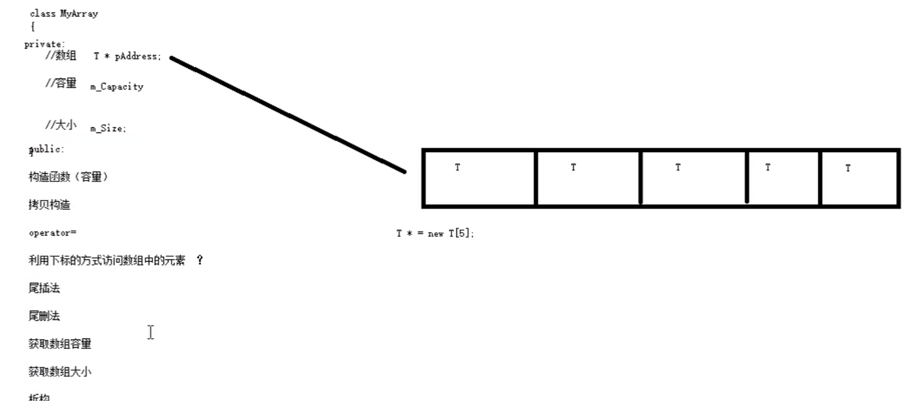
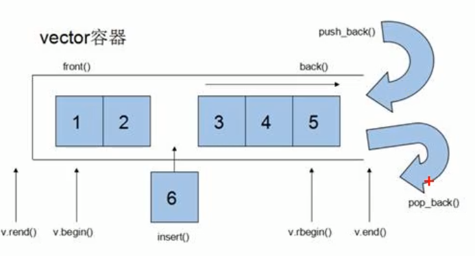
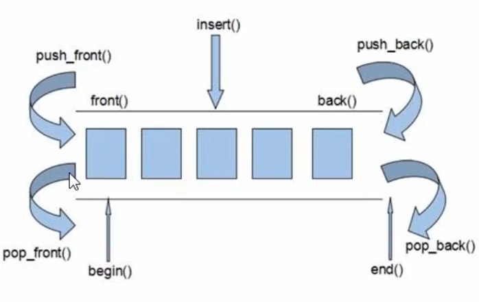
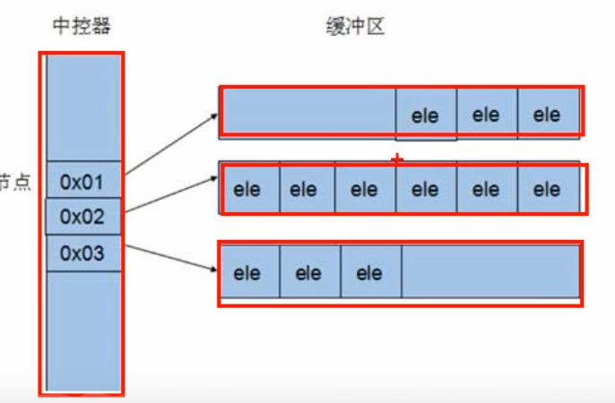

本阶段主要针对C++泛型编程和STL技术做详细讲解，探讨C++更深层的使用。

[《黑马》——C++提高编程_漏网小鱼的博客-CSDN博客](https://blog.csdn.net/ClaireSy/article/details/108423061)

# 模板

C++泛型的实现

## 模板的概念

模板就是建立**通用的模具**，大大**提高复用性**

模板的特点：

- 模板不可以直接使用，它只是一个框架
- 模板的通用并不是万能的

## 函数模板

- C++另一种编程思想称为 **泛型编程** ，主要利用的技术就是模板
- C++提供两种模板机制:**函数模板**和**类模板**

### 函数模板语法

类比java的泛型函数

函数模板作用：

建立一个通用函数，其函数返回值类型和形参类型可以不具体制定，用一个**虚拟的类型**来代表。

**语法：**

```c++
template<typename T>
函数声明或定义
```

**解释：**

template — 声明创建模板

typename — 表面其后面的符号是一种数据类型，可以用class代替

T — 通用的数据类型，名称可以替换，通常为大写字母

```c++
#include<iostream>

using namespace std;

//交换整型函数
void swapInt(int &a, int &b) {
    int temp = a;
    a = b;
    b = temp;
}

//交换浮点型函数
void swapDouble(double &a, double &b) {
    double temp = a;
    a = b;
    b = temp;
}

//利用模板提供通用的交换函数
template<typename T>
void mySwap(T &a, T &b) {
    T temp = a;
    a = b;
    b = temp;
}

void test01() {
    int a = 10;
    int b = 20;

    //swapInt(a, b);

    //利用模板实现交换
    //1、自动类型推导
    mySwap(a, b);

    //2、显示指定类型
    mySwap<int>(a, b);

    cout << "a = " << a << endl;
    cout << "b = " << b << endl;

}

int main() {
    test01();
    return 0;
}
```

总结：

- 函数模板利用关键字 template
- 使用函数模板有两种方式：自动类型推导、显示指定类型
- 模板的目的是为了提高复用性，将类型参数化

### 函数模板注意事项

注意事项：

- 自动类型推导，必须推导出一致的数据类型T,才可以使用
- 模板必须要确定出T的数据类型，才可以使用

```c++
#include<iostream>

using namespace std;

//注意事项：
//1. 自动类型推导，必须推导出一致的数据类型T,才可以使用
//2. 板必须要确定出T的数据类型，才可以使用
//利用模板提供通用的交换函数
template<class T>
//typename可以替换成class
void mySwap(T& a, T& b) {
    T temp = a;
    a = b;
    b = temp;
}


// 1、自动类型推导，必须推导出一致的数据类型T,才可以使用
void test01() {
    int a = 10;
    int b = 20;
    char c = 'c';

    mySwap(a, b); // 正确，可以推导出一致的T
    //mySwap(a, c); // 错误，推导不出一致的T类型
}


// 2、模板必须要确定出T的数据类型，才可以使用
template<class T>
void func() {
    cout << "func 调用" << endl;
}

void test02() {
    //func(); //错误，模板不能独立使用，必须确定出T的类型
    func<int>(); //利用显示指定类型的方式，给T一个类型，才可以使用该模板
}

int main() {
    test01();
    test02();
    return 0;
}

```

- 使用模板时必须确定出通用数据类型T，并且能够推导出一致的类型

### 函数模板案例-数组排序

案例描述：

- 利用函数模板封装一个排序的函数，可以对**不同数据类型数组**进行排序
- 排序规则从大到小，排序算法为**选择排序**
- 分别利用**char数组**和**int数组**进行测试

```c++
#include<iostream>

using namespace std;

//实现通用的对数组进行排序的函数，从大到小，选择排序，char、int数组

template<class T>
void mySwap(T& a, T& b) {
    T temp = a;
    a = b;
    b = temp;
}

template<class T>
void printArray(T arr[], int len) {
    for (int i = 0; i < len; ++i) {
        cout << arr[i] << " ";
    }
    cout<<endl;
}

template<class T>
void mySort(T arr[], int len) {
    for (int i = 0; i < len; ++i) {
        int max = i;
        for (int j = i + 1; j < len; ++j) {
            if (arr[max] < arr[j]) {
                max = j;
            }
        }
        if (max != i) {
            mySwap(arr[max], arr[i]);
        }
    }
}

void test01() {
    //char
    char charArr[] = "badcfe";
    mySort(charArr, sizeof(charArr) / sizeof(char));
    printArray(charArr,sizeof(charArr) / sizeof(char));
}
void test02() {
    //int
    int intArr[] = {7,5,1,3,9,2,4,6,8};
    mySort(intArr, sizeof(intArr) / sizeof(int));
    printArray(intArr,sizeof(intArr) / sizeof(int));
}

int main() {
    test01();
    test02();
    return 0;
}
```

总结：模板可以提高代码复用，需要熟练掌握

### 普通函数与函数模板的区别

- 普通函数调用时可以发生自动类型转换（隐式类型转换）
- 函数模板调用时，如果利用自动类型推导，不会发生隐式类型转换
- 如果利用显示指定类型的方式，可以发生隐式类型转换

```c++
#include<iostream>

using namespace std;

//普通函数
int myAdd01(int a, int b) {
    return a + b;
}

//函数模板
template<class T>
T myAdd02(T a, T b) {
    return a + b;
}

//使用函数模板时，如果用自动类型推导，不会发生自动类型转换,即隐式类型转换
void test01() {
    int a = 10;
    int b = 20;
    char c = 'c';

    cout << myAdd01(a, c) << endl; //正确，将char类型的'c'隐式转换为int类型  'c' 对应 ASCII码 99

    //myAdd02(a, c); // 报错，使用自动类型推导时，不会发生隐式类型转换

    myAdd02<int>(a, c); //正确，如果用显示指定类型，可以发生隐式类型转换
}

int main() {
    test01();
    return 0;
}

```

总结：建议使用显示指定类型的方式，调用函数模板，因为可以自己确定通用类型T

### 普通函数与函数模板的调用规则

调用规则如下：

1. 如果函数模板和普通函数都可以实现，优先调用普通函数
2. 可以通过空模板参数列表来强制调用函数模板
3. 函数模板也可以发生重载
4. 如果函数模板可以产生更好的匹配,优先调用函数模板

```c++
#include<iostream>

using namespace std;

//如果函数模板和普通函数都可以实现，优先调用普通函数
//可以通过空模板参数列表来强制调用函数模板
//函数模板也可以发生重载
//如果函数模板可以产生更好的匹配,优先调用函数模板
//普通函数与函数模板调用规则

void myPrint(int a, int b) {
    cout << "调用的普通函数" << endl;
}

template<typename T>
void myPrint(T a, T b) {
    cout << "调用的模板" << endl;
}

template<typename T>
void myPrint(T a, T b, T c) {
    cout << "调用重载的模板" << endl;
}

void test01() {
    //1、如果函数模板和普通函数都可以实现，优先调用普通函数
    // 注意 如果告诉编译器  普通函数是有的，但只是声明没有实现，或者不在当前文件内实现，就会报错找不到
    int a = 10;
    int b = 20;
    myPrint(a, b); //调用普通函数

    //2、可以通过空模板参数列表来强制调用函数模板
    myPrint<>(a, b); //调用函数模板

    //3、函数模板也可以发生重载
    int c = 30;
    myPrint(a, b, c); //调用重载的函数模板

    //4、 如果函数模板可以产生更好的匹配,优先调用函数模板
    char c1 = 'a';
    char c2 = 'b';
    myPrint(c1, c2); //调用函数模板
}

int main() {
    test01();
    return 0;
}
```

总结：既然提供了函数模板，最好就不要提供普通函数，否则容易出现二义性

### 模板的局限性

模板的通用性并不是万能的

例如：

```c++
template<class T>
void f(T a, T b){ 
	a = b;
}
```

在上述代码中提供的赋值操作，如果传入的a和b是一个数组，就无法实现了

再例如：

```c++
template<class T>
    void f(T a, T b)
{ 
    if(a > b) { ... }
}
```

在上述代码中，如果T的数据类型传入的是像Person这样的自定义数据类型，也无法正常运行

因此C++为了解决这种问题，提供模板的重载，可以为这些**特定的类型**提供**具体化的模板**

```c++
#include<iostream>

using namespace std;

//模板不是万能的，有些特定数据类型，需要用具体化方式做特殊实现
//对比两个数据是否相等的函数
template<class T>
bool myCompare(T& a, T& b) {
    return a == b;
}

class Person {
public:
    Person(string name, int age) {
        this->m_Name = name;
        this->m_Age = age;
    }

    string m_Name;
    int m_Age;
};

//具体化，显示具体化的原型和定意思以template<>开头，并通过名称来指出类型
//具体化优先于常规模板
template<> bool myCompare(Person& p1, Person& p2) {
    return p1.m_Name == p2.m_Name && p1.m_Age == p2.m_Age;
}

void test01() {
    int a = 10, b = 20;
    bool ret = myCompare(a, b);
    if (ret) {
        cout << "a == b " << endl;
    } else {
        cout << "a != b " << endl;
    }
}

void test02() {
    Person p1("Tom", 10);
    Person p2("Tom", 10);
    //自定义数据类型，不会调用普通的函数模板
    //可以创建具体化的Person数据类型的模板，用于特殊处理这个类型
    bool ret = myCompare(p1, p2);
    if (ret) {
        cout << "p1 == p2 " << endl;
    } else {
        cout << "p1 != p2 " << endl;
    }
}

int main() {
    test01();
    test02();
    return 0;
}
```

总结：

- 利用具体化的模板，可以解决自定义类型的通用化
- 学习模板并不是为了写模板，而是在STL能够运用系统提供的模板

## 类模板

### 类模板语法

类模板作用：

- 建立一个通用类，类中的成员 数据类型可以不具体制定，用一个**虚拟的类型**来代表。

**语法：**

```c++
template<typename T>
类
```

**解释：**

template — 声明创建模板

typename — 表面其后面的符号是一种数据类型，可以用class代替

T — 通用的数据类型，名称可以替换，通常为大写字母

```c++
#include<iostream>

using namespace std;

#include <string>

//类模板
template<class NameType, class AgeType>
class Person {
public:
    Person(NameType name, AgeType age) {
        this->mName = name;
        this->mAge = age;
    }

    void showPerson() {
        cout << "name: " << this->mName << " age: " << this->mAge << endl;
    }

public:
    NameType mName;
    AgeType mAge;
};

void test01() {
    // 指定NameType 为string类型，AgeType 为 int类型
    Person<string, int> P1("孙悟空", 999);
    P1.showPerson();
}

int main() {
    test01();
    return 0;
}

```

总结：类模板和函数模板语法相似，在声明模板template后面加类，此类称为类模板

### 类模板与函数模板区别

类模板与函数模板区别主要有两点：

1. 类模板没有自动类型推导的使用方式
2. 类模板在模板参数列表中可以有默认参数

```c++
#include<iostream>

using namespace std;

//类模板
template<class NameType, class AgeType = int> //默认参数int
class Person {
public:
    Person(NameType name, AgeType age) {
        this->mName = name;
        this->mAge = age;
    }

    void showPerson() {
        cout << "name: " << this->mName << " age: " << this->mAge << endl;
    }

public:
    NameType mName;
    AgeType mAge;
};

//1、类模板没有自动类型推导的使用方式
void test01() {
    // Person p("孙悟空", 1000); // 错误 类模板使用时候，不可以用自动类型推导
    Person<string, int> p("孙悟空", 1000); //必须使用显示指定类型的方式，使用类模板
    p.showPerson();
}

//2、类模板在模板参数列表中可以有默认参数
void test02() {
    Person<string> p("猪八戒", 999); //类模板中的模板参数列表 可以指定默认参数
    p.showPerson();
}

int main() {
    test01();
    test02();
    return 0;
}

```

总结：

- 类模板使用只能用显示指定类型方式
- 类模板中的模板参数列表可以有默认参数

### 类模板中成员函数创建时机

类模板中成员函数和普通类中成员函数创建时机是有区别的：

- 普通类中的成员函数一开始就可以创建
- 类模板中的成员函数在调用时才创建

```c++
#include<iostream>

using namespace std;

class Person1 {
public:
    void showPerson1() {
        cout << "Person1 show" << endl;
    }
};

class Person2 {
public:
    void showPerson2() {
        cout << "Person2 show" << endl;
    }
};

template<class T>
class MyClass {
public:
    T obj;

    //类模板中的成员函数，并不是一开始就创建的，而是在模板调用时再生成

    void fun1() { obj.showPerson1(); }

    void fun2() { obj.showPerson2(); }

};

void test01() {
    MyClass<Person1> m;

    m.fun1();

    //m.fun2();//编译会出错，说明函数调用才会去创建成员函数
}

int main() {
    test01();
    return 0;
}

```

总结：类模板中的成员函数并不是一开始就创建的，在调用时才去创建

### 类模板对象做函数参数

学习目标：

- 类模板实例化出的对象，向函数传参的方式

一共有三种传入方式：

1. 指定传入的类型 — 直接显示对象的数据类型
2. 参数模板化 — 将对象中的参数变为模板进行传递
3. 整个类模板化 — 将这个对象类型 模板化进行传递

```c++
#include<iostream>
using namespace std;

//类模板
template<class NameType, class AgeType = int>
class Person {
public:
    Person(NameType name, AgeType age) {
        this->mName = name;
        this->mAge = age;
    }

    void showPerson() {
        cout << "name: " << this->mName << " age: " << this->mAge << endl;
    }

public:
    NameType mName;
    AgeType mAge;
};

//1、指定传入的类型
void printPerson1(Person<string, int>& p) {
    p.showPerson();
}

void test01() {
    Person<string, int> p("孙悟空", 100);
    printPerson1(p);
}

//2、参数模板化
template<class T1, class T2>
void printPerson2(Person<T1, T2>& p) {
    p.showPerson();
    cout << "T1的类型为： " << typeid(T1).name() << endl;
    cout << "T2的类型为： " << typeid(T2).name() << endl;
}

void test02() {
    Person<string, int> p("猪八戒", 90);
    printPerson2(p);
}

//3、整个类模板化
template<class T>
void printPerson3(T& p) {
    cout << "T的类型为： " << typeid(T).name() << endl;
    p.showPerson();

}

void test03() {
    Person<string, int> p("唐僧", 30);
    printPerson3(p);
}

int main() {
    test01();
    test02();
    test03();
    return 0;
}

```

总结：

- 通过类模板创建的对象，可以有三种方式向函数中进行传参
- **使用比较广泛是第一种：指定传入的类型**

### 类模板与继承

当类模板碰到继承时，需要注意一下几点：

- 当子类继承的父类是一个类模板时，子类在声明的时候，要指定出父类中T的类型
- 如果不指定，编译器无法给子类分配内存
- 如果想灵活指定出父类中T的类型，子类也需变为类模板

```c++
#include <iostream>

using namespace std;

template<class T>
class Base {
    T m;
};

//必须要知道父类中的T类型，才能继承给子类
class Son : public Base<int> {

};

void test01() {
    Son s1;
}

//如果想灵活指定父类中T类型，子类也需要变类模板
template<class T1, class T2>
class Son2 : public Base<T2> {
public:
    Son2() {
        cout << typeid(T1).name() << endl;
        cout << typeid(T2).name() << endl;
    }

    T1 obj;
};

void test02() {
    Son2<int, char> s2;
}

int main() {
    test01();
    test02();
    return 0;
}
```

总结：如果父类是类模板，子类需要指定出父类中T的数据类型

### 类模板成员函数类外实现

```c++
#include <iostream>

using namespace std;

#include <string>

//类模板中成员函数类外实现
template<class T1, class T2>
class Person {
public:
    //成员函数类内声明
    Person(T1 name, T2 age);

    void showPerson();

public:
    T1 m_Name;
    T2 m_Age;
};

//构造函数 类外实现
template<class T1, class T2>
Person<T1, T2>::Person(T1 name, T2 age) {
    this->m_Name = name;
    this->m_Age = age;
}

//成员函数 类外实现
template<class T1, class T2>
void Person<T1, T2>::showPerson() {
    cout << "姓名: " << this->m_Name << " 年龄:" << this->m_Age << endl;
}

void test01() {
    Person<string, int> p("Tom", 20);
    p.showPerson();
}

int main() {
    test01();
    return 0;
}

```

总结：**类模板中成员函数类外实现时，需要加上模板参数列表**

### 类模板分文件编写

学习目标：

- 掌握类模板成员函数分文件编写产生的问题以及解决方式

问题：

- 类模板中成员函数创建时机是在调用阶段，导致分文件编写时链接不到

解决：

- 解决方式1：直接包含.cpp源文件
- 解决方式2：将声明和实现写到同一个文件中，并更改后缀名为.hpp，hpp是约定的名称，并不是强制

**示例：**

person.hpp中代码：

```c++
#pragma once
#include <iostream>
using namespace std;
#include <string>

template<class T1, class T2>
class Person {
public:
	Person(T1 name, T2 age);
	void showPerson();
public:
	T1 m_Name;
	T2 m_Age;
};

//构造函数 类外实现
template<class T1, class T2>
Person<T1, T2>::Person(T1 name, T2 age) {
	this->m_Name = name;
	this->m_Age = age;
}

//成员函数 类外实现
template<class T1, class T2>
void Person<T1, T2>::showPerson() {
	cout << "姓名: " << this->m_Name << " 年龄:" << this->m_Age << endl;
}

```

类模板分文件编写.cpp中代码

```c++
/**
 * 类模板分文件编写， "Person.h",编译出错
 * 因为类模板中的成员函数在调用阶段产生
 * 第一种解决方式，直接包含源文件 "Person.hpp"
 * 第二种解决方式，将.h和.cpp中的内容写到一起，将后缀名改为.hpp为文件,包含 "Person.hpp"
 */
#include <iostream>
#include "Person.hpp"

using namespace std;

void test01() {
    Person<string, int> p("Jerry", 18);
    p.showPerson();
}

int main() {
    test01();
    return 0;
}
```

总结：主流的解决方式是第二种，将类模板成员函数写到一起，并将后缀名改为.hpp

### 类模板与友元

学习目标：

- 掌握类模板配合友元函数的类内和类外实现

全局函数类内实现 - 直接在类内声明友元即可

全局函数类外实现 - 需要提前让编译器知道全局函数的存在

```c++
#include <iostream>

using namespace std;

//2、全局函数配合友元  类外实现 - 先做函数模板声明，下方在做函数模板定义，在做友元
template<class T1, class T2>
class Person;

//如果声明了函数模板，可以将实现写到后面，否则需要将实现体写到类的前面让编译器提前看到
//template<class T1, class T2> void printPerson2(Person<T1, T2> & p);

template<class T1, class T2>
void printPerson2(Person<T1, T2>& p) {
    cout << "类外实现 ---- 姓名： " << p.m_Name << " 年龄：" << p.m_Age << endl;
}

template<class T1, class T2>
class Person {
    //1、全局函数配合友元   类内实现
    friend void printPerson(Person<T1, T2>& p) {
        cout << "姓名： " << p.m_Name << " 年龄：" << p.m_Age << endl;
    }

    //全局函数配合友元  类外实现
    friend void printPerson2<>(Person<T1, T2>& p);

public:
    Person(T1 name, T2 age) {
        this->m_Name = name;
        this->m_Age = age;
    }


private:
    T1 m_Name;
    T2 m_Age;

};

//1、全局函数在类内实现
void test01() {
    Person<string, int> p("Tom", 20);
    printPerson(p);
}


//2、全局函数在类外实现
void test02() {
    Person<string, int> p("Jerry", 30);
    printPerson2(p);
}

int main() {
    //test01();
    test02();
    return 0;
}

```

总结：建议全局函数做类内实现，用法简单，而且编译器可以直接识别

### 类模板案例—数组类封装

案例描述: 实现一个通用的数组类，要求如下：

- 可以对内置数据类型以及自定义数据类型的数据进行存储
- 将数组中的数据存储到堆区
- 构造函数中可以传入数组的容量
- 提供对应的拷贝构造函数以及operator=防止浅拷贝问题
- 提供尾插法和尾删法对数组中的数据进行增加和删除
- 可以通过下标的方式访问数组中的元素
- 可以获取数组中当前元素个数和数组的容量



myArray.hpp中代码:

```c++
/**
* 自己的通用数组类
*/
#pragma once

#include <iostream>

using namespace std;

template<class T>
class MyArray {
public:
    explicit MyArray(int capacity) {
//        cout<<"MyArray的有参构造调用"<<endl;
        this->capacity = capacity;
        this->size = 0;
        this->address = new T[this->capacity];
    }

    //拷贝构造，防止浅拷贝
    MyArray(const MyArray& arr) {
//        cout<<"MyArray的拷贝构造调用"<<endl;
        this->capacity = arr.capacity;
        this->size = arr.size;
        this->address = new T[arr.capacity];//这一步是深拷贝
        //将arr中的数据都可拷贝过来
        for (int i = 0; i < this->size; ++i) {
            this->address[i] = arr.address[i];
        }
    }

    //重载=,防止浅拷贝问题
    MyArray& operator=(const MyArray& arr) {
//        cout<<"MyArray的 operator= 调用"<<endl;
        //先判断原来堆区是否有数据，如果有先释放
        if (this->address != NULL) {
            delete[] this->address;
            this->address = NULL;
            this->capacity = 0;
            this->size = 0;
        }
        //深拷贝
        this->capacity = arr.capacity;
        this->size = arr.size;
        this->address = new T[arr.capacity];
        for (int i = 0; i < this->size; ++i) {
            this->address[i] = arr.address[i];
        }
        return *this;
    }

    //尾插法
    void pushBack(const T& val) {
        //判断容量是否等于大小
        if (this->capacity == this->size) return;
        this->address[this->size] = val;//在数组末尾插入数据
        this->size++;//更新数组的大小
    }

    //尾删法
    void popBack() {
        //让用户访问不到最有一个元素，即为尾删，逻辑删除
        if (this->size == 0) return;
        this->size--;
    }

    //通过下标的方式访问数组中的元素
    T& operator[](int index) {
        //函数返回引用，这个函数调用可以作为左值
        return this->address[index];
    }

    //返回数组的容量
    int getCapacity() {
        return this->capacity;
    }

    //返回数组的大小
    int getSize() {
        return this->size;
    }

    ~MyArray() {
        if (this->capacity != NULL) {
            delete[] this->address;//释放数组占的内存
            this->address = NULL;//指针置为空，防止野指针
//            cout<<"MyArray的析构调用"<<endl;
        }
    }

private:
    T* address;//指针指向堆区开辟的数组
    int capacity{};//数组容量
    int size{};//数组大小
};
```

测试使用：

```c++
#include <iostream>
#include "MyArray.hpp"

using namespace std;

void printIntArray(MyArray<int>& arr) {
    for (int i = 0; i < arr.getSize(); ++i) {
        cout << arr[i] << endl;
    }
}

void test01() {
    MyArray<int> arr1(5);
    for (int i = 0; i < 5; ++i) {
        arr1.pushBack(i);
    }
    cout << "arr1的打印输出为:" << endl;
    printIntArray(arr1);
    cout << "arr1的容量为:" << arr1.getCapacity() << endl;
    cout << "arr1的大小为:" << arr1.getSize() << endl;

    MyArray<int> arr2(arr1);
    arr2.popBack();
    cout << "arr2尾删后" << endl;
    cout << "arr2的容量为:" << arr2.getCapacity() << endl;
    cout << "arr2的大小为:" << arr2.getSize() << endl;

}

//测试自定义数据类型
class Person {
public:
    Person() {}

    Person(string name, int age) {
        this->name = name;
        this->age = age;
    }

public:
    string name;
    int age;
};

void printPersonArray(MyArray<Person>& personArr) {
    for (int i = 0; i < personArr.getSize(); i++) {
        cout << "姓名：" << personArr[i].name << " 年龄： " << personArr[i].age << endl;
    }

}

void test02() {
    //创建数组
    MyArray<Person> pArray(10);
    Person p1("孙悟空", 30);
    Person p2("韩信", 20);
    Person p3("妲己", 18);
    Person p4("王昭君", 15);
    Person p5("赵云", 24);

    //插入数据
    pArray.pushBack(p1);
    pArray.pushBack(p2);
    pArray.pushBack(p3);
    pArray.pushBack(p4);
    pArray.pushBack(p5);

    printPersonArray(pArray);

    cout << "pArray的大小：" << pArray.getSize() << endl;
    cout << "pArray的容量：" << pArray.getCapacity() << endl;

}
int main() {
    test01();
    cout<<"----------------"<<endl;
    test02();
    return 0;
}
```

## STL初识

##  STL的诞生

- 长久以来，软件界一直希望建立一种可重复利用的东西
- C++的**面向对象**和**泛型编程**思想，目的就是**复用性的提升**
- 大多情况下，数据结构和算法都未能有一套标准,导致被迫从事大量重复工作
- 为了建立数据结构和算法的一套标准,诞生了**STL**

## STL基本概念

- STL(Standard Template Library,**标准模板库**)
- STL 从广义上分为: **容器(container) 算法(algorithm) 迭代器(iterator)**
- **容器**和**算法**之间通过**迭代器**进行无缝连接。
- STL 几乎所有的代码都采用了模板类或者模板函数

## STL六大组件

STL大体分为六大组件，分别是:**容器、算法、迭代器、仿函数、适配器（配接器）、空间配置器**

1. 容器：各种数据结构，如vector、list、deque、set、map等,用来存放数据。
2. 算法：各种常用的算法，如sort、find、copy、for_each等
3. 迭代器：扮演了容器与算法之间的胶合剂。
4. 仿函数：行为类似函数，可作为算法的某种策略。
5. 适配器：一种用来修饰容器或者仿函数或迭代器接口的东西。
6. 空间配置器：负责空间的配置与管理。

### STL中容器、算法、迭代器

**容器：**置物之所也

STL**容器**就是将运用**最广泛的一些数据结构**实现出来

常用的数据结构：数组, 链表,树, 栈, 队列, 集合, 映射表 等

这些容器分为**序列式容器**和**关联式容器**两种:

 **序列式容器**:强调值的排序，序列式容器中的每个元素均有固定的位置。
**关联式容器**:二叉树结构，各元素之间没有严格的物理上的顺序关系

**算法：**问题之解法也

有限的步骤，解决逻辑或数学上的问题，这一门学科我们叫做算法(Algorithms)

算法分为:**质变算法**和**非质变算法**。

质变算法：是指运算过程中会更改区间内的元素的内容。例如拷贝，替换，删除等等

非质变算法：是指运算过程中不会更改区间内的元素内容，例如查找、计数、遍历、寻找极值等等

**迭代器：**容器和算法之间粘合剂

提供一种方法，使之能够依序寻访某个容器所含的各个元素，而又无需暴露该容器的内部表示方式。

每个容器都有自己专属的迭代器

迭代器使用非常类似于指针，初学阶段我们可以先理解迭代器为指针

迭代器种类：

| 种类           | 功能                                                     | 支持运算                               |
| -------------- | -------------------------------------------------------- | -------------------------------------- |
| 输入迭代器     | 对数据的只读访问                                         | 只读，支持++、==、！=                  |
| 输出迭代器     | 对数据的只写访问                                         | 只写，支持++                           |
| 前向迭代器     | 读写操作，并能向前推进迭代器                             | 读写，支持++、==、！=                  |
| 双向迭代器     | 读写操作，并能向前和向后操作                             | 读写，支持++、–，                      |
| 随机访问迭代器 | 读写操作，可以以跳跃的方式访问任意数据，功能最强的迭代器 | 读写，支持++、–、[n]、-n、<、<=、>、>= |

常用的容器中迭代器种类为双向迭代器，和随机访问迭代器

# STL常用容器

## vector容器

**功能：**

- vector数据结构和**数组非常相似**，也称为**单端数组**

**vector与普通数组区别：**

- 不同之处在于数组是静态空间，而vector可以**动态扩展**

**动态扩展：**

- 并不是在原空间之后续接新空间，而是找更大的内存空间，然后将原数据拷贝新空间，释放原空间



- vector容器的迭代器是支持随机访问的迭代器

### vector构造函数

**功能描述：**

- 创建vector容器

**函数原型：**

- `vector<T> v;` //采用模板实现类实现，默认构造函数
- `vector(v.begin(), v.end());` //将v[begin(), end())区间中的元素拷贝给本身。
- `vector(n, elem);` //构造函数将n个elem拷贝给本身。
- `vector(const vector &vec);` //拷贝构造函数。

```c++
#include <iostream>
#include <vector>

using namespace std;

void printVector(vector<int>& v) {

    for (int & it : v) {
        cout << it << " ";
    }
    cout << endl;
}

void test01() {
    vector<int> v1; //无参构造
    for (int i = 0; i < 10; i++) {
        v1.push_back(i);
    }
    printVector(v1);

    //通过区间方式进行构造
    vector<int> v2(v1.begin(), v1.end());
    printVector(v2);

    //e个elem方式构造
    vector<int> v3(10, 100);
    printVector(v3);

    //拷贝构造
    vector<int> v4(v3);
    printVector(v4);
}

int main() {
    test01();
    return 0;
}
```

vector的多种构造方式没有可比性，灵活使用即可

### vector赋值操作

**功能描述：**

- 给vector容器进行赋值

**函数原型：**

- `vector& operator=(const vector &vec);`//重载等号操作符
- `assign(beg, end);` //将[beg, end)区间中的数据拷贝赋值给本身。
- `assign(n, elem);` //将n个elem拷贝赋值给本身。

```c++
#include <iostream>
#include <vector>

using namespace std;

void printVector(vector<int>& v) {
    for (int& it : v) {
        cout << it << " ";
    }
    cout << endl;
}

void test01() {
    vector<int> v1;
    for (int i = 0; i < 10; ++i) {
        v1.push_back(i);
    }
    printVector(v1);

    //赋值 1.operator=
    vector<int> v2;
    v2 = v1;
    printVector(v2);

    //2.assign
    vector<int> v3;
    v3.assign(v1.begin(), v1.end());//左闭右开
    printVector(v3);

    //3.n个elem方式赋值
    vector<int>v4;
    v4.assign(10, 100);
    printVector(v4);
}

int main() {
    test01();
    return 0;
}
```


```
0 1 2 3 4 5 6 7 8 9 
0 1 2 3 4 5 6 7 8 9 
0 1 2 3 4 5 6 7 8 9 
100 100 100 100 100 100 100 100 100 100 
```

总结： vector赋值方式比较简单，使用operator=，或者assign都可以

### vector容量和大小

对vector容器的容量和大小操作

容量大于等于大小

**函数原型：**

- `empty();` //判断容器是否为空

- `capacity();` //容器的容量

- `size();` //返回容器中元素的个数

- `resize(int num);` //重新指定容器的长度为num，若容器变长，则以默认值填充新位置。

   //如果容器变短，则末尾超出容器长度的元素被删除。

- `resize(int num, elem);` //重新指定容器的长度为num，若容器变长，则以elem值填充新位置。

   //如果容器变短，则末尾超出容器长度的元素被删除

```c++
#include <iostream>
#include <vector>

using namespace std;

void printVector(vector<int>& v) {
    for (int& it : v) {
        cout << it << " ";
    }
    cout << endl;
}

void test01() {
    vector<int> v1;
    for (int i = 0; i < 10; i++) {
        v1.push_back(i);
    }
    printVector(v1);
    if (v1.empty()) {
        cout << "v1为空" << endl;
    } else {
        cout << "v1不为空" << endl;
        cout << "v1的容量 = " << v1.capacity() << endl; //16
        cout << "v1的大小 = " << v1.size() << endl; //10
    }

    //resize 重新指定大小 ，若指定的更大，默认用0填充新位置，可以利用重载版本替换默认填充
    v1.resize(15, 10);
    printVector(v1);

    //resize 重新指定大小 ，若指定的更小，超出部分元素被删除
    v1.resize(5);
    printVector(v1);
}

int main() {
    test01();
    return 0;
}
```

总结：

- 判断是否为空 — empty
- 返回元素个数 — size
- 返回容器容量 — capacity
- 重新指定大小 — resize

### vector插入和删除

对vector容器进行插入、删除操作

**函数原型：**

- `push_back(ele);` //尾部插入元素ele
- `pop_back();` //删除最后一个元素
- `insert(const_iterator pos, ele);` //迭代器指向位置pos插入元素ele
- `insert(const_iterator pos, int count,ele);`//迭代器指向位置pos插入count个元素ele
- `erase(const_iterator pos);` //删除迭代器指向的元素
- `erase(const_iterator start, const_iterator end);`//删除迭代器从start到end之间的元素
- `clear();` //删除容器中所有元素

```c++
#include <iostream>
#include <vector>

using namespace std;

void printVector(vector<int>& v) {
    for (int& it : v) {
        cout << it << " ";
    }
    cout << endl;
}

void test01() {
    vector<int> v1;
    //尾插
    v1.push_back(10);
    v1.push_back(20);
    v1.push_back(30);
    v1.push_back(40);
    v1.push_back(50);
    printVector(v1);
    //尾删
    v1.pop_back();
    printVector(v1);
    //插入
    //想在任意位置插入就v1.begin()+n就行
    v1.insert(v1.begin(), 100);
    printVector(v1);

    v1.insert(v1.begin(), 2, 1000);
    printVector(v1);

    //删除
    v1.erase(v1.begin());
    printVector(v1);

    //清空
    v1.erase(v1.begin(), v1.end());
    v1.clear();
    printVector(v1);
}

int main() {
    test01();
    return 0;
}
```

总结：

- 尾插 — push_back
- 尾删 — pop_back
- 插入 — insert (位置迭代器)
- 删除 — erase （位置迭代器）
- 清空 — clear

### vector数据存取

对vector中的数据的存取操作

**函数原型：**

- `at(int idx);` //返回索引idx所指的数据
- `operator[];` //返回索引idx所指的数据
- `front();` //返回容器中第一个数据元素
- `back();` //返回容器中最后一个数据元素

```c++
vector<int> v1;
for (int i = 0; i < 10; i++) {
    v1.push_back(i);
}

for (int i = 0; i < v1.size(); i++) {
    cout << v1[i] << " ";
}
cout << endl;

for (int i = 0; i < v1.size(); i++) {
    cout << v1.at(i) << " ";
}
cout << endl;

cout << "v1的第一个元素为： " << v1.front() << endl;
cout << "v1的最后一个元素为： " << v1.back() << endl;
```

总结：

- 除了用迭代器获取vector容器中元素，[ ]和at也可以
- front返回容器第一个元素
- back返回容器最后一个元素

### vector互换容器

实现两个容器内元素进行互换

**函数原型：**

- `swap(vec);` // 将vec与本身的元素互换

```c++
#include <iostream>
#include <vector>

using namespace std;

void printVector(vector<int>& v) {
    for (int& it : v) {
        cout << it << " ";
    }
    cout << endl;
}

//1.基本使用
void test01() {
    vector<int> v1;
    for (int i = 0; i < 10; i++) {
        v1.push_back(i);
    }
    printVector(v1);

    vector<int> v2;
    for (int i = 10; i > 0; i--) {
        v2.push_back(i);
    }
    printVector(v2);

    //互换容器
    cout << "互换后" << endl;
    v1.swap(v2);
    printVector(v1);
    printVector(v2);
}

//2.实际用途：可以收缩内存空间
void test02() {
    vector<int> v;
    for (int i = 0; i < 100000; i++) {
        v.push_back(i);
    }

    cout << "v的容量为：" << v.capacity() << endl;//131072
    cout << "v的大小为：" << v.size() << endl;//100000

    v.resize(3);

    cout << "v的容量为：" << v.capacity() << endl;//131072
    cout << "v的大小为：" << v.size() << endl;//3

    //收缩内存
    vector<int>(v).swap(v); //匿名对象 vector<int>(v)，初始化的容量是v的大小，即：3
    //匿名对象执行完成后，会自动执行析构进行回收

    cout << "v的容量为：" << v.capacity() << endl;//3
    cout << "v的大小为：" << v.size() << endl;//3
}

int main() {
    test01();
    test02();
    return 0;
}
```


```
0 1 2 3 4 5 6 7 8 9 
10 9 8 7 6 5 4 3 2 1 
互换后
10 9 8 7 6 5 4 3 2 1 
0 1 2 3 4 5 6 7 8 9 
v的容量为：131072
v的大小为：100000
v的容量为：131072
v的大小为：3
v的容量为：3
v的大小为：3

进程已结束，退出代码为 0

```

总结：swap可以使两个容器互换，可以达到实用的收缩内存效果

### vector预留空间

减少vector在动态扩展容量时的扩展次数

**函数原型：**

- `reserve(int len);`//容器预留len个元素长度，预留位置不初始化，元素不可访问。

```c++
vector<int> v;

//预留空间
v.reserve(100000);//不写这个num是18

int num = 0; //统计开辟次数
int* p = nullptr;
for (int i = 0; i < 100000; i++) {
    v.push_back(i);
    if (p != &v[0]) {
        p = &v[0];
        num++;
    }
}

cout << "num:" << num << endl;//1
```

总结：如果数据量较大，可以一开始利用reserve预留空间

### vector存放内置数据类型

容器： `vector`

算法： `for_each`

迭代器： `vector<int>::iterator`

```c++
#include <iostream>
#include <vector>
#include <algorithm> //标注算法的头文件

using namespace std;

void myPrint(int val) {
    cout << val << endl;
}

//vector容器存放内置数据类型
void test01() {
    //创建了一个vector容器，数组
    vector<int> v;
    //向容器中插入数据
    v.push_back(10);
    v.push_back(20);
    v.push_back(30);
    v.push_back(40);
    //通过迭代器来访问容器中数据
    vector<int>::iterator itBegin = v.begin();//起始迭代器，指向容器中第一个元素
    vector<int>::iterator itEnd = v.end();//结束迭代器，指向容器中最后一个元素的下一个位置
    //第一种遍历方式
    while (itBegin != itEnd) {
        cout << *itBegin << endl;
        itBegin++;
    }
    //第二种遍历方式
    for (vector<int>::iterator it = v.begin(); it != v.end(); it++) {
        cout << *it << endl;
    }
    //简写：
    for (int& it : v) {
        cout << it << endl;
    }
    //第三种遍历方式，利用STL提供的遍历算法，传入一个回调函数
    for_each(v.begin(), v.end(), myPrint);
}

int main() {
    test01();
    return 0;
}
```

### vector存放自定义数据类型

```c++
#include <iostream>
#include <vector>
#include <algorithm>

using namespace std;

//自定义数据类型
class Person {
public:
    Person(string name, int age) {
        this->name = std::move(name);
        this->age = age;
    }

public:
    string name;
    int age;
};

//存放对象
void test01() {
    vector<Person> v;
    //创建数据
    Person p1("aaa", 10);
    Person p2("bbb", 20);
    Person p3("ccc", 30);
    Person p4("ddd", 40);
    Person p5("eee", 50);

    v.push_back(p1);
    v.push_back(p2);
    v.push_back(p3);
    v.push_back(p4);
    v.push_back(p5);
//    for (vector<Person>::iterator it = v.begin(); it != v.end(); it++) {
//        cout << "Name:" << (*it).name << " Age:" << (*it).age << endl;
//
//    }
    for (auto& it : v) {
        cout << "Name:" << it.name << " Age:" << it.age << endl;

    }
}

//存放对象指针
void test02() {
    vector<Person*> v;
    //创建数据
    Person p1("aaa", 10);
    Person p2("bbb", 20);
    Person p3("ccc", 30);
    Person p4("ddd", 40);
    Person p5("eee", 50);

    v.push_back(&p1);
    v.push_back(&p2);
    v.push_back(&p3);
    v.push_back(&p4);
    v.push_back(&p5);
//    for (vector<Person*>::iterator it = v.begin(); it != v.end(); it++) {
//        Person * p = (*it);
//        cout << "Name:" << p->name << " Age:" << (*it)->age << endl;
//    }
    for (auto & it : v) {
        cout << "Name:" << it->name << " Age:" << it->age << endl;
    }
}

int main() {
    test01();
    test02();
    return 0;
}
```

### vector容器嵌套容器

容器中嵌套容器，我们将所有数据进行遍历输出

```c++
#include <iostream>
#include <vector>
#include <algorithm>

using namespace std;

//容器嵌套容器
void test01() {
    vector<vector<int> > v;

    vector<int> v1;
    vector<int> v2;
    vector<int> v3;
    vector<int> v4;

    for (int i = 0; i < 4; i++) {
        v1.push_back(i + 1);
        v2.push_back(i + 2);
        v3.push_back(i + 3);
        v4.push_back(i + 4);
    }

    //将容器元素插入到vector v中
    v.push_back(v1);
    v.push_back(v2);
    v.push_back(v3);
    v.push_back(v4);

    for (vector<vector<int>>::iterator it = v.begin(); it != v.end(); it++) {

        for (vector<int>::iterator vit = (*it).begin(); vit != (*it).end(); vit++) {
            cout << *vit << " ";
        }
        cout << endl;
    }

    for (auto & it : v) {
        for (int & vit : it) {
            cout << vit << " ";
        }
        cout << endl;
    }
}

int main() {
    test01();
    return 0;
}
```

## string容器

### string基本概念

**本质：**

- string是C++风格的字符串，而string本质上是一个类

**string和char \* 区别：**

- char * 是一个指针
- string是一个类，类内部封装了char*，管理这个字符串，是一个char*型的容器。

**特点：**

string 类内部封装了很多成员方法

例如：查找find，拷贝copy，删除delete 替换replace，插入insert

string管理char*所分配的内存，不用担心复制越界和取值越界等，由类内部进行负责

### string构造函数

构造函数原型：

- `string();` //创建一个空的字符串 例如: string str;
  `string(const char* s);` //使用字符串s初始化
- `string(const string& str);` //使用一个string对象初始化另一个string对象
- `string(int n, char c);` //使用n个字符c初始化

```c++
#include <iostream>
#include <algorithm>
#include <string>
using namespace std;

//string构造
void test01() {
    string s1; //创建空字符串，调用无参构造函数
    cout << "str1 = " << s1 << endl;

    const char* str = "hello world";
    string s2(str); //把c_string转换成了string

    cout << "str2 = " << s2 << endl;

    string s3(s2); //调用拷贝构造函数
    cout << "str3 = " << s3 << endl;

    string s4(10, 'a');
    cout << "str4 = " << s4 << endl;
}

int main() {
    test01();
    return 0;
}
```

总结：string的多种构造方式没有可比性，灵活使用即可

###  string赋值操作

功能描述：

- 给string字符串进行赋值

赋值的函数原型：

- `string& operator=(const char* s);` //char*类型字符串 赋值给当前的字符串

  ```c++
  string str1;
  str1 = "hello world";
  cout << "str1=" << str1 << endl;
  ```

  

- `string& operator=(const string &s);` //把字符串s赋给当前的字符串

  ```c++
  string str2;
  str2 = str1;
  cout << "str2=" << str2 << endl;
  ```

  

- `string& operator=(char c);` //字符赋值给当前的字符串

  ```c++
  string str3;
  str3 = 'a';
  cout << "str3=" << str3 << endl;
  ```

  

- `string& assign(const char *s);` //把字符串s赋给当前的字符串

  ```c++
  string str4;
  str4.assign("hello C++");
  cout << "str4=" << str4 << endl;
  ```

  

- `string& assign(const char *s, int n);` //把字符串s的前n个字符赋给当前的字符串

  ```c++
  string str5;
  str5.assign("hello C++",5);
  cout << "str5=" << str5 << endl;
  ```

  

- `string& assign(const string &s);` //把字符串s赋给当前字符串

  ```c++
  string str6;
  str6.assign(str5);
  cout << "str6=" << str6 << endl;
  ```

  

- `string& assign(int n, char c);` //用n个字符c赋给当前字符串

  ```c++
  string str7;
  str7.assign(10,'w');
  cout << "str7=" << str7 << endl;
  ```


总结： string的赋值方式很多，`operator=` 这种方式是比较实用的

### string字符串拼接

实现在字符串末尾拼接字符串

**函数原型：**

- `string& operator+=(const char* str);` //重载+=操作符
- `string& operator+=(const char c);` //重载+=操作符
- `string& operator+=(const string& str);` //重载+=操作符
- `string& append(const char *s);` //把字符串s连接到当前字符串结尾
- `string& append(const char *s, int n);` //把字符串s的前n个字符连接到当前字符串结尾
- `string& append(const string &s);` //同operator+=(const string& str)
- `string& append(const string &s, int pos, int n);`//字符串s中从pos开始的n个字符连接到字符串结尾

```c++
#include <iostream>
#include <string>

using namespace std;

/*
 * string& operator+=(const char* str);            //重载+=操作符
 * string& operator+=(const char c);               //重载+=操作符
 * string& operator+=(const string& str);          //重载+=操作符
 * string& append(const char *s);                  //把字符串s连接到当前字符串结尾
 * string& append(const char *s, int n);           //把字符串s的前n个字符连接到当前字符串结尾
 * string& append(const string &s);                //同operator+=(const string& str)
 * string& append(const string &s, int pos, int n);//字符串s中从pos开始的n个字符连接到字符串结尾
 */
void test01() {
    string str1 = "我";
    str1 += "爱玩游戏";
    cout << "str1=" << str1 << endl;

    str1+=':';
    cout << "str1=" << str1 << endl;

    string str2 = "LOL DNF";
    str1+=str2;
    cout << "str1=" << str1 << endl;

    string str3 = "I ";
    str3.append("love ");
    cout << "str3=" << str3 << endl;

    str3.append("game abcde", 4);
    cout << "str3=" << str3 << endl;

//    str3.append(str2);
//    str3.append(str2,0,3);
    str3.append(str2,4,3);//参数2:从哪个位置开始截取，参数3:截取字符个数
    cout << "str3=" << str3 << endl;

}

int main() {
    test01();
    return 0;
}
```

字符串拼接的重载版本很多，初学阶段记住几种即可

### string查找和替换

**功能描述：**

- 查找：查找指定字符串是否存在
- 替换：在指定的位置替换字符串

**函数原型：**

- `int find(const string& str, int pos = 0) const;`        //查找str第一次出现位置,从pos开始查找
- `int find(const char* s, int pos = 0) const;`                //查找s第一次出现位置,从pos开始查找
- `int find(const char* s, int pos, int n) const;`          //从pos位置查找s的前n个字符第一次位置
- `int find(const char c, int pos = 0) const;`                  //查找字符c第一次出现位置
- `int rfind(const string& str, int pos = npos) const;`//查找str最后一次位置,从pos开始查找
- `int rfind(const char* s, int pos = npos) const;`        //查找s最后一次出现位置,从pos开始查找
- `int rfind(const char* s, int pos, int n) const;`        //从pos查找s的前n个字符最后一次位置
- `int rfind(const char c, int pos = 0) const; `                 //查找字符c最后一次出现位置
- `string& replace(int pos, int n, const string& str);`//替换从pos开始n个字符为字符串str
- `string& replace(int pos, int n,const char* s);`           //替换从pos开始的n个字符为字符串s

```c++
#include <iostream>
#include <string>

using namespace std;

//1.查找
void test01() {
    string str1 = "abcdefgde";
    int pos = str1.find("de");
    if (pos == -1) {
        cout << "未找到" << endl;
    } else {
        cout << "pos = " << pos << endl;
    }
    //rfind从右往左查找，find从左往右查找
    pos = str1.rfind("de");
    cout << "pos = " << pos << endl;
}
//2.替换
void test02() {
    string str1 = "abcdefgde";
    //从1号位置起，3个字符替换为"1111"
    str1.replace(1, 3, "1111");
    cout << "str1 = " << str1 << endl;
}

int main() {
    test01();
    test02();
    return 0;
}
```

总结：

- find查找是从左往后，rfind从右往左
- find找到字符串后返回查找的第一个字符位置，找不到返回-1
- replace在替换时，要指定从哪个位置起，多少个字符，替换成什么样的字符串

### string字符串比较

**功能描述：**

- 字符串之间的比较

**比较方式：**

- 字符串比较是按字符的ASCII码进行对比

= 返回 0

\> 返回 1

< 返回 -1

**函数原型：**

- `int compare(const string &s) const;` //与字符串s比较
- `int compare(const char *s) const;` //与字符串s比较

```c++
string s1 = "hello";
string s2 = "aello";

int ret = s1.compare(s2);

if (ret == 0) {
    cout << "s1 等于 s2" << endl;
} else if (ret > 0) {
    cout << "s1 大于 s2" << endl;
} else {
    cout << "s1 小于 s2" << endl;
}
```

总结：字符串对比主要是用于比较两个字符串是否相等，判断谁大谁小的意义并不是很大

### string字符存取

string中单个字符存取方式有两种

- `char& operator[](int n);` //通过[]方式取字符
- `char& at(int n);` //通过at方法获取字符

```c++
string str = "hello world";

//1、通过[]访问单个字符
for (int i = 0; i < str.size(); i++) {
    cout << str[i] << " ";
}
cout << endl;

//2、通过at访问单个字符
for (int i = 0; i < str.size(); i++) {
    cout << str.at(i) << " ";
}
cout << endl;

//字符修改
str[0] = 'x';
str.at(1) = 'x';
cout << str << endl;
```

总结：string字符串中单个字符存取有两种方式，利用 [ ] 或 at

### string插入和删除

**功能描述：**

- 对string字符串进行插入和删除字符操作

**函数原型：**

- `string& insert(int pos, const char* s);` //插入字符串
- `string& insert(int pos, const string& str);` //插入字符串
- `string& insert(int pos, int n, char c);` //在指定位置插入n个字符c
- `string& erase(int pos, int n = npos);` //删除从Pos开始的n个字符

```c++
string str = "hello";
str.insert(1, "111");
cout << str << endl;

str.erase(1, 3);  //从1号位置开始3个字符
cout << str << endl;
```

插入和删除的起始下标都是从0开始

### string子串

从字符串中获取想要的子串

**函数原型：**

- `string substr(int pos = 0, int n = npos) const;` //返回由pos开始的n个字符组成的字符串

**示例：**

```c++
string str = "abcdefg";
string subStr = str.substr(1, 3);
cout << "subStr = " << subStr << endl;

string email = "hello@sina.com";
int pos = email.find("@");
string username = email.substr(0, pos);
cout << "username: " << username << endl;
```

灵活的运用求子串功能，可以在实际开发中获取有效的信息

## deque容器

### deque容器基本概念

双端数组，可以对头端进行插入删除操作

**deque与vector区别：**

- vector对于头部的插入删除效率低，数据量越大，效率越低
- deque相对而言，对头部的插入删除速度回比vector快
- vector访问元素时的速度会比deque快,这和两者内部实现有关



deque内部工作原理:

deque内部有个**中控器**，维护每段缓冲区中的内容，缓冲区中存放真实数据

中控器维护的是每个缓冲区的地址，使得使用deque时像一片连续的内存空间



deque容器的迭代器也是支持随机访问的

### deque构造函数

deque容器构造

**函数原型：**

- `deque<T>` deqT; //默认构造形式
- `deque(beg, end);` //构造函数将[beg, end)区间中的元素拷贝给本身。
- `deque(n, elem);` //构造函数将n个elem拷贝给本身。
- `deque(const deque &deq);` //拷贝构造函数

```c++
#include <deque>
#include <iostream>

using namespace std;

void printDeque(const deque<int>& d) {
//    for (deque<int>::const_iterator it = d.begin(); it != d.end(); it++) {
//        cout << *it << " ";
//    }
    for (int it : d) {
        cout << it << " ";
    }
    cout << endl;
}

//deque构造
void test01() {

    deque<int> d1; //无参构造函数
    for (int i = 0; i < 10; i++) {
        d1.push_back(i);
    }
    printDeque(d1);
    deque<int> d2(d1.begin(), d1.end());
    printDeque(d2);

    deque<int> d3(10, 100);
    printDeque(d3);

    deque<int> d4 = d3;
    printDeque(d4);
}

int main() {
    test01();
    return 0;
}
```

deque容器和vector容器的构造方式几乎一致，灵活使用即可

### deque赋值操作

**函数原型：**

- `deque& operator=(const deque &deq);` //重载等号操作符
- `assign(beg, end);` //将[beg, end)区间中的数据拷贝赋值给本身。
- `assign(n, elem);` //将n个elem拷贝赋值给本身。

```c++
deque<int> d1;
for (int i = 0; i < 10; i++) {
    d1.push_back(i);
}
printDeque(d1);

deque<int> d2;
d2 = d1;
printDeque(d2);

deque<int> d3;
d3.assign(d1.begin(), d1.end());
printDeque(d3);

deque<int> d4;
d4.assign(10, 100);
printDeque(d4);
```

总结：deque赋值操作也与vector相同，需熟练掌握

### deque大小操作

对deque容器的大小进行操作

**函数原型：**

- `deque.empty();` //判断容器是否为空

- `deque.size();` //返回容器中元素的个数

- `deque.resize(num);` //重新指定容器的长度为num,若容器变长，则以默认值填充新位置。

   //如果容器变短，则末尾超出容器长度的元素被删除。

- `deque.resize(num, elem);` //重新指定容器的长度为num,若容器变长，则以elem值填充新位置。

   //如果容器变短，则末尾超出容器长度的元素被删除。

```C++
deque<int> d1;
for (int i = 0; i < 10; i++) {
    d1.push_back(i);
}
printDeque(d1);

//判断容器是否为空
if (d1.empty()) {
    cout << "d1为空!" << endl;
} else {
    cout << "d1不为空!" << endl;
    //统计大小
    cout << "d1的大小为：" << d1.size() << endl;
}

//重新指定大小
d1.resize(15, 1);
printDeque(d1);

d1.resize(5);
printDeque(d1);
```


```
0 1 2 3 4 5 6 7 8 9 
d1不为空!
d1的大小为：10
0 1 2 3 4 5 6 7 8 9 1 1 1 1 1 
0 1 2 3 4 
```

总结：

- deque没有容量的概念，可以一直扩容
- 判断是否为空 — empty
- 返回元素个数 — size
- 重新指定个数 — resize

### deque 插入和删除

向deque容器中插入和删除数据

**函数原型：**

两端插入操作：

- `push_back(elem);` //在容器尾部添加一个数据
- `push_front(elem);` //在容器头部插入一个数据
- `pop_back();` //删除容器最后一个数据
- `pop_front();` //删除容器第一个数据

指定位置操作：

- `insert(pos,elem);` //在pos位置插入一个elem元素的拷贝，返回新数据的位置。
- `insert(pos,n,elem);` //在pos位置插入n个elem数据，无返回值。
- `insert(pos,beg,end);` //在pos位置插入[beg,end)区间的数据，无返回值。
- `clear();` //清空容器的所有数据
- `erase(beg,end);` //删除[beg,end)区间的数据，返回下一个数据的位置。
- `erase(pos);` //删除pos位置的数据，返回下一个数据的位置。

```c++
#include <deque>
#include <iostream>

using namespace std;

void printDeque(const deque<int>& d) {
//    for (deque<int>::const_iterator it = d.begin(); it != d.end(); it++) {
//        cout << *it << " ";
//    }
    for (int it : d) {
        cout << it << " ";
    }
    cout << endl;
}


//两端操作
void test01() {
    deque<int> d;
    //尾插
    d.push_back(10);
    d.push_back(20);
    //头插
    d.push_front(100);
    d.push_front(200);

    printDeque(d);

    //尾删
    d.pop_back();
    //头删
    d.pop_front();
    printDeque(d);
}

//插入
void test02() {
    deque<int> d;
    d.push_back(10);
    d.push_back(20);
    d.push_front(100);
    d.push_front(200);
    printDeque(d);

    d.insert(d.begin(), 1000);
    printDeque(d);

    d.insert(d.begin(), 2, 10000);
    printDeque(d);

    deque<int> d2;
    d2.push_back(1);
    d2.push_back(2);
    d2.push_back(3);

    d.insert(d.begin(), d2.begin(), d2.end());
    printDeque(d);

}

//删除
void test03() {
    deque<int> d;
    d.push_back(10);
    d.push_back(20);
    d.push_front(100);
    d.push_front(200);
    printDeque(d);

    d.erase(d.begin());
    printDeque(d);

    d.erase(d.begin(), d.end());
    d.clear();
    printDeque(d);
}

int main() {
    test01();
    //test02();
    //test03();
    return 0;
}
```

总结：

- 插入和删除提供的位置是迭代器！
- 尾插 — push_back
- 尾删 — pop_back
- 头插 — push_front
- 头删 — pop_front

### deque 数据存取

对deque 中的数据的存取操作

**函数原型：**

- `at(int idx);` //返回索引idx所指的数据
- `operator[];` //返回索引idx所指的数据
- `front();` //返回容器中第一个数据元素
- `back();` //返回容器中最后一个数据元素

```c++
deque<int> d;
d.push_back(10);
d.push_back(20);
d.push_front(100);
d.push_front(200);

for (int i = 0; i < d.size(); i++) {
    cout << d[i] << " ";
}
cout << endl;

for (int i = 0; i < d.size(); i++) {
    cout << d.at(i) << " ";
}
cout << endl;
cout << "front:" << d.front() << endl;
cout << "back:" << d.back() << endl;
```


```
200 100 10 20 
200 100 10 20 
front:200
back:20
```

总结：

- 除了用迭代器获取deque容器中元素，[ ]和at也可以
- front返回容器第一个元素
- back返回容器最后一个元素

### deque 排序

利用算法实现对deque容器进行排序

**算法：**

- `sort(iterator beg, iterator end)` //对beg和end区间内元素进行排序

```c++
#include <deque>
#include <iostream>
#include <algorithm>

using namespace std;

void printDeque(const deque<int>& d) {
    for (int it : d) {
        cout << it << " ";
    }
    cout << endl;
}

void test01() {
    deque<int> d;
    d.push_back(10);
    d.push_back(20);
    d.push_front(100);
    d.push_front(200);

    printDeque(d);
    sort(d.begin(), d.end());
    printDeque(d);
}

int main() {
    test01();
    return 0;
}
```

总结：sort算法非常实用，使用时包含头文件 algorithm即可