# 概念理清

来源：https://zhuanlan.zhihu.com/p/111110992

最近，有没有被make、cmake、makefile... ... 这些东西绕晕了，看看下面的文章，也许就可以理解清楚了。

## gcc

它是GNU Compiler Collection（就是GNU编译器套件），也可以简单认为是**编译器**，它可以编译很多种编程语言（括C、C++、Objective-C、Fortran、Java等等）。

我们的程序**只有一个**源文件时，直接就可以用gcc命令编译它。

可是，如果我们的程序包含很**多个**源文件时，该咋整？用gcc命令逐个去编译时，就发现很容易混乱而且工作量大，所以出现了下面make工具。

## make

make工具可以看成是一个智能的**批处理**工具，它本身并没有编译和链接的功能，而是用类似于批处理的方式—通过调用**makefile文件**中用户指定的命令来进行编译和链接的。

### makefile

这个是啥东西？

简单的说就像一首歌的乐谱，make工具就像指挥家，指挥家根据乐谱指挥整个乐团怎么样演奏，make工具就根据makefile中的命令进行编译和链接的。makefile命令中就包含了调用gcc（也可以是别的编译器）去编译某个源文件的命令。

makefile在一些简单的工程完全可以人工拿下，但是当工程非常大的时候，手写makefile也是非常麻烦的，如果换了个平台makefile又要重新修改，这时候就出现了下面的Cmake这个工具。

## cmake

cmake就可以更加简单的生成makefile文件给上面那个make用。当然cmake还有其他更牛X功能，就是可以**跨平台**生成对应平台能用的makefile，我们就不用再自己去修改了。

可是cmake根据什么生成makefile呢？它又要根据一个叫CMakeLists.txt文件（学名：组态档）去生成makefile。

**Clion默认支持cmake**

### CMakeList.txt

到最后CMakeLists.txt文件谁写啊？亲，是你自己手写的。

## nmake

nmake又是啥东西？

nmake是Microsoft Visual Studio中的附带命令，需要安装VS，实际上可以说相当于linux的make，明白了么？

## xmake

https://xmake.io/mirror/zh-cn/index.html

xmake 是一个基于 Lua 的轻量级跨平台构建工具，使用 xmake.lua 维护项目构建，相比 makefile/CMakeLists.txt，配置语法更加简洁直观，对新手非常友好，短时间内就能快速入门，能够让用户把更多的精力集中在实际的项目开发上。

虽然，简单易用是 xmake 的一大特色，但 xmake 的功能也是非常强大的，既能够像 Make/Ninja 那样可以直接编译项目，也可以像 CMake/Meson 那样生成工程文件，还有内置的包管理系统来帮助用户解决 C/C++依赖库的集成使用问题。

目前，xmake主要用于 C/C++ 项目的构建，但是同时也支持其他native语言的构建，可以实现跟C/C++进行混合编译，同时编译速度也是非常的快，可以跟Ninja持平。

```
Xmake = Build backend + Project Generator + Package Manager
```

## 小结

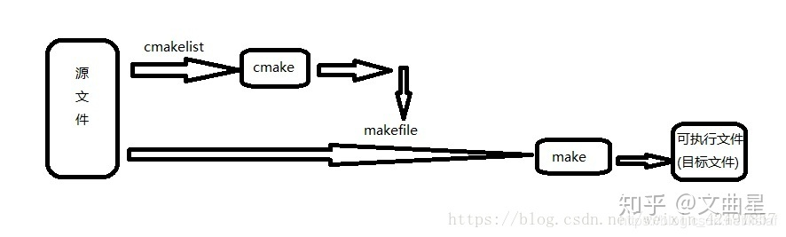

总结一下大体流程

1.用编辑器编写源代码，如.c文件。

2.用编译器编译代码生成目标文件，如.o。

3.用链接器连接目标代码生成可执行文件，如.exe。

但如果源文件太多，一个一个编译那得多麻烦啊？于是人们想到，为啥不设计一种类似批处理的程序，来批处理编译源文件呢？

于是就有了**make**工具，它是一个自动化编译工具，你可以使用一条命令实现完全编译。但是你需要编写一个规则文件，make依据它来批处理编译，这个文件就是**makefile**，所以编写makefile文件也是一个程序员所必备的技能。

对于一个大工程，编写makefile实在是件复杂的事，于是人们又想，为什么不设计一个工具，读入所有源文件之后，自动生成makefile呢，于是就出现了**cmake**工具，它能够输出各种各样的makefile或者project文件，从而帮助程序员减轻负担。但是随之而来也就是编写cmakelist文件，它是cmake所依据的规则。（cmake中有很多设置库的，此时还不是可执行文件，而make生成后才是二进制可执行文件。）

**所以在编程的世界里没有捷径可走，还是要脚踏实地的。**

# 现代CMake

课程：https://www.bilibili.com/video/BV16P4y1g7MH

- 现代CMake指的是CMake 3.x
- 古代CMake指的是CMake 2.x
- 通过互联网和学校课程，许多人认识的Cmake都是古代 CMake。
- 现代 CMake和古代 CMake相比，使用更方便，功能更强大

```cmd
# 古代
mkdir -p build
cd build
cmake .. -DCMAKE_BUILD_TYPE=Release  # 在build目录运行cmake<源码目录>生成Makefile
make -j4  # 执行本地的构建系统make真正开始构建（4进程并行）
make install #让本地的构建系统执行安装步骤
cd..  # 回到源码目录


# 现代
cmake -B build -DCMAKE_BUILD_TYPE=Release
cmake --build build --parallel 4
cmake --build build --target install
```

现代 Cmake提供了更方便的B和--build指令，不同平台，统一命令!

- cmake -B build  在源码目录用-B直接创建buid目录并生成 build/ Makefilec
- make --build build -j4  自动调用本地的构建系统在buld里构建，即: make -c build-j4
- sudo cmake --build build -- target install  调用本地的构建系统执行 install这个目标，即安装


cmake -B build  免去了先创建 build目录再切换进去再指定源码目录的麻烦。

cmake --build build  统一了不同平台( Linux上会调用make， Windows上调用 devenv.exe)

结论:从现在开始，如果在命令行操作 cmake，请使用更方便的-B和-bυuild命令。


## Cmake项目的构建

Cmake项目的构建分为两步:

第一步是 cmake -B build，称为**配置阶段**( configure)，这时只检测环境并生成构建规则，会在 build目录下生成本地构建系统能识别的项目文件( Makefile或是.sln)

第二步是 cmake --build build，称为**构建阶段**( build)，这时才实际调用编译器来编译代码。

## -D选项 配置变量 缓存变量

-D选项:指定配置变量(又称缓存变量)

在**配置阶段**可以通过 -DXXX 设置缓存变量。

第二次配置时，之前的-DXXX添加仍然会被保留。

**cmake -B build -DCMAKE_INSTALL_PREFIX=**/opt/openvdb-8.0
设置安装路径为/opt/openvdb80(会安装到/opt/openvdb-80/ib/ /ibopenvdb.so)

**cmake -B build -DCMAKE_BUILD_TYPE=Release**
设置构建模式为发布模式(开启全部优化)

cmake -B build  ←第二次配置时没有-D参数，但是之前的-D设置的变量都会被保留(此时缓存里仍有你之前定义的 CMAKE_BUILD_TYPE和 CMAKE_INSTALL_PREFIX)

### -G选项 指定要用的生成器

众所周知， CMake是一个**跨平台的构建系统**，可以从 CMakeLists.txt生成不同类型的构建系统(比如 Linux的make， Windows的 MSBuild)，从而让构建规则可以只写一份，跨平台使用。

过去的软件(例如TBB)要跨平台，只好 Makefile的构建规则写一份， MSBuild也写一份。现在只需要写一次 CMakeLists.txt，他会视不同的操作系统，生成不同构建系统的规则文件。

那个**和操作系统绑定的构建系统**(make、 MSBuild)称为**本地构建系统**( native buildsystem)。

**负责从 CMakeLists.txt 生成本地构建系统构建规则文件的，称为生成器( generator)。**


- Linux系统上的 CMake默认用是 Unix Makefiles生成器;

- Windows系统默认是suaStudio2019生成器; 
- Macos系统默认是code生成器。

可以用-G参数改用别的生成器,例如 cmake- Ninja会生成 Ninja这个构建系统的构建规则。Ninja是一个高性能,跨平台的构建系统, Linux、 Windows、 Macos上都可以用。

Ninja可以从包管理器里安装，没有包管理器的 Windows可以用 Python的包管理器安装pip install ninja

(有趣的事实: CMake也可以通过 pip install cmake安装)

事实上, MSBuild是单核心的构建系统, Makefile虽然多核心但因历史兼容原因效率一般。**而Ninja则是专为性能优化的构建系统,他和 Cmake结合都是行业标准了。**

```cmd
cmake -GNinja -B build
```


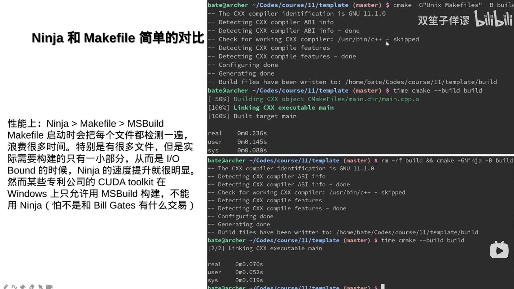


# 第一个CMake工程

## 先来一个源文件

main.cpp

```c++
#include <cstdio>
int mian() {
    printf("hello world!\n");
    return 0;
}
```

CMakeLists.txt

```cmake
add_executable(main main.cpp)
```

或者这样写：

```cmake
add_executable(main)
target_sources(main PUBLIC main.cpp)
```

## 如果有多个源文件呢

main.cpp

```c++
#include <cstdio>
#include "other.h"
int mian() {
    printf("hello world!\n");
	say_hello();
    return 0;
}
```

other.h

```h
#pragma once

void say_hello();
```

other.cpp

```c++
#include "other.h"
#include <cstdio>

void say_hello() {
    printf("Hello from other.cpp!\n");
}
```

CMakeLists.txt

```cmake
add_executable(main)
target_sources(main PUBLIC main.cpp other.cpp)
```

或者这样写：**使用变量来存储**

```cmake
add_executable(main)
set(sources main.cpp other.cpp)
target_sources(main PUBLIC ${sources})
```

格式：

```cmake
set(变量名 变量值1 变量值2...)
${sources} # 使用变量
```

建议把头文件也加上，这样在VS里可以出现在"Header Files" 一栏

```cmake
add_executable(main)
set(sources main.cpp other.cpp other.h)
target_sources(main PUBLIC ${sources})
```

## 使用file(GLOB ...) 自动查找文件

**使用GLOB自动查找当前目录下指定扩展名的文件，实现批量添加源文件**

```cmake
add_executable(main)
file(GLOB sources *.cpp *.h)
target_sources(main PUBLIC ${sources})
```

方便是方便，唯一的问题是当你写了一个新的cpp或h文件时，CMake可能不会被更新。
所以最好加上**CONFIGURE_DEPENDS**选项，当添加新文件时，自动更新变量。

```cmake
add_executable(main)
file(GLOB sources CONFIGURE_DEPENDS *.cpp *.h)
target_sources(main PUBLIC ${sources})
```

当执行build时，它会检测有没有添加新的文件，检测到就重新刷新一遍。

## 如果源码放在子文件夹里怎么办

main.cpp

```c++
#include <cstdio>
#include "mylib/other.h"
int mian() {
    printf("hello world!\n");
	say_hello();
    return 0;
}
```

mylib目录下：

```
other.h
other.cpp
```

必须把路径名和后缀名的排列组合全部写出来吗？感觉好麻烦：

```cmake
add_executable(main)
file(GLOB sources CONFIGURE_DEPENDS *.cpp *.h mylib/*.cpp mylib/*.h)
target_sources(main PUBLIC ${sources})
```

大可不必，用 aux_source_directory，自动搜集需要的文件名后缀

```cmake
add_executable(main)
#查找当前目录下的所有源文件将名称保存到 sources 变量
aux_source_directory(. sources)
aux_source_directory(mylib sources)
target_sources(main PUBLIC ${sources})
```

格式：

```cmake
aux_source_directory(< dir > < variable >)
```

## GLOB 换成 GLOB_RECURSE 

进一步：GLOB_RECURSE 了解以下，能自动包含所有**子文件夹**下的文件：

```cmake
add_executable(main
file(GLOB_RECURSE sources CONFIGURE_DEPENDS *.cpp .*h)
target_sources(main PUBLIC ${sources})
```

GLOB_RECURSE 的问题：会把build目录里生成的临时.cpp文件也加进来。CMake为了测试编译器，会生成一些临时的cpp文件，而临时的cpp文件里也有mian函数，就和我们写的main函数冲突了

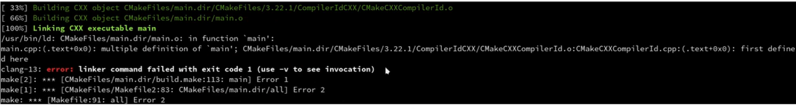

解决方案：要么把源码统一放到src目录下，要么要求使用者不要把buid放到和源码同一个目录里，我个人的建议是把源码放到src目录下。

# 项目配置变量

## 构建的类型

**CMAKE_BUILD_TYPE构建的类型，调试模式还是发布模式。**

CMAKE_BUILD_TYPE 是 CMake 中一个特殊的变量，用于控制构建类型，他的值可以是：

- **Debug调试模式**，完全不优化，生成调试信息，方便调试程序
- **Release发布模式**，优化程度最高，性能最佳，但是编译比 Debug慢
- **MinsizeRel最小体积发布**，生成的文件比 Release更小，不完全优化，减少二进制体积
- **RelwithDeblnfo带调试信息发布**，生成的文件比 Release更大，因为带有调试的符号信息

**默认情况下 CMAKE_BUILD_TYPE为空字符串，这时相当于 Debug。**

```cmake
cmake_minimum_required(VERSION 3.15)
project(hellocmake LANGUAGES CXX)

set(CMAKE_BUILD_TYPE Release)
add_executable(main main.cpp)
```

## 各种构建类型在编译器选项上的区别

在 Release模式下，追求的是程序的最佳性能表现，在此情况下，编译器会对程序做最大的代码优化以达到最快运行速度。另一方面，由于代码优化后不与源代码一致，此模式下般会丢失大量的调试信息。

```
1.Debug:`-O0 -g`
2.Release:`-O3 -DNDEBUG`
3.MinSizeRel:`-Os -DNDEBUG`
4.RelWithDebInfo:`-O2 -g DNDEBUG`
```

此外，注意定义了 NDEBUG宏会使 assert被去除掉。

小技巧：设定一个变量的默认值

如何让 CMAKE_BUILD_TYPE在用户没有指定的时候为 Release,指定的时候保持用户指定的值不变呢。

也就是说 CMake默认情况下 CMAKE_BUILD_TYPE 是一个空字符串。因此这里通过if( NOT  CMAKE_BUILD_TYPE)判断是否为空，如果空则自动设为 Release模式。

大多数 CMakeLists.txt 的开头都会有这样三行，为的是让默认的构建类型为发布模式(高度优化)而不是默认的调试模式(不会优化)。
我们稍后会详细捋一遍类似于 CMAKE_BUILD_TYPE  这样的东西。绝大多数 CMakeLists.txt 开头都会有的部分，可以说是“标准模板”了。

```cmake
if (NOT CMAKE_BUILD_TYPE)
    set(CMAKE_BUILD_TYPE Release)
endif()
```

## project：初始化项目信息

project：初始化项目信息，并把当前 CMakeLists.txt 所在位置作为根目录。

这里初始化了一个名称为 hellocmake的项，为什么需要项目名?
对于MSVC，他会在build里生成 hellocmake.sln作为“IDE眼中的项目”。

```cmake
cmake_minimum_required(VERSION 3.15)
project(hellocmake)
message("PROJECT_NAME:${PROJECT_NAME}")
message("PROJECT_SOURCE_DIR:${PROJECT_SOURCE_DIR}")
message("PROJECT_BINARY_DIR:${PROJECT_BINARY_DIR}")
message("CMAKE_CURRENT_SOURCE_DIR:${CMAKE_CURRENT_SOURCE_DIR}")
message("CMAKE_CURRENT_BINARY_DIR:${CMAKE_CURRENT_BINARY_DIR}")
add_executable(main main.cpp)
```

CMAKE_CURRENT_SOURCE_DIR 表示当前源码目录的位置，例如：~/hellocmake。

CMAKE_CURRENT_BINARY_DIR 表示当前输出目录的位置，例如：~/hellocmake/build。


**和子模块的关系: PROJECT_X_DIR和 CMAKE_CURRENT_X_DIR的区别**

PROJECT_SOURCE_DIR 表示**最近一次调用** project的 CMakeLists.txt所在的源码目录。

CMAKE_CURRENT_SOURCE_DIR 表示**当前**  CMakeLists.txt 所在的源码目录。

CMAKE_SOURCE_DIR 表示**最为外层**  CMakeLists.txt 的源码根目录。

利用 PROJECT_SOURCE_DIR 可以实现从子模块里直接获得项目最外层目录的路径。

**不建议用 CMAKE_SOURCE_DIR，那样会让你的项目无法被人作为子模块使用。**

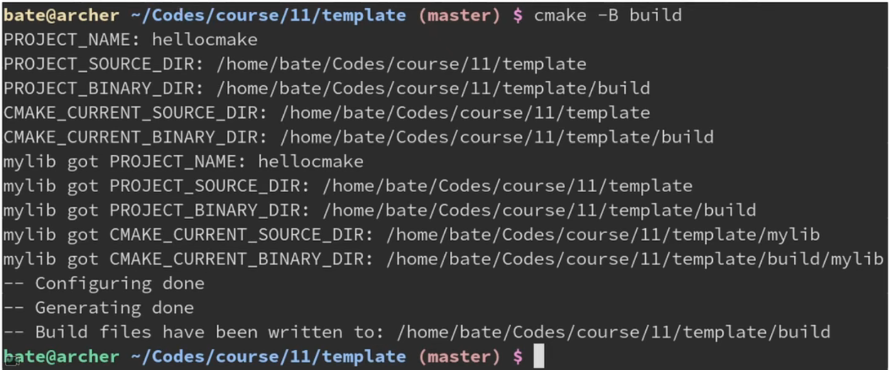

项目名的另一大作用:会设置另外<项目名>_SOURCE_DIR等变量

```cmake
cmake_minimum_required(VERSION 3.15)
project(hellocmake VERSION 0.2.3)
messgae("PROJECT_NAME:${PROJECT_NAME}")
messgae("PROJECT_VERSION:${PROJECT_VERSION}")
messgae("PROJECT_SOURCE_DIR:${PROJECT_SOURCE_DIR}")
messgae("PROJECT_BINARY_DIR:${PROJECT_BINARY_DIR}")
messgae("hellocmake_NAME:${hellocmake_NAME}")
messgae("hellocmake_VERSION:${hellocmake_VERSION}")
messgae("hellocmake_SOURCE_DIR:${hellocmake_SOURCE_DIR}")
messgae("hellocmake_BINARY_DIR:${hellocmake_BINARY_DIR}")
```

**小技巧: Cmake的${}表达式可以嵌套**

因为${PROJECT_NAME}求值的结果是 hellocmake。

所以${${PROJECT_NAME}_VERSION}相当于${hellocmake_VERSION}进一步求值的结果也就是刚刚指定的0.2.3了。


**cmake_minimum_required 指定最低所需的CMake版本**

假如你写的 CMakeLists.txt包含了3.15版本才有的特性,如果用户在老版本上使用,就会出现各种奇怪的错误。因此最好在第一行加个 cmake_minimum_required (VERSION 3.15)表示本 Cmakelists txt至少需要 Cmake版本315以上才能运行。如果用户的 CMake版本小于3.15,会出现“ CMake版本不足”的提示。

```cmake
message("CMAKE_VERSION:${CMAKE_VERSION}")
message("CMAKE_MINIMUM_REQUIRED:${CMAKE_MINIMUM_REQUIRED}")
```


## 其他相关变量

PROJECT_SOURCE_DIR：**当前项目**源码路径(存放main.cp的地方)

PROJECT_ BINARY_DIR：**当前项目**输岀路径(存放main.exe的地方)

CMAKE_SOURCE_DIR：**根项目**源码路径(存放main.cpp的地方)

CMAKE_BINARY_DIR：**根项目**输出路径(存放main.exe的地方)

PROJECT_ISITOP_LEVEL: BOOL类型，表示当前项目是否是(最顶层的)根项目

PROJECT_NAME：当前项目名

CMAKE_PROJECT_NAME：根项目的项目名

详见：https://cmake.org/cmake/help/latest/command/project.html


**CMAKE_BUILD_TOOL:执行构建过程的工具。**该变量设置为 Cmake构建时输出所需的程序。对于VS6, CMAKE_BUILD_TOOL设置为msdev,对于Unix,它被设置为make或 gmake。对于VS7,它被设置为 devenv，对于 Nmake构建文件,它的值为 nmake。

CMAKE_DL_LIBS:包含 dlopen和 dlclose的库的名称。

CMAKE_COMMAND:指向 cmake可执行程序的全路径。

CMAKE_CTEST_COMMAND:指向ctes可执行程序的全路径。

CMAKE_EDIT_COMMAND: cmake-gui或 ccmake的全路径。

CMAKE_EXECUTABLE_SUFFIX:该平台上可执行程序的后缀。

CMAKE_SIZEOF_VOID_P: void指针的大小。

CMAKE_SKIP_RPATH: 如果为真,将不添加运行时路径信息。默认情况下是如果平台支持运行时信息,将会添加运行时信息到可执行程序当中。这样从构建树中运行程序将很容易。为了在安装过程中忽略掉 RPATH,使用 CMAKE_SKIP_INSTALL_RPATH。

CMAKE_GENERATOR:构建工程的产生器。它将产生构建文件(eg." Unix Makefiles"," VisualStudio 2019", etc.

## 子模块

子模块里也可以用 project命令，将当前目录作为一个独立的子项目这样一来 PROJECT_SOURCE_DIR就会是子模块的源码目录而不是外层了。

这时候 CMake会认为这个子模块是个独立的项目，会额外做一些初始化。

他的构建目录 PROJECT_BINARY_DIR也会变成 build/<源码相对路径>。这样在MSvC上也会看见 build/mylib/mylib. vcxproj的生成。

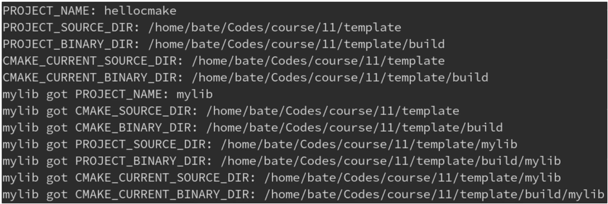

## 指定使用的编程语言

project(项目名 LANGUAGES使用的语言列表…) 指定了该项目使用了哪些编程语言。

目前支持的语言包括:

- C：C语言
- CXX：C++语言
- ASM：汇编语言
- Fortran：老年人的编程语言
- CUDA:英伟达的CUDA(3.8版本新增)
- OBJC：苹果的 Objective-C(3.16版本新增)
- OBJCXX:苹果的 Objective-C++(3.16版本新增)
- lSPC:一种因特尔的自动SIMD编程语言(3.18版本新增)

**如果不指定 LANGUAGES,默认为C和CXX**。

常见问题：LANGUAGES中没有启用C语言，但是却用到了C语言

```cmake
cmake_minimum_required(VERSION 3.15)
project(hellocmake LANGUAGES CXX)
add_executable(main main.c)
```

main.c

```c
#include <stdio.h>

int main(void) {
  printf("Hello, world from C！\n");
  return 0;
}
```

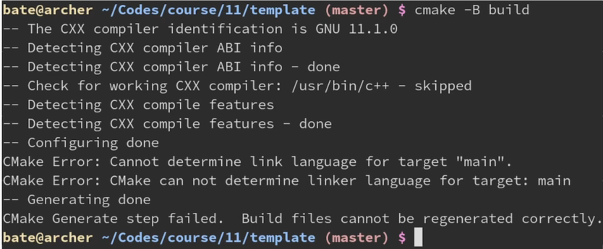

解决：改成project(项目名 LANGUAGES C CXX) 即可

```cmake
cmake_minimum_required(VERSION 3.15)
project(hellocmake LANGUAGES C CXX)
add_executable(main main.c)
```

也可以先设置 LANGUAGES NONE,之后再调用 enable_ language(CXX)

这样可以把 enable_language放到if语句里，从而只有某些选项开启才启用某语言之类的。

```cmake
cmake_minimum_required(VERSION 3.15)
project(hellocmake LANGUAGES NONE)
enable_language(CXX)
add_executable(main main.cpp)
```

## 设置C++标准

CMAKE_CXX_STANDARD变量

CMAKE_CXX_STANDARD是一个整数，表示要用的C++标准。

比如需要C++17那就设为17,需要C++23就设为23。

CMAKE_ CXX_STANDARD_REQUIRED 是BOOL类型，可以为ON或OFF，默认OFF。

他表示是否一定要支持你指定的C++标准：如果为OFF则 Cmake检测到编译器不支持C++17时不报错，而是默默调低到C++14给你用；为ON则发现不支持报错，更安全。

```cmake
cmake_minimum_required(VERSION 3.15)
set(CMAKE_CXX_STANDARD 17)
set(CMAKE_CXX_STANDARD_REQUIRED ON)
set(CMAKE_CXX_EXTENSION ON)

project(hellocmake LANGUAGES C CXX)
add_executable(main main.c)
```

CMAKE_CXX_EXTENSION 也是BOOL类型,默认为ON。设为ON表示启用GCC特有的一些扩展功能；OFF则关闭GCC的扩展功能，只使用标准的C++。

要兼容其他编译器(如MSVC)的项目，都会设为OFF防止不小心用了GCC才有的特性。

此外，**最好是在 project指令前设置 CMAKE_ CXX_STANDARD这一系列变量**，这样Cmake可以在 project函数里对编译器进行一些检测，看看他能不能支持C++17的特性。

常见误区：我手动添加-std=c++17行不行？

请勿直接修改 CMAKE_CXX_FLAGS来添加-std=c++17(你在百度CSDN学到的用法)。

请使用 Cmake帮你封裝好的 CMAKE_CXX_STANDARD(从业人员告诉你的正确用法)。

为什么百度不对：你GCC用户手动指定了-std=c++17,让MSVC的用户怎么办?

此外 Cmake已经自动根据 CMAKE_CXX_STANDARD 的默认值11添加-std=C++11选项了，你再添加个-std=c++17选项不就冲突了吗?所以请用 CMAKE_CXX_STANDARD。

## 设置版本号字段

**VSERSION字段**

projec(项目名 VERSION x.y.z) 可以把当前项目的版本号设定为x.y.z

- 之后可以通过 PROJECT_VERSION来获取当前项目的版本号。

- PROJECT_VERSION_MAJOR获取x(主版本号)。
- PROJECT_VERSION_MINOR获取y(次版本号)。
- PROJECT_VERSION_PATCH获取z(补丁版本号)。

```cmake
cmake_minimum_required(VERSION 3.15)
project(hellocmake VERSION 0.2.3)
messgae("PROJECT_NAME:${PROJECT_NAME}")
messgae("PROJECT_VERSION:${PROJECT_VERSION}")
messgae("PROJECT_VERSION_MAJOR:${PROJECT_VERSION_MAJOR}")
messgae("PROJECT_VERSION_MINOR:${PROJECT_VERSION_MINOR}")
messgae("PROJECT_VERSION_PATCH:${PROJECT_VERSION_PATCH}")
```

一些没什么用,但 Cmake官方不知为何就是提供了的项目字段

```cmake
project(hellocmake DESCRIPTION "A free,open-source, online modern C++ course" 
    HOMEPAGE_URL https://github.com/xxx/yyy
)
```

## 一个标准的CMakeLists.txt模板

```cmake
cmake_minimum_required(VERSION 3.15)

set(CMAKE_CXX_STANDARD 17)
set(CMAKE_CXX_STANDARD_REQUIRED ON)

project(zeno LANGUAGES C CXX)

if (PROJECT_BINARY_DIR STREQUAL PROJECT_SOURCE_DIR)
    message(WARNING "The binary directory of CMake cannot br the same as source directory!")
endif()

if (WIN32)
     add_definitions(-DNOMINMAX -D_USE_NATH_DEFINES)
endif()

if (NOT MSVC)
    find_program(CCACHE_PROGRAM ccache)
    if (CCACHE_PROGRAM)
        message(STATUS "Found CCache:{CCACHE_PROGRAM}")
        set_property(GLOBAL PROPERTY RULE_LAUNCH_COMPILE ${CCACHE_PROGRAM})
        set_property(GLOBAL PROPERTY RULE_LAUNCH_LINK ${CCACHE_PROGRAM})
    endif()
endif()
```

# 对象的属性

前面提到了：

```cmake
set_property(TARGET otherlib PROPERTY POSITION_INDEPENDENT_CODE ON)
```

除了 POSITION_INDEPENDENT_CODE 还有哪些这样的属性

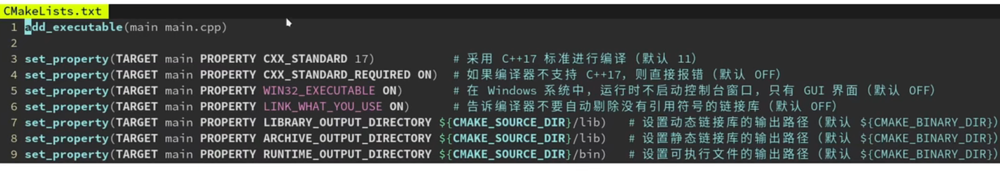

另一种方式: set_target_properties批量设置多个属性：

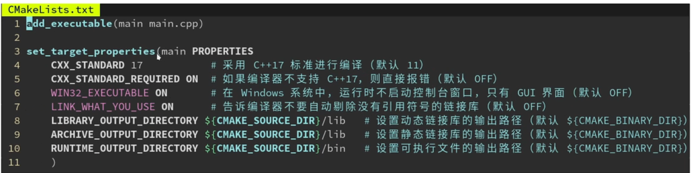

另一种方式:通过全局的变量,让之后创建的所有对象都享有同样的属性

相当于改变了各个属性的初始默认值。要注意此时set( CMAKE XXX)必须在 add_executable之前才有效。

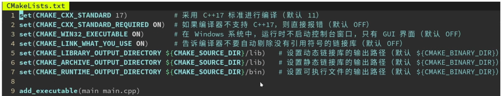


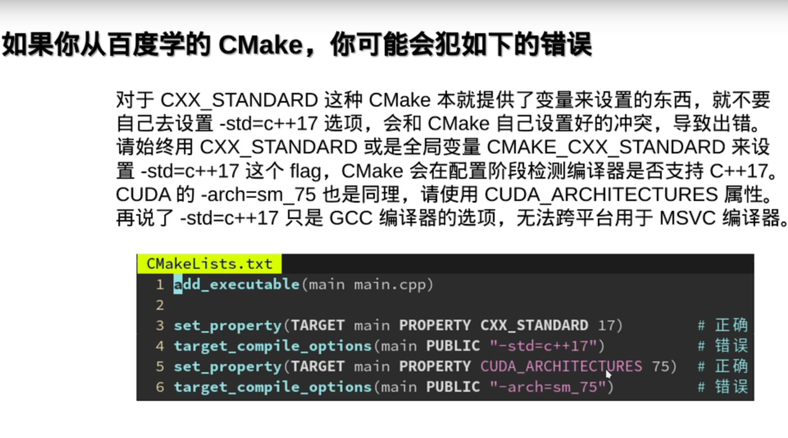


# 调用静态库和动态库

## 静态库与动态库的区别

[静态库与动态库的区别_sheng_bin的博客-CSDN博客_静态库和动态库的区别](https://blog.csdn.net/sheng_bin/article/details/52961520)

库：编译好的二进制文件，加上头文件就可以供给别人使用。

静态库：编译时一起打包带上。windows：.lib，Linux和Mac：.a

动态库：运行时自己去找。windows：.dll，Linux：.so，Mac：.dylib

**静态库的好处**很明显，编译完成之后，库文件实际上就没有作用了。目标程序没有外部依赖，直接就可以运行。当然其缺点也很明显，就是会使用目标程序的体积增大。

**动态库的优点**是，不需要拷贝到目标程序中，不会影响目标程序的体积，而且同一份库可以被多个程序使用（因为这个原因，动态库也被称作共享库）。同时，编译时才载入的特性，也可以让我们随时对库进行替换，而不需要重新编译代码。动态库带来的问题主要是，动态载入会带来一部分性能损失，使用动态库也会使得程序依赖于外部环境。如果环境缺少动态库或者库的版本不正确，就会导致程序无法运行。


## 调用静态库

main.cpp调用mylib.cpp里的say_hello函数

CMakeLists.txt

```cmake
add_executable(main main.cpp mylib.cpp)
```

main.cpp

```c++
#include "mylib.h"
int main() {
  say_hello();
  return 0;
}
```

mylib.cpp

```c++
#include "mylib.h"
#include <cstdio>
void sat_hello() {
  printf("hello, mylib!\n");
}
```

## 调用动态库

**改进：mylib作为一个动态库**

CMakeLists.txt

```cmake
add_library(mylib SHARED mylib.cpp)
add_executable(main main.cpp)
target_link_libraries(mian PUBLIC mylib)
```

## 调用对象库

改进：mylib作为一个对象库

**对象库类似于静态库**，但不生成.a文件，只由Cmake记住该库生成了哪些对象文件。

```cmake
add_library(mylib OBJECT mylib.cpp)
add_executable(main main.cpp)
target_link_libraries(mian PUBLIC mylib)
```

对象库的优点是，可以对mylib.cpp单独指定不同的编译选项。

对象库是 Cmake自创的，绕开了编译器和操作系统的各种繁琐规则，保证了跨平台统一性。在自己的项目中，我推荐全部用对象库( OBJECT)替代静态库( STATIC）避免跨平台的麻烦。对象库仅仅作为组织代码的方式，而实际生成的可执行文件只有一个，减轻了部署的困难。


静态库的麻烦：GCCD编译器自作聪明，会自动剔除没有引用符号的那些对象。比如：

CMakeLists.txt

```cmake
add_library(mylib STATIC mylib.cpp)
```

mylib.cpp

```c++
#include <cstdio>
static int unused = printf("mylib initialized\n"); //在main函数执行之前执行一些初始化的逻辑
```

main.cpp

```c++
#include <cstdio>
int mian() {
  printf("main function\n");
}
```

GCC意识到mylib没有被用到，于是删除了mylib.o文件。

**对象库可以绕开编译器的不统一:保证不会自动剔除没引用到的对象文件**

虽然动态库也可以避免剔除没引用的对象文件,但引入了运行时链接的麻烦。

## add_ library默认是静态库还是动态库

add_ library无参数时,是静态库还是动态库?

会根据 BUILD_SHARED_LIBS 这个变量的值决定是动态库还是静态库。

ON则相当于 SHARED，OFF则相当于 STATIC。如果未指定 BUILD_SHARED_LIBS变量，则默认为 STATIC。

因此,如果发现一个项目里的 add_library都是无参数的，意味着你可以用：

cmake -b build-DBUILD_SHARED_LIBS:BOOL=ON来让他全部生成为动态库。稍后会详解命令行传递变量的规则。

```cmake
set(BUILD_SHARED_LIBS ON)
add_library(mylib mylib.cpp)
```

小技巧:设定一个变量的默认值

要让 BUILD_SHARED_LIBS默认为ON，可以用下面这个方法：

如果该变量没有定义，则设为ON，否则保持用户指定的值不变。这样当用户没有指定 BUILD_SHARED_LIBS这个变量时，会默认变成ON。也就是说除非用户指定了-DBUILD_SHARED_LIBS:BOOL=OFF才会生成静态库，否则默认是生成动态库。

```cmake
if (NoT DEFINED BUILD_SHARED_LIBS)
    set(BUILD_SHARED_LIBS ON)
endif()
```

## 常见坑点

### 常见坑点：动态库无法链接静态库

```cmake
add_library(otherlib STATIC otherlib.cpp)

add_library(mylib SHARED mylib.cpp)
target_link_libraries(mylib PUBLIC otherlib)

add_library(main main.cpp)
target_link_libraries(mylib PUBLIC mylib)
```

解决：让静态库编译时也生成位量无关的代码(PIC),这样才能装在动态库里

```cmake
set(CMAKE_POSITION_INDEPENDENT_CODE ON)
add_library(otherlib STATIC otherlib.cpp)

add_library(mylib SHARED mylib.cpp)
target_link_libraries(mylib PUBLIC otherlib)

add_library(main main.cpp)
target_link_libraries(mylib PUBLIC mylib)
```

也可以只针对一个库，只对他启用位置无关的代码（PIC）

```cmake
add_library(otherlib STATIC otherlib.cpp)
set_property(TARGET otherlib PROPERTY POSITION_INDEPENDENT_CODE ON)

add_library(mylib SHARED mylib.cpp)
target_link_libraries(mylib PUBLIC otherlib)

add_library(main main.cpp)
target_link_libraries(mylib PUBLIC mylib)
```

### 假如你一定要用动态链接库( Windows对动态链接很不友好)

m/mylib.cpp:

```c++
#include <cstdio>

#indef _MSC_VER
__declspec(dllexport)
#endif

void say_hello() {
  printf("hello");
}
```

m/mylib.h:

```h
#pragma once

##indef _MSC_VER
__declspec(dllimport)
#endif
  
void say_hello();
```

根目录的CMakeLists.txt:

```cmake
cmake_minimum_required(VERSION 3.15)

add_subdirectory(mylib)

add_executable(main main.cpp)
target_link_libraries(main PUBLIC mylib)
```

m/CMakeLists.txt:

```cmake
add_library(mylib SHARED mylib.cpp mylib.h)
```

### 链接了自己的dll但是为什么运行时会找不到

常见问题：老师,我链接了自己的dll但是为什么运行时会找不到?

这是因为你的dll和exe不在同一目录。 Windows比较蠢，他只会找当前exe所在目录然后查査找PATH，找不到就报错。而你的dll在其他目录，因此 Windows会找不到dll。

解决1:把dll所在位置加到你的PATH环境变量里去，一劳永逸。

解决2:把这个dll,以及这个dll所依赖的其他dll,全部拷贝到和exe文件同一目录下。

### 手动拷贝dll好麻烦,能不能让 Cmake把dll 自动生成在exe同一目录?

归根到底还是因为 Cmake把定义在顶层模块里的main放在 build/main.exe。而mylib因为是定义在mylib这个子模块里的，因此被放到了 build/mylib/myib.dll

解决1:设置mylib对象的 **xx_OUTPUT_DIRECTORY** 系列属性

所以，可以设置mylib的这些属性，让mylb.dll文件输出到 PROJECT_BINARY_DIR,也就是项目根目录(main所在的位置)。这样 main.exe在运行时就能找到 mylib.dll了。·是的，为了伺候这睿智的 Wendou系统，需要设置全部9个属性，是不是非常繁琐?

m/CMakeLists.txt

```cmake
add_library(mylib SHARED mylib.cpp mylib.h)
set_property(TARGET mylib PROPERTY RUNTIME_OUTPUT_DIRECTORY ${PROJECT_BINARY_DIR})
set_property(TARGET mylib PROPERTY ARCHIVE_OUTPUT_DIRECTORY ${PROJECT_BINARY_DIR})
set_property(TARGET mylib PROPERTY LIBRARY_OUTPUT_DIRECTORY ${PROJECT_BINARY_DIR})
set_property(TARGET mylib PROPERTY RUNTIME_OUTPUT_DIRECTORY_DEBUG ${PROJECT_BINARY_DIR})
set_property(TARGET mylib PROPERTY ARCHIVE_OUTPUT_DIRECTORY_DEBUG ${PROJECT_BINARY_DIR})
set_property(TARGET mylib PROPERTY LIBRARY_OUTPUT_DIRECTORY_DEBUG ${PROJECT_BINARY_DIR})
set_property(TARGET mylib PROPERTY RUNTIME_OUTPUT_DIRECTORY_RELEASE ${PROJECT_BINARY_DIR})
set_property(TARGET mylib PROPERTY ARCHIVE_OUTPUT_DIRECTORY_RELEASE ${PROJECT_BINARY_DIR})
set_property(TARGET mylib PROPERTY LIBRARY_OUTPUT_DIRECTORY_RELEASE ${PROJECT_BINARY_DIR})
```

不懂就问,为什么说 Linux系统是永远滴神?

而 Linux系统支持 RPATH, CMake会让生成出来可执行文件的 RPATH字段指向他链接了的.so文件所在目录，运行时会优先从 RPATH里找链接库，所以即使不在同目录也能找到。

所以还有第三种解决方案:微软,我卸卸你全家(指卸载)。然后安装 Arch linux系统。

需要手动修改或查看一个ELF文件的 RPATH,可以用 chrpath或 patchelf命令。

# 链接第三方库

案例：需要使用tbb这个库

CMakeLists.txt

```cmake
add_executable(main main.cpp)
target_link_libraries(main PUBLIC tbb)
```

main.cpp:

```c++
#include <tbb/parallel_for.h>

int main() {
  tbb::parallel_for(0, 4, [&](int i) {
    printf("hello,%d!\n",i)
  });
}
```

直接链接tbb的缺点:

如果这样直接指定tbb， Cmake会让链接器在系统的库目录里查找tb，他会找到/usr/ib/iotb.so这个系统自带的，但这对于没有一个固定库安装位置的Windows系统并不适用。

此外，他还要求tbb的头文件就在/usr/include这个系统默认的头文件目录，这样才能#include<tbb/parallel_for .h>不出错，如果tbb的头文件在其他地方就需要再加一个 target_include_directories 设置额外的头文件查找目录。

CMakeLists.txt

```cmake
add_executable(main main.cpp)
target_link_libraries(main PUBLIC tbb)
```

也可以直接写出全部路径，就是太硬核。

也可以直接写出全部路径，这样也可以让没有默认系统路径的 Windows找到安装在奇怪位置的tbb。

不过这样根本不跨平台，你这样改了别人如果装在不同地方就出错了。

顺便一提, Cmake的路径分割符始终是/。即使在 Windows上，也要把所有的\改成/，这是出于跨平台的考虑。请放心, Cmake会自动在调用MSVC的时候转换成\,你可以放心的用${x}/bin来实现和 Python的 os.path.join(x,'bin')一样的效果。

CMakeListx.txt：

```cmake
add_executable(main main.cpp)
target_link_libraries(main PUBLIC C:/Users/archibate/installed/tbb/tbb.dll)
```

毕竟大多数操作系统都是Unⅸ-like嘛.…就 Windows喜欢搞特殊

```cmd
cd /d C:\\Program\ Files\\(x86\)\ Visual\ Studio\\2019\\
```

怎么路径里动不动夹杂几个转移符、空格、特殊符号?这谁顶得住啊。高情商: Windows是最适合练习你C语言转移符使用水平的地方。

**更通用的方式: find_package**

更好的做法是用 Cmake的 find_package命令。

find_package(TBB REQUIRED)会查找/usr/lib/cmake/TBB/Tbbconfig.cmake这个配置文件，并根据里面的配置信息创建TBB::tbb这个伪对象(他实际指向真正的tbb库文件路径usr/lib/libtbb.so)，之后通过 target_link_libraries链接TBB:tbb就可以正常工作了。

CMakeListx.txt：

```cmake
add_executable(main main.cpp)
find_package(TBB REQUIRED)
target_link_libraries(main PUBLIC TBB::tbb)
```


TBB:tbb的秘密：自带了一些 PUBLIC属性

CMakeListx.txt：

```cmake
add_executable(main main.cpp)
find_package(TBB REQUIRED)
target_link_libraries(main PUBLIC TBB::tbb)
```

TBB: tbb是一个伪对象(imported)，除了他会指向/usr/lib/libtbb.so之外，Tbbconfig.cmake还会给TBB::tbb添加一些 PUBLIC属性，用于让链接了他的对象带上一些flag之类的。比如，TBB安装在/opt/tbb 目录下，头文件在/ opt/tbb/include里，那么这时 Tbbconfig.cmake里就会有：target_include_directories(TBB::tbb PUBLIC /opt/tbb/include)

这样main在链接了 TBB: tbb的时候也会被“传染”上/opt/tbb/include这个目录，不用调用者手动添加了。

再比如，TBB::tbb链接了另一个库 Bloc::bosc，那这个库也会自动链接到main上，无需调用者手动添加。  

比如 spdlog的 spdlog-config.cmake 就会定义 SPDLOG_NOT_HEADER_ONLY这个宏为 PUBLIC。从而实现直接# include<spdlog/spdlog.h>时候是纯头文件，而 find_package(spdlog REQUIRED)时却变成预编译链接库的版本。(嗯,其实不是 PUBLIC而是 INTERFACE，因为伪对象没有实体)

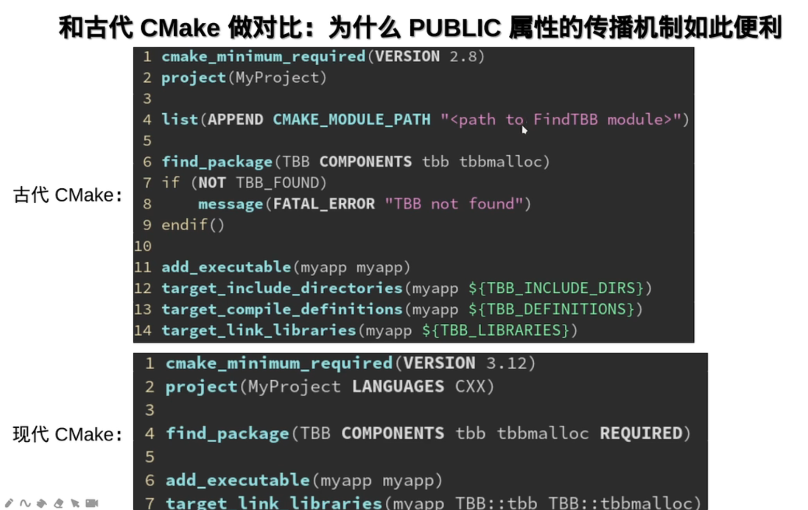

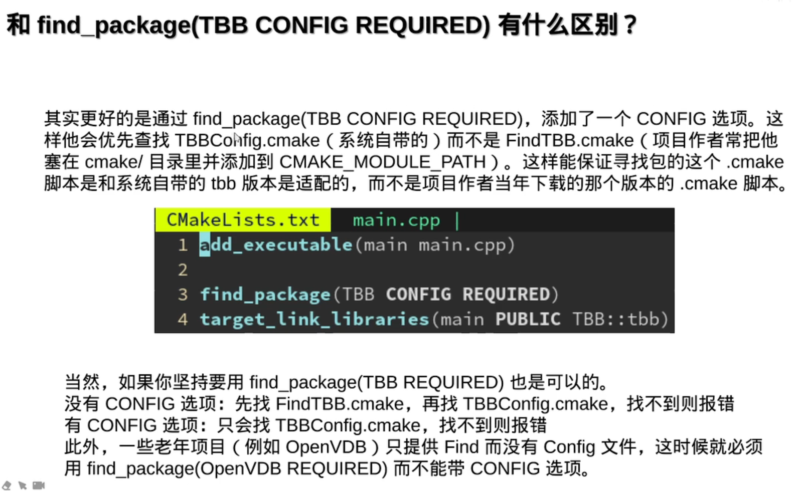

1：01：27

1