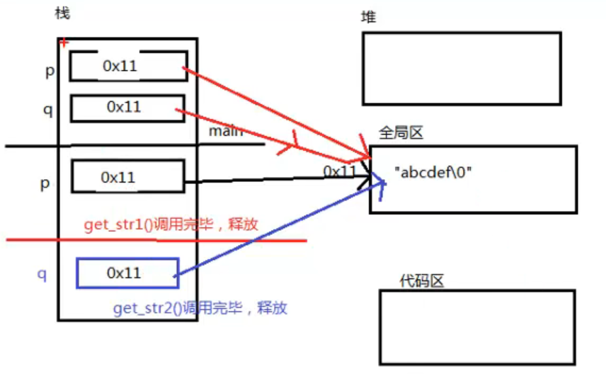
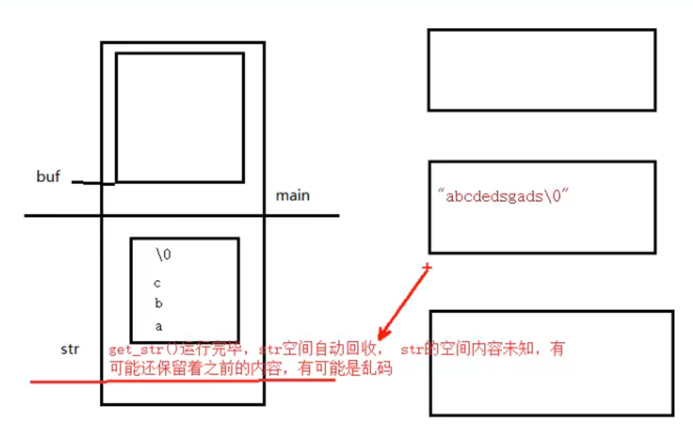
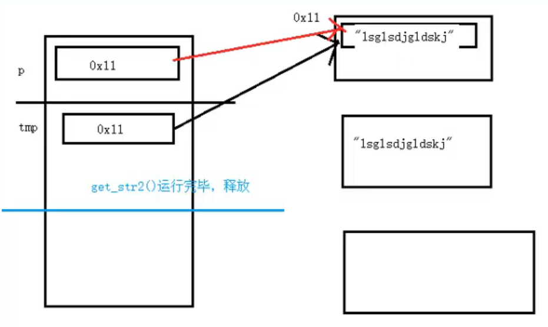
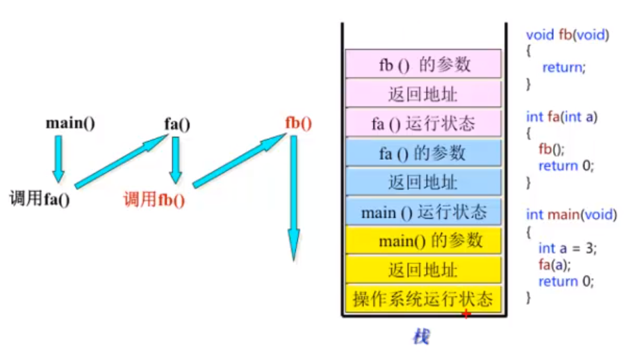

# 函数封装和数组形参退化为指针

先来个原始版本，没有用函数封装

```c
int main01() {
    int a[] = {10, 7, 1, 9, 4, 6, 7, 3, 2, 0};
    //这样写a是数组类型，sizeof(a)就是元素个数*元素的字节数
    int n = sizeof(a) / sizeof(a[0]); //数组元素的个数
    printf("排序前：");
    for (int i = 0; i < n; ++i) {
        printf("%d ", a[i]);
    }
    printf("\n");

    //选择排序
    int temp = 0;
    for (int i = 0; i < n - 1; ++i) {
        for (int j = i + 1; j < n; ++j) {
            if (a[i] > a[j]) {//升序
                temp = a[i];
                a[i] = a[j];
                a[j] = temp;
            }
        }
    }
    printf("排序后：");
    for (int i = 0; i < n; ++i) {
        printf("%d ", a[i]);
    }
    printf("\n");
    return 0;
}
```

使用函数：数组退化为指针

```c
/**
 * 这样写都对：
 * void print_array(int a[], int n)
 * void print_array(int a[1], int n)
 * 如果数组作为函数参数，数组形参退化为指针，所以形参里a[1]写成a[100]可以，随便写什么数
 * 方括号里数字是没有意义的
 * 还可以这样写：
 * void print_array(int *a, int n)
 * 那怎么知道它退化成指针了呢?利用：n = sizeof(a) / sizeof(a[0]);
 */
void print_array(int *a, int n) {
    //a，当作指针用，指针类型，32位的4个字节，64位8个字节
    //int 类型是4个字节，因此 n = 8 /4 =2
    n = sizeof(a) / sizeof(a[0]);
    printf("print_array:n=%d\n",n);
    for (int i = 0; i < n; ++i) {
        printf("%d ", a[i]);
    }
}

void sort_array(int a[], int n) {
    //选择排序
    int temp = 0;
    for (int i = 0; i < n - 1; ++i) {
        for (int j = i + 1; j < n; ++j) {
            if (a[i] > a[j]) {//升序
                temp = a[i];
                a[i] = a[j];
                a[j] = temp;
            }
        }
    }
}

int main(void) {
    int a[] = {10, 7, 1, 9, 4, 6, 7, 3, 2, 0};
    int n = sizeof(a) / sizeof(a[0]); //数组元素的个数
    printf("排序前：\n");
    print_array(a, n);
    sort_array(a, n);
    printf("排序后：\n");
    print_array(a, n);
    printf("\n");
    return 0;
}
```

# 内存四区

## 数据类型的本质：固定内存大小的别名

数据类型可理解为**创建变量的模具**：是**固定内存大小的別名**。

数据类型的作用：编译器预算对象(变量)分配的内存空间大小。

注意：数据类型只是模具，编诏器并没有分空间，只有根据类型(模具)创建变量(实物)，编译器才会分配空间。

C语言中，函数也可以看作一种数据类型，进一步思考，函数这种数据类型，能够重新定义（函数指针）。

下面来个例子感受一下：

```c
#include <stdio.h>

int main() {
    int a = 10;//告诉编译器，分配4个字节的内存
    int b[10]; //告诉编译器，分配4*10=40个字节的内存

    //打印地址,数组首元素地址，数组首地址，相等
    printf("b:%p, &b:%p\n",b,&b);//都是0xffffcc10

    //b+1:0xffffcc14, &b+1:0xffffcc38
    //数组首元素地址+1，加了4（int类型大小）
    //数组首地址+1，加了40（整个数组的大小），注意16进制转换
    //&运算符的优先级大于+号
    printf("b+1:%p, &b+1:%p\n",b+1,&b+1);

    printf("b:%p, b+1:%p, &b:%p, &b+1:%p \n", b, b + 1, &b, &b + 1);
    //b+1 和 &b + 1 的结果不一样，因为b和&b的数据类型不一样
    //b代表数组元素的首地址，&b代表整体数组的地址

    //指针类型长度，32位程序，长度4，64位程序，长度8
    char***********p=NULL;
    int *q = NULL;
    printf("%d,%d\n",sizeof(p), sizeof(q));//%lu: long unsigned
    return 0;
}
```


## 给类型起别名

```c
/**
 * 给类型起别名
 */
#include <stdio.h>

typedef unsigned int u32;

struct MyStruct{
    int a;
    int b;
};
//typedef通常和结构体一起使用，很方便
typedef struct MyStruct2{
    int a;
    int b;
} TMP;

int main(){
    u32 t;
    //定义结构体变量，一定要加上 struct 关键字
    struct MyStruct ml;
    //MyStruct ml2; //结构体变量不加struct，编译报错
    TMP m3; //使用typedef起别名后，就可以不用加struct

    return 0;
}
```

## void类型

- 函数参数为空，定义函数时，可以用void修饰，int fun(void)
- 函数没有返回值：void fun(void)
- 不能定义void类型的普通变量: void a;//err，无法确定类型，不同的类型，分配的空间不一样
- 可以定义void *变量： void *p;//ok，32位-4字节，64位-8字节

还是那句话，数据类型本质：固定内存块大小的别名

 **void *p 万能指针**，函数返回值，函数参数。

## 变量的本质：一段连续内存空间的别名

**既能读又能写**的内存对象，称为变量；若一旦初始化后不能修改的对象则称为常量。

变量定义形式：类型 标识符，标识符，...

**变量的本质：一段连续内存空间的别名**

程序通过变量来申请和命名内存空间 int a = 0;

通过变量名访问内存空间。

打个比方，数据类型是模具，变量是根据模具创建出来的实物

看下面的例子，体会一下：

```c
/**
 * 变量的本质: 一段连续内存空间的别名
 */
#include <stdio.h>

int main() {
    //变量相当于门牌号，内存相当于房间
    int a;
    int *p;

    //直接赋值
    a = 10;
    printf("a=%d\n", a);

    //间接赋值
    printf("a=%p\n", &a);//a=0xffffcc34
    p = &a;
    printf("p=%p\n", p);//p=0xffffcc34

    *p = 22;
    printf("*p = %d, a = %d\n", *p, a);//22,22
    return 0;
}
```

## 内存四区模型



流程说明

1、操作系统把物理硬盘代码load到内存

2、操作系统把C代码分成四个区

**栈区**( stack)：由编译器自动分配释放，存放函数的参数值，返回值，局部变量的值等。

**堆区**(heap)：一般由程序员分配释放(动态内存申请与释放)，若程序员不释放，程序结束时可能由操作系统回收。


**全局区**(静态区)( static)：存放全局变量、静态变量、常量（如字符串常量），全局区的叫法有很多：全局区、静态区、数据区、全局静态区、静态全局区。这部分可以细分为data区和bss区。

- data区里主要存放的是**已经初始化**的全局变量、静态变量和常量
-  bss区主要存放的是**未初始化**的全局变量、静态变量，这些未初始化的数据在程序执行前会自动被系统初始化为**0或者NULL**
- 常量区，常量区是全局区中划分的一个小区域，里面存放的是常量，如const修饰的全局变量、**字符串常量**等

全局变量和静态变量的存储是放在一块的，初始化的全局变量和静态变量在一块区域，未初始化的全局变量和未初始化的静态变量在相邻的另一块区域，该区域在程序结束后由操作系统释放。

常量区：字符串常量和其他常量的存储位置，程序结束后由操作系统释放。


**程序代码区**：存放函数体的二进制代码。这部分主要是存放 CPU 执行的机器指令，通常是可共享的（即另外的执行程序可以调用它），使其可共享的目的是对于频繁被执行的程序，只需要在内存中有一份代码即可。代码区通常是只读的，使其只读的原因是防止程序意外地修改了它的指令。另外，代码区还规划了局部变量的相关信息。代码区的特点是共享和只读。


3、操作系统找到main函数入口执行


### 全局区分析

```c
#include <stdio.h>

char *get_str1() {
    char *p = "abcedf";//放在全局区中的常量区
    return p;
}

char *get_str2() {
    char *q = "abcedf";//放在全局区中的常量区
    return q;
}

int main() {
    char *p = NULL;
    char *q = NULL;
    p = get_str1();
    //%s:这里是指针指向内存区域的内容
    //%d %p:这里是 p 本身的值(内存地址)
    printf("p=%s,p=%p\n", p,p);//abcedf,0x100403000
    q= get_str2();
    printf("q=%s,q=%p\n", q,q);//abcedf,0x100403000
    //一样的
    return 0;
}
```




### 栈区和堆区分析

```c
/**
 * 内存四区之栈区和堆区
 */
#include <stdio.h>
#include <stdlib.h>
#include <string.h>

char *get_str() {
    //"abcdefg"在全局区
    //对于数组，编译器会将全局区的"abcdefg"再拷贝一份到栈区的str[]
    char str[] = "abcdefg";//分配在栈区，函数执行完毕，局部变量就释放了
    //warning C4172: 返回局部变量或临时变量的地址: str
    return str;
}

char *get_str2() {
    char *temp = (char *) malloc(100); //堆区
    if (temp == NULL) {
        return NULL;
    }
    strcpy(temp,"asdfxgsdf");
    return temp;
}

int main() {
    char buf[128] = {0};
    //vs编译器下能打印出来是因为，已经把字符串拷贝拷贝出来了
    strcpy(buf, get_str());//不确定，有可能打印出来(vs)，还有可能编译报错(gcc)
    printf("buf=%s\n", buf);
    char *p = NULL;
    p = get_str();//vs-debug能正常显示，vs-release乱码
    printf("p=%s\n", p);

    p = get_str2();
    if (p != NULL) {
        printf("p=%s\n", p);
        free(p);//free不是清除数据，是置一个标志位，告诉操作系统这块内存可以用了。
        //p的指向还是不变的，还是可以用的，因此要给p指向空
        p = NULL;
        //一般，还要加一句：
        if (p != NULL) {
            free(p);
        }
    }
    return 0;
}
```

栈区图解：




堆区图解：



## 函数调用模型



main函数在栈区开辟的内存，所有子函数均可以使用。

main函数在堆区开辟的内存，所有子函数均可以使用。

子函数1里面调用子函数2：

- 子函数1在堆区开辟的内存，子函数1和2均可以使用
- 子函数1在栈区开辟的内存，子函数1和2均可以使用

## 静态局部变量

```c
int *getA(){
    static int a = 10;
    return &a;
}


int main() {
    int *p = getA();
    return 0;
}
```

## 栈的生长方向和内存存放方向



```c
/**
 * 栈的生长方向和内存存放方向
 * 栈：内存地址递减的
 * 堆：内存地址递增的
 * 栈中的数组：内存存放的方向递增
 * 堆中的数组：内存存放的方向递减
 * 也不绝对，和编译器有关
 */
#include <stdio.h>
#include <stdlib.h>
#include <string.h>

int main() {
    int a;
    int b;
    //&a = 00AFFC34, &b = 00AFFC28 栈：内存地址递减的
    printf("&a = %p, &b = %p\n",&a,&b);

    int buf[100];
    //buf:00AFFA90, buf+1:00AFFA94 栈中的数组：内存存放的方向递增
    printf("buf:%p, buf+1:%p\n",buf,buf+1);
    return 0;
}
```

# 分文件

1、分文件时，头文件防止头文件重复包含：

```h
#pragma once
```

a.h：

```h
#include "b.h"
```

b.h：

```h
#include "a.h"
```

main.c:

```c
#include "a.h"
```

编译报错：头文件包含太多：深度=1024

解决：加上：#pragma once

a.h：

```h
#pragma once
#include "b.h"
```

b.h：

```h
#pragma once
#include "a.h"
```

就解决了


2、让C代码可以在C++编译器编译运行：

```h
// __cplusplus是编译器提供好的宏，不是自定义的
#ifdef __cplusplus
extern "C"{
#endif

  //函数的声明

#ifdef __cplusplus
}
#endif
```

这样可以不用把.c后缀改为.cpp就能在C++编译器里运行


# 指针强化

## 指针也是一种数据类型

指针变量也是一种变量，占有内存空间，用来保存内存地址。

- 在指针声明时，*号表示所声明的变量位指针
- 在指针使用时，*号表示操作指针所指向的内存空间中的值

*p相当于通过地址（p变量的值）找打一块内存，然后操作内存。

```c
#include <stdio.h>
#include <stdlib.h>
#include <string.h>

//指针也是一种数据类型,指针变量也是一种变量
int main() {
    int *p = NULL;
    char **********q = NULL;
    printf("sizeof(p)=%d,sizeof(q)=%d\n", sizeof(p), sizeof(q));//32位：4

    //指针指向谁，就把谁的地址赋值给指针
    int a = 100;
    int *p1 = NULL;
    p1 = &a;
    //通过*号找到指针指向的内存区域，操作内存
    *p1 = 22;//a和p1的值都变成22
    //*放在=左边，给内存赋值，写内存，
    //*放在=右边，取内存的值，读内存
    int b = *p1;//22

    return 0;

}
```

void*,万能指针，使用时转换为实际的类型

## 指针变量和它指向的内存块


1
