# 什么是shellcode

本质上就是一段代码，特殊之处：

- 独立的存在，无需任何文件格式的包装
- 内存中运行，无需固定指定的宿主进程


通常过程：编写代码-->生成PE文件-->执行PE文件

PE文件格式

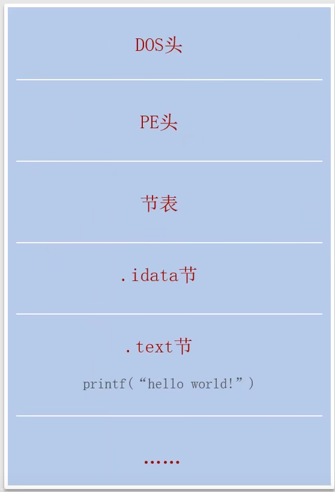


基本特点：短小精悍、灵活多变

生成方法：

- 自己编写：汇编语言，C语言，...

- 生成器：shell storm，Msfvenom

目标：实现一个实用的shellcode生成空间，能够高效快速的按照自己的需求生成shellcode

# 环境基本搭建

VS2019新建控制台项目，名字就叫做shellcode

写一个main函数：shellcode.cpp

```c

int main()
{
    return 0;
}
```

可以看到，什么也没有的main函数，编译生成的exe文件也有9KB

因为PE文件有一定的格式。

但是实际上，VS默认生成的exe文件，会添加一部分初始化的代码.

IDA打开这个exe，可以看到有很多sub开头的函数和其他函数，是VS自动生成的，这些代码对我们编写shellcode代码有很大干扰，要尽量清除这些代码，清除这些代码需要做如下操作：

## 1、修改程序入口点

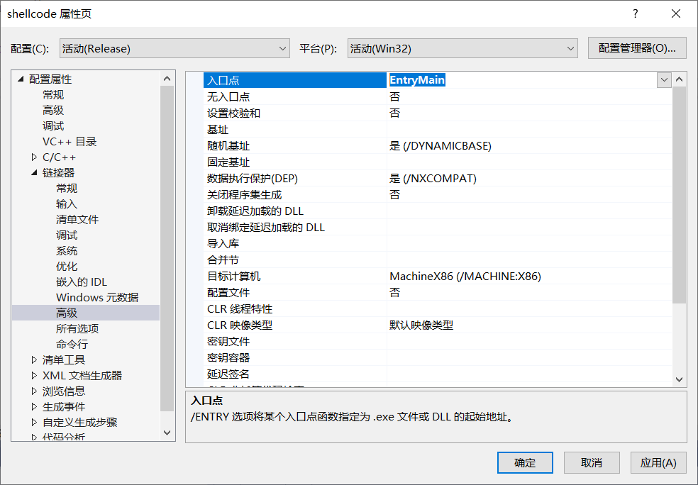

入口点改为任意我们想要的名字。

原程序的main函数名字改为EntryMain：

```c
int EntryMain()
{
    return 0;
}

```

## 2、关闭缓冲区安全检查

重新生成，发现shellcode.exe大小缩小为2.5KB

用IDA打开exe，发现只有一个start函数了：

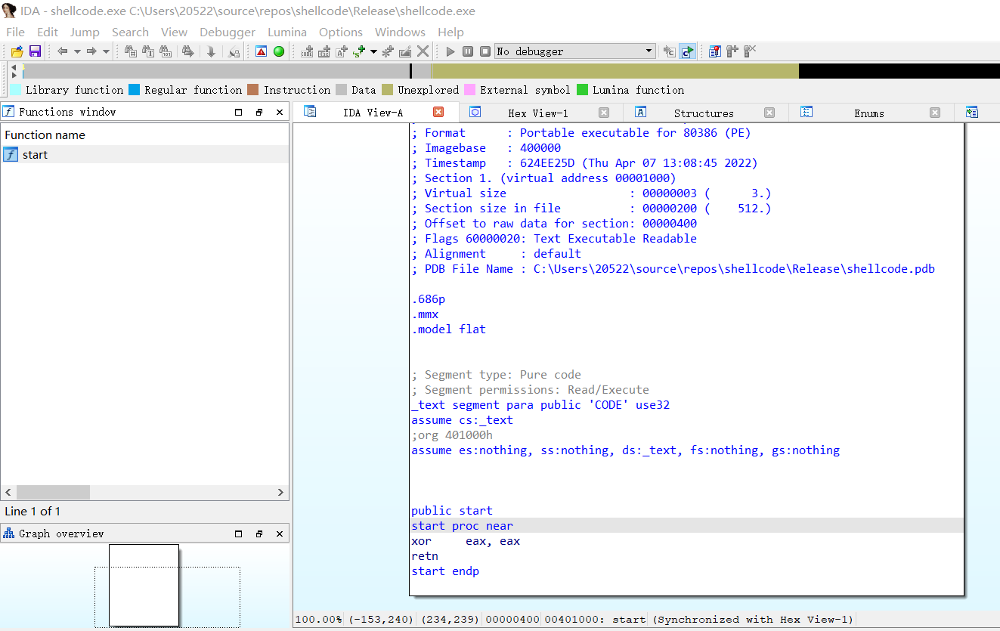


选择函数，快捷键F5，可以将汇编代码转为C代码：

```c
int start()
{
  return 0;

```

## 3、设置工程兼容Windows XP和修改多线程库

高版本的VS生成的文件默认不支持在XP下运行。（不考虑运行在XP系统上就不设置）

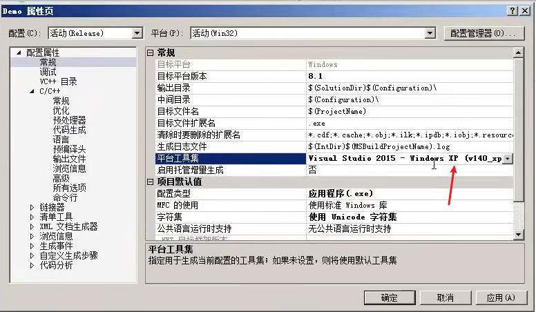

Release版本，下面这个地方修改为MT。Debug版本修改为MTD

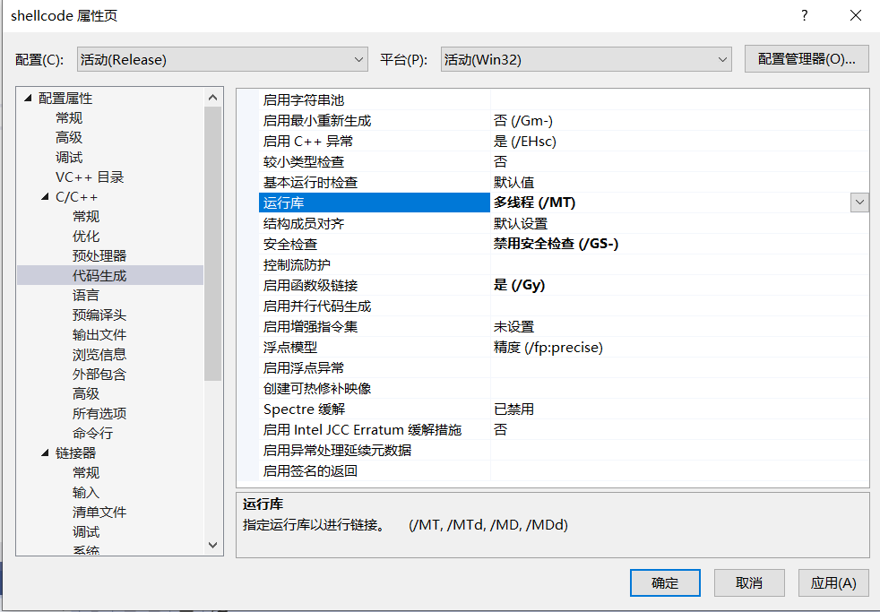

VS中的多线程（/MT）、多线程调试（/MTd）、多线程DLL（/MD）、多线程调试DLL（/MDd）的区别：

**静态链接：多线程（/MT）、多线程调试（/MTd）**

**动态链接：多线程DLL（/MD）、多线程调试DLL（/MDd）**

## ４、关闭生成清单

此时，利用PEID查看exe文件的节段

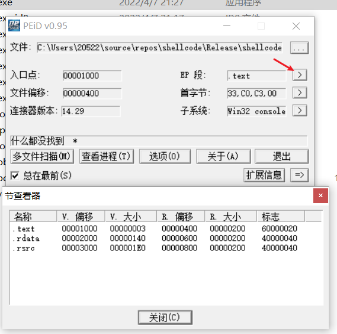

有三个区段：代码段、数据段、资源段

我们接下来的目的是：生成的exe只保留代码段，一方面方便编写出符合规范的shellcode，另一方面便于提取代码段作为shellcode。

.rsrc资源段，是VS默认添加的清单数据，如下设置可以关闭清单生成：

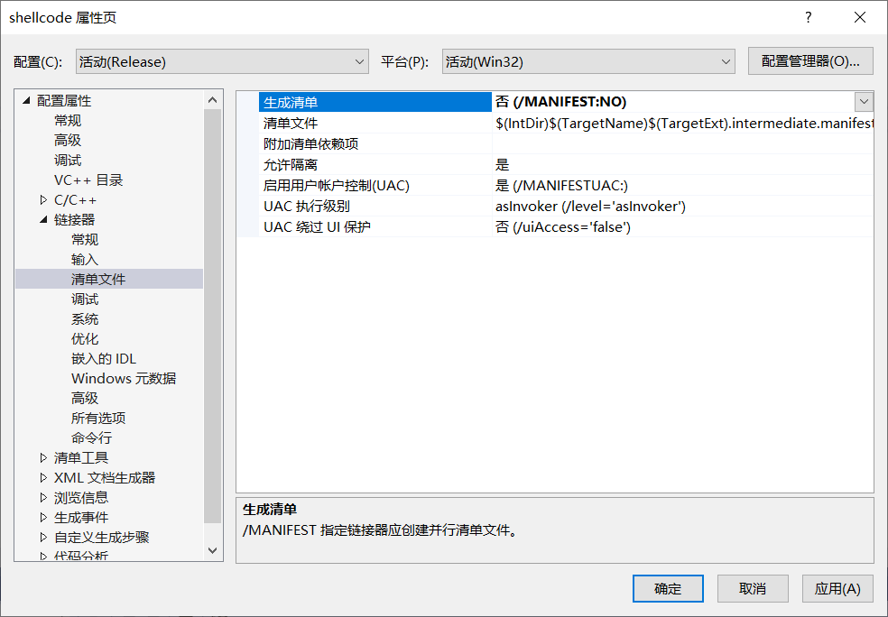

再重新生成，exe文件只有1.5KB大小了。

再用PEID查看，已经没有资源段了：

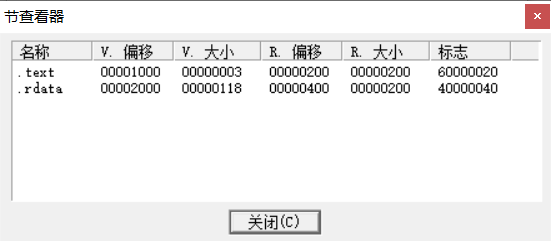

## 5、关闭调试信息

目的是去除.rdata数据段。

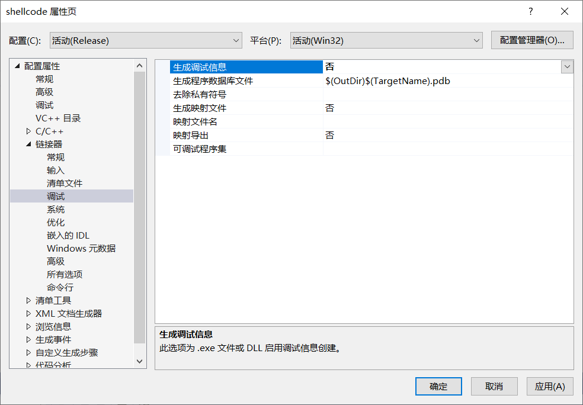

再重新生成，发现没有去除rdata，那就不纠结了。

# shellcode原则

## 杜绝双引号字符串的直接使用

1.杜绝双引号字符串的直接使用 2.关闭VS自动优化没有使用到的变量

因为不管如何使用双引号字符串，只要出现了"Hello",程序都会在一个常量区集中存放字符串，然后使用strcpy赋值，用ida或用winhex看一下可以看出来，所以必须一个字符一个字符存进去shellcode才能运行。

双引号字符串会被编译到只读数据段，已引用绝对地址的使用

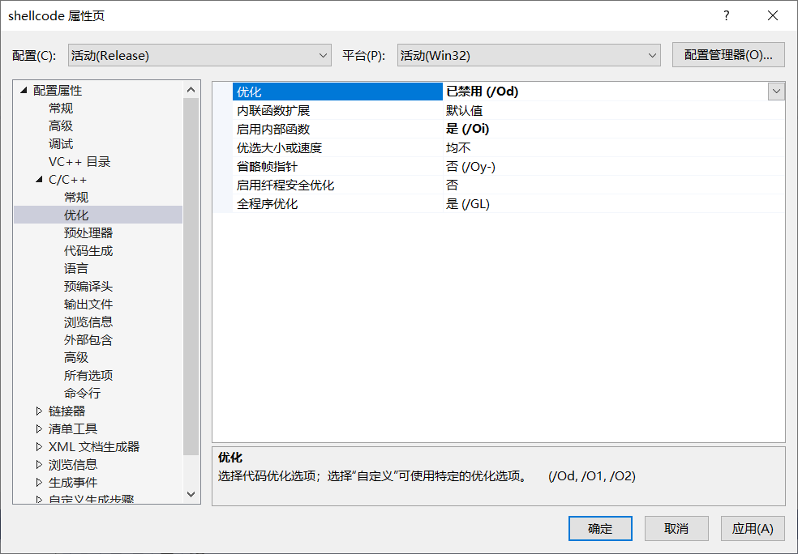

## 函数动态调用

### 直接调用

```c
#include <Windows.h>
#pragma comment(linker,"/entry:EntryMain")
int EntryMain()
{
    MessageBox(NULL, NULL, NULL, NULL);
    return 0;
}

```

生成exe文件时，编译器会把MessageBox(NULL, NULL, NULL, NULL);转换成系统中执行弹框功能的函数入口地址。

OD中可以看以下细节

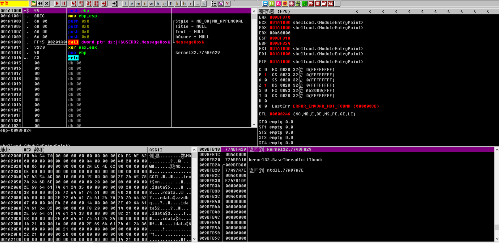

跟进到这一步，出现了弹窗

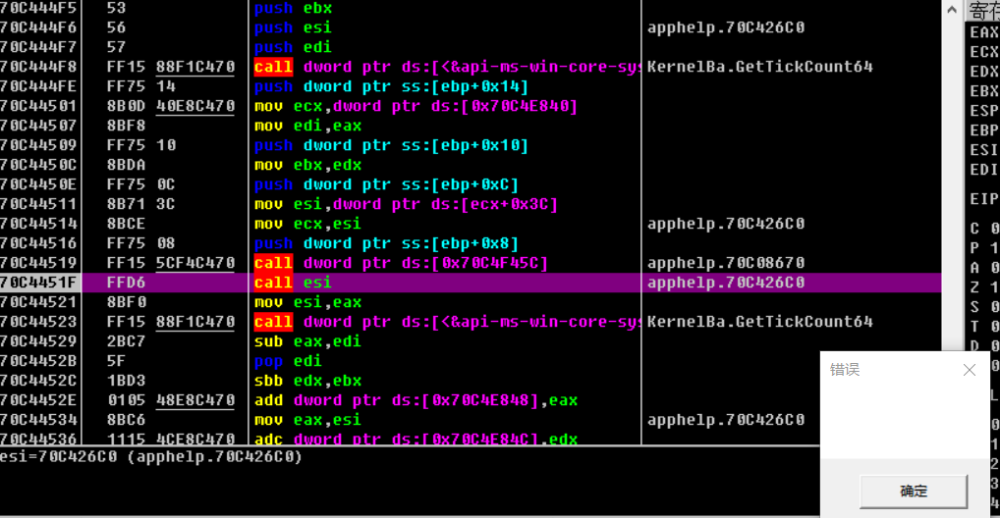

这种方式在shellcode中行不通，shellcode中要杜绝一切绝对地址的直接调用。

### 获取函数地址进行调用

GetProcAddress函数可以在指定的动态链接库中，获取指定要导出函数的地址。  
比如想要获取MessageBox中真实地址

**参数1：加载的动态库的句柄，比如MessageBox存放在user32.dll这个动态链接库中**  

**常用函数所在的dll**
可以用PEID打开user32.dll，查看输出表，里面有MessageBoxA这个函数  
CreateFileA在kernel32.dll中，strcpy在msvcrt.dll中，  
常用函数基本都在：kernel32.dll，user32.dll，gdi32.dll，msvcrt.dll中  
ShellExecuteA在shell32.dll中

**参数2：函数名**  
因为MessageBox有两个版本，要具体指定，比如MessageBoxA是ASCII版本  

再内嵌汇编来调用这个地址

```c
#include <Windows.h>
#pragma comment(linker,"/entry:EntryMain")
int EntryMain()
{
    MessageBox(NULL, NULL, NULL, NULL);
    LPVOID lp = GetProcAddress(LoadLibraryA("user32.dll"),"MessageBoxA");//在指定的动态链接库中，获取指定要导出函数的地址
    __asm 
    {
        push 0
        push 0
        push 0
        push 0
        call lp
    }
    return 0;
}

```

4和个push 0，压栈4个0，就和MessageBox()中传入4个NULL效果是一样的，然后编译生成，可以运行，和上面的一样效果。

也可以传入参数

```c
#include <Windows.h>
#pragma comment(linker,"/entry:EntryMain")
int EntryMain()
{
    LPVOID lp = GetProcAddress(LoadLibraryA("user32.dll"),"MessageBoxA");//在指定的动态链接库中，获取指定要导出函数的地址
    char * pszData = "hello world";
    __asm 
    {
        push 0
        push 0
        push pszData
        push 0
        call lp
    }
    return 0;
}

```

运行exe:

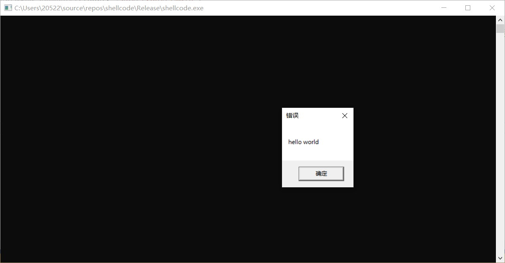

如果出现“const char *“ 类型的值不能用于初始化 “char *“ 类型的实体 的错误，可以关闭符合模式：

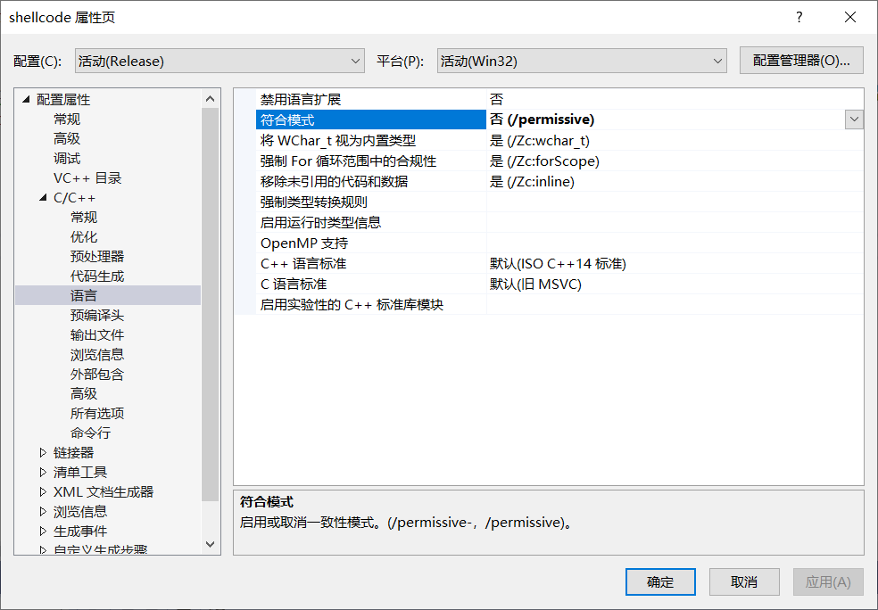

### 不使用内嵌汇编实现调用地址

```c
#include <Windows.h>
#include <stdio.h>
#pragma comment(linker,"/entry:EntryMain")
int EntryMain()
{
    //CreateFileA("hello.txt", GENERIC_WRITE, 0, NULL, CREATE_ALWAYS, 0, NULL);
    //右键CreateFileA，转到定义，将定义复制粘贴过来，写一个typedef
    typedef HANDLE (WINAPI* FN_CreateFileA)(
            _In_ LPCSTR lpFileName,
            _In_ DWORD dwDesiredAccess,
            _In_ DWORD dwShareMode,
            _In_opt_ LPSECURITY_ATTRIBUTES lpSecurityAttributes,
            _In_ DWORD dwCreationDisposition,
            _In_ DWORD dwFlagsAndAttributes,
            _In_opt_ HANDLE hTemplateFile
        );
    FN_CreateFileA fn_CreateFileA;//定义一个这个函数的指针变量
    fn_CreateFileA = (FN_CreateFileA)GetProcAddress(LoadLibraryA("kernel32.dll"), "CreateFileA");//在指定的动态链接库中，获取指定要导出函数的地址
    fn_CreateFileA("hello.txt", GENERIC_WRITE, 0, NULL, CREATE_ALWAYS, 0, NULL);
    return 0;
}

```

重新生成，运行exe，就会创建一个hello.txt文件

再写一个printf的动态调用

```c
typedef int (__CRTDECL* FN_printf)(char const* const _Format, ...);
FN_printf fn_printf;
fn_printf = (FN_printf)GetProcAddress(LoadLibraryA("msvcrt.dll"),"printf");
fn_printf("%s\n", "hello world");
```

当然，我们自定义的函数，直接调用就可以。

那么，如何获取GetProcAddress和LoadLibraryA的真实地址呢

## kernel32基址获取与GetProcAddress地址获取

windows系统，我们执行的每个程序、进程，不管有没有加载dll模块，内部都会对nt.dll、kernel32.dll和kernelbase.dll这三个dll做一个系统内部的加载，所以我们要找到内部加载的kernel32的地址

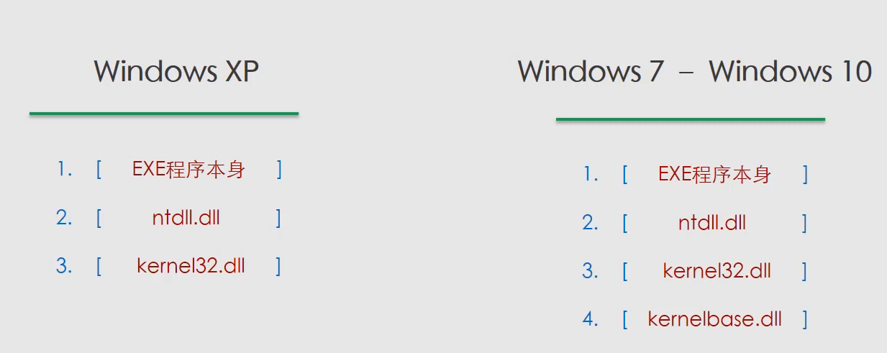


1
