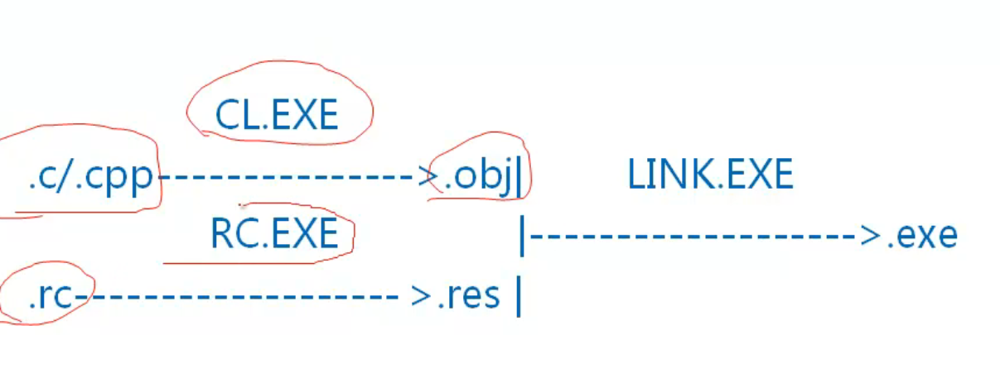
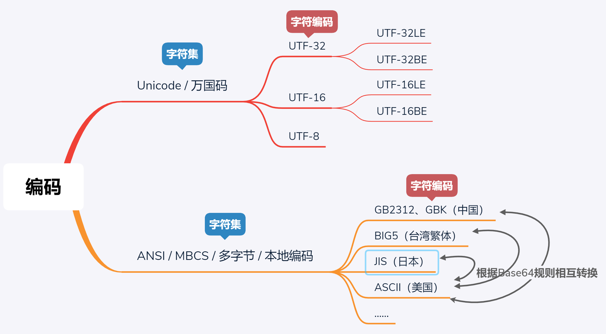
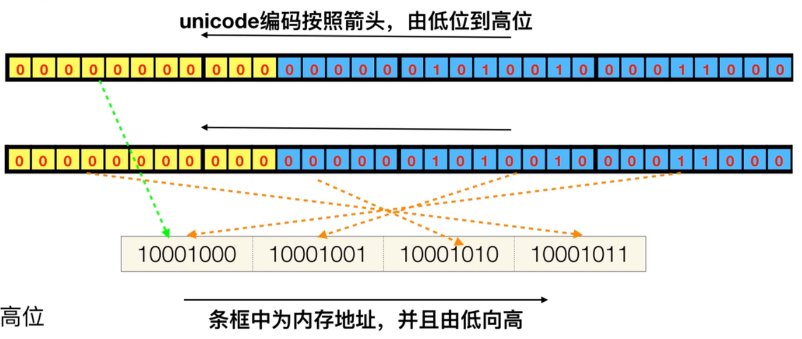
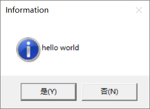

课程地址：

https://www.bilibili.com/video/BV1us411A7UE

https://www.bilibili.com/video/BV1Qb4y1o7u9

参考书目：《Windows程序设计 第5版》

# 前言

**编译器**

- 编译器：cl.exe 将源代码编译成目标代码.obj

- 链接器link.exe：将目标代码、库连接生成最终文件

- 资源编译器rc.exe：（.rx）将资源编译、最终通过链接器存入最终文件

路径：

```
"C:\Program Files (x86)\Microsoft Visual Studio\2019\Professional\VC\Tools\MSVC\14.29.30037\bin\Hostx86\x86\cl.exe"

"C:\Program Files (x86)\Microsoft Visual Studio\2019\Professional\VC\Tools\MSVC\14.29.30037\bin\Hostx86\x86\link.exe"


```



**windows常用动态库**：提供了几千个api函数的内部实现

- kenel32.dll 提供了内核级的API，例如进程、线程、内存管理等。
- user32.dll 提供了窗口、消息等。
- gdi32.dll  绘图相关的API。

路径: C:\Windows\System32


**头文件**

- **windows.h：所有windows头文件的集合，包下下面所有以及其他**
- windef.h：windows数据类型
- winbase.h：kernel32的API
- wingdi.h：gdi32的API
- winuser.h：user32的API
- winnt.h：UNICODE字符集支持

路径：

```
C:\Program Files (x86)\Windows Kits\10\Include
```

## Windows api和MFC的区别

https://blog.csdn.net/u012987386/article/details/72868744

windows api头文件：windows.h

MFC头文件：afxwin.h

MFC是微软对Windows api的封装。

使用windows api思路清晰，但是写起来繁琐。使用MFC代码量少，但流程不清晰

**相关函数**

```c
int WINAPI WinMain(
  HINSTANCE hInstane,//当前程序的实例句柄
  HINSTANCE hPrevInstance,//当前程序前一个实例句柄
  LPSTR lpCmdLine,//命令行参数字符串
  int mCmdShow,//窗口的显示方式
);

int MessageBox(
  HWND hWnd,//父窗口句柄
  LPCTSTR lpText,//显示在消息框中的文字
  LPCTSTR lpCaption,//显示在标题栏中的文字
  UINT uType//消息框中的按钮，图标显示类型
);//返回点击的按钮ID
```


**句柄是什么**

https://www.cnblogs.com/zpcdbky/p/4652151.html

  Windows是一个以虚拟内存为基础的操作系统，很多时候，进程的代码和数据并不全部装入内存，进程的某一段装入内存后，还可能被换出到外存，当再次需要时，再装入内存。两次装入的地址绝大多数情况下是不一样的。也就是说，同一对象在内存中的地址会变化。（对于虚拟内存不是很了解的读者，可以参考有关操作系统方面的书籍）那么，程序怎么才能准确地访问到对象呢？为了解决这个问题，Windows引入了句柄。

   系统为每个进程在内存中分配一定的区域，用来存放各个句柄，即一个个32位无符号整型值（32位操作系统中）。每个32位无符号整型值相当于一个指针，指向内存中的另一个区域（我们不妨称之为区域A）。而区域A中存放的正是对象在内存中的地址。当对象在内存中的位置发生变化时，区域A的值被更新，变为当前时刻对象在内存中的地址，而在这个过程中，区域A的位置以及对应句柄的值是不发生变化的。这种机制，用一种形象的说法可以表述为：有一个固定的地址（句柄），指向一个固定的位置（区域A），而区域A中的值可以动态地变化，它时刻记录着当前时刻对象在内存中的地址。这样，无论对象的位置在内存中如何变化，只要我们掌握了句柄的值，就可以找到区域A，进而找到该对象。而句柄的值在程序本次运行期间是绝对不变的，我们（即系统）当然可以掌握它。这就是以不变应万变，按图索骥，顺藤摸瓜。

   **所以，我们可以这样理解Windows句柄：**

   数值上，是一个32位无符号整型值（32位系统下）；逻辑上，相当于指针的指针；形象理解上，是Windows中各个对象的一个唯一的、固定不变的ID；作用上，Windows使用句柄来标识诸如窗口、位图、画笔等对象，并通过句柄找到这些对象。

基本上，大写字母H开头的类型，很多是句柄类型，比如：HINSTANCE、

```c
#include <Windows.h>
//窗口处理函数
LRESULT CALLBACK WndProc(HWND hWnd, UINT msgID, WPARAM wParam, LPARAM lparam) {
	return DefWindowProc(hWnd, msgID, wParam, lparam);
}
//入口函数
int CALLBACK WinMain(HINSTANCE hInstane, HINSTANCE hPrevInstance, LPSTR lpCmdLine, int mCmdShow) {
	//注册窗口类
	WNDCLASS wc = { 0 };
	wc.cbClsExtra = 0;
	wc.cbWndExtra = 0;
	wc.hbrBackground = (HBRUSH)(COLOR_WINDOW + 1);
	wc.hCursor = NULL;
	wc.hIcon = NULL;
	wc.hInstance = hInstane;
	wc.lpfnWndProc = WndProc;
	wc.lpszClassName = "Main";
	wc.lpszMenuName = NULL;
	wc.style = CS_HREDRAW | CS_VREDRAW;
	RegisterClass(&wc);//将以上所有赋值全部写入操作系统
	//在内存中创建窗口
	HWND hWnd = CreateWindow("Main", "window", WS_OVERLAPPEDWINDOW, 100, 100, 500, 500, NULL, NULL, hInstane, NULL);
	//显示窗口
	ShowWindow(hWnd, SW_SHOW);
	UpdateWindow(hWnd);
	//消息循环
	MSG nMsg = { 0 };
	while (GetMessage(&nMsg, NULL, 0, 0)) {
		TranslateMessage(&nMsg);
		DispatchMessage(&nMsg);//将消息交给处理函数来处理
	}
	return 0;
}
```

# 函数入口


# 编码问题



## Unicode实现方式

**(1)Unicode实现方式：UTF-32**

以4个byte为编码单元进行定长存储，调度器一次性下发4个byte进行存储任务

主要有两种方式：

大端法UTF-32BE：地址由小向大增加，而数据从高位往低位放 ，在网络上传输数据普遍采用的都是大端

小端法UTF-32LE：地址由小向大增加，而数据从低位往高位放，在英特尔处理器，Windows10操作系统，采用小端法。




**(2)UTF-16**

也有大小端模式

UTF-16 LE是windows上默认的Unicode编码方式，使用wchar_t表示。所有wchar_t *类型的字符串(包括硬编码在.h/.cpp里的字符串字面值)

```c++
char chinese[] = "你";  
//大小为3个byte，一个char存储结束符,两个char存储汉字字符‘你’   1char:1byte
wchar_t wchinese[] = L"你";  
//大小为4个byte, 一个wchar_t存储结束符,一个wchar_t存储汉字字符‘你’  1wchar_t:2byte(window下)
auto size = sizeof(chinese);  // 3 byte
auto wsize = sizeof(wchinese);  // 4 byte
auto len = strlen(chinese); // 2个字符(除去结束符)
auto wlen = wcslen(wchinese); // 1个字符(除去结束符)
```

优势：就是大多数情况下一个wchar_t表示一个字符(包括中文字符)

坑：char *类型的字面值，最终内存使用何种编码方式完全取决于当前文件的编码方式

备注：在Windows上应该铭记没有char / std::string这种类型的字符/字符串，只有wchar_t / char16_t / std::wstring / std::u16string

**(3)UTF-8**

优势：无字节序的概念，不用考虑大小端问题，适用与字符串的网络数据传输

劣势：如上代码，一个char并不能表示一个汉字字符，往往需要两个char

## 多字节字符集与宽字节字符集

https://blog.csdn.net/CherishPrecious/article/details/83817965

- 多字节字符集：每个字符的编码宽度不一，可为一个字节或多个字节。
- 宽字节字符集：每个字符的编码宽度都相等，均是两个字节

### 多字节字符集

 （1）ASCII字符只占一个字节
 （2）对于中文、日文等用两个字节
 （3）一个字符串中，如何区分哪个是中文字符，那个是ASCII字符呢？

 “Windows程序设计” 16进制（10进制）的编码

| W    | i    | n    | d    | o    | w    | s    | 程      | 序      | 设      | 计      |      |
| ---- | ---- | ---- | ---- | ---- | ---- | ---- | ------- | ------- | ------- | ------- | ---- |
| 57   | 69   | 6E   | 64   | 6F   | 77   | 73   | B3 CC   | D0 F2   | C9 E8   | BC C6   | 0    |
| 87   | 105  | 110  | 100  | 111  | 119  | 115  | -77 -52 | -48 -14 | -55 -24 | -68 -58 | 0    |

 

 ①说明：ASCII码为一个字节，中文为两个字节，均为负数
 ②优点：节约内存。 
 ③缺点：每次查找，都需要从头到尾扫描，效率低。

  char c[] ="Windows程序设计";
  printf("%d\n",sizeof(c)); //输出16，数组总长度为16字节，含\0
  printf("%d\n",strlen(c)); //输出15，字符的长度为15个字节，不含\0

### 宽字节字符集

（1）ASCII字符的处理。扩充为两个字节，在原先的字节前补充一个字节0x00
（2）结束符为两个\0
（3）字符串的解释都是两个字符为单位进行的。所以查找效率快，但内存占用大。

 “Windows程序设计”16进制的编码：

| W    | i    | n    | d    | o    | w    | s    | 程   | 序   | 设   | 计   |      |
| ---- | ---- | ---- | ---- | ---- | ---- | ---- | ---- | ---- | ---- | ---- | ---- |
| 0057 | 0069 | 006E | 0064 | 006F | 0077 | 0073 | 7A0B | 5E8F | 8BBE | 8BA1 | 0000 |

​    wchar_t c[] = L"Windows程序设计";
​    printf("%d\n",sizeof(c)); //输出24，数组总长度为16字节，含结束符
​    printf("%d\n",wcslen(c)); //输出11，字符的长度为11个，不含结束符


### 兼容两种的字符集——如何兼容呢？

```cpp
#ifdef _UNICODE
#define _tcslen wcslen
#define TCHAR wchar_t
#define LPTSTR wchar_t*
#define _T(x) L##x
#else
#define _tcslen strlen
#define TCHAR  char
#define LPTSTR  char*
#define _T(x)  x
#endif
```

【例】TCHAR c[] = _T("Windows程序设计");

```cpp
    //多字节字符集下
    printf("%d\n",sizeof(c));  //16
    printf("%d\n",_tcslen(c)); //15

    //宽字符集下
    printf("%d\n",sizeof(c));  //24
    printf("%d\n",_tcslen(c)); //11
```

**字符集的对比**

|              | ASCII                                | Unicode                                | 通用版本                                                     |
| ------------ | ------------------------------------ | -------------------------------------- | ------------------------------------------------------------ |
| 字符类型     | char\CHAR                            | wchar_t\WCHAR                          | TCHAR                                                        |
| 函数两种版本 | printf <br />strlen<br />MessageBoxA | wprintf <br />wcslen<br /> MessageBoxW | \_tprintf<br />  \_tcslen <br />MessageBox宏：TEXT或\_TEXT    _T或\_\_T |

```c
#include <stdio.h>
#include <locale.h>
#include <tchar.h>
 
int main()
 
{
    //ASCII字符集
    //char c = 'A'; //char为一个字节
     //char str[] = "中国";  //在未出现Unicode前的用法，在求字符串长度时会出问题。
     //printf("%c\n", c);
     //printf("%s\n", str);
     //printf("长度：%d\n",strlen(str));//长度为4，对于ASCII来说，一个汉字为2个字节，被看成是两个字符了。
 
    //Unicode字符集
    //wchar_t c = L'中'; //Unicode，两个字节
    //wchar_t str[] = L"中国";  //Unicode字符串的用法
    //setlocale(LC_ALL,"chs");
    //wprintf(L"%lc\n", c);//wprintf要求第1个参数为L型的，须加个大写的L
    //wprintf(L"%ls\n",str);
    //wprintf(L"%d\n",wcslen(str));//长度为2，Unicode字符。注意与上面ASCII字符集的比较
 
    //通用的类型与函数
    TCHAR str[] = _T("中国");
     setlocale(LC_ALL,"chs");
     _tprintf(_T("%s\n"),str);
     _tprintf(_T("%d\n"),_tcslen(str));
     return 0;
 }
```

**Windows中的字符串函数**

| 通用版本 | C语言中的ASCII版本 |
| -------- | ------------------ |
| lstrlen  | strlen             |
| Lstrcpy  | strcpy             |
| Lstrcpyn | strcpyn            |
| lstrcat  | strcat             |
| lstrcmp  | strcmp             |
| lstrcmpi | strcmpi            |

```c
//ASCII码版
int WINAPI WinMain(HINSTANCEhInstance,HINSTANCE hPrevInstance,PSTR szCmdLine,int iCmdShow)
 {   
      int a= 12;
      char szBuffer[100];
      sprintf_s(szBuffer,100,"Hello %d\n", a); //在内存中格式化字符串，标准c语言版本
      MessageBoxA(NULL,szBuffer, "Hello ASCII", MB_OK | MB_ICONINFORMATION); //带A
      return0;
 }
 
//Unicode版
 
int WINAPI WinMain(HINSTANCE hInstance,HINSTANCE hPrevInstance, PSTR szCmdLine, int iCmdShow)
 {
      int a= 12;
      wchar_tszBuffer[100];  //WCHAR
      swprintf_s(szBuffer,100, L"Hello %d\n", a); //在内存中格式化字符串，标准c语言版
      MessageBoxW(NULL,szBuffer, L"Hello Unicode", MB_OK | MB_ICONINFORMATION); //带W
      return0;
 }
 
 //通用版本
 
int WINAPI WinMain(HINSTANCE hInstance,HINSTANCE hPrevInstance, PSTR szCmdLine, int iCmdShow)
 
{
       int a= 12;
       TCHARszBuffer[100];  //WCHAR
       _stprintf_s(szBuffer,100,TEXT("Hello %d\n"), a); //在内存中格式化字符串,微软版本的在tchar.h中
       MessageBox(NULL,szBuffer, TEXT("Hello TCHAR"), MB_OK | MB_ICONINFORMATION);
       return0;
 }
```


## Unicode与多字节（ANSI ）

https://www.cnblogs.com/main404/p/12319230.html

(1)**Windows中**，Unicode也称为宽字节，多字节也称为窄字节; **VS中默认使用Unicode编码**，在**项目属性>>配置属性>>常规>>字符集**中可选择Unicode字符集或者多字节字符集

**(2) Unicode与多字节函数版本、字符、字符串类型的区别**

Win32 API中大部分参数有字符串的函数都有两个版本

| 以A结尾,代表多字节版本 | 以W结尾,代表Unicode版本 | 根据版本自动选择的 |
| ---------------------- | ----------------------- | ------------------ |
| 如：CreateEventA       | 如：CreateEventW        | 如：CreateEvent    |

C运行库也有很多类似的函数

| 多字节版本 | Unicode版本 | 自适应版本 |
| ---------- | ----------- | ---------- |
| strcpy     | wcscpy      | _tcscpy    |
| strcat     | wcscat      | _tscscat   |
| strlen     | wcslen      | _tcslen    |

函数有两种，所以字符也有两种

| 多字节字符 | Unicode字符 | 自适应字符 |
| ---------- | ----------- | ---------- |
| char       | wchar_t     | TCHAR      |

**(3) 常见Win32字符串类型**

LPSTR、LPWSTR、LPTSTR、LPCTSTR

LP前缀，代表指针；STR后缀代表字符串

LPSTR:代表多字节

LPWSTR:代表Unicode

LPTSTR:T自适应

LPCTSTR:C代表const+T代表自适应

备注：变量类型使用自适应类型后如LPTSTR，相关字符串需要用TEXT()进行包裹

```c++
	const char* str = "hello";
	const wchar_t*  wstr = L"hello";
	const TCHAR* tstr = TEXT("hello");
```

**(4)关于_T()**

```c++
        #ifdef _UNICODE 
        #define _T(X) L ## X   //Unicode版本
        #else
        #define _T(X) X     //多字节版本
        #endif
```

**(5)Unicode与多字节的选择**

1.Unicode程序环境适应能力强，不会出现乱码问题

2.Unicode程序运行速度比多字节程序快。原因：Windows内部都是使用Unicode编码，多字节函数会将参数转码后交给Unicode函数

3.控制后台可使用多字节，GUI程序最好使用Unicode

# 第一个windows程序

**hello world**

```c
#include <stdio.h>

int main() {
    printf("Hello, World!\n");
    return 0;
}
```


**windows版 hello world**

SayHi.c

```c
#include <windows.h>
#pragma comment(linker, "/subsystem:windows /entry:WinMainCRTStartup")

int WINAPI WinMain(_In_ HINSTANCE hInstance, _In_opt_ HINSTANCE hPrevInstance, _In_ LPSTR lpCmdLine, _In_ int iCmdShow) {
    //参数1：父窗口句柄，没有父窗口就是NULL,
    //参数2：提示框内容,
    //参数3：标题栏,
    //参数4：按钮,MB_OK替换成0也可以，1 就是出现两个按钮，一个确定，一个取消,使用 | 可以使用多个选项参数
    MessageBox(NULL, "hello world", "Information", MB_YESNO | MB_ICONASTERISK);
    return 0;
}


```




踩坑：

无法解析的外部符号 WinMain，该符号在函数 "int __cdecl invoke_main(void)" (?invoke_main@@YAHXZ) 中被引用，有两种解决方法：

- 项目->属性->配置属性->连接器->系统中的【子系统】设置为Windows(/SUBSYSTEM:WINDOWS)

- 或者加上：

  ```c
  #pragma comment(linker, "/subsystem:windows /entry:WinMainCRTStartup")
  ```

  


也可以在c语言直接调用windows api，这是既有控制台，又有MessageBox

```c
#include <stdio.h>
#include <stdlib.h>
#include <Windows.h>

int main() {
	//C语言调用windows api
	MessageBox(NULL, TEXT("hello,c"), TEXT("标题"), MB_OK);
	return 0;
}
```


1