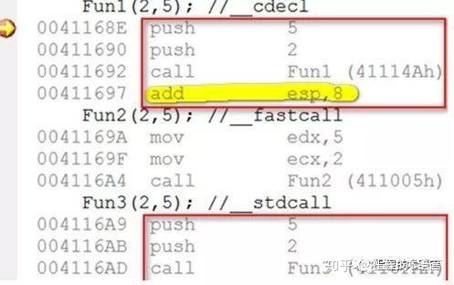

# 函数调用的三种约定

来源：[函数调用的三种约定，你都清楚吗 - 知乎 (zhihu.com)](https://zhuanlan.zhihu.com/p/170134539)

[C语言函数调用约定 - findumars - 博客园 (cnblogs.com)](https://www.cnblogs.com/findumars/p/5356217.html)

__cdecl、__stdcall、__fastcall是C/C++里中经常见到的三种函数调用方式。其中__cdecl是C/C++默认的调用方式，__stdcall是windows API函数的调用方式，只不过我们在头文件里查看这些API的声明的时候是用了WINAPI的宏进行代替了，而这个宏其实就是__stdcall了。

三种调用方式的区别相信大家应该有些了解，这篇文章主要从实例和汇编的角度阐述这些区别的表现形态，使其对它们的区别认识从理论向实际过渡。

我们知道，函数的调用过程是通过函数栈帧的不断变化实现的：


函数的调用，涉及参数传递，返回值传递，调用后返回，这都是通过栈的变化来实现的，对于三种调用约定而言：

**__cdecl:**

C/C++默认方式，参数从右向左入栈，主调函数负责栈平衡。

**__stdcall：**

windows API默认方式，参数从右向左入栈，被调函数负责栈平衡。

**__fastcall：**

快速调用方式。所谓快速，这种方式选择将参数优先从寄存器传入（ECX和EDX），剩下的参数再从右向左从栈传入。因为栈是位于内存的区域，而寄存器位于CPU内，故存取方式快于内存，故其名曰“__fastcall”。

下面从实例来认识一下这三种调用约定。先来看一个简单的不能再简单的程序了：


三个函数的内容都是一样的，不同的是使用了三种调用的方式。我们先来看看在main函数调用三个函数的时候的汇编代码：



按照上面说的那样，__cdecl按照参数从右向左的方式进入栈区，注意Fun1()和Fun3()的区别，Fun1()在call Fun1()之后执行了add esp,8。这一操作正是我们前面所说的进行栈的平衡。调用函数之前连续进行了两次push操作将函数所需的实参5和2先后压入了栈区，调用完成后，我们需要恢复调用前的状态，则需调整栈顶指针esp的位置，这一工作由谁来完成就决定了两种函数调用方式__cdecl（主调函数完成）和__stdcall（被调函数完成）的区别。上图我们看到了__cdecl中由主调函数完成了，那么__stdcall呢，在被调函数Fun3()中，转向被调函数结尾处的代码，我们看到了这一句：


那么Fun1()结尾处又是如何呢？


看到了吧，这个ret指令后面跟没跟值就决定了函数返回是栈指针ESP需要增加的量。这样，不需要主调函数再调用add指令为ESP操作平衡栈区，节约了程序的开销，一条指令开销小，如果十万百万个这样的调用，这个开销就明显了。

说完了__cdecl和__stdcall，再来看看__fastcall，如前面图看到的调用时并未使用push指令向栈里传参数，而是使用了

mov edx, 5

mov ecx, 2

两条指令。这样直接将参数传入寄存器，被调函数在执行的时候直接从寄存器取值即可，省去了从栈里取出来给寄存器，再从寄存器取出来放入内存。

不过，说个题外话，ecx寄存器经常作为计数和C++里this指针的传递媒介。在这种情况下，情况又是怎样的呢，下次分析C++操作符 new 的时候再予以讨论。ecx做计数器时，需要将ecx中存储的实参先压入栈区，计数操作完成后再pop出来。如此一来，这个fastcall倒显得不那么fast了。当然，上面所说的这些操作都是由编译器在背后为我们完成的，开发人员无需关心这些操作，对我们是透明的。不过，知其然更知其所以然方能立于不败之地！

在C语言中，假设我们有这样的一个函数：

> **int function(int a,int b)**

调用时只要用result = function(1,2)这样的方式就可以使用这个函数。但是，当高级语言被编译成计算机可以识别的机器码时，有一个问题就凸现出来：在CPU中，计算机没有办法知道一个函数调用需要多少个、什么样的参数，也没有硬件可以保存这些参数。也就是说，计算机不知道怎么给这个函数传递参数，传递参数的工作必须由函数调用者和函数本身来协调。为此，计算机提供了一种被称为栈的数据结构来支持参数传递。

栈是一种先进后出的数据结构，栈有一个存储区、一个栈顶指针。栈顶指针指向堆栈中第一个可用的数据项（被称为栈顶）。用户可以在栈顶上方向栈中加入数据，这个操作被称为压栈(Push)，压栈以后，栈顶自动变成新加入数据项的位置，栈顶指针也随之修改。用户也可以从堆栈中取走栈顶，称为弹出栈(pop)，弹出栈后，栈顶下的一个元素变成栈顶，栈顶指针随之修改。

函数调用时，调用者依次把参数压栈，然后调用函数，函数被调用以后，在堆栈中取得数据，并进行计算。函数计算结束以后，或者调用者、或者函数本身修改堆栈，使堆栈恢复原装。

在参数传递中，有两个很重要的问题必须得到明确说明：

- 当参数个数多于一个时，按照什么顺序把参数压入堆栈
- 函数调用后，由谁来把堆栈恢复原装

在高级语言中，通过函数调用约定来说明这两个问题。常见的调用约定有：

- stdcall
- cdecl
- fastcall
- thiscall
- naked call

## stdcall调用约定

stdcall很多时候被称为pascal调用约定，因为pascal是早期很常见的一种教学用计算机程序设计语言，其语法严谨，使用的函数调用约定就是stdcall。在Microsoft C++系列的C/C++编译器中，常常用PASCAL宏来声明这个调用约定，类似的宏还有WINAPI和CALLBACK。

stdcall调用约定声明的语法为(以前文的那个函数为例）：

int __**stdcall** function(int a,int b)

stdcall的调用约定意味着：1）参数从右向左压入堆栈，2）函数自身修改堆栈 3)函数名自动加前导的下划线，后面紧跟一个@符号，其后紧跟着参数的尺寸

以上述这个函数为例，参数b首先被压栈，然后是参数a，函数调用function(1,2)调用处翻译成汇编语言将变成：

> push 2 第二个参数入栈 push 1 第一个参数入栈 call function 调用参数，注意此时自动把cs:eip入栈

而对于函数自身，则可以翻译为：

> push ebp 保存ebp寄存器，该寄存器将用来保存堆栈的栈顶指针，可以在函数退出时恢复 mov ebp,esp 保存堆栈指针 mov eax,[ebp + 8H] 堆栈中ebp指向位置之前依次保存有ebp,cs:eip,a,b,ebp +8指向a add eax,[ebp + 0CH] 堆栈中ebp + 12处保存了b mov esp,ebp 恢复esp pop ebp ret 8

而在编译时，这个函数的名字被翻译成_function@8

注意不同编译器会插入自己的汇编代码以提供编译的通用性，但是大体代码如此。其中在函数开始处保留esp到ebp中，在函数结束恢复是编译器常用的方法。

从函数调用看，2和1依次被push进堆栈，而在函数中又通过相对于ebp(即刚进函数时的堆栈指针）的偏移量存取参数。函数结束后，ret 8表示清理8个字节的堆栈，函数自己恢复了堆栈。

## cdecl调用约定

cdecl调用约定又称为C调用约定，是C语言缺省的调用约定，它的定义语法是：

> int function (int a ,int b) //不加修饰就是C调用约定 int __cdecl function(int a,int b)//明确指出C调用约定

在写本文时，出乎我的意料，发现cdecl调用约定的参数压栈顺序是和stdcall是一样的，参数首先由有向左压入堆栈。所不同的是，函数本身不清理堆栈，调用者负责清理堆栈。由于这种变化，C调用约定允许函数的参数的个数是不固定的，这也是C语言的一大特色。对于前面的function函数，使用cdecl后的汇编码变成：

> **调用处** push 1 push 2 call function add esp,8 **注意：这里调用者在恢复堆栈** **被调用函数_function处** push ebp 保存ebp寄存器，该寄存器将用来保存堆栈的栈顶指针，可以在函数退出时恢复 mov ebp,esp 保存堆栈指针 mov eax,[ebp + 8H] 堆栈中ebp指向位置之前依次保存有ebp,cs:eip,a,b,ebp +8指向a add eax,[ebp + 0CH] 堆栈中ebp + 12处保存了b mov esp,ebp 恢复esp pop ebp ret **注意，这里没有修改堆栈**

MSDN中说，该修饰自动在函数名前加前导的下划线，因此函数名在符号表中被记录为_function，但是我在编译时似乎没有看到这种变化。

由于参数按照从右向左顺序压栈，因此最开始的参数在最接近栈顶的位置，因此当采用不定个数参数时，第一个参数在栈中的位置肯定能知道，只要不定的参数个数能够根据第一个后者后续的明确的参数确定下来，就可以使用不定参数，例如对于CRT中的sprintf函数，定义为：

**int sprintf(char\* buffer,const char\* format,...)**

由于所有的不定参数都可以通过format确定，因此使用不定个数的参数是没有问题的。

## fastcall

fastcall调用约定和stdcall类似，它意味着：

- 函数的第一个和第二个DWORD参数（或者尺寸更小的）通过ecx和edx传递，其他参数通过从右向左的顺序压栈
- 被调用函数清理堆栈
- 函数名修改规则同stdcall

其声明语法为：int fastcall function(int a,int b)

## thiscall

thiscall是唯一一个不能明确指明的函数修饰，因为thiscall不是关键字。它是C++类成员函数缺省的调用约定。由于成员函数调用还有一个this指针，因此必须特殊处理，thiscall意味着：

- 参数从右向左入栈
- 如果参数个数确定，this指针通过ecx传递给被调用者；如果参数个数不确定，this指针在所有参数压栈后被压入堆栈。
- 对参数个数不定的，调用者清理堆栈，否则函数自己清理堆栈

为了说明这个调用约定，定义如下类和使用代码：

```
class A
{
public:
   int function1(int a,int b);
   int function2(int a,...);
};
int A::function1 (int a,int b)
{
   return a+b;
}
#include 
int A::function2(int a,...)
{
   va_list ap;
   va_start(ap,a);
   int i;
   int result = 0;
   for(i = 0 ; i < a ; i ++)
   {
      result += va_arg(ap,int);
   }
   return result;
}
void callee()
{
   A a;
   a.function1 (1,2);
   a.function2(3,1,2,3);
}
```

callee函数被翻译成汇编后就变成：

> //函数function1调用 0401C1D push 2 00401C1F push 1 00401C21 lea ecx,[ebp-8] 00401C24 call function1 注意，这里this没有被入栈 //函数function2调用 00401C29 push 3 00401C2B push 2 00401C2D push 1 00401C2F push 3 00401C31 lea eax,[ebp-8] 这里引入this指针 00401C34 push eax 00401C35 call function2 00401C3A add esp,14h

可见，对于参数个数固定情况下，它类似于stdcall，不定时则类似cdecl

## naked call

这是一个很少见的调用约定，一般程序设计者建议不要使用。编译器不会给这种函数增加初始化和清理代码，更特殊的是，你不能用return返回返回值，只能用插入汇编返回结果。这一般用于实模式驱动程序设计，假设定义一个求和的加法程序，可以定义为：

```
__declspec(naked) int  add(int a,int b)
{
   __asm mov eax,a
   __asm add eax,b
   __asm ret 
}
```

注意，这个函数没有显式的return返回值，返回通过修改eax寄存器实现，而且连退出函数的ret指令都必须显式插入。上面代码被翻译成汇编以后变成：

> mov eax,[ebp+8] add eax,[ebp+12] ret 8

注意这个修饰是和__stdcall及cdecl结合使用的，前面是它和cdecl结合使用的代码，对于和stdcall结合的代码，则变成：

```
__declspec(naked) int __stdcall function(int a,int b)
{
    __asm mov eax,a
    __asm add eax,b
    __asm ret 8        //注意后面的8
}
```

至于这种函数被调用，则和普通的cdecl及stdcall调用函数一致。

## 函数调用约定导致的常见问题

如果定义的约定和使用的约定不一致，则将导致堆栈被破坏，导致严重问题，下面是两种常见的问题：

1. 函数原型声明和函数体定义不一致
2. DLL导入函数时声明了不同的函数约定

以后者为例，假设我们在dll种声明了一种函数为：

```
__declspec(dllexport) int func(int a,int b);//注意，这里没有stdcall，使用的是cdecl
```

使用时代码为：

```
      typedef int (*WINAPI DLLFUNC)func(int a,int b);
      hLib = LoadLibrary(...);
      DLLFUNC func = (DLLFUNC)GetProcAddress(...)//这里修改了调用约定
      result = func(1,2);//导致错误
```

由于调用者没有理解WINAPI的含义错误的增加了这个修饰，上述代码必然导致堆栈被破坏，MFC在编译时插入的checkesp函数将告诉你，堆栈被破坏了。