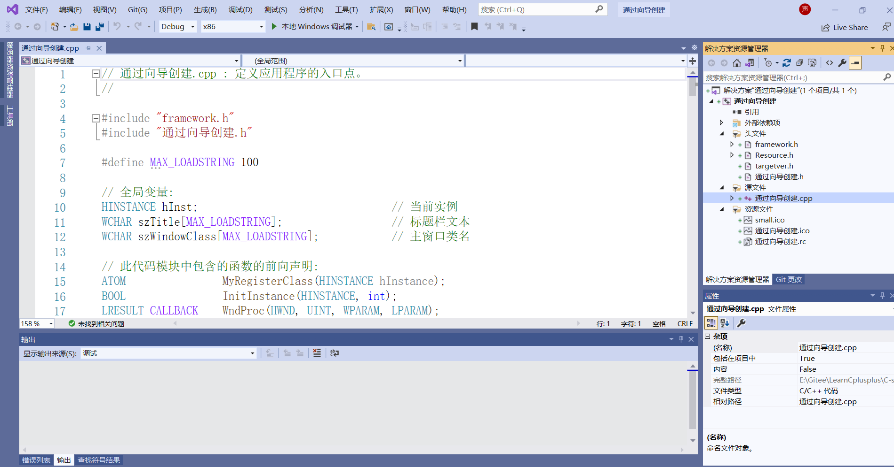

# 创建窗口

两种方法

- 手写代码创建窗口
- 使用向导创建窗口


结果：



向导创建出来的代码有200行，很复杂，下面，我们自己写一个简单的。

- 两个函数
- 十多个API函数

重新创建一个空项目，添加文件：create_windows.c


**消息循环**


windows**消息循环** 在时刻处理windows中的大量消息，比如用户操作产生的消息，系统自身的消息，网络产生的消息.


**窗口类**

类是面向对象中的概念，windows使用结构体来实现面向对象，窗口类的结构体定义如下：

```c
  typedef struct tagWNDCLASSEXA {
    UINT cbSize;
    UINT style;
    WNDPROC lpfnWndProc;
    int cbClsExtra;
    int cbWndExtra;
    HINSTANCE hInstance;
    HICON hIcon;
    HCURSOR hCursor;
    HBRUSH hbrBackground;
    LPCSTR lpszMenuName;
    LPCSTR lpszClassName;
    HICON hIconSm;
  } WNDCLASSEXA,*PWNDCLASSEXA,*NPWNDCLASSEXA,*LPWNDCLASSEXA;
```


**完整代码**

```c
#include <windows.h>
#include <stdio.h>

HINSTANCE hinst;//实例句柄很重要，定义全局变量保存起来


LRESULT CALLBACK MainWndProc(HWND hwnd, UINT uMsg, WPARAM wParam, LPARAM lParam);

int WINAPI WinMain(HINSTANCE hInstance, HINSTANCE hPrevInstance, LPSTR lpCmdLine, int iCmdShow) {
    //定义窗口类，类相对于模板，窗口类能定义窗口是什么样子
    WNDCLASSEX wcx;
    HWND hwnd;//窗口句柄
    hinst = hInstance;
    MSG msg;//消息
    BOOL fGotMessage;//有没有取到消息

    wcx.cbSize = sizeof(wcx);
    wcx.style = CS_HREDRAW | CS_VREDRAW;//窗口大小改变时就重画窗口
    wcx.lpfnWndProc = MainWndProc;//窗口过程（是个函数指针）
    wcx.cbClsExtra = 0;//不适用类内存，使用类内存可以保存一些附加的信息
    wcx.cbWndExtra = 0;//不使用窗口内存
    wcx.hInstance = hInstance;//实例句柄
    wcx.hIcon = LoadIcon(NULL, IDI_APPLICATION);//加载窗口图标，这里时默认的图标
    wcx.hCursor = LoadCursor(NULL, IDC_ARROW);//加载鼠标指针，箭头形状的
    wcx.hbrBackground = (HBRUSH) GetStockObject(WHITE_BRUSH);//指定窗口背景所需要的画刷，这里从库存里拿一个白色画刷
    wcx.lpszMenuName = NULL;//窗口设置为没有菜单
    //设置窗口的小图标,5号资源，设置宽度和高度为标准小图标的
    wcx.hIconSm = (HICON) LoadImage(hInstance, MAKEINTRESOURCE(5), IMAGE_ICON,
                                    GetSystemMetrics(SM_CXSMICON), //宽度
                                    GetSystemMetrics(SM_CYSMICON),//高度
                                    LR_DEFAULTCOLOR);//默认颜色
    wcx.lpszClassName = "MainWClass";//给窗口类一个名称

    //这里注册窗口，可以理解成系统开辟一段内存，然后窗口句柄是个void*指针，指向了这段内存，所以句柄代表创建的对象
    if (!RegisterClassEx(&wcx)) {//注册窗口类，失败的话就提前结束

        return 1;
    }
    //使用窗口类创建窗口
    //lpszClassName，窗口标题,默认的样式，默认位置，默认宽度和高度
    hwnd = CreateWindow(wcx.lpszClassName, "Hello", WS_OVERLAPPEDWINDOW,
                        CW_USEDEFAULT, CW_USEDEFAULT, CW_USEDEFAULT, CW_USEDEFAULT,
                        (HWND) NULL,//没有父窗口
                        (HMENU) NULL,//没有菜单
                        hInstance, //实例句柄
                        (LPVOID) NULL//不需要创建数据
    );
    if (!hwnd) {
        //如果创建窗口失败了
        return 1;
    }
    ShowWindow(hwnd, iCmdShow);
    UpdateWindow(hwnd);//ShowWindow有时显示不出来窗口，调用update立即显示
    //窗口必须有消息循环，否则窗口就不能工作了
    //GetMessage，从消息队列里取消息

    while ((fGotMessage = GetMessage(&msg, (HWND) NULL, 0, 0)) != 0) {
        //取到了消息需要翻译
        TranslateMessage(&msg);
        DispatchMessage(&msg);//把消息转发给窗口过程
    }
    return msg.wParam;
}

/**
 * 窗口过程函数，用来处理消息
 * @param hwnd
 * @param uMsg
 * @param wParam
 * @param lParam
 * @return LRESULT:long long CALLBACK：__stdcall
 */
LRESULT CALLBACK MainWndProc(HWND hwnd, UINT uMsg, WPARAM wParam, LPARAM lParam) {
    //处理消息
    switch (uMsg) {
        case WM_DESTROY://关闭窗口，如果不处理，这个窗口就关不掉
            PostQuitMessage(0);//退出消息
            return 0;
        case WM_LBUTTONDOWN:
            MessageBox(hwnd, "hello窗口!", "标题", MB_OK);
            return 0;
        default:
            //不需要处理的消息转给windows处理
            return DefWindowProc(hwnd, uMsg, wParam, lParam);
    }
}
```

效果：


# 使用对话框资源创建窗口

相对简便的方法


代码：

```c
#include <windows.h>
#include <stdio.h>
#include "resource.h"
INT_PTR CALLBACK MainDlgProc(HWND hwnd, UINT uMsg, WPARAM wParam, LPARAM lParam) {
	BOOL bRet = TRUE;
    //处理消息
    switch (uMsg) {
    case WM_CLOSE://关闭窗口
        EndDialog(hwnd,0);//退出消息
        break;
    case WM_LBUTTONDOWN:
        MessageBox(hwnd, L"hello窗口!", L"标题", MB_OK);
        break;
    case WM_COMMAND:
        switch (LOWORD(wParam)) {
        case IDC_BUTTON1:
            MessageBox(hwnd, L"hello button1!", L"标题", MB_OK);
            break;
        case IDC_BUTTON4:
            MessageBox(hwnd, L"hello button4!", L"标题", MB_OK);
            break;
        default:
            bRet = FALSE;
            break;
        }
        break;
    default:
        //不需要处理的消息转给windows处理
        return DefWindowProc(hwnd, uMsg, wParam, lParam);
    }
	return bRet;
}
int WINAPI WinMain(HINSTANCE hInstance, HINSTANCE hPrevInstance, LPSTR lpCmdLine, int iCmdShow) {
	DialogBox(hInstance, MAKEINTRESOURCE(IDD_DIALOG1), NULL, MainDlgProc);
	return 0;
}
```


# MFC创建对话框窗口

MFC是微软使用C++封装的Windows API

- 封装WinMain()
- 封装消息循环
- 封装窗口过程

