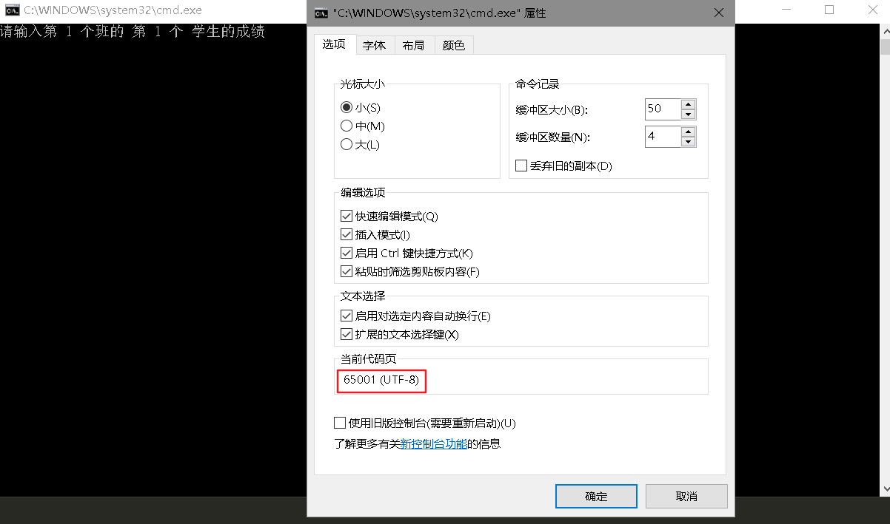

# 编译器

## gcc 

Linux下最常用的

官网：http://gcc.gnu.org/

​		gcc全称是 GNU C Compiler, 最早的时候就是一个c编译器。GNU（GNU's Not Unix）是个软件项目名，开发了很多开源软件，gnu官网：http://www.gnu.org/。但是后来因为这个项目里边集成了更多其他不同语言的编译器，GCC就代表 the GNU Compiler Collection，所以表示一堆编译器的合集。

​		GNU编译器集合包括C， C ++，Objective-C，Fortran，Ada，Go和D语言 ，以及这些语言的库（libstdc ++等）。GCC最初是作为GNU操作系统的编译器编写的。

​		2020年7月，gcc发布了10.2的版本，更新很活跃哇。第1个发布版是1987年5月，够古老了，C语言是1987年11月正式发布的

## g++

g++则是gcc的c++编译器

## MinGW

**MinGW**是Minimalist GNU for Windows的缩写，是windows平台的GNU最小化编译器

官网：http://www.mingw.org/

## tcc

tiny C Compiler最小的C语言编译器，安装包才几百KB,也是notepad++推荐使用的，支持C99

官网：https://bellard.org/tcc/

最后更新是2017年12月

解压后，配置环境变量path

cmd执行tcc -version查看是否安装成功

使用：

编译运行：**tcc -run  .c文件** 

编译连接：**tcc .c文件**

如tcc -run hello.c

优点：小，速度快

缺点：不能调试程序

# Notepad++

NppExec插件安装

## NppExec的环境变量

命令不区分大小写

格式："$(环境变量)"

**"$(FULL_CURRENT_PATH)"** 当前文件的完整路径

可以在Notepad++的控制台，使用echo "$(FULL_CURRENT_PATH)" 命令查看，比如当前打开的文件是hello.c文件

```bash
echo "$(FULL_CURRENT_PATH)" 
"C:\Users\123\Desktop\hello\heelo.c" 
```


**ENV_SET 自定义路径变量**

格式：ENV_SET 变量名=$(路径)

env_unset来取消变量

例如：

ENV_SET NPPHOME = $(NPP_DIRECTORY)

在Notepad++的控制台执行指令cmd，在Notepad++的控制台中打开windows的控制台

再执行 echo %NPPHOME%，输出

echo %NPPHOME%

D:\Program Files\Notepad++    （是Notepad++的安装路径）

执行exit ，退回到Notepad++的控制台


再例如：

ENV_SET MYHOME = "C:\Users\123\Desktop\hello"

在cmd里执行：echo %MYHOME%，输出

C:\Users\123\Desktop\hello


## sublime test3

设置C语言编译运行

```json
{
	"cmd": ["gcc", "${file}", "-o", "${file_path}/${file_base_name}", "&", "start", "cmd", "/c", "${file_base_name} & echo. & pause"],
	"file_regex": "^(..[^:]*):([0-9]+):?([0-9]+)?:? (.*)$",
	"working_dir": "${file_path}",
	"selector": "source.c, source.c++",
	"shell": true,
	"encoding":"utf-8",
}
```


# cmd输出中文乱码

https://blog.csdn.net/SmallSXJ/article/details/108957008

乱码问题，主要是windows的cmd默认字符集是GBK的，现在需要改为UTF-8

修改注册表：

计算机\HKEY_CURRENT_USER\Console\%SystemRoot%_System32_cmd.exe

CodePage项目：改为65001（10进制）

原来的值是936（对应GBK编码），日后其他软件出问题可以改回来

查看：



还有，计算机\HKEY_CURRENT_USER\Console\D:_Program Files (x86)_Microsoft Visual Studio_2019_Professional_Common7_IDE_CommonExtensions_Platform_Debugger_VsDebugConsole.exe

将CodePage也改为65001，这个是改的VS2019自带的cmd的字符集

此外，powershell的字符集不要改到utf-8，不然的话，直接中文乱码

