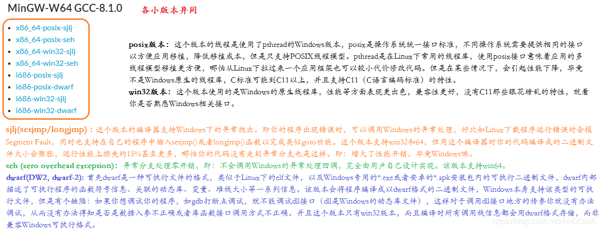

# mingw安装

[MinGW gcc下载链接及sjlj、dwarf、seh异同以及gcc安装_AMDDMA的博客-CSDN博客_gcc编译器windows安装](https://blog.csdn.net/AMDDMA/article/details/111600238)

[Downloads - MinGW-w64](https://www.mingw-w64.org/downloads/#llvm-mingw)

**32位下载链接：**[https://sourceforge.net/projects/mingw-w64/files/Toolchains%20targetting%20Win32/Personal%20Builds/mingw-builds/](https://sourceforge.net/projects/mingw-w64/files/Toolchains targetting Win32/Personal Builds/mingw-builds/)

**64位下载链接：** [https://sourceforge.net/projects/mingw-w64/files/Toolchains%20targetting%20Win64/Personal%20Builds/mingw-builds/](https://sourceforge.net/projects/mingw-w64/files/Toolchains targetting Win64/Personal Builds/mingw-builds/)

