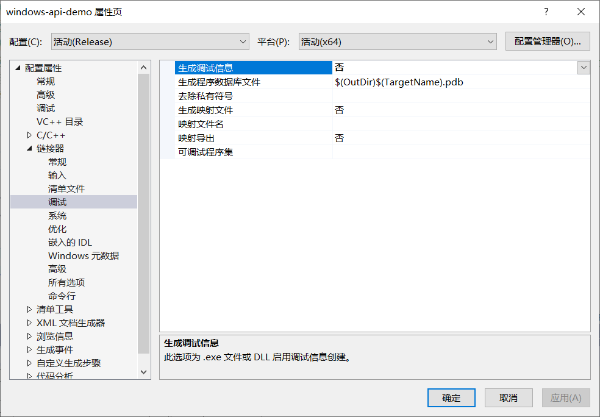

[让vc编译出的程序减小体积_24号杀手的博客-CSDN博客](https://blog.csdn.net/hpp24/article/details/53418163)

[VC编译出来的PE文件大小优化_jimoyangguang的博客-CSDN博客](https://blog.csdn.net/jimoyangguang/article/details/6319533)

## 去除清单文件


## 去除调试信息



## 更改对齐

```c
#pragma comment(linker,"/align:0x80") //定义最小节的大小,数值越小程序体积越小 ^_^
```

vs2019里允许的最小对齐是128，即0x80，不能比这还要小了

## 数据段和代码段放在一起

```c
#pragma comment(linker,"/merge:.data=.text") 
#pragma comment(linker,"/merge:.rdata=.text")
```


## 最大优化


## 取消一些检查和设置最小生成


## 更改main函数入口

