# gcc、makefile、cmake

集成开发环境IDE和编译器的概念要注意区别

gcc hello.c -o hello 只能编译一个文件，makefile可以编译多个文件

**脚本语言makefile**

Linux C/C++ 必须要使用的一个编译脚本

准备hello.c文件

```c
#include <stdio.h>
#define STR "hello world\n"
#define PRT printf
int main(){
   PRT(STR);
    return 0;
}
```

## gcc的编译四个阶段

**预处理** gcc -E hello.c -o helle.i   将代码中的代码中的头文件，宏定义宏选择等进行展开及替换

**编译**   gcc -S hello.i -o hello.s   产生**汇编文件**

**汇编**   gcc -c hello.s -o hello.o    将汇编文件编译为**目标文件**

**链接**    gcc hello.o -o hello   产生**可执行文件**

上面这四步骤可以用一个命令来代替：

**gcc hello.c -o hello**

预处理后的文件打开后：

开头可以看到一堆头文件：

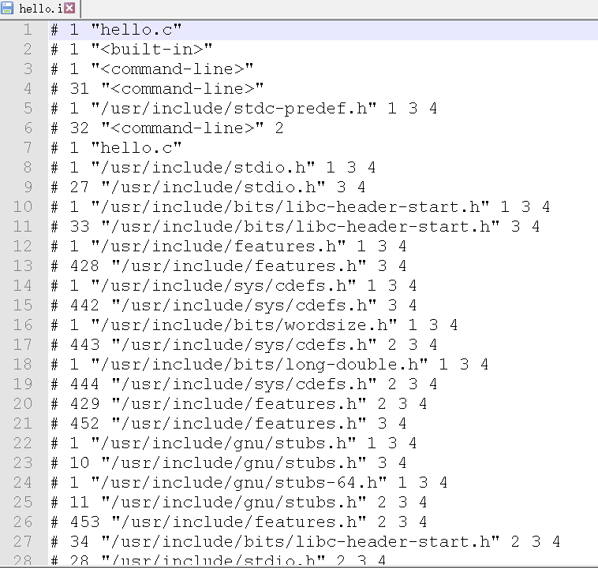

内容很多700多行，最后面可以看到C代码，已经替换了宏定义

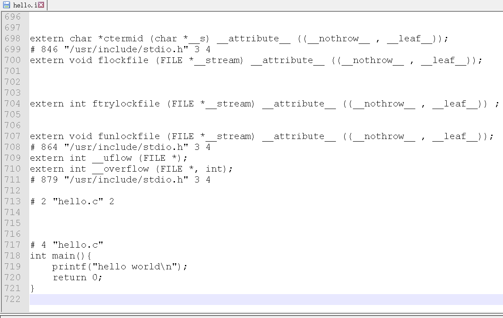


编译后hello.s文件：产生汇编语言

```assembly
	.file	"hello.c"
	.text
	.section	.rodata
.LC0:
	.string	"hello world"
	.text
	.globl	main
	.type	main, @function
main:
.LFB0:
	.cfi_startproc
	pushq	%rbp
	.cfi_def_cfa_offset 16
	.cfi_offset 6, -16
	movq	%rsp, %rbp
	.cfi_def_cfa_register 6
	movl	$.LC0, %edi
	call	puts
	movl	$0, %eax
	popq	%rbp
	.cfi_def_cfa 7, 8
	ret
	.cfi_endproc
.LFE0:
	.size	main, .-main
	.ident	"GCC: (GNU) 8.3.1 20191121 (Red Hat 8.3.1-5)"
	.section	.note.GNU-stack,"",@progbits

```

汇编后产生的.o文件，打开是乱码了

## makefile

学会第一层就会makefile了，就可以了

### 第一层：显式规则

步骤：

1.创建文本文档，取名Makefile，没有后缀名

2.#是注释

3.显式规则

目标文件:依赖文件

[TAB]指令   makefile里不要乱用TAB，只有命令所在的行才能且只能以TAB开头！

注意：**Makefile的TAB不能用4个空格来代替**

```makefile
hello.i:hello.c
    gcc -E hello.c -o hello.i

hello.S:hello.i
    gcc -S hello.i -o hello.S

hello.o:hello.S
    gcc -c hello.S -o hello.o
    
hello:hello.o
    gcc hello.o -o hello
```

还可以**反过来写**：第一个目标文件是我的最终目标,有点像递归

```makefile
hello:hello.o
    gcc hello.o -o hello

hello.o:hello.S
    gcc -c hello.S -o hello.o

hello.S:hello.i
    gcc -S hello.i -o hello.S

hello.i:hello.c
    gcc -E hello.c -o hello.i
```

执行：

```bash
make
```


**伪目标** .PHONY:

可以执行控制台命令

```makefile
hello:hello.o
	gcc hello.o -o hello

hello.o:hello.S
	gcc -c hello.S -o hello.o

hello.S:hello.i
	gcc -S hello.i -o hello.S

hello.i:hello.c
	gcc -E hello.c -o hello.i

.PHONY:
clearAll:  # 这个地方可以随便起名
	rm -rf hello.o hello.S hello.i hello
clear:  # 这个地方可以随便起名
	rm -rf hello.o hello.S hello.i
```

执行：

```bash
make clear
```


#### 案例

准备如下文件用来测试

main.c

```c
#include <stdio.h>
#include "main.h"
int main()
{
	printf("areaCircle=%f,areacuble=%f",areaCircle(1),areacuble(1));
	return 0;
}
```

main.h

```h
#include "circle.h"
#include "cube.h"
```

circle.h

```h
double areaCircle(double n);
```

cube.h

```h
double areacuble(double n);
```

circle.c

```c
double areaCircle(double n)
{
	return 3.14*n*n;
}
```

cube.c

```c
double areacuble(double n)
{
	return n*n;
}
```

Makefile文件

```makefile
#得到可执行文件test
test:circle.o cube.o main.o
	gcc circle.o cube.o main.o -o test
	
circle.o:circle.c
	gcc -c circle.c -o circle.o

cube.o:circle.c
	gcc -c cube.c -o cube.o

main.o:main.c
	gcc -c main.c -o main.o

.PHONY:
clearAll:
	rm -rf circle.o cube.o main.o test
clear:
	rm -rf circle.o cube.o main.o
```

执行

```bash
make clear
```

结果

```
areaCircle=3.140000,areacuble=1.000000
```

### 第二层:变量

类似于宏定义

变量 = (替换) +=(追加) :=(恒等于)

使用变量 $(变量名) 替换

```makefile
#得到可执行文件test
#变量 = (替换) +=(追加) :=(恒等于)
#使用变量 $(变量名) 替换
TAR = test
OBJ = circle.o cube.o main.o
CC := gcc
$(TAR):$(OBJ)
	$(CC) $(OBJ) -o $(TAR)
	
circle.o:circle.c
	$(CC) -c circle.c -o circle.o

cube.o:circle.c
	$(CC) -c cube.c -o cube.o

main.o:main.c
	$(CC) -c main.c -o main.o

.PHONY:
clearAll:
	rm -rf $(OBJ) $(TAR)
clear:
	rm -rf $(OBJ)
```


### 第三层：隐含规则

```makefile
#第三层：隐含规则 %.c %.o *.c %.o
#%.c %.o 任意的.c，任意的.o文件
#*.c %.o 所有的.c  .o文件
TAR = test
OBJ = circle.o cube.o main.o
CC := gcc
$(TAR):$(OBJ)
	$(CC) $(OBJ) -o $(TAR)

%.o:%.c
	$(CC) -c %.c -o %.o

.PHONY:
clearAll:
	rm -rf $(OBJ) $(TAR)
clear:
	rm -rf $(OBJ)
```


### 第四层:通配符

 **\$^**所有的依赖文件 

**\$@**所有的目标文件 

**$<**所有的依赖文件的第一个文件

**$?** 依赖文件中更新过的文件

```makefile
TAR = test
OBJ = circle.o cube.o main.o
CC := gcc
RMRF :=rm -rf
$(TAR):$(OBJ)
	$(CC) $^ -o $@

%.o:%.c
	$(CC) -c $^ -o $@

.PHONY:
clearAll:
	RMRF $(OBJ) $(TAR)
clear:
	RMRF $(OBJ)
```

### 第五层：函数

makefile葵花宝典

https://blog.csdn.net/yredh_114/article/details/69389134

makefile教程

https://www.cnblogs.com/hbtmwangjin/articles/9051574.html

## cmake

Cross Platform Make

​		对于一个大工程，编写makefile实在是件复杂的事，且makefile在不同的操作系统下的编写格式还不完全一样，于是人们又想，为什么不设计一个工具，读入所有源文件之后，自动生成makefile呢，于是就出现了cmake工具，它能够输出各种各样的makefile或者project文件,从而帮助程序员减轻负担。但是随之而来也就是编写cmakelist文件，它是cmake所依据的规则。所以在编程的世界里没有捷径可走，还是要脚踏实地的。

原文件－－camkelist —cmake —makefile —make —生成可执行文件

这样通过CMake就实现跨平台

步骤

```bash
vim CMakeLists.txt #名字必须是 CMakeLists.txt 
```

CMake的命令不区分大小写

```cmake
cmake_minimum_required (VERSION 3.8) #声明CMake版本要求

```

https://www.bilibili.com/video/BV16V411k7eF?p=2


# 第1章 概述

## 发展历程

Unix 操作系统

- 1972.11 诞生
- 1978.11 正式发布 
- 1989.12 **C89**标准或称为ANSI或称标准C
- 1990.9  ANSI C 被ISO采纳为国际标准（ISO.C或**C90**）
- 1999.8 ISO发布**C99**标准
- 2011年 ISO发布**C11**标准

## 特点

- 代码级别跨平台，跨平台需要重新编辑
- 直接访问物理地址，操作硬件
- 可以是值传递，也可以传递指针（地址）
- 不同变量类型可以放在**结构体**里
- 预编译处理

## 开发工具IDE

- VC++
- VS
- VS Code
- ......

## C语言编译器

- GCC （GNU Compiler Collection ） Linux平台，也能由于Windows系统
- Visual C++ 简称 MSVC ，只能由于Windows
- Clang（也称Apple LLVM 编译器） FreeBSD和maxOS在用

## VS Code相关插件

- **C/C++**

  作者：Microsoft

  在Visual Studio Code中增加了对C / C ++的语言支持，包括IntelliSense和调试等功能

- Better C++ Syntax

  作者：Jeff Hykin

  为C、C++、Objto-C和Objul-C++提供语法高亮

- C/C++ Extension UI Themes

  C/C++ 扩展主题

- CMake

- C/C++ Compile Run

  可以**轻松**地**编译和运行**单个c / c ++文件

  按F6或F7编译运行

## C语言环境搭建

### C语言编译器

windos：

- GCC 
- LLVM Clang
- Visual C++（简称 MSVC）对 C99 支持有限，不支持C11

Unix/Linux：

- GCC 
- LLVM Clang

**MinGW**

又称mingw ，是Minimalist GNU for Windows的缩写。它是一个可自由使用和自由发布的Windows特定头文件和使用GNU工具集导入库的集合，允许你在GNU/Linux和Windows平台生成本地的Windows程序而不需要第三方C运行时（C Runtime）库。MinGW 是一组包含文件和端口库，其功能是允许控制台模式的程序使用微软的标准C运行时（C Runtime）库

官网：http://www.mingw.org/

https://zhuanlan.zhihu.com/p/87864677

GCC、g++编译器的区别

GCC:（GNU Compiler Collection，GNU编译器套件），是由 GNU 开发的编程语言编译器。它是以GPL许可证所发行的自由软件，也是 GNU计划的关键部分。

gcc:GNU的C语言编译器。

g++:GNU的C++语言编译器。

**区别一**：
gcc:编译文件后缀为.c的文件时，编译成编译成C语言，编译文件后缀为.cpp的文件时，编译成C++语言。

g++:编译.c/.cpp文件时，只编译成c++语言。

**区别二**：
如果你使用g++去链接.o文件，它将自动链接c++标准库(gcc不会这么做)。

**区别三**：
gcc编译后缀为.c的文件有更少的预定义宏。

gcc编译后缀为.cpp的文件和g++编译后缀为.c/.cpp的文件有少量额外宏。

### gcc编译器常用命令

https://www.cnblogs.com/fengliu-/p/10219850.html

```bash
gcc [options] [filenames]
```

参数说明：

- **-c** 

  只编译，不链接成为可执行文件。编译器只是由输入的 .c 等源代码文件生成 .o 为后缀的目标文件，通常用于编译不包含主程序的子程序文件。

- **-o** output_filename    
  确定输出文件的名称为output_filename。同时这个名称不能和源文件同名。如果不给出这个选项，gcc就给出默认的可执行文件 a.out 。
- -g
  产生符号调试工具（GNU的 gdb）所必要的符号信息。想要对源代码进行调试，就必须加入这个选项。
  -O
  对程序进行优化编译、链接。采用这个选项，整个源代码会在编译、链接过程中进行优化处理，这样产生的可执行文件的执行效率可以提高，但是编译、链接的速度就相应地要慢一些，而且对执行文件的调试会产生一定的影响，造成一些执行效果与对应源文件代码不一致等一些令人“困惑”的情况。因此，一般在编译输出软件发行版时使用此选项。
- -O2
  比 -O 更好的优化编译、链接。当然整个编译链接过程会更慢。
  -Idirname
  将 dirname 所指出的目录加入到程序头文件目录列表中，是在预编译过程中使用的参数。

​        说明：
C程序中的头文件包含两种情况：
#include <stdio.h>
#include "stdio.h"
其中，使用尖括号（<>），预处理程序 cpp 在系统默认包含文件目录（如/usr/include）中搜索相应的文件；使用双引号，预处理程序 cpp 首先在当前目录中搜寻头文件，如果没有找到，就到指定的 dirname 目录中去寻找。
在程序设计中，如果需要的这种包含文件分别分布在不同的目录中，就需要逐个使用 -I 选项给出搜索路径。

- -L dirname
  将dirname所指出的目录加入到程序函数库文件的目录列表中，是在链接过程中使用的参数。在默认状态下，链接程序 ld 在系统默认路径中（如 /usr/lib）寻找所需要的库文件。这个选项告诉链接程序，首先到 -L 指定的目录中去寻找，然后到系统默认路径中寻找；如果函数库存放在多个目录下，就需要依次使用这个选项，给出相应的存放目录。
- -l name
  链接时装载名为 libname.a 的函数库。该函数库位于系统默认的目录或者由 -L 选项确定的目录下。例如，-lm 表示链接名为 libm.a 的数学函数库。


### VS Code配置 C/C++环境

设置环境变量

下载C/C++插件

> VSCode C语言输出中文乱码问题 

将win10的cmd设置为utf-8https://jingyan.baidu.com/article/25648fc1471e6a9191fd002e.html


hello.c文件

```c
#include <stdio.h>
void main(){
   printf("hello world");
}
```

### Centos搭建C语言环境

```bash
yum -y install gcc gcc-c++ kernel-devel
```


设置vim缩进为4个空格，修改 `/etc/vimrc` 文件，在末尾添加：

```
set smartindent
set shiftwidth=4
set tabstop=4
set expandtab
```

https://blog.csdn.net/oMengLiShuiXiang1234/article/details/51124193

编写：

```c
#include <stdio.h>
int main(){
        printf("hello world");
        return 0;
}
```


编译和运行：

```bash
gcc hello.c -o hello && ./hello
```


centos安装图形界面

```bash
yum -y groupinstall "X Window System"
yum -y groupinstall "Desktop"  #安装GNOME
```

设置GNOME为默认启动

```bash
vi /etc/inittab
id:5:initdefault:    #3改为5
```

重启，进入桌面

安装中文输入法

```bash
yum -y groupinstall "Input Methods"
yum -y groupinstall "Chinese support"
```

设置-选择拼音输入法

Ctrl+空格 切换输入法

安装等宽字体 ，在应用商店里搜索：dejavu

勾选：Monospace sans-serif font faces 安装

终端打开，设置字体为Monospace  ，加粗


### notepad++

运行命令：

```
/cmd /k cd "$(CURRENT_DIRECTORY)" & gcc -o $(NAME_PART) $(FILE_NAME) & "$(NAME_PART)".exe
```

保存快捷键到ctrl+F5

## main函数怎么写

mian函数的返回值：

main函数几种形式如下:

- C语言中:
  - int main(void);
  - int main(int argc,char* argv[]);
  - 或者 int main(int argc, char** argv);
  
- *C++语言中:*
  - int main();
  - int main(int argc,char* argv[]);

https://www.cnblogs.com/bianchengzhuji/p/9783772.html C语言main函数到底怎么写

**C89/C99/C11标准文档中只提供了两种main函数的写法**：

```c
int main(void){/*...*/}
```


```c
int main(int argc, char *argv[]) { /* ... */ }
```

## C 程序运行机制

1) 编辑：比如编写我们的 hello.c 文件， 就是 源代码. 

2) 编译：将 hello.c 程序 翻译成 目标文件(hello.obj) // 在计算机底层执行

3) 链接：将目标文件 hello.obj + 库文件 生成可执行文件 (MyProject01.exe) //在计算机底层执行

4) 运行：执行 .exe 文件， 得到运行结果

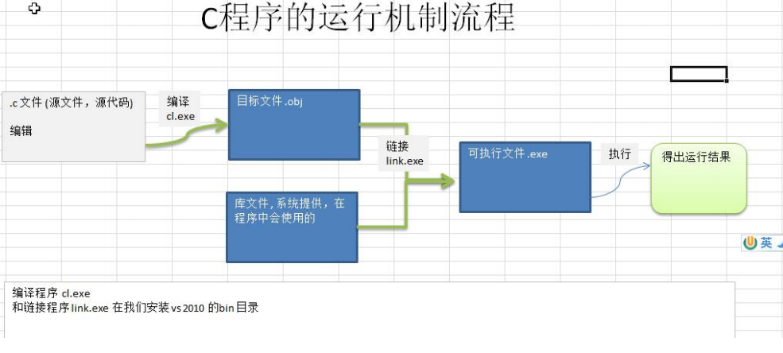


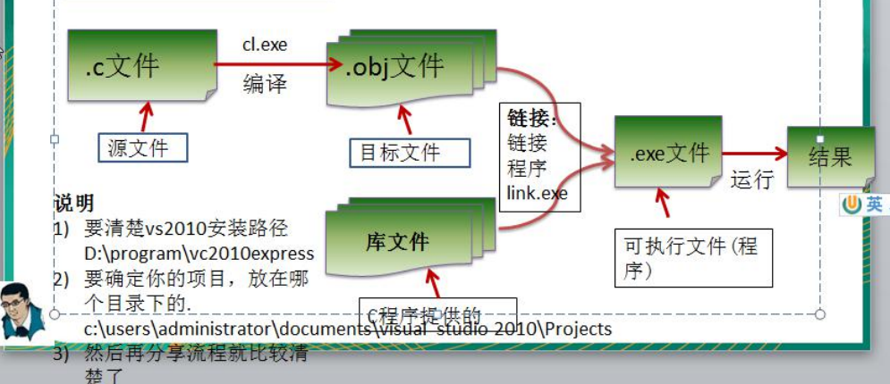

### 什么是编译

1) 有了 C 源文件，通过编译器将其编译成 obj 文件(目标文件)。

2) 如果程序没有错误，没有任何提示，但在 Debug 目录下会出现一个 Hello.obj 文件，该文件称为目标文件。

### 什么是链接

1) 有了目标文件(.obj 文件)，通过链接程序将其和运行需要的 c 库文件链接 成 exe 文件(可执行文件)。

2) 如果程序没有错误，没有任何提示，但在 Debug 目录下会出现一个项目名.exe 文件，该文件称为可执行文件。

3) 为什么需要链接库文件呢? 因为我们的 C 程序中会使用 C 程序库的内容，比如 <stdio.h> <stdlib.h> 中的函数
printf() system()等等, 这些函数不是程序员自己写的，而是 C 程序库中提供的，因此需要链接

4) 你会发现链接后，生成的.exe 文件，比 obj 文件大了很多.

### 什么是运行

1) 有了可执行的 exe 文件, 也称为可执行程序 (二进制文件)

2) 在控制台下可以直接运行 exe 文件

## C 程序开发注意事项

1) C 程序的主体结构说明
#include ... void main() { // {} 包括内容， 称为函数体
语句 1;
语句 2;
}

2) C 程序源文件以“c”为扩展名。

3) C 程序的执行入口是 main()函数。

4) C 语言严格区分大小写。

5) C 程序由一条条语句构成，每个语句以“;”结束

6) 大括号都是成对出现的，缺一不可

## C 转义字符

1) \t ：一个制表位，实现对齐的功能

2) \n ：换行符

3) \\\ ：一个\

4) \\" :一个" 

5) \\' ：一个' 

6) \r :一个回车 printf("张无忌赵敏周\r 芷若小昭"); 回车不是换行，将当前位置移到本行开头

## 注释

单行注释//

多行注释/**/

## C语言标准库

C 标准库是一组 C 内置函数、常量和头文件，比如 <stdio.h>、<stdlib.h>、<math.h>，等等。这个标
准库可以作为 C 程序员的参考手册。

# 第2章 变量

每一种数据都定义了明确的数据类型，在内存中分配了不同大小的内存空间(使用字节多少表示)。

- 基本类型
  - 数值型
    - 整型
      - 短整型 short
      - 整型 int
      - 长整型 long 、long long、long int
    - 浮点型
      - 单精度 float
      - 双精度 double 、long double
  - 字符型 char
- 构造类型
  - 数组
  - 结构体 struct
  - 共用体 union
  - 枚举类型 enum
- 指针类型
- 空类型void

注意：在 c 中，**没有字符串类型,** 使用**字符数组**表示字符串

在不同系统上，部分数据类型字节长度不一样, int 2 或者 4

## 整数类型

| 类型                                   | 存储字节 | 范围                                              |
| -------------------------------------- | :------: | ------------------------------------------------- |
| char<br />（字符型底层也是存放的整数） |    1     | -128到127                                         |
| unsigned char                          |    1     | 0到255                                            |
| signed char                            |          | -128到127                                         |
| int<br />signed int                    |  2 或 4  | -32768~32767或<br />-2,147,483,648~-2,147,483,647 |
| unsigned int                           |  2 或 4  |                                                   |
| short<br/>signed short                 |    2     |                                                   |
| unsigned short                         |    2     |                                                   |
| long<br/>signed long                   |    4     | 2,147,483,648~-2,147,483,647                      |
| unsigned long                          |    4     | 0到4,294,967,295                                  |

1) **各种类型的存储大小与操作系统、系统位数和编译器有关**

## 浮点类型

| 类型          | 大小 | 范围                | 精度     |
| ------------- | ---- | ------------------- | -------- |
| float 单精度  | 4    | 1.2E-38 到 3.4E+38  | 6位小数  |
| double 双精度 | 8    | 2.3E-308 到1.7E+308 | 15位小数 |

1) 关于浮点数在机器中存放形式的简单说明,浮点数=符号位+指数位+尾数位 , 浮点数是近似值

2) 尾数部分可能丢失，造成精度损失。


1) 浮点型常量**默认为 double 型** ，声明 float 型常量时，须后加‘f’或‘F’。

2) 浮点型常量有两种表示形式

十进制数形式：如：5.12 512.0f .512 (必须有小数点）

科学计数法形式:如：5.12e2 、 5.12E-2

3) 通常情况下，应该使用 double 型，因为它比 float 型更精确。

4) printf("d1=%f ", d1); // 在输出时，默认保留 小数点 6 位

```c
//浮点型常量默认为 double 型 ，声明 float 型常量时，须后加‘f’或‘F’
float d1 = 1.18909095; //从“double”到“float”截断, 1.1 是 double
float d2 = 1.1f;//1.1f 就是 float
double d3 = 1.3; // ok
double d4 = 5.12;
double d5 = .512; // 等价 0.512
double d6 = 5.12e2; //等价 5.12 * (10^2) = 512
double d7 = 5.12e-2; // 等价 5.12 * (10^-2) = 5.12 / 100 = 0.0512
//在输出时，如果%f 默认保留小数点 6 位
printf("d1=%.15f d2=%f d3=%f d4=%f d5=%f d6=%f d7=%f", d1,d2,d3,d4,d5,d6,d7);
```

## 字符类型(char)

字符类型可以表示单个字符,字符类型是 char，char 是 1 个字节(可以存字母或者数字)，多个字符称为字符串，在
C 语言中 使用 char 数组 表示，数组不是基本数据类型，而是构造类型

1) 字符常量是用单引号('')括起来的单个字符。例如：char c1 = 'a'; char c3 = '9';
2) C 中还允许使用转义字符‘\’来将其后的字符转变为特殊字符型常量。例如：char c3 = ‘\n’; // '\n'表示换
行符

3) 在 C 中，char 的本质是一个整数，在输出时，是 ASCII 码对应的字符。

4) 可以直接给 char 赋一个整数，然后输出时，会按照对应的 ASCII 字符输出 [97]

5) char 类型是可以进行运算的，相当于一个整数，因为它都对应有 Unicode 码.

```c
char c1 = 'a';
char c2 = 'b';
//这时当我们以%c 输出时，就会安装 ASCII 编码表(理解 字符 <==> 数字 对应关系 ) 对应的 97 对应字
符输出
char c3 = 97;
//这里注意
//1. vs2010 编译器 是 c89
//2. 要求 变量的定义在 执行语句之前
int num = c2 + 10; // 98 + 10 = 108
printf("c1=%c c2=%c c3=%c", c1, c2, c3);// c3= 'a'
printf("num=%d", num); // 108
```


字符类型本质探讨

1) 字符型 存储到 计算机中，需要将字符对应的码值（整数）找出来
存储：字符'a'——>码值 (97)——>二进制 (1100001)——>存储()
读取：二进制(1100001)——>码值(97)——> 字符'a'——>读取(显示)

2) 字符和码值的对应关系是通过字符编码表决定的

ASCII 码介绍

1) 在计算机内部，所有数据都使用二进制表示。每一个二进制位（bit）有 0 和 1 两种状态，因此 8 个二进制
位就可以组合出 256 种状态，这被称为一个字节（byte）。一个字节一共可以用来表示 256 种不同的状态，
每一个状态对应一个符号，就是 256 个符号，从 0000000 到 11111111。

2) ASCII 码：上个世纪 60 年代，美国制定了一套字符编码，对英语字符与二进制位之间的关系，做了统一规定。
这被称为 ASCII 码。ASCII 码一共规定了 127 个字符的编码，比如空格“SPACE”是 32（二进制 00100000），
大写的字母 A 是 65（二进制 01000001）。这 128 个符号（包括 32 个不能打印出来的控制符号），只占用了一
个字节的后面 7 位，最前面的 1 位统一规定为 0。

## 布尔类型

1) C 语言标准(C89)没有定义布尔类型，所以 C 语言判断真假时以 0 为假，非 0 为真 [案例]

2) 但这种做法不直观，所以我们可以借助 C 语言的宏定义 。

3) C 语言标准(C99)提供了_Bool 型，\_Bool 仍是整数类型，但与一般整型不同的是，\_Bool 变量只能赋值为 0 或 1，
非 0 的值都会被存储为 1，C99 还提供了一个头文件 <stdbool.h> 定义了 bool 代表_Bool，true 代表 1，false 代
表 0。只要导入 stdbool.h ，就能方便的操作布尔类型了 , 比如 bool flag = false;[了解]

```c
#include <stdio.h>
//宏定义
#define BOOL int
#define TURE 1
#define FALSE 0

void main() {
    int isPass = -1;
    //可以使用宏定义来完成(这里大家先看下，体会一下，后面我们会详解宏定义)
    //定义一个布尔变量
    BOOL isOk = TURE; // 等价 int isOK = 0
    if(isPass) { // 0 表示假， 非 0 表示真
        printf("通过考试");
    }
    if(isOk) {
        printf("ok");
    }
    getchar();
}
```

## 基本数据类型转换

### 自动类型转换

当 C 程序在进行赋值或者运算时，精度小的类型自动转换为精度大的数据类型，这个就是自动类型转换。

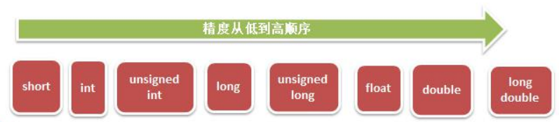

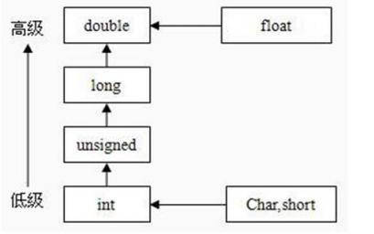

1) 有多种类型的数据混合运算时，系统首先自动将所有数据转换成**精度最大**的那种数据类型，然后再进行计算(如
int 型和 short 型运算时，先把 short 转成 int 型后再进行运算)。

2) 若两种类型的字节数不同，转换成**字节数大**的类型，若两种类型的字节数相同，且一种有符号，一种无符号，
则转换成**无符号类型**

3) 在赋值运算中，赋值号两边量的数据类型不同时，赋值号右边的类型将转换为左边的类型**，如果右边变量的数**
**据类型长度比左边长时，将丢失一部分数据**，这样会降低精度，丢失的部分按**四舍五入向前舍入**

### 强制类型转换

将精度高的数据类型转换为精度小的数据类型。使用时要加上强制转换符 ( )，但可能造成精度降低或溢出,格外要注意。

```c
double d1 = 1.934;
int num = (int)d1; //这里注意，不是进行四舍五入，而是直接截断小数后的部分
//强制转换只对最近的数有效, 如果希望针对更多的表达式转换，使用（）
//int num2 = (int)3.5 * 10 + 6 * 1.5; // 3 * 10 + 6 * 1.5 = 30 + 9.0 = 39.0
int num3 = (int)(3.5 * 10 + 6 * 1.5); // 35.0 + 9.0 = 44.0 -> int = 44
printf("\nnum3=%d", num3); // num3 = 44
printf("\nnum=%d d1=%f" , num, d1); // d1 仍然是 double
```

1) 当进行数据的从 精度高——>精度低，就需要使用到强制转换

2) 强转符号只针对于最近的操作数有效，往往会使用小括号提升优先级

## 指针入门

**指针表示一个地址（存放的是地址）**

```
* :指针类型
& :取出变量的地址
指针变量本身也有地址(可以无限套娃)
```


```c
int num = 1;
//定义一个指针变量，指针
//说明
//1. int * 表示类型为 指针类型
//2. 名称 ptr , ptr 就是一个 int * 类型
//3. ptr 指向了一个 int 类型的变量的地址
int *ptr = &num;
//num 的地址是多少
//说明 1：如果要输出一个变量的地址，使用格式是 %p
//说明 2: &num 表示取出 num 这个变量对应地址
printf("\nnum 的值=%d num 地址=%p", num, &num);
//1.指针变量，本身也有地址 &ptr
//2.指针变量, 存放的地址 ptr
//3.获取指针指向的值 *ptr
printf("\nptr 的地址是 %p ptr 存放的值是一个地址为 %p ptr 指向的值=%d", &ptr, ptr, *ptr);
```

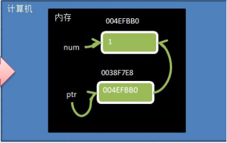

案例:

1)写一个程序，获取一个 int 变量 num 的地址，并显示到终端

2)将 num 的地址赋给指针 ptr , 并通过 ptr 去修改 num 的值. 

3)分析 ptr 的类型 是 int * , 注意指针的类型和 该指针指向的变量类型是对应关系

4)画出案例的内存布局图

```c
#include <stdio.h>
int main()
{
    int num = 88;
    int *ptr = &num;
    printf("num的值=%d num的地址值=%p\n", num, &num);
    *ptr = 99; //通过指针去修改num的值,地址没有变
    printf("num的值=%d num的地址值=%p", num, &num);
}
```

结果：

```
num的值=88 num的地址值=0061FF28
num的值=99 num的地址值=0061FF28
```

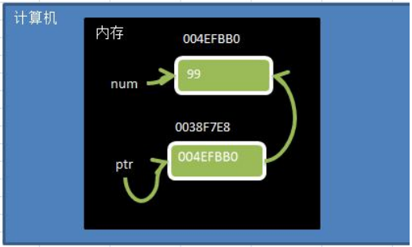


**课堂练习(判断程序是否正确)**

```c
void main() {
    int a = 300;
    int *ptr = a; 
}
//错误: 把 int 赋给 int *
```


```c
void main() {
    int a = 300;
    float *ptr = &a;
}
//错误：把 int 的地址赋给float *
```


```c
void main() {
    int a = 300; // a = 300
    int b = 400; // b = 400
    int * ptr = &a; //ok ptr 指向 a
    *ptr = 100; // a = 100 
    ptr = &b; // ok ptr 指向 b
    *ptr = 200; // b = 200
    printf("\n a=%d,b=%d,*ptr=%d", a, b, *ptr);
    getchar();
}
//a = 100, b = 200, *ptr = 200
```

**指针细节说明**

1) 基本类型，都有对应的指针类型， 形式为 **数据类型 ***，比如 int的对应的指针就
是 int *, float 对应的指针类型就是 float * , 依次类推。

2) 此外还有指向数组的指针、指向结构体的指针，指向共用体的指针，后面我们
再讲到数组、结构体和共用体时，还会详细讲解。

## 值传递和地址传递

C语言传递参数(或者赋值)可以是值传递（pass by value），也可以传递
指针（a pointer passed by value）, 传递指针也叫地址传递。

1) 默认传递值的类型：基本数据类型 (整型类型、小数类型，字符类型), 结构体, 
共用体。

2) 默认传递地址的类似：指针、数组

**值传递**：将变量指向的存储内容，在传递/赋值时，拷贝一份给接收变量.

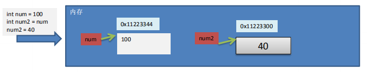

**地址传递** 也叫 **指针传递**：如果是指针，就将指针变量存储的**地址**，传递给
接收变量，如果是数组，就将数组的**首地址**传递给接收变量。

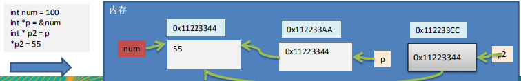

# 第3章 常量

1) 常量是固定值，在程序执行期间不能改变。这些固定的值，又叫做**字面量**。

2) 常量可以是任何的基本数据类型，比如整数常量、浮点常量、字符常量，或字符串
字面值，也有枚举常量。

3) 常量的值在**定义后不能进行修改**.

## 经常使用的常量

**整数常量**

```c
85 /* 十进制 */
0213 /* 八进制 */
0x4b /* 十六进制 */ 
30 /* 整数 */
30u /* 无符号整数 */
30l /* 长整数 */
30ul /* 无符号长整数 */
```

**浮点常量**

```c
3.14159; //double 常量
314159E-5; // 科学计数法
3.1f; //float常量
```

**字符常量**

```c
'X' 
'Y' 
'A'
'b'
'1'
'\t'
```

**字符串常量**

```c
"hello, world" 
"北京"
"hello \
world"
```

案例演示

```c
#include <stdio.h>
void main() {
    int n1 = 0213; /* 八进制 */ //对应 10 进制 139
    int n2 = 0X4b; /* 十六进制 */ // 对应 10 进制 75
    char c1 = 'a';
    char c2 = '\t'; // '\t' 是字符常量
    char str1[20] = "北京 hello"; // "北京 hello" 字符串常量
    char str2[100] = "hello \
world"; // 等价 "hello world" \只是告诉编译器要换行，不是字符串本身
    //验证
    printf("\nn1=%d n2=%d", n1, n2);
    printf("\nstr1=%s str2=%s", str1, str2);
    getchar();
}
```


## 常量的定义

1) 使用 **#define** 预处理器。

2) 使用 **const 关键字**

### #define 预处理器

```c
#define 常量名 常量值
```


```c
#include <stdio.h>
#define PI 3.14 //定义常量 PI 常量值 3.14
int main() {
    //PI = 3.1415 可以吗?=》 不可以修改，因为 PI 是常量
    //可以修改 PI 值?
    //PI = 3.1415; //提示 = 左值 必须是可修改的值
    double area;
    double r = 1.2;//半径
    area = PI * r * r;
    printf("面积 : %.2f", area);
    getchar();
    return 0;
}
```

### const 关键字

```c
const 数据类型 常量名 = 常量值;
```


```c
#include <stdio.h>
//1. const 是一个关键字，规定好，表示后面定义了一个常量
//2. PI 是常量名，即是一个常量，常量值就是 3.14
//3. PI 因为是常量，因此不可以修改
//4. const 定义常量时，需要加 分号
const double PI = 3.14;
int main() {
    //PI = 3.1415 可以吗? => 不可以
    double area;
    double r = 1.2;
    area = PI * r * r;
    printf("面积 : %.2f", area);
    getchar();
    return 0;
}
```

### const 和 #define 的区别

1) const 定义的常量时，带类型，define 不带类型

2) const 是在 编译、运行的时候起作用，而 define 是在编译的**预处理阶段**起作用

3) define 只是简单的替换，没有类型检查。简单的字符串替换会导致**边界效应**[案例演示].

```c
#include <stdio.h>
#define A 1
#define B A+3
#define C A/B*3
void main() {
    //#define就是一个简单的替换
    //C其实是A/A+3*3 = 10
    printf("c=%d",C);//10
}
```

 4) const 常量可以进行调试的，**define** 是不能进行调试的，主要是预编译阶段就已经**替换掉了**，调试的时候就没它
了

5) const 不能重定义，不可以定义两个一样的，而 define 通过 undef 取消某个符号的定义，再重新定义 [案例]

6) define 可以配合**#ifdef**、 **#ifndef**、 **#endif** 来使用， 可以让代码更加灵活，比如我们可以通过#define 来 启动
或者关闭 调试信息。

```c
#include <stdio.h>
#define A 1
#define B (A+3) //
#define C A/B*3 //
//const 不能重定义，不可以定义两个一样的，而 define 通过 undef 取消某个符号的定义，再重新定义
const double PI=3.14;
//const double PI=3.145;
#define PI2 3.14
#undef PI2 // 取消 PI2 的定义
#define PI2 3.145
void main() {
    //
    //分析过程
    //#define 就是一个简单的替换!!!
    //C 其实是 A/A+3*3 = 1/1 + 3 * 3 = 1 + 9 = 10
    //C 其实是 A/(A+3)*3 = 1/(1+3) * 3 = 1/4 *3 = ?
    double d1 = 1.0/4 *3 ; // 0.25 * 3 = 0.75
    printf("\nc=%.2f", C);// 问 c = ?
    printf("\nd1=%.2f", d1);
    getchar();
}
```


```c
#include <stdio.h>
//#define DEBUG
void main() {
    #ifdef DEBUG //如果定义过 DEBUF
    printf("ok, 调试信息");
    #endif
    #ifndef DEBUG //如果没有定义过 DEBUF
    printf("hello, 另外的信息");
    #endif
    getchar();
}
```


# 第4章 运算符

## 算术运算符

+, - , * , / , %, ++, --

```c
#include <stdio.h>
void main() {
    //处理的流程 10 / 4 = 2.5 ==截取整数==> 2 => 2.00000
    double d1 = 10 / 4; //
    double d2 = 10.0 / 4; //如果希望保留小数，参与运算数必须有浮点数
    //给大家一个取模的公式
    // a % b = a - a / b * b
    int res1 = 10 % 3; // 求 10/3 的余数 1
    int res2 = -10 % 3; // = -10 - (-10) / 3 * 3 = -10- (-3) * 3 = -10 + 9 = -1
    int res3 = 10 % -3; // 10 - 10 / (-3) * (-3) = 10 - 9 = 1
    int res4 = -10 % -3; // ? -1
    //++ 的使用
    int i = 10;
    int j = i++; // 运算规则等价是 int j = i; i = i + 1; ==> j = 10, i=11
    int k = ++i; // 运算规则等价 i = i + 1; int k = i; ===> i=12, k =12
    printf("\n i=%d j=%d", i, j); //i=12 j=10
    printf("\n i=%d k=%d", i ,k );// i = 12 k = 12
    printf("\nd1=%f d2=%f res1=%d res2=%d res3=%d res4=%d", d1, d2, res1, res2, res3, res4); //
    //++ 或者 -- 还可以独立使用, 就相当于自增
    //k++ 等价于 k = k +1
    //++k 等价于 k= k +1
    //如果独立使用 ++k 和 k++ 完全等价
    k++; // k = 13
    ++k;// k = 14
    printf("\nk=%d", k); //k = 14
    getchar();
}
```

细节说明

1) 对于除号“/”，它的整数除和小数除是有区别的：整数之间做除法时，只保留整数部分而舍弃小数部分。 例
如：int x= 10/3 ,结果是 3

2) 当对一个数取模时，可以等价 a%b=a-a/b*b ， 这样我们可以看到 取模的一个本质运算。

3) 当 自增 当做一个独立语言使用时，不管是 ++i; 还是 i++; 都是一样的，等价

4) 当 自增 当做一个 表达式使用时 j = ++i 等价 i = i + 1; j = i;

5) 当 自增 当做一个 表达式使用时 j = i++ 等价 j = i; i = i + 1;

## 关系运算符(比较运算符)

1) 关系运算符的结果要么是**真(非 0 表示)**，要么是 **假(0 表示)**

2) 关系表达式 经常用在 **if** 结构的条件中或**循环结构**的条件中

== 、!=,  <,  >,  <=,  >=

```c
#include <stdio.h>
void main() {
    int a = 8;
    int b = 7;
    printf("\na>b=%d", a > b); // 1
    printf("\na>=b=%d", a >= b); // 1
    printf("\na<b=%d", a < b); //0
    printf("\na<=b=%d", a <= b);//0
    printf("\na==b=%d", a == b);//0
    printf("\na!=b=%d", a != b);//1
    getchar();
}
```

1) 关系运算符的结果要么是真(非 0 表示, 默认使用 1)，要么是 假(0 表示)

2) 关系运算符组成的表达式，我们称为关系表达式。 a > b

3) 比较运算符 "=="(关系运算符) 不能误写成 "=" (赋值)

## 逻辑运算符

用于连接多个条件（一般来讲就是关系表达式），最终的结果要么是真(非 0 表示)，要么是 假(0 表示) 。

&&    逻辑与（具有短路性质）如果第一个条件为 false ,则后面的条件不在判断

||  逻辑或（具有短路性质）如果第一个条件为真，则不再执行后面的条件，整个结果为真

!    逻辑非

## 赋值运算符

=，+=，-=，*=，/=，%=

<<=,  >>=,   &=,  ^=

赋值运算符特点

1) 运算顺序从右往左

2) 赋值运算符的左边 只能是变量,右边 可以是变量、表达式、常量值

3) 复合赋值运算符等价于下面的效果
比如：a+=3;等价于 a=a+3;

4) 注意在运算时，可能截断小数点后面的部分

```c
int a = 10;
a += 1.7; // a = a + 1.7 =>11.7 => 11
a= 11
```

## 位运算符

&,  |,  ^(取反),  ~,  <<(左移),  >>(右移)

## 三元运算符

```c
条件表达式 ? 表达式 1: 表达式 2;
```

1) 表达式 1 和表达式 2 要为可以赋给接收变量的类型(或可以自动转换), 否则会有精度损失

2) 三元运算符可以转成 if--else 语句

int res = a > b ? a++ : --b; // if ... else ..

## 运算符优先级

1) 结合的方向只有三个是从右向左，其余都是从左向右

2) 所有的双目运算符中只有赋值运算符的结合方向是从右向左

3) 另外两个从右向左的结合运算符，一个是单目运算，还有一个是三目运算()

4) 逗号的运算符优先级最低

5) 说一下优先级的大概的顺序 算术运算符 > 关系运算符 > 逻辑运算符(逻辑非! 除外) > 赋值运算符 > 逗号
运算符

6) 注意不需要刻意的记, 常用就慢慢有印象.

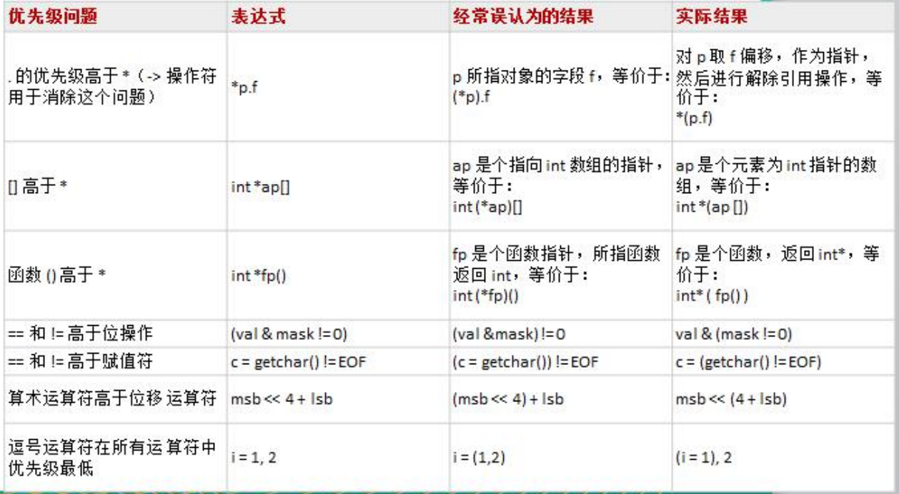

## 标识符的命名规则和规范

**标识符概念**

1) C 语言 对各种变量、函数等命名时使用的字符序列称为标识符

2) 凡是自己可以起名字的地方都叫标识符

**标识符的命名规则**

1) 由 26 个英文字母大小写，0-9 ，_或 $ 组成

2) 数字不可以开头。

3) 不可以使用关键字和保留字，但能包含关键字和保留字。

4) C 语言中严格区分大小写，长度无限制。

5) 标识符不能包含空格。

**标识符命名规范**

1) 程序中不得出现仅靠大小写区分的相似的标识符
int x, X; 变量 x 与 X 容易混淆

2) 所有宏定义、枚举常数、常量(只读变量)全用大写字母命名，用下划线分隔单词
比如： const double TAX_RATE = 0.08; //TAX_RATE 只读变量
#define FILE_PATH "/usr/tmp"

 3) 定义变量别忘了初始化。定义变量时编译器并不一定清空了这块内存，它的值可能是无效的数据, 运行程序，
会异常退出.

4) 变量名、函数名：多单词组成时，第一个单词首字母小写，第二个单词开始每个单词首字母大写：xxxYyyZzz [驼
峰法，小驼峰， 比如 short stuAge = 20;]
比如： tankShotGame 大驼峰 [TankShotGame]

## 关键字

定义：被C语言赋予了特殊含义，用做专门用途的字符串

特点：关键字中所有字母都为小写

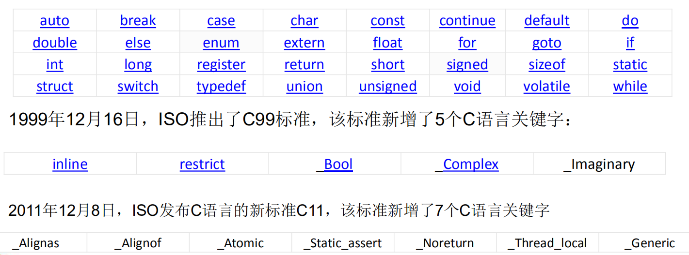

## 键盘输入语句

**步骤**

1) include <stdio.h>

2) 使用 scanf 函数

3) 使用适当的格式参数接收输入

**案例演示**

要求：可以从控制台接收用户信息，【姓名，年龄，薪水, 性别 (male(m) / female(f))】。

```c
#include <stdio.h>
void main() {
    //使用字符数组接收名
    char name[10] = "";
    int age = 0;
    double sal = 0.0;
    char gender = ' ';
    //提示用户输入信息
    printf("请输入名字：");
    //scanf("%s", name) 表示接收 一个字符串，存放到 name 字符数组
    scanf("%s", name);
    printf("请输入年龄：");
    scanf("%d", &age); // 因为我们将得到输入存放到 age 变量指向地址,因此需要加 &
    printf("请输入薪水：");
    scanf("%lf", &sal); //接收一个 double 时，格式参数 %lf
    printf("请输入性别(m/f)：");
    scanf("%c", &gender); //这里是接收到了上面的回车字符
    scanf("%c", &gender); //等待用户输入. //输出得到信息
    printf("\nname %s age %d sal %.2f gender %c", name, age,sal,gender);
    getchar();//接收到一个回车
    getchar();//这个 getchar() 才会让控制台暂停
}
```

课后练习题

定义变量保存 秒数，打印输出 xx 小时 xx 分钟 xx 秒

```c
void main() {
    //定义变量保存 秒数，打印输出 xx 小时 xx 分钟 xx 秒
    //思路
    //1. 定义变量保存 秒数 second
    //2. 定义变量保存 小时 hour
    //3. 定义变量保存 分钟 min
    //4. 定义变量保存 剩余描述 leftSecond
    int second = 894567;
    int hour = second / 3600 ; // 一个小时有 3600 秒
    int min = second % 3600 / 60; //
    int leftSecond = second % 60;
    printf("%d 秒 合%d 小时%d 分钟%d 秒", second, hour, min, leftSecond);
    getchar();
}
```

实现对三个整数进行排序，输出时按照从小到大的顺序输出

```c
void main() {
    //实现对三个整数进行排序，输出时按照从小到大的顺序输出=> 冒泡
    int n1 = 10;
    int n2 = 8;
    int n3 = 5;
    int temp = 0; //temp 是用于交换的临时变量
    printf("\n 最初顺序 n1=%d n2=%d n3=%d", n1, n2,n3);
    //思路如下
    //1. 从小到大将值保存 n1 n2 n3
    //2. n1 和 n2 比较，如果 n1 大于 n2 ,则交换
    //3. n2 和 n3 比较 , 如果 n2 大于 n3 ,则交换
    //4. n1 和 n2 比较，如果 n1 大于 n2 ,则交换
    //n1 和 n2 比较，如果 n1 大于 n2 ,则交换
    if (n1 > n2) {
        temp = n1;
        n1 = n2;
        n2 = temp;
    }
    //输出
    printf("\n 第一次处理 n1=%d n2=%d n3=%d", n1, n2,n3);
    // n2 和 n3 比较 , 如果 n2 大于 n3 ,则交换
    if (n2 > n3) {
        temp = n2;
        n2 = n3;
        n3 = temp;
    }
    //输出
    printf("\n 第 2 次处理 n1=%d n2=%d n3=%d", n1, n2,n3);
    //n1 和 n2 比较，如果 n1 大于 n2 ,则交换
    if (n1 > n2) {
        temp = n1;
        n1 = n2;
        n2 = temp;
    }
    //输出
    printf("\n 第 3 次处理 n1=%d n2=%d n3=%d", n1, n2,n3);
    getchar();
}
```

# 第5章 流程控制

略（和Java基本一样）

# 第6章 枚举enum

举个例子，比如：一星期有 7 天， 请定义数据表示星期一到星期天. 

传统的方法

```c
//使用#define 来完成
#define MON 1
#define TUE 2
#define WED 3
#define THU 4
#define FRI 5
#define SAT 6
#define SUN 7
```

分析：这个看起来代码量较多，并且不好管理 =》 枚举

构造数据类型

```c
enum 枚举名 {枚举元素 1,枚举元素 2,……};
```

## 快速入门

```c
#include <stdio.h>
void main() {
    enum DAY
    {
        MON=1, TUE=2, WED=3, THU=4, FRI=5, SAT=6, SUN=7
    }; // 这里 DAY 就是枚举类型, 包含了 7 个枚举元素
    enum DAY day; // enum DAY 是枚举类型， day 就是枚举变量
    day = WED; //给枚举变量 day 赋值，值就是某个枚举元素
    printf("%d",day);// 3 ， 每个枚举元素对应一个值
    getchar();
}
```

## 枚举的遍历

C 语言中，枚举类型是被当做 int 或者 unsigned int 类型来处理的，枚举类型必须连续是可以实现有条件的
遍历。以下实例使用 for 来遍历枚举的元素

```c
enum DAY {
    MON=1, TUE, WED, THU, FRI, SAT, SUN //如果没有给赋值，就会按照顺序赋值
} day; // 表示 定义了一个枚举类型 enum Day ,同时定义了一个变量 day(类型是 enum DAY)
int main() {
    // 遍历枚举元素
    //day++ 会给出警告，但是可以运行
    for (day = MON; day <= SUN; day++) { // 要求枚举元素是连续赋值
        printf("枚举元素：%d \n", day);
    }
    getchar();
    return 0;
}
```

## switch 中使用枚举

```c
int main() {
    enum SEASONS {SPRING=1, SUMMER, AUTUMN, WINTER}; //定义枚举类型 enum SEASONS
    enum SEASONS season;//定义了一个枚举类型变量 season(类型 enum SEASONS )
    printf("请输入你喜欢的季节: (1. spring, 2. summer, 3. autumn 4 winter): ");
    scanf("%d", &season);
    switch (season) {
        case SPRING:
            printf("你喜欢的季节是春天");
            break;
        case SUMMER:
            printf("你喜欢的季节是夏天");
            break;
        case AUTUMN:
            printf("你喜欢的季节是秋天");
            break;
        case WINTER:
            printf("你喜欢的季节是冬天");
            break;
        default:
            printf("你没有选择你喜欢的季节");
    }
    getchar();
    getchar();
    return 0;
}
```

## 枚举类型使用注意事项和细节

1) 第一个枚举成员的默认值为整型的 0，后续枚举成员的值在前一个成员上加 1。我们在这个实例中把第一个枚
举成员的值定义为 1，第二个就为 2，以此类推

2) 在定义枚举类型时改变枚举元素的值 

```c
enum DAY {
    MON, TUE, WED, THU=9, FRI, SAT, SUN //如果没有给赋值，就会按照顺序赋值
} day; // 表示 定义了一个枚举类型 enum Day ,同时定义了一个变量 day(类型是 enum DAY)
//说明 FRI, SAT, SUN 就是 10, 11, 12
```

3) 枚举变量的定义的形式 1-先定义枚举类型，再定义枚举变量 

```c
enum DAY {
    MON=1, TUE, WED, THU, FRI, SAT, SUN
};
enum DAY day;
```

4) 枚举变量的定义的形式 2-定义枚举类型的同时定义枚举变量

```c
enum DAY {
    MON=1, TUE, WED, THU, FRI, SAT, SUN
} day;
```

5) 枚举变量的定义的形式 3-省略枚举名称，直接定义枚举变量 

```c
enum {
    MON=1, TUE, WED, THU, FRI, SAT, SUN
} day; // 这样使用枚举，该枚举类型只能使用一次.
```

6) 可以将整数转换为对应的枚举值

不能直接将一个整数，赋给枚举变量，但是可以将整数，转成枚举类型，再赋给枚举变量.

```c
int main() {
    enum SEASONS {SPRING=1, SUMMER, AUTUMN, WINTER};
    enum SEASONS season;
    int n = 4;
    season = (enum SEASONS) n;
    printf("season=:%d",season);
    getchar();
    return 0;
}
```

# 第7章 函数

1) 为完成某一功能的程序指令(语句)的集合,称为函数。

2) 在 C 语言中,函数分为: **自定义函数**、**系统函数**(查看 C 语言函数手册)

3) 函数还有其它叫法，比如方法等，在本视频课程中，我们统一称为 函数。

## 函数的定义

```c
返回类型 函数名（形参列表）{
    执行语句...; // 函数体
    return 返回值; // 可选
}
```

1) 形参列表：表示函数的输入

2) 函数中的语句：表示为了实现某一功能代码块

3) 函数可以有返回值,也可以没有, 如果没有返回值，返回类型 声明为 void 。


## 头文件

在实际的开发中，我们往往需要在不同的文件中，去调用其它文件的定义的函数，比如 hello.c 中，去使用
myfuns.c 文件中的函数，如何实现？ -》头文件

1) 头文件是扩展名为 .h 的文件，包含了 C 函数声明和宏定义，被多个源文件中引用共享。有两种类型的头文件：
程序员编写的头文件和 C 标准库自带的头文件

2) 在程序中要使用头文件，需要使用 **C 预处理指令 #include 来引用它**。前面我们已经看过 stdio.h 头文件，它是
C 标准库自带的头文件

3) #include 叫做文件包含命令，用来引入对应的头文件（.h 文件）。#include 也是 C 语言预处理命令的一种。#include
的处理过程很简单，就是将头文件的内容插入到该命令所在的位置，从而把头文件和当前源文件连接成一个源
文件，这与复制粘贴的效果相同。但是我们不会直接在源文件中复制头文件的内容，因为这么做很容易出错，
特别在程序是由多个源文件组成的时候。

4) 建议把所有的常量、宏、系统全局变量和函数原型写在头文件中，在需要的时候随时引用这些头文件

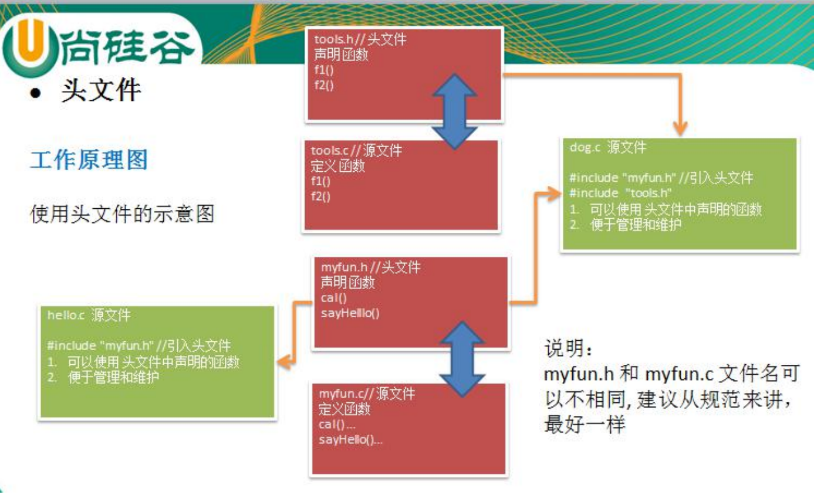

### 头文件快速入门

myfun.h

```c
#include <stdio.h>
//声明函数
int myCal(int n1, int n2, char oper);
void sayHello() ;
```

myfun.c

```c
//实现 int myCal(int n1, int n2, char oper)
int myCal(int n1, int n2, char oper) {
    //定义一个变量 res ,保存运算的结果
    double res = 0.0;
    switch(oper) {
        case '+' :
            res = n1 + n2;
            break;
        case '-':
            res = n1 - n2;
            break;
        case '*':
            res = n1 * n2;
            break;
        case '/':
            res = n1 / n2;
            break;
        default :
            printf("你的运算符有误~");
    }
    printf("\n%d %c %d = %.2f\n", n1, oper, n2, res);
    return res;
}
void sayHello() { //定义函数
    printf("say Hello");
}
```

hello.c

```c
#include <stdio.h>
//引入我们需要的头文件(用户头文件)
#include "myfun.h" 
#include "myfun.h" 
void main() {
    //使用 myCal 完成计算任务
    int n1 = 10;
    int n2 = 50;
    char oper = '-';
    double res = 0.0;
    //调用 myfun.c 中定义的函数 myCal
    res = myCal(n1, n2, oper);
    printf("\nres=%.2f", res);
    sayHello();
    getchar();
}
```

### 头文件的注意事项和细节说明

1) 引用头文件相当于复制头文件的内容

2) 源文件的名字 可以不和头文件一样，但是为了好管理，一般头文件名和源文件名一样. 

3) C 语言中 include <> 与 include "" 的区别
include <>：引用的是编译器的类库路径里面的头文件，用于引用系统头文件。
include ""：引用的是你程序目录的相对路径中的头文件，如果在程序目录没有找到引用的头文件则到编译器的
类库路径的目录下找该头文件，用于引用用户头文件。
所以：

* 引用 **系统头文件，两种形式都会可以，include <> 效率高**
* 引用 **用户头文件，只能使用 include ""** 

4) 一个 #include 命令只能包含一个头文件，多个头文件需要多个 #include 命令

5) 同一个头文件如果被多次引入，多次引入的效果和一次引入的效果相同，因为头文件在代码层面有防止重复引
入的机制 [举例]

6) 在一个被包含的文件(.c)中又可以包含另一个文件头文件(.h)

7) 不管是标准**头文件**，还是自定义头文件，都只能包含变量和函数的声明，**不能包含定义**，否则在多次引入时会
引起重复定义错误(!!!!)

## 函数调用过程

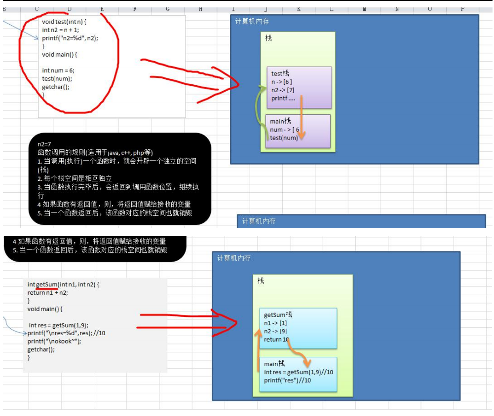

1. 当调用(执行)一个函数时，就会开辟一个独立的空间(栈)
2. 每个栈空间是相互独立
3. 当函数执行完毕后，会返回到调用函数位置，继续执行

4. 如果函数有返回值，则，将返回值赋给接收的变量

5. 当一个函数返回后，该函数对应的栈空间也就销毁


**递归调用**

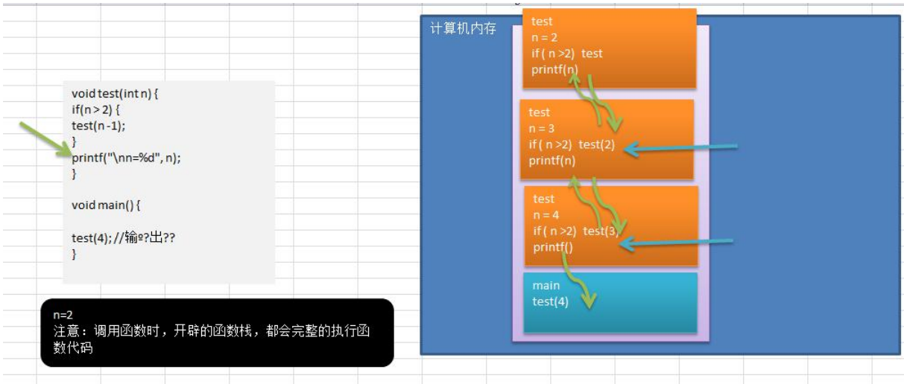

## 函数注意事项和细节讨论

1) 函数的形参列表可以是多个。

2) C 语言传递参数可以是值传递（pass by value），也可以传递指针（a pointer passed by value）也叫引用传递。

3) 函数的命名遵循标识符命名规范，首字母不能是数字，可以采用 驼峰法 或者 下划线法 ，比如 getMax()
get_max()。

4) 函数中的变量是局部的，函数外不生效【案例说明】

5) 基本数据类型默认是值传递的，即进行值拷贝。在函数内修改，不会影响到原来的值。【案例演示】

基本数据类型默认是值传递的，即进行值拷贝。在函数内修改，不会影响到原来的值

```c
void f2(int n) {
    n++;
    printf("\nf2 中的 n=%d", n); // n=10
}
void main() {
    //函数中的变量是局部的，函数外不生效
    //printf("num=%d", num);
    int n = 9;
    f2(n);
    printf("\nmain 函数中 n=%d", n); //9
    getchar();
}
```

6) 如果希望函数内的变量能修改函数外的变量，可以传入变量的地址&，函数内以指针的方式操作变量。从效果
上看类似引用(即传递指针)

```c
void f3(int *p) {
    (*p)++;// 修改会对函数外的变量有影响
}
void main() {
    //函数中的变量是局部的，函数外不生效
    //printf("num=%d", num);
    int n = 9;
    f3(&n);
    printf("\nmain 函数中 n=%d", n); //10
    getchar();
}
```


7) C 语言 不支持函数重载。

8) C 语言支持可变参数函数

```c
#include <stdarg.h>
int fun(int num, ...)
{
    int i, totalSum=0; //totalSum 一定要初始化
    int val = 0;
    va_list v1; //v1实际是一个字符指针，从头文件里可以找到
    va_start(v1, num); //使v1指向可变列表中第一个值，即num后的第一个参数
    printf("*v = %d\n",*v1);
    for(i = 0; i < num; i++) //num 减一是为了防止下标超限
    {
        val = va_arg(v1, int); //该函数返回v1指向的值，并使v1向下移动一个int的距离，使其指向下一个int 
        printf("res = %d\n", val);
        totalSum += val;
    } 
    va_end(v1); //关闭v1指针，使其指向null
    return totalSum;
}
```

int num 表示传递的参数个数 和 数据类型, 需要引入 include<stdarg.h>。

**课堂练习题**

请编写一个函数 swap(int *n1, int *n2) 可以交换 n1 和 n2的值

```c
#include <stdio.h>
void swap(int *n1, int *n2) {
    int temp = *n1; //表示将 n1 这个指针指向的变量的值赋给 temp
    *n1 = *n2; // 表示将 n2 这个指针指向的变量的值赋给 n1 这个指针指向的变量
    *n2 = temp; //表示将 temp 值赋给 n2 这个指针指向的变量
}
void main() {
    int n1 = 1;
    int n2 = 2;
    swap(&n1, &n2);
    printf("main n1=%d n2=%d", n1, n2);// n1= 2 n2 = 1
    getchar();
}
```

对上面代码的执行机制分析

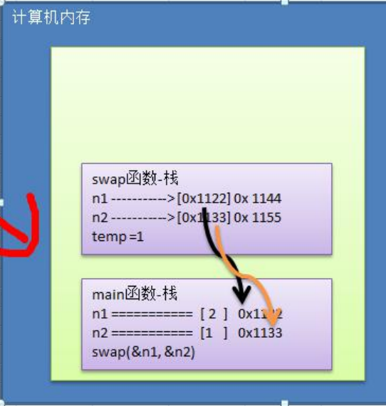

思考：

如果这样写：起不到交换作用

```c
void swap(int* n1, int* n2) {
    int temp = n1;
    n1 = n2;
    n2 = temp;
}
void main() {
    int n1 = 1;
    int n2 = 2;
    swap(&n1, &n2);
    printf("main n1=%d n2=%d", n1, n2);// n1= 1 n2 = 2
}
```

这样写也不行：

```c
void swap(int n1, int n2) {
    int temp = n1;
    n1 = n2;
    n2 = temp;
}
```

## 函数参数的传递方式

1) 值传递

2) 引用传递(传递指针、地址)

​		其实，不管是值传递还是引用传递，传递给函数的都是**变量的副本**，不同的是，值传递的是值的拷贝，引用传
递的是**地址的拷贝**，一般来说，**地址拷贝效率高**，因为数据量小，而值拷贝决定拷贝的数据大小，数据越大，效率
越低。


1) 值传递：变量直接存储值，内存通常在栈中分配

2) 默认是值传递的数据类型有 1. 基本数据类型 2. 结构体 3. 共用体 4. 枚举类型


3) 引用传递：变量存储的是一个地址，这个地址对应的空间才真正存储数据(值)

4) 默认是引用传递的数据类型有：指针和数组


​		如果希望**函数内的变量能修改函数外的变量**，可以**传入变量的地址&**，**函数内以指针的方式操作变量**(***指针**)。从效果上看类似引用 【案例演示: 画出示意图】, 
比如修改结构体的属性.


## 变量作用域

所谓变量作用域（Scope），就是指变量的有效范围

1) 函数**内部声明/定义的局部变量**，作用域仅限于**函数内部**。

```c
void sayHello() {
    char name[] = "tom";
    printf("hello %s \n", name);
}
void main() {
    sayHello();
    //这里我们不能使用到 sayHello 的 name 变量
    printf("name= %s", name); //这里将提示，没有定义 name
}
```

2) 函数的参数，形式参数，被当作该函数内的局部变量，如果与全局变量同名它们会优先使用局部变量(编译器
使用就近原则)

```c
#include <stdio.h>
n=20
void f10(int n) {
    printf("\nn=%d", n);
}
void main() {
    f10(10); // 输出就是 10
}
```

3) 在一个代码块，比如 for / if 中 的局部变量，那么这个变量的的作用域就在该代码块

4) **在所有函数外部定义的变量叫全局变量**，作用域在**整个程序**有效

通常可以将全局变量放在一个头文件中

### 初始化局部变量和全局变量

1) 局部变量，系统不会对其默认初始化，必须对局部变量初始化后才能使用，否则，程序运行后可能会异常退出. 

2) 全局变量，系统会自动对其初始化，如下所示

| 数据类型 | 默认初始化值 |
| -------- | ------------ |
| int      | 0            |
| char     | '\\0'        |
| float    | o.o          |
| double   | 0.0          |
| 指针     | NULL         |

```c
int a;
float f;
double d1;
void main() {
    printf("\na=%d f=%f d1=%f", a, f, d1);
    getchar();
    return ;
}
```

3) 正确地初始化变量是一个良好的编程习惯，否则有时候程序可能会产生意想不到
的结果，因为未初始化的变量会导致一些在内存位置中已经可用的垃圾值

**作用域的注意事项和细节**

1) 全局变量(Global Variable)保存在内存的**全局存储区**中，占用**静态的存储单元**，它
的作用域默认是整个程序，也就是所有的代码文件，包括源文件（.c文件）和头
文件（.h文件）。【c程序内存布局图!!!】

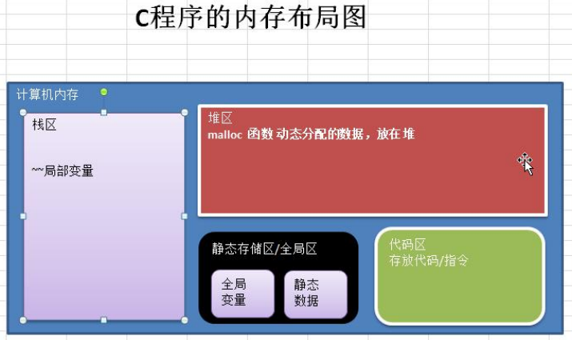

2) **局部变量**(Local Variable)保存在**栈**中，函数被调用时才动态地为变量分配存储单
元，它的作用域仅限于**函数内部**。【内存布局分析 】

3) C语言规定，**只能从小的作用域向大的作用域中去寻找变量**，而不能反过来，使
用更小的作用域中的变量

4) 在**同一个作用域，变量名不能重复**，在**不同的作用域，变量名可以重复**，使用
时编译器采用就近原则.

5) 由**{ }包围的代码块也拥有独立的作用域**

```c
void f20() { //函数, 定义变量就是局部变量
    int num = 90;
    if(1) {
        int num = 900; //ok
    }
    printf("a=%d", a);//90
}
```


**课堂练习题 1**

思考：下面的代码输出什么内容

```c
#include <stdio.h>
double price = 200.0; //全局变量
void test01() {
    printf("%.2f \n", price); // 就是 全局变量 ： 200.0
}
void test02() { //编译器采用就近原则
    double price = 250.0; // 如果把 这句话 改成 double price = 250.0 ， 输出有什么变化?
    printf("%.2f \n", price); // 250.0
}
void main() {//main 函数
    printf("main price=%.2f \n", price); // 200.00
    test01(); // 200.0
    test02(); // 250.0 , 将 全局 price 改成 250
    test01();// 200.0
    getchar();
}
```

**课堂练习题 2**

思考：下面的代码输出什么内容？

```c
#include <stdio.h>
int n = 10; //全局变量
void func1(){
    int n = 20; //局部变量
    printf("func1 n: %d\n", n); //
}
void func2(int n){
    printf("func2 n: %d\n", n); // n 是 形参 n
}
void func3(){
    printf("func3 n: %d\n", n); //n 是全局变量 n
}
int main(){
    int n = 30; //局部变量(main 函数)
    func1(); // 20
    func2(n); // 30
    func3(); //10
    //代码块由{}包围
    {
        int n = 40; //局部变量{}
        printf("block n: %d\n", n); // 40
    }
    printf("main n: %d\n", n); // 30
    getchar();
    return 0;
}
```


## static 关键字

### 局部变量使用 static 修饰

1) 局部变量被 static 修饰后，我们称为静态局部变量

2) 对应静态局部变量在声明时**未赋初值**，编译器也会把它**初始化为 0**。

3) 静态局部变量存储于进程的**静态存储区(全局性质)**，只会被初始一次，即使函数返回，它的值也会保持不变 [案例+图解]

```c
#include <stdio.h>
//void main() {
//
// static int n; //n 就是静态局部变量, 默认初始化值 0
// printf("\n n=%d", n);
// getchar();
//}
void fn(void){
    int n = 10; //普通变量, 每次执行都会初始化，n 在栈区,函数调用结束，栈就销毁
    printf("n=%d\n", n);
    n++;
    printf("n++=%d\n", n);
}
void fn_static(void) {
    static int n = 10; //静态局部变量， 放在静态存储区，全局性质空间
    printf("\nstatic n=%d\n", n); // 10
    n++; // n = 11
    printf("\nn++=%d\n", n); // 11
}
int main(void) {
    /* fn();// 10 11
printf("--------------------\n");*/
    fn_static();//10  11
    printf("--------------------\n");
    /* fn();////10  11
printf("--------------------\n");*/
    fn_static();//11 12
    getchar();
    return 0;
}
```

### 全局变量使用 static 修饰

1) 普通全局变量对整个工程可见，其他文件可以使用 extern 外部声明后直接使用。也就是说其他文件不能再定义
一个与其相同名字的变量了（否则编译器会认为它们是同一个变量），静态全局变量仅对当前文件可见，其他
文件不可访问，其他文件可以定义与其同名的变量，两者互不影响 [案例]

2) **定义不需要与其他文件共享的全局变量时**，加上 **static** 关键字能够有效地降低程序模块之间的耦合，避免不同
文件同名变量的冲突，且不会误使用

file01.c

```c
#include <stdio.h>
//在一个文件中，使用另外一个文件的全局变量, 使用 extern 引入即可
extern int num;
//extern int num2;//不能这样做
int num2 = 60;
void main() {
    printf("\nnum=%d num2=%d", num, num2);
    getchar();
}
```

file02.c

```c
int num = 10; //普通全局变量
static int num2 = 20; //静态全局变量, 只能在本文件中使用，而不能在其它文件使用
```


### 函数使用 static 修饰

1) 函数的使用方式与全局变量类似，在函数的返回类型前加上 static，就是静态函数

2) 非静态函数可以在另一个文件中通过 extern 引用 【案例】

3) 静态函数只能在声明它的文件中可见，其他文件不能引用该函数[案例]

4) 不同的文件可以使用相同名字的静态函数，互不影响[案例]

file03.c

```c
#include <stdio.h>
void fun1(void) {//普通函数(非静态函数)
    printf("hello from fun1.\n");
}
static void fun2(void) {//静态函数, 它只能在本文件中使用
    printf("hello from fun2.\n");
}
```

file04.c

```c
#include <stdio.h>
extern void fun1(void);
//extern void fun2(void);//不可以
void fun2() {
    //... 
}
void main() {
    fun1();
    //fun2();
    getchar();
}
```

## 字符串中常用的系统函数

**头文件 <string.h>**

1) 得到字符串的长度

size_t strlen(const char *str)
计算字符串 str 的长度，直到空结束字符，但不包括空结束字符。

2) 拷贝字符串

char *strcpy(char *dest, const char *src)
把 src 所指向的字符串复制到 dest。

3) 连接字符串

char *strcat(char *dest, const char *src)
把 src 所指向的字符串追加到 dest 所指向的字符串的结尾。

```c
#include <stdio.h>
#include <string.h> // 头文件中声明字符串相关的系统函数
void main() {
    char src[50] = "abc", dest[50]; //定义了两个字符数组(字符串) , 大小为 50
    char * str = "abcdff";
    printf("str.len=%d", strlen(str)); //统计字符串的大小
    //表示将 "hello" 拷贝到 src
    //注意，拷贝字符串会将原来的内容覆盖
    strcpy(src, "hello");
    printf("\s src=%s", src);
    strcpy(dest, "尚硅谷");
    //strcat 是将 src 字符串的内容连接到 dest ,但是不会覆盖 dest 原来的内容，而是连接!!
    strcat(dest, src); // "hello 尚硅谷" printf("最终的目标字符串： dest=%s", dest);
    getchar();
}
```

## 时间和日期相关函数

头文件是 <time.h>

1) 获取当前时间   char *ctime(const time_t *timer)

返回一个表示当地时间的字符串，当地时间是基于参数 timer。

```c
#include <stdio.h>
#include <time.h>
int main()
{
	time_t curtime;//结构体类型
	time(&curtime);//time()完成初始化
	
	printf("当前时间=%s",ctime(&curtime));
	return 0;
}
```


2) 编写一段代码来统计函数 test 执行的时间

double difftime(time_t time1, time_t time2)

返回 time1 和 time2 之间相差的秒数 (time1-time2)

```c
#include <stdio.h>
#include <time.h> //该头文件中，声明和日期和时间相关的函数
void test() { // 运行 test 函数，看看执行花费时间
    int i = 0;
    int sum = 0;
    int j = 0;
    for(i = 0; i < 77777777;i++) {
        sum = 0;
        for (j = 0; j< 10;j++) {
            sum += j;
        }
    }
}
int main () {
    //先得到执行 test 前的时间
    time_t start_t, end_t;
    double diff_t; //存放时间差
    printf("程序启动...\n");
    time(&start_t); //初始化得到当前时间
    test(); //执行 test
    //再得到执行 test 后的时间
    time(&end_t);//得到当前时间
    diff_t = difftime(end_t, start_t); //时间差，按秒 ent_t - start_t
    //然后得到两个时间差就是耗用的时间
    printf("执行 test()函数 耗用了%.2f 秒", diff_t);//1秒
    getchar();
    return 0;
}
```

## 数学相关函数

​		**math.h** 头文件定义了各种数学函数和一个宏。在这个库中所有可用的功能都带有一个 double 类型的参数，且都返
回 double 类型的结果

1) double exp(double x)
返回 e 的 x 次幂的值。

2) double log(double x)
返回 x 的自然对数（基数为 e 的对数）

3) double pow(double x, double y)
返回 x 的 y 次幂。

4) double sqrt(double x)
返回 x 的平方根。

5) double fabs(double x)
返回 x 的绝对值。

```c
#include <stdio.h>
#include <math.h>
void main (){
    double d1 = pow(2.0,3.0);
    double d2 = sqrt(5.0);
    printf("d1=%.2f", d1);
    printf("d2=%.2f", d2);
    getchar();
}
```

## 基本数据类型和字符串类型的转换

​		在程序开发中，我们经常需要将基本数据类型转成字符串类型(即 char 数组 )。或者将字符串类型转成基本数
据类型。

### **sprintf** 函数的用法

1) sprintf 和平时我们常用的 printf 函数的功能很相似。**sprintf** 函数打印到**字符串**中，而 printf 函数打印输出到**屏幕**
上。sprintf 函数在我们完成其他数据类型转换成字符串类型的操作中应用广泛

2) 该函数包含在 **stdio.h** 的头文件中


### 基本类型转字符串类型

```c
#include <stdio.h>
#include <stdlib.h>

int main () {
    char str1[20]; //字符数组，即字符串
    char str2[20];
    char str3[20];
    int a=20984,b=48090;
    double d=14.309948;
    //说明
    //1. sprintf 是一个系统函数，可以将结果存放到字符串中
    //2. 格式化的结果，会存放到 str1 中
    sprintf(str1,"%d %d",a,b);
    sprintf(str2, "%.2f", d);
    sprintf(str3, "%8.2f", d); //%8.2f 含义是格式化后，一共有 8 位，小数点后占用 2 位， 不够用空格占位
    printf("str1=%s str2=%s str3=%s", str1, str2, str3);
    system("pause");
    return 0;
}
```

### 字符串类型转基本数据类

语法：通过的函数调用 **atoi atof** 即可 ，案例演示

```c
#include <stdio.h>
#include <stdlib.h>
void main() {
    //字符数组
    char str[10] = "123456";
    char str2[10] = "12.67423";
    char str3[3] = "ab";
    char str4[4] = "111";
    //说明
    //1. atoi(str) 将 str 转成整数
    int num1 = atoi(str);
    short s1 = atoi(str4);
    //说明
    //1. atof(str2); 将 str2 转成小数
    double d = atof(str2);
    //说明
    //1. str3[0] 表示获取到 str3 这个字符串(数组)的第一个元素 'a' char c = str3[0];
    printf("num1=%d d=%f c=%c s1=%d", num1, d, c, s1);//
    getchar();
}
```


1) 在将 char 数组 类型转成 基本数据类型时，要确保能够转成有效的数据，比如 我们可以把 "123" , 转成一个
整数，但是不能把 "hello" 转成一个整数

2) 如果格式不正确，会默认转成 0 或者 0.0


# 预处理命令

​		预处理主要是处理以#开头的命令，例如#include <stdio.h>等。预处理命令要放在所有函数之外，而且一般都放
在源文件的前面

​		预处理是 C 语言的一个重要功能，由预处理程序完成。当对一个源文件进行编译时，系统将自动调用预处理程
序对源程序中的预处理部分作处理，处理完毕自动进入对源程序的编译

​		C 语言提供了多种预处理功能，如宏定义、文件包含、条件编译等，合理地使用它们会使编写的程序便于阅读、
修改、移植和调试，也有利于模块化程序设计


## 快速入门

​		开发一个 C 语言程序，让它暂停 5 秒以后再输出内容 "helllo, 尚硅谷!~"，并且要求跨平台，在 Windows 和
Linux 下都能运行，如何处理

提示

1) Windows 平台下的暂停函数的原型是 void Sleep(DWORD dwMilliseconds)，参数的单位是“毫秒”，位
于 <windows.h> 头文件。

2) Linux 平台下暂停函数的原型是 unsigned int sleep (unsigned int seconds)，参数的单位是“秒”，位于 <unistd.h>
头文件

3) #if、#elif、#endif 就是预处理命令，它们都是在编译之前由预处理程序来执行的。

```c
#include <stdio.h>
#if _WIN32 //如果是 windows 平台, 就执行 #include <windows.h>
#include <windows.h>
#elif __linux__ //否则判断是不是 linux ,如果是 linux 就引入<unistd.h>
#include <unistd.h>
#endif
int main() {
	//不同的平台下调用不同的函数
	#if _WIN32 //识别 windows 平台
	Sleep(5000); //毫秒
	#elif __linux__ //识别 linux 平台
	sleep(5); //秒
	#endif
	puts("hello, 尚硅谷~"); //输出
	getchar();
	return 0;
}
```


## 宏定义注意事项和细节

1) 宏定义是用宏名来表示一个字符串，在宏展开时又以该字符串取代宏名，这只是一种**简单的替换**。字符串中可
以含任何字符，它可以是常数、表达式、if 语句、函数等，预处理程序对它不作任何检查，如有错误，只能在
编译已被宏展开后的源程序时发现。

2) 宏定义不是说明或语句，在行末不必加分号，**如加上分号则连分号也一起替换**

3) 宏定义必须写在函数之外，其作用域为宏定义命令起到源程序结束。如要终止其作用域可使用#undef 命令 [案
例]

```c
#define PI 3.14159
int main(){
    printf("PI=%f", PI);
    return 0;
}
#undef PI //取消宏定义
void func(){
    // Code
    printf("PI=%f", PI);//错误,这里不能使用到 PI 了
}
```

4) **代码中的宏名如果被引号包围，那么预处理程序不对其作宏代替** 

```c
#include <stdio.h>
#define OK 100
int main(){
    printf("OK\n");
    return 0;
}
```

5) 宏定义**允许嵌套**，在宏定义的字符串中可以使用已经定义的宏名，在宏展开时由预处理程序层层代换 【案例】

```c
#define PI 3.1415926
#define S PI*y*y /* PI 是已定义的宏名*/
printf("%f", S);
//在宏替换后变为：
printf("%f", 3.1415926*y*y);
```

6) **习惯上宏名用大写字母表示**，以便于与变量区别。但也允许用小写字母

7) 可用宏定义表示数据类型，使书写方便 [案例]

```c
#define UINT unsigned int
void main() {
    UINT a, b; // 宏替换 unsigned int a, b;
}
```

8) **宏定义表示数据类型**和用 **typedef** **定义数据说明符**的区别：**宏定义只是简单的字符串替换，由预处理器来处理**,而 **typedef** **是在编译阶段由编译器处理的**，它并不是简单的字符串替换，而给原有的数据类型起一个新的名字，将它作为一种新的数据类型。

## 带参数的宏定义

1) C 语言允许宏带有参数。在宏定义中的参数称为“形式参数”，在宏调用中的参数称为“实际参数”，这点**和函数有些类似**

2) 对带参数的宏，在展开过程中不仅要进行字符串替换，还要用实参去替换形参

3) 带参宏定义的一般形式为 **#define 宏名(形参列表) 字符串** ,在字符串中可以含有各个形参

4) 带参宏调用的一般形式为 : **宏名(实参列表)**;

```c
#include <stdio.h>
//说明
//1. MAX 就是带参数的宏
//2. (a,b) 就是形参
//3. (a>b) ? a : b 是带参数的宏对应字符串，该字符串中可以使用形参
#define MAX(a,b) (a>b) ? a : b
int main(){
    int x , y, max;
    printf("input two numbers: ");
    scanf("%d %d", &x, &y);
    //说明
    //1. MAX(x, y); 调用带参数宏定义
    //2. 在宏替换时(预处理，由预处理器)， 会进行字符串的替换，同时会使用实参， 去替换形参
    //3. 即 MAX(x, y) 宏替换后 (x>y) ? x : y
    max = MAX(x, y);
    printf("max=%d\n", max);
    getchar();
    getchar();
    return 0;
}
```

**带参宏定义的注意事项和细节**

1) 带参宏定义中，形参之间可以出现空格，但是宏名和形参列表之间不能有空格出现

```c
#define MAX(a,b) (a>b)?a:b 如果写成了 #define MAX (a, b) (a>b)?a:b
将被认为是无参宏定义，宏名 MAX 代表字符串(a,b) (a>b)?a:b
而不是 : MAX(a,b) 代表 (a>b) ? a: b 了
```

2) 在带参宏定义中，不会为形式参数分配内存，因此不必指明数据类型。而在宏调用中，实参包含了具体的数据，
要用它们去替换形参，因此实参必须要指明数据类型

3) 在宏定义中，字符串内的形参通常要用括号括起来以避免出错。

```c
#include <stdlib.h>
#define SQ(y) (y)*(y) // 带参宏定义,字符串内的形参通常要用括号括起来以避免出错
int main(){
    int a, sq;
    printf("input a number: ");
    scanf("%d", &a);
    sq = SQ(a+1); // 宏替换 (a+1) * (a+1)
    printf("sq=%d\n", sq);
    system("pause");
    return 0;
}
```

## 带参宏定义和函数的区别

1) 宏展开仅仅是字符串的替换，不会对表达式进行计算；宏在编译之前就被处理掉了，它没有机会参与编译，也
不会占用内存。

2) 函数是一段可以重复使用的代码，会被编译，会给它分配内存，每次调用函数，就是执行这块内存中的代码

3) 案例说明 ：要求 使用函数计算平方值， 使用宏计算平方值， 并总结二者的区别

```c
#include <stdlib.h>
#include <stdio.h>
int SQ(int y){
    return ((y)*(y));
}
int main(){
    int i=1;
    while(i<=5){ // 1, 4, 9, 16, 25
        printf("%d^2 = %d\n", (i-1), SQ(i++));//先执行SQ(i++)
    }
    system("pause");
    return 0;
}
```


```c
#include <stdlib.h>
#include <stdio.h>
#define SQ(y) ((y)*(y))
int main(){
    int i=1;
    while(i<=5){ // 这里相当于计算了 1,3,5 的平方
        ////进入循环 3 次，得到的是 1 * 1 = 1 3 * 3 = 9 , 5 * 5 = 25
        // SQ(i++) 宏调用 展开 ((i++)*(i++))
        printf("%d^2 = %d\n", i, SQ(i++));
    }
    system("pause");
    return 0;
}
```


## 预处理命令总结

​		预处理指令是以#号开头的代码行，# 号必须是该行除了任何空白字符外的第一个字符。# 后是指令关键字，
在关键字和 # 号之间允许存在任意个数的空白字符，整行语句构成了一条预处理指令，该指令将在编译器进行编
译之前对源代码做某些转换

常见的预处理指令

| 指令      | 说明                                                       |
| --------- | ---------------------------------------------------------- |
| #         | 空指令，无任何效果                                         |
| \#include | 包含一个源代码文件                                         |
| \#define  | 定义宏                                                     |
| \#undef   | 取消已定义的宏                                             |
| \#if      | 如果给定条件为真，则编译下面代码                           |
| \#ifdef   | 如果宏已经定义，则编译下面代码                             |
| \#ifndef  | 如果宏没有定义，则编译下面代码                             |
| \#elif    | 如果前面的#if 给定条件不为真，当前条件为真，则编译下面代码 |
| \#endif   | 结束一个#if……#else 条件编译块                              |

预处理指令使用注意事项

1) 预处理功能是 C 语言特有的功能，它是在对源程序正式编译前由预处理程序完成的，程序员在程序中用预处理
命令来调用这些功能。

2) 宏定义可以带有参数，宏调用时是以实参代换形参，而不是“值传送”。

3) 为了避免宏代换时发生错误，宏定义中的字符串应加括号，字符串中出现的形式参数两边也应加括号。

4) 文件包含是预处理的一个重要功能，它可用来把多个源文件连接成一个源文件进行编译，结果将生成一个目标
文件。

5) **条件编译**允许只编译源程序中满足条件的程序段，使生成的目标程序较短，从而减少了内存的开销并提高了程序的效率。

6) 使用预处理功能便于程序的修改、阅读、移植和调试，也便于实现模块化程序设计


# 第9章 数组

## 快速入门案例

从终端循环输入 5 个成绩，保存到 double 数组,并输出

```c
#include <stdio.h>
void main() {
    /*
从终端循环输入 5 个成绩，保存到 double 数组,并输出
*/
    //定义数组和初始化数组的方式
    int arr2[3] = {10, 20, 80};
    //如果在定义时，直接就指定值，可以省略数组大小
    int arr3[] = {110, 220, 800};
    //定义一个数组
    double arr[5];
    int arrLen = sizeof(arr) / sizeof(double);
    int i;
    for(i = 0; i < arrLen; i++) {
        printf("\n 请输入一个小数");
        scanf("%lf", &arr[i]);
    }
    //输出整个数组
    printf("\n======================\n");
    for(i = 0; i < arrLen; i++) {
        printf("arr[%d]=%.2f ", i, arr[i]);
    }
    getchar(); //过滤回车
    getchar();
}
```


## 定义

C99标准规定了，数组可以是可变长度的

```c
类型 数组名[元素个数];
```


```c
int a[6];
```

1) **数组名 就代表 该数组的首地址** ，即 a[0]地址

2) **数组的各个元素是 连续分布的**， 假如 a[0] 地址 0x1122 a[1] 地址= a[0]的地址+int 字节数(4) = 0x1122 + 4 =0x1126,后面 a[2] 地址 = a[1]地址 + int 字节数(4) = 0x1126 + 4 = 0x112A, 依次类推

## 访问

下标从0开始

```c
数组名[下标]
```


## 初始化

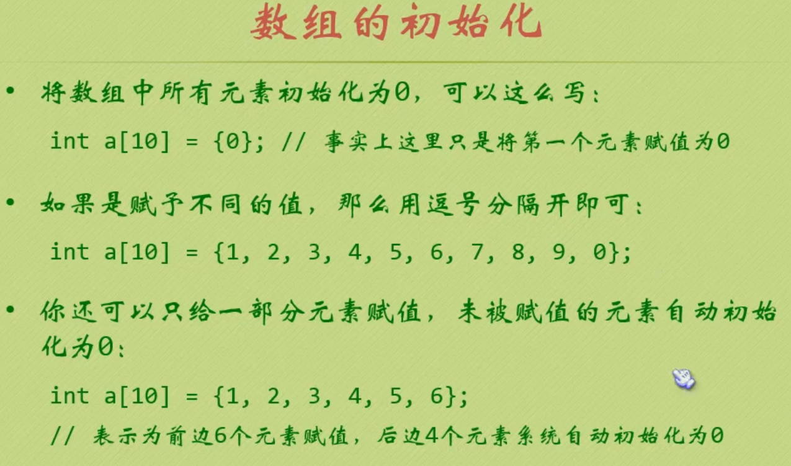


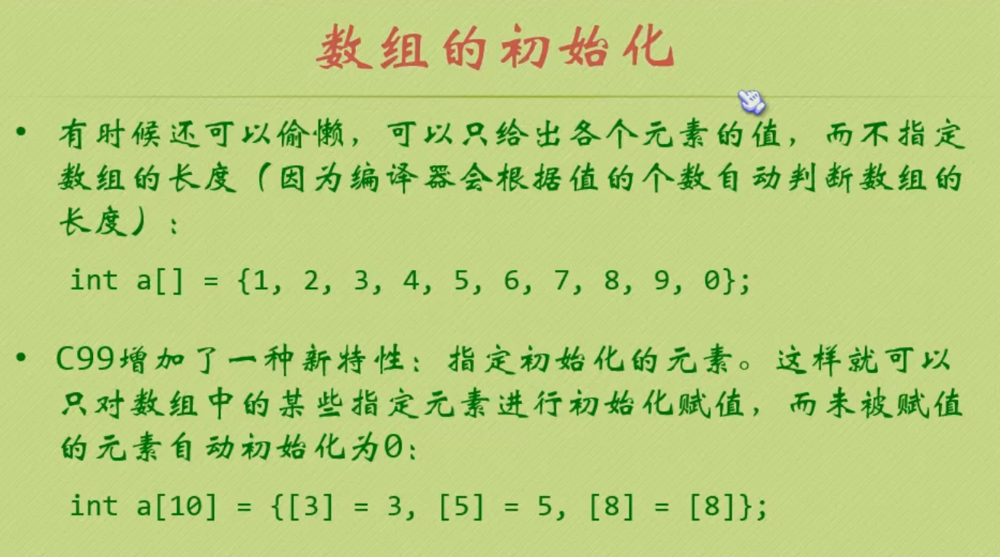

## 数组使用注意事项和细节

1) 数组是多个相同类型数据的组合,一个数组一旦声明/定义了,其长度是固定的, 不能动态变化。

2) 数组创建后，**如果没有赋值**，则遵守如下规则
**全局数组默认值 0**， **非全局数组初值是机器垃圾值**(即：原来系统分配给这块空间的值)

3) 使用数组的步骤 1. 定义数组 2 给数组各个元素赋值 3 使用数组, 也可以一步到位

4) 数组的下标是从 0 开始的, 不是从 1 开始。

5) 数组下标必须在指定范围内使用，编译通过，在运行时会因为数组越界而异常中断:
比如 int arr [5] 有效下标为 0-4

6) C 的数组属构造类型， 是引用传递(传递的是地址)，因此当把一个数组传递给一个函数时/或者变量，函数/变
量操作数组会影响到原数组. [内存图！！！.]

```c
#include <stdio.h>
void f1(int arr[]) {
    printf("\nf1 函数中 的 arr 的地址 = %p", arr);
    arr[0] = arr[0] + 1;
}
void main() {
    int arr[3] = {3,4,5};
    int i;
    printf("\nmain 函数中 的 arr 的地址 = %p", arr);
    //数组默认是以 地址传递(传递指针)
    f1(arr);
    //遍历 main 函数中的 arr
    for(i = 0; i < 3; i++) {
        printf("arr[%d]=%d ", i , arr[i]); // 4,4,5
    }
    getchar();
}
```


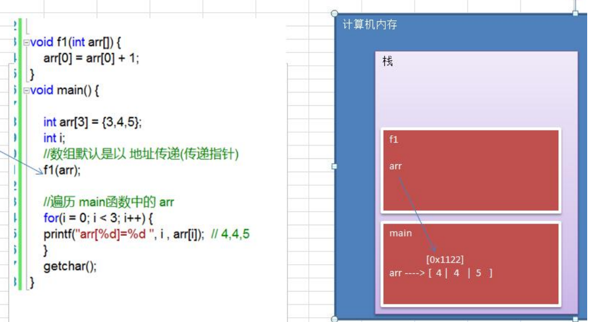


```c
#include <stdio.h>
int main()
{
        int a[10]={0};
        int i;
        for(i=0;i<10;i++){
                printf("%d\n",a[i]);
        }
        //printf("hello world");        
        return 0;
}
```

如果不初始化int a[10];

输出的就是乱七八糟的

```
324702368
32648
0
0
4195808
0
4195504
0
2116758304
32765
```

sizeof(a)；//计算数组的所占空间大小


## 字符数组

### 基本介绍

'\0'结尾

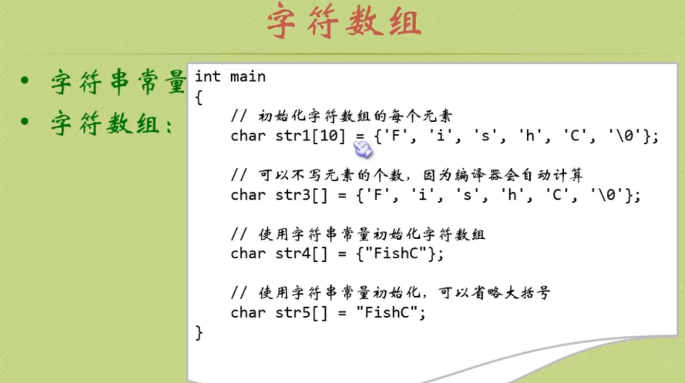

用来存放字符的数组称为字符数组

1) char a[10]; //一维字符数组, 长度为 10

2) char b\[5][10]; //二维字符数组, 后面我们详细介绍二维数组

3) char c[20]={'c', ' ', 'p', 'r', 'o', 'g', 'r', 'a','m'}; // 给部分数组元素赋值

​		字符数组实际上是一系列字符的集合，也就是字符串（String）。在 C 语言中，没有专门的字符串变量，没有
string 类型，通常就用一个字符数组来存放一个字符串

1) 在 C 语言中，**字符串实际上是使用 null 字符 ('\0') 终止的一维字符数组**。因此，一个以 null 结尾的字符串，
包含了组成字符串的字符。

2) '\0'是 ASCII 码表中的**第 0 个字符**，用 NUL 表示，称为**空字符**。该字符既不能显示，也不是控制字符，输出该
字符不会有任何效果，它在 C 语言中仅作为字符串的结束标志。

3) **字符数组(字符串)在内存中的布局分析**

\0后面的值是什么就不确定了

4) 思考 char str[3] = {'a','b','c'} 输出什么？ 为什么?

abc乱码，**因为要在后面找到一个\\0才结束输出**

char str[4] = {'a','b','c','\0'}这样就输出了abc

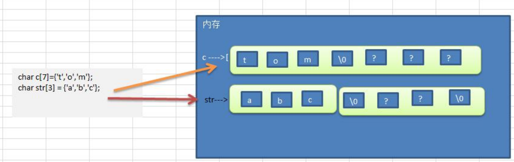

结论：如果在给某个字符数组赋值时，

(1)赋给的**元素的个数小于该数组的长度**，则会**自动在后面加 '\0'**, 表示
字符串结束，

(2)赋给的**元素的个数等于该数组的长度**，则**不会自动添加 '\0'** char str2[] = {'t','m','o'} 输出什么? 输出的是 tmo **乱码**

再如：

```c
char c[] = {'t','o','m'}; //这个后面也不会自动加\0
printf("%s\n", c);//tom乱码
```


```c
#include <stdio.h>
void main() {
    //c 是一个一维字符数组，给部分元素赋值
    char c[7]={'t','o','m'};
    char str[4] = {'a','b','c','\0'};
    char str2[] = {'j','a','c','k'}; // 这个后面系统也不会自动添加 '\0' //输出 c , 系统会这样处理
    //1. 从第一个字符开始输出，直到遇到 \0 , 表示该字符串结束
    printf("\nc=%s", c);
    printf("\nstr=%s", str); // abc?
    printf("\nstr2=%s", str2); // jack 乱码
    getchar();
}
```

### 字符串的访问和遍历

因为字符串的本质就是字符数组，因此可以按照数组的方式遍历和访问某个元素即可

```c
#include <stdio.h>
#include <string.h>
#include <stdlib.h>
void main() {
    char greeting[] = "Hello";
    int i;
    int len = strlen(greeting); // len = 5
    printf("\n greeting=%s", greeting);
    printf("\nlen=%d", len); //5
    printf("\n 字符串第 3 个字符是=%c", greeting[2]); //l
    printf("\n");
    for(i = 0; i < len; i++) {//遍历
        printf("%c ", greeting[i]); //H e l l o
    }
    system("pause");
}
```

对应的内存示意图

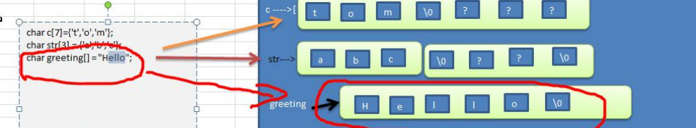


## 字符串的表示形式

**用字符数组存放一个字符串**

```c
char str[]="hello tom";
char str2[] = {'h', 'e'};
```

**用字符指针指向一个字符串**

```c
char* pStr=" hello tom";
```

1) C 语言对字符串常量" hello tom"是按字符数组处理的，在内存中开辟了一个字符数组用来存放字符串常量，程
序在定义字符串指针变量 str 时只是把字符串首地址（即存放字符串的字符数组的首地址）赋给 pStr

2) printf("%s\n",str); 可以输出 str 指向的字符串

3) 对应的内存布局图(!!)

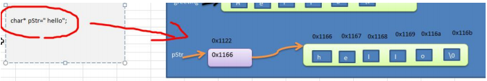


思考：C语言变量名在内存中是如何存放的？

https://www.cnblogs.com/y4247464/p/12573434.html

https://blog.csdn.net/ssff1/article/details/4998787

​		C 源码经过编译生成汇编代码时，就**没有变量名了**，所有的变量名到最后都变成了**内存地址**，汇编指令操作的是各种寄存器和内存地址

思考：内存地址如何理解？

​		在操作系统里面，程序的内存地址**并不是物理地址**，而且通过一个**基址+偏移量**的方式的计算得到的**虚拟地址**，操作系统为了更好的管理应用在内存这个层面做了很多抽象。

### 使用字符指针变量和字符数组两种方法表示字符串的讨论

1) 字符数组由若干个元素组成，每个元素放一个字符；而字符指针变量中存放的是地址（字符串/字符数组的首地址），绝不是将字符串放到字符指针变量中（是字符串首地址） [图]

2) 对字符数组只能对各个元素赋值，不能用以下方法对字符数组赋值

```c
char str[14];//str实际上是一个常量(数组的首地址常量，数组地址已经划分好了，不能动)
str=" hello tom"; //错误
str[0] = 'i'; //ok
```

3) 对字符指针变量，采用下面方法赋值, 是可以的

```c
char* a="yes";
a=" hello tom";
```

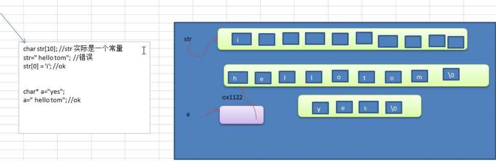

5) 如果定义了一个**字符数组**，那么它有**确定的内存地址**(即**字符数组名是一个常量**)；而定义一个**字符指针变量**时，
它**并未指向某个确定的字符数据，并且可以多次赋值**


```c
#include <stdio.h>
#include <string.h>
#include <stdlib.h>
int main() {
    char* a = "yes";
    printf("a本身的地址=%p a指向地址=%p\n", &a,a);
    a = "hello tom";
    printf("a本身的地址=%p a指向地址=%p\n", &a,a);
    printf("a=%s\n", a);//hello tom
    system("pause");
    return 0;
}
```


```
a本身的地址=0061FF2C a指向地址=00405044
a本身的地址=0061FF2C a指向地址=00405065
a=hello tom
```

## 字符串相关函数

s1:原字符串，s2:目标字符串

strlen(s1) 字符串长度

sizeof(s1) 字符串的大小（包含\0在内）

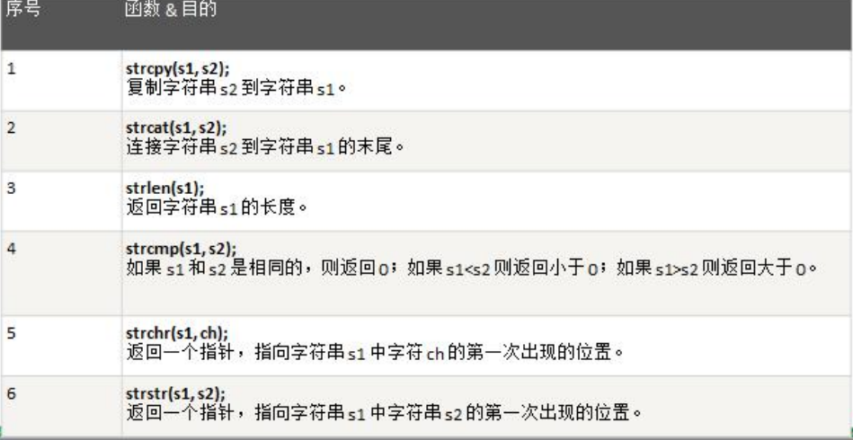


```c
#include <stdio.h>
#include <string.h>
void main() {
    char str1[12] = "Hello";
    char str2[12] = "World";
    char str3[12];
    int len ;
    /* 复制 str1 到 str3 */
    strcpy(str3, str1); // str3 内容 "Hello" 
    printf("strcpy( str3, str1) : %s\n", str3 ); //"Hello"
    /* 连接 str1 和 str2 */
    strcat( str1, str2);
    printf("strcat( str1, str2): %s\n", str1 ); //"HelloWorld"
    /* 连接后，str1 的总长度 */
    len = strlen(str1);//
    printf("strlen(str1) : %d\n", len );//10
    getchar();
}
```

## 字符串(字符数组)使用注意事项和细节

1) 程序中往往依靠检测 '\0' 的位置来判定字符串是否结束，而不是根据数组的长度来决定字符串长度。因此，字
符串长度不会统计 '\0', 字符数组长度会统计 [案例]

2) 在定义字符数组时应估计实际字符串长度，保证数组长度始终大于字符串实际长度， 否则，在输出字符数组
时可能出现未知字符. 

3) 系统对字符串常量也自动加一个'\0'作为结束符。例如"C Program”共有 9 个字符，但在内存中占 10 个字节，
最后一个字节'\0'是系统自动加上的。（通过 sizeof()函数可验证）

4) 定义字符数组时，如果 给的字符个数 比 数组的长度小，则系统会默认将剩余的元素空间，全部设置为 '\0', 比
如 char str[6] = "ab" , str 内存布局就是
\[a]\[b]\[\0]\[\0]\[\0][\0]

5) 字符数组定义和初始化的方式比较多，比如

```c
#include <stdio.h>
void main() {
    char str1[ ]={"I am happy"}; // 默认后面加 '\0' 
    char str2[ ]="I am happy"; // 省略{}号 ,默认后面加 '\0'
    char str3[ ]={'I',' ','a','m',' ','h','a','p','p','y'}; // 字符数组后面不会加 '\0', 可能有乱码
    char str4[5]={'C','h','i','n','a'}; //字符数组后面不会加 '\0', 可能有乱码
    char * pStr = "hello";//ok
    printf("\n str1=%s", str1);
    printf("\n str2=%s", str2);//ok
    printf("\n str3=%s", str3);//乱码
    printf("\n str4=%s", str4);//乱码
}
```

**练习**

```c
char str[ ];
str="I am happy";
题 1
错误，因为 str 是常量
```

## 二维数组

### 使用方式1:先定义在初始化

```c
语法: 类型 数组名[大小][大小];
比如: int a[2][3];
```

二维数组在内存的存在形式，各个元素的地址是连续分布的,即在前一个元素基础上+4

```c
#include <stdio.h>
void main() {
    //a[4][6] : 表示一个 4 行 6 列的二维数组
    int a[4][6]; // 没有初始化，则是分配的内存垃圾值
    int i, j;
    //全部初始化 0
    for(i = 0; i < 4; i++) { //先遍历行
        for(j = 0; j < 6; j++) {//遍历列
            a[i][j] = 0;
        }
    }
    a[1][2] = 1;
    a[2][1] = 2;
    a[2][3] = 3;
    //输出二维数组
    for(i = 0; i < 4; i++) {
        for(j = 0; j < 6; j++) {
            printf("%d ", a[i][j]);
        }
        printf("\n");
    }
    ////看看二维数组的内存布局
    printf("\n 二维数组 a 的首地址=%p", a);
    printf("\n 二维数组 a[0]的地址=%p", a[0]);
    printf("\n 二维数组 a[0][0]的地址=%p", &a[0][0]);
    printf("\n 二维数组 a[0][1]的地址=%p", &a[0][1]);
    //将二维数组的各个元素得地址输出
    printf("\n");
    for(i = 0; i < 4; i++) {
        printf("a[%d]的地址=%p ", i, a[i]);
        for(j=0; j < 6; j++) {
            printf("a[%d][%d]的地址=%p ", i, j , &a[i][j]);
        }
        printf("\n");
    }
}
```

二维数组的内存布局图

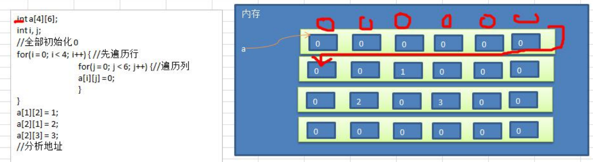

### 使用方式 2: 直接初始化

1) 定义 类型 数组名\[大小][大小] = {{值 1,值 2..},{值 1,值 2..},{值 1,值 2..}};

2) 或者 类型 数组名\[大小][大小] = { 值 1,值 2,值 3,值 4,值 5,值 6 ..};

### 二维数组的应用案例

定义二维数组，用于保存三个班，每个班五名同学成绩，并求出每个班级平均分、
以及所有班级平均分

```c
#include <stdio.h>
void main() {
    /*
定义二维数组，用于保存三个班，
每个班五名同学成绩，并求出每个班级平均分、以及所有班级平均分
分析
1. 创建一个 scores[3][5]
2. 遍历，给赋值
3. 再次遍历，统计总分和平均分
4. 输出
*/
    double score[3][5]; //
    int rows = sizeof(score) / sizeof(score[0]), cols = sizeof(score[0])/sizeof(double), i, j; //
    //classTotalScore 各个班级总成绩 totalScore 所有学生成绩
    double totalScore = 0.0, classTotalScore = 0.0;
    for (i = 0; i < rows; i++ ) {
        for (j = 0; j < cols ; j++ ) {
            score[i][j] = 0.0; //初始化
        }
    }
    //遍历，给每个学生输入成绩
    for (i = 0; i < rows; i++ ) {
        for (j = 0; j < cols ; j++ ) {
            printf("请输入第 %d 个班的 第 %d 个 学生的成绩", i + 1, j + 1);
            scanf("%lf", &score[i][j]);
        }
    }
    //getchar();
    //显示下成绩情况
    for (i = 0; i < rows; i++ ) {
        for (j = 0; j < cols ; j++ ) {
            printf("%.2f ",score[i][j]);
        }
        printf("\n");
    }
    //统计各个班的总成绩，和所有学生的总成绩
    for (i = 0; i < rows; i++ ) {
        classTotalScore = 0.0; // 每次清 0
        for (j = 0; j < cols ; j++ ) {
            classTotalScore += score[i][j]; //累计每个班的总成绩
        }
        printf("\n 第 %d 个班的平均成绩是 %.2f" , i+1, classTotalScore/cols );
        totalScore += classTotalScore; //将该班级的总分，累计到 totalScore
    }
    printf("\n 所有学生总成绩是 %.2f 平均成绩 %.2f" , totalScore, totalScore/(rows * cols));
}
```

### 二维数组使用细节和注意事项

1) 可以只对部分元素赋值，未赋值的元素自动取“零”值

```c
int a[4][5] = {{1}, {2}, {3},{1}};
```

2) 如果对全部元素赋值，那么第一维的长度可以不给出。

```c
int a[3][3] = {1, 2, 3, 4, 5, 6, 7, 8, 9};
可以写为：
int a[][3] = {1, 2, 3, 4, 5, 6, 7, 8, 9};
```

3) **二维数组可以看作是由一维数组嵌套而成的**；如果一个数组的每个元素又是一个数组，那么它就是二维数组。

```
二维数组 a[3][4]可看成三个一维数组，它们的数组名分别为 a[0]、a[1]、a[2]。
这三个一维数组都有 4 个元素，如，一维数组 a[0] 的元素为 a[0][0]、a[0][1]、a[0][2]、a[0][3]
```

# 断点调试

​		断点调试是指自己在程序的某一行设置一个断点，调试时，程序运行到这一行就会停住，然后你可以一步一
步往下调试，调试过程中可以看各个变量当前的值，出错的话，调试到出错的代码行即显示错误，停下。然后程序
可以进行分析从而找到这个 Bug

断点调试的快捷键

f5： 开始调试 、执行到下一个断点

f11: 逐句执行代码, 会进入到函数体中

f10: 逐过程执行(遇到函数，不会进入到函数体)

shift+f11: 跳出(跳出某个函数, 跳出前，会将该函数执行完)

shift+f5: 终止调试


```c
void main() {
    int sum = 0; //断点下在这里，然后使用 f10(逐过程执行， 可以看到各个变量的变化情况)
    int i = 0;
    for(i = 0; i < 10; i++) {
        sum += i;
        printf("\n i=%d", i);
        printf("\n sum=%d", sum);
    }
    printf("退出 for 循环了~~");
}
```

看一下数组越界的情况, 当数组越界后，会输出一个未知的值

```c
void main() {
    int arr[] = {1,2,3,4,5};
    int i = 0;
    int len = sizeof(arr) / sizeof(int);
    for(i = 0; i <= len; i++) {
        printf("\narr[%d]=%d", i, arr[i]);
    }
}
```

```

arr[0]=1
arr[1]=2
arr[2]=3
arr[3]=4
arr[4]=5
arr[5]=-858993460
```

# 指针

## 基本介绍

1) 指针是 C 语言的精华，也是 C 语言的难点。

2) 指针，也就是内存的地址；所谓指针变量，也就是**保存了内存地址的变量**。关于指针的基本使用，在讲变量的
时候做了入门级的介绍

3) **获取变量的地址，用&**，比如： int num = 10, 获取 num 的地址：&num

4) **指针类型，指针变量存的是一个地址**，这个地址指向的空间存的才是值
比如：int *ptr = \&num; ptr 就是指向 int 类型的指针变量, 即 ptr 是 int * 类型。

5) **获取指针类型所指向的值，使用：*(取值符号)**，比如：int * ptr , 使用*ptr 获取 ptr 指向的值


​		指针是一个变量，其值为另一个变量的地址(前示意图已经说明)，即，内存位置的直接地址。就像其他变量或
常量一样，在使用指针存储其他变量地址之前，对其进行声明。指针变量声明的一般形式为：

```c
int *ip; /* 一个整型的指针 */
double *dp; /* 一个 double 型的指针 */
float *fp; /* 一个浮点型的指针 */
char *ch; /* 一个字符型的指针 */
```

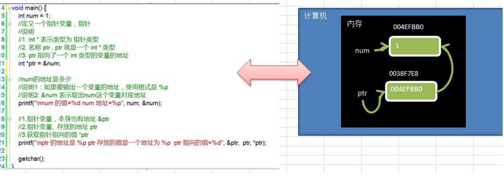

## 指针的算术运算

指针是一个用数值表示的地址。可以对指针执行算术运算。可以对指针进行四种算术运算：++、--、+、-。

### 指针递增操作(++)

```c
#include <stdio.h>
const int MAX = 3;//常量
int main () {
    int var[] = {10, 100, 200}; // int 数组
    int i, *ptr; // ptr 是一个 int* 指针
    ptr = var; // ptr 指向了 var 数组的首地址
    for ( i = 0; i < MAX; i++) {
        printf("var[%d] 地址= %p \n", i, ptr );
        printf("存储值：var[%d] = %d\n", i, *ptr );
        ptr++;// ptr = ptr + 1(1 个 int 字节数); ptr 存放值+4 字节(int)
    }
    return 0;
}
```

运行结果：

```
var[0] 地址= 0000001638EFF750
存储值：var[0] = 10
var[1] 地址= 0000001638EFF754
存储值：var[1] = 100
var[2] 地址= 0000001638EFF758
存储值：var[2] = 200
```


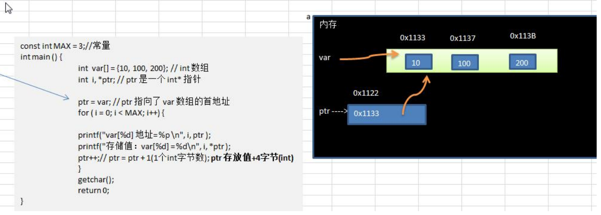

小结

- 数组在内存中是连续分布的
- 当对指针进行++时，指针会按照它指向的数据类型字节数大小增加，比如 int * 指针，每++ ， 就增加 4 个字
  节(老师的电脑), 【案例演示 int -> short】

### 指针递减操作(--)

和++同理

当对指针进行--时，指针会按照它指向的数据类型字节数大小减少，**比如 int * 指针**，**每--** ， **就减少 4 个字节**


### 指针+、-操作

可以对指针按照指定的字节数大小进行 + 或者 – 的操作，**可以快速定位你要的地址** 

```c
#include <stdio.h>
int main () {
    int var[] = {10, 100, 200};
    int i, *ptr;
    ptr = var; // 将 var 的首地址 赋给 ptr
    ptr += 2; // ptr 的存储的地址 + 2 个 int 的字节 (8 个字节)
    printf("var[2]=%d var[2]的地址=%p ptr 存储的地址=%p ptr 指向的值=%d", var[2], &var[2], ptr, *ptr);
    return 0;
}
```


```c
int main ()
{
    int var[] = {10, 100, 200, 400, 9, 12};
    int i, *ptr;
    ptr = &var[2]; // ptr 指向了 第 3 个元素
    ptr -= 2;
    printf("ptr 指向的值=%d", *ptr); // 10
    return 0;
}
```


## 指针的比较

​		指针可以用关系运算符进行比较，如 ==、< <= 和 > >=。如果 p1 和 p2 指向两个变量，比如同一个数组中
的不同元素，则可对 p1 和 p2 进行大小比较, 看下面代码，说明输出什么?

```c
#include <stdio.h>
int main () {
    int var[] = {10, 100, 200};
    int *ptr;
    ptr = var;//ptr 指向 var 首地址(第一个元素)
    //if(ptr == var[0]) {//错误,类型不一样 (int *) 和 (int )
    // printf("ok1");
    //}
    if(ptr == &var[0]) { // 可以
        printf("\nok2"); //输出
    }
    if(ptr == var) { //可以
        printf("\nok3"); //输出
    }
    if(ptr >= &var[1]) { //可以比较,但是返回 false
        printf("\nok4");//不会输出
    }
    return 0; 
}
```


```c
#include <stdio.h>
const int MAX = 3;
int main () {
    int var[] = {10, 100, 200};
    int i, *ptr;
    ptr = var;
    i = 0;
    while ( ptr <= &var[MAX - 2] )//&var[1]
    {
        printf("Address of var[%d] = %x\n", i, ptr );
        printf("Value of var[%d] = %d\n", i, *ptr );
        ptr++;
        i++;
    } //会输出 10 , 100
    getchar();
    return 0; }
```

## 指针数组

要让数组的元素 指向 int 或其他数据类型的地址(指针)。可以使用指针数组。

**数据类型 *指针数组名[大小];**

1) 比如： int *ptr[3];

2) ptr 声明为一个指针数组

3) 由 3 个整数指针组成。因此，ptr 中的每个元素，都是一个指向 int 值的指针。

```c
#include <stdio.h>
const int MAX=3;
int main ()
{
    int var[] = {10, 100, 200};
    int i, *ptr[3];
    for ( i = 0; i < MAX; i++)
    {
        ptr[i] = &var[i]; /* 赋值为整数的地址 */
    }
    for ( i = 0; i < MAX; i++) //指针数组来获取各个值
    {
        printf("Value of var[%d] = %d ptr[%d]本身的地址=%p \n ", i, *ptr[i] , i, &ptr[i]); // 10, 100, 200
    }
    getchar();
    return 0;
}
```

指针数组的内存布局

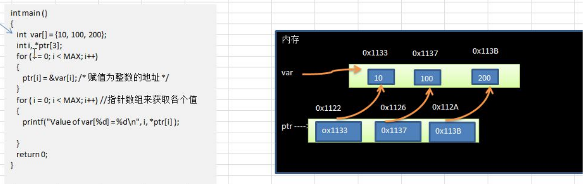


指针数组应用实例

​		请编写程序，定义一个指向字符的指针数组来存储字符串列表(四大名著书名)， 并通过遍历 该指针数组，显
示字符串信息 ， (即：定义一个指针数组，该数组的每个元素，指向的是一个字符串)

```c
#include <stdio.h>
void main() {
    //定义一个指针数组，该数组的每个元素，指向的是一个字符串
    char *books[] = {"三国演义", "西游记", "红楼梦", "水浒传" };
    char * pStr = "abc";
    //遍历
    int i, len = 4;
    for(i = 0; i < len; i++) {
        printf("\nbooks[%d] 指向字符串是=%s pStr 指向的内容=%s", i , books[i], pStr);
    }
}
```

## 指向指针的指针(多重指针)

​		指向指针的指针是一种多级间接寻址的形式，或者说是一个指针链。通常，一个指针包含一个变量的地址。当
我们定义一个指向指针的指针时，第一个指针包含了第二个指针的地址，第二个指针指向包含实际值的位置(如下
图)

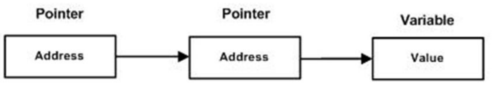

1) 一个指向指针的指针变量必须如下声明，即在变量名前放置两个星号。例如，下面声明了一个指向 int 类型指
针的指针:

**int \**ptr; // ptr 的类型是 int ****

2) 当一个目标值被一个指针间接指向到另一个指针时，访问这个值需要使用两个星号运算符, 比如 **ptr

快速入门案例

```c
#include <stdio.h>
int main () {
    int var;
    int *ptr; //一级指针
    int **pptr; //二级指针
    int ***ppptr; // 三级指针
    var = 3000;
    ptr = &var; // var 变量的地址赋给 ptr
    pptr = &ptr;// 表示将 ptr 存放的地址，赋给 pptr
    ppptr = &pptr; // 表示将 pptr 存放的地址，赋给 ppptr
    printf("var 的地址=%p var = %d \n", &var, var );// 0x1133 3000
    printf("ptr 的本身的地址=%p ptr 存放的地址=%p *ptr = %d \n", &ptr, ptr, *ptr );
    printf("pptr 本身地址 = %p pptr 存放的地址=%p **pptr = %d\n", &pptr, pptr, **pptr);
    printf("ppptr 本身地址 = %p ppptr 存放的地址=%p ***pptr = %d\n", &ppptr, ppptr, ***ppptr);
    return 0;
}
```


```
var 的地址=0061FF2C var = 3000
ptr 的本身的地址=0061FF28 ptr 存放的地址=0061FF2C *ptr = 3000
pptr 本身地址 = 0061FF24 pptr 存放的地址=0061FF28 **pptr = 3000
ppptr 本身地址 = 0061FF20 ppptr 存放的地址=0061FF24 ***pptr = 3000
```

（栈空间，内存地址从上往下，变大，数据从下面开始放）

对应的内存布局图

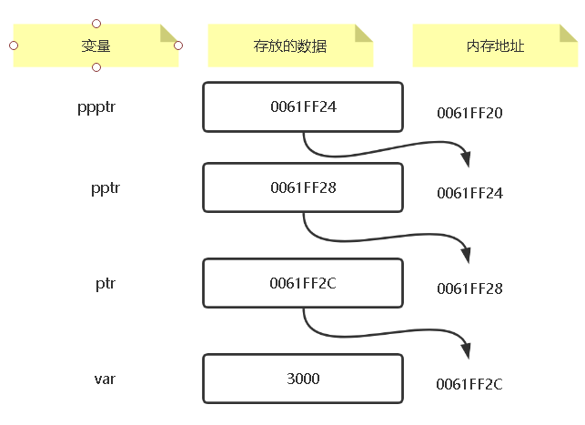

## 传递指针(地址)给函数

​		当函数的形参类型是指针类型时，是使用该函数时，需要传递指针，或者地址，或者数组给该形参

### 案例 1-传地址或指针给指针变量

```c
#include <stdio.h>
//test2函数写在main函数的后面就需要在这里声明，写在前面就不需要
void test2(int *p); //函数声明，接收 int *
int main() {
    int num=90;
    int *p = &num; //将 num 的地址赋给 p
    test2(&num); //传地址
    printf("\nmain() 中的 num=%d", num); //91
    test2(p); //传指针
    printf("\nmain() 中的 num=%d", num);//92
    return 0;
}
void test2(int *p) {
    *p += 1; //*p 就访问 num 的值
}
```

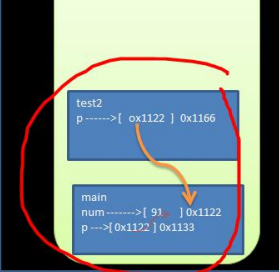

### 案例 2-传数组给指针变量

数组名本身就代表该数组首地址，因此传数组的本质就是传地址。

```c
#include <stdio.h>
/* 函数声明 */
double getAverage(int *arr, int size); //函数声明
double getAverage2(int *arr, int size); //函数声明
int main ()
{
    /* 带有 5 个元素的整型数组 */
    int balance[5] = {1000, 2, 3, 17, 50};
    double avg;
    /* 传递一个指向数组的指针作为参数 */
    avg = getAverage( balance, 5 ) ;
    /* 输出返回值 */
    printf("Average value is: %f\n", avg );
    getchar();
    return 0;
}
//说明
//1. arr 是一个指针，
double getAverage(int *arr, int size)
{
    int i, sum = 0;
    double avg;
    for (i = 0; i < size; ++i)
    {
        // arr[0] = arr + 0
        // arr[1] = arr + 1 个 int 字节（4）
        // arr[2] = arr + 2 个 int 字节（8）
        //... 
        sum += arr[i];// arr[0] =>数组第一个元素的地址 arr[1]
        printf("\narr 存放的地址=%p ", arr);
    }
    avg = (double)sum / size;
    return avg;
}
double getAverage2(int *arr, int size)
{
    int i, sum = 0;
    double avg;
    for (i = 0; i < size; ++i)
    {
        sum += *arr;
        printf("\narr 存放的地址=%p ", arr);
        arr++; // 指针的++运算, 会对 arr 存放的地址做修改
    }
    avg = (double)sum / size;
    return avg;
}
```

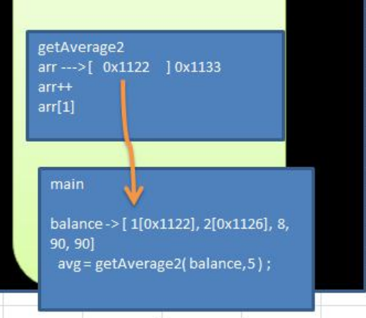

图中只是传递了数组首元素的地址，数组元素值没有传递

​		如果在 getAverage()函数中，通过指针修改了数组的值，那么 main 函数的 balance 数组的值是否会相应变化? 会的。因为 getVerage 函数中的指针，指向的就是 main 函数的数组. 

## 返回指针的函数

C 语言 允许函数的返回值是一个指针（地址），这样的函数称为指针函数。

### 快速入门案例

请编写一个函数 strlong()，返回两个字符串中较长的一个。

```c
#include <stdio.h>
#include <string.h>
char *strlong(char *str1, char *str2){ //函数返回的 char * (指针)
    printf("\nstr1 的长度%d str2 的长度%d", strlen(str1), strlen(str2));
    if(strlen(str1) >= strlen(str2)){
        return str1;
    }else{
        return str2;
    }
}
int main(){
    char str1[30], str2[30], *str; // str 是一个指针类型，指向一个字符串
    printf("\n 请输入第 1 个字符串");
    gets(str1);
    printf("\n 请输入第 2 个字符串");
    gets(str2);
    str = strlong(str1, str2);
    printf("\nLonger string: %s \n", str);
    return 0;
}
```

### 注意事项和细节

1) 用指针作为函数返回值时需要注意，函数运行结束后会销毁在它内部定义的所有局部数据，包括局部变量、局
部数组和形式参数，函数返回的指针不能指向这些数据【案例演示】

2) 函数运行结束后会销毁该函数所有的局部数据，这里所谓的销毁并不是将局部数据所占用的内存全部清零，而
是程序放弃对它的使用权限，后面的代码可以使用这块内存 【案例演示】


```c
#include <stdio.h>
int* fun() {
	int n = 100;//局部变量
	return &n;
}
int main() {
	int* p = fun();
	int n;
	n = *p;
	printf("value=%d", n);//能否输出100？
	return 0;
}
```

结果：

用VS2019运行结果是：value=100

并生成警告：warning C4172: 返回局部变量或临时变量的地址: n


在gcc编译器时，生成上述警告 warning: function returns address of local variable

且没有输出


```c
#include <stdio.h>
int* fun() {
	int n = 100;//局部变量
	return &n;
}
int main() {
	int* p = fun();
	int n;
	n = *p;
	printf("value=%d", n);//能否输出100？
	return 0;
}
```

在VS2019下：

```
ok
value=-858993460
```

3) **C** **语言不支持在调用函数时返回局部变量的地址，如果确实有这样的需求，需要定义局部变量为** **static** **变量**

```c
#include <stdio.h>
int* fun() {
	static int n = 100; // 如果这个局部变量是 static 性质的，那么 n 存放数据的空间在静态数据区
	return &n;
}
int main() {
	int* p = fun();
	int n;
	n = *p;
	printf("value=%d", n);//100
	return 0;
}
```

**应用实例**

​		编写一个函数，它会生成 10 个随机数，并使用表示指针的数组名（即第一个数组元素的地址）来返回它们。

```c
#include <stdio.h>
#include <stdlib.h>
//编写一个函数，返回一个一维数组
int * f1() {
    static int arr[10]; //必须加上 static ,让 arr 的空间在静态数据区分配
    int i = 0;
    for (i = 0; i < 10;i++) {
        arr[i] = rand();
    }
    return arr;
}
void main() {
    int *p;
    int i;
    p = f1(); //p 指向是在 f1 生成的数组的首地址(即第一个元素的地址)
    for ( i = 0; i <10; i++) {
        printf("\n%d", *(p+i));
    }
}
```

随机数种子没有变，所以运行几遍输出都是一样的

```

41
18467
6334
26500
19169
15724
11478
29358
26962
24464
```

## 函数指针（指向函数的指针）

1) 一个函数总是占用一段连续的内存区域，函数名在表达式中有时也会被转换为该函数所在内存区域的首地址，**这和数组名非常类似**。

2) **把函数的这个首地址（或称入口地址）赋予一个指针变量**，使指针变量指向函数所在的内存区域，然后通过指
针变量就可以找到并调用该函数。这种指针就是**函数指针**。

### 函数指针定义

returnType (*pointerName)(param list);

1) returnType 为函数指针指向的函数返回值类型

2) pointerName 为函数指针名称

3) param list 为函数指针指向的函数的参数列表

4) 参数列表中可以同时给出参数的类型和名称，也可以只给出参数的类型，省略参数的名称

5) 注意( )的优先级高于*，第一个**括号不能省略**，如果写作 returnType *pointerName(param list);就成了函数原型，
它表明函数的返回值类型为 returnType *

### 应用案例

用函数指针来实现对函数的调用, 返回两个整数中的最大值.

```c
#include <stdio.h>
//说明
//1. max 函数
//2. 接收两个 int ,返回较大数
int max(int a, int b){
    return a>b ? a : b;
}
int main(){
    int x, y, maxVal;
    //说明 函数指针
    //1. 函数指针的名字 pmax
    //2. int 表示 该函数指针指向的函数是返回 int 类型
    //3. (int, int) 表示 该函数指针指向的函数形参是接收两个 int
    //4. 在定义函数指针时，也可以写上形参名 int (*pmax)(int x, int y) = max;
    int (*pmax)(int , int ) = max; //
    printf("Input two numbers:");
    scanf("%d %d", &x, &y);
    // (*pmax)(x, y) 通过函数指针去调用 函数 max
    maxVal = (*pmax)(x, y);
    printf("Max value: %d pmax=%p pmax 本身的地址=%p\n", maxVal, pmax, &pmax);
    return 0;
}
```

```
Input two numbers:1 2
Max value: 2 pmax=00401410 pmax 本身的地址=0061FF20
```

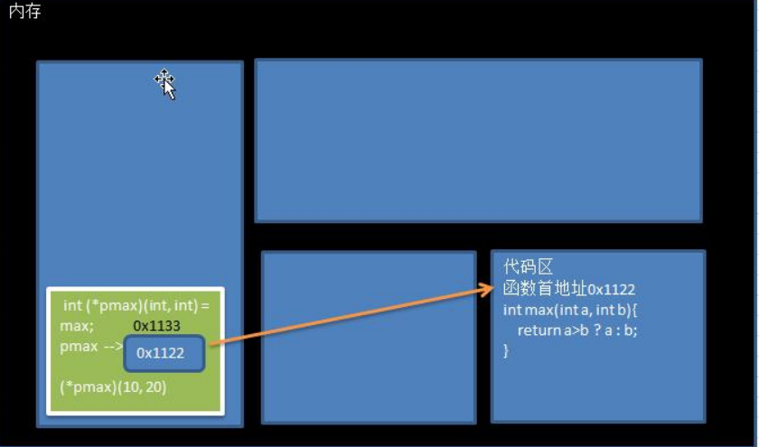


## 回调函数

1) **函数指针变量可以作为某个函数的参数来使用的**，回调函数就是一个通过函数指针调用的函数。

2) 简单的讲：回调函数是由别人的函数执行时调用你传入的函数（通过函数指针完成）

**应用实例**

使用回调函数的方式，给一个整型数组 int arr[10] 赋 10 个随机数. 

```c
#include <stdlib.h>
#include <stdio.h>
// 回调函数
//1. int (*f)(void)
//2. f 就是 函数指针 , 它可以接收的函数是 (返回 int ,没有形参的函数)
//3. f 在这里被 initArray 调用，充当了回调函数角色
void initArray(int *array, int arraySize, int (*f)(void)) {
    int i ;
    //循环 10
    for ( i=0; i<arraySize; i++) {
        array[i] = f(); //通过 函数指针调用了 getNextRandomValue 函数
    }
}
// 获取随机值
int getNextRandomValue(void) {
    return rand();//rand 系统函数， 会返回一个随机整数
}
int main(void) {
    int myarray[10],i; //定义一个数组和 int
    //说明
    //1. 调用 initArray 函数
    //2. 传入了一个函数名 getNextRandomValue (地址), 需要使用函数指针接收
    initArray(myarray, 10, getNextRandomValue);
    //输出赋值后的数组
    for(i = 0; i < 10; i++) {
        printf("%d ", myarray[i]);
    }
    printf("\n");
    getchar();
    return 0;
}
```

## 指针的注意事项和细节

能够使用到地址的地方都可以用地址

1) 指针变量存放的是地址，从这个角度看**指针的本质就是地址**。

2) 变量声明的时候，如果**没有确切的地址赋值**，为指针变量赋一个 **NULL** 值是好的编程习惯。

3) 赋为 NULL 值的指针被称为空指针，NULL 指针是一个定义在标准库 **<stdio.h>**中的值为零的常量 **#define**
**NULL 0** [案例]

C标准库空指针定义的位置：

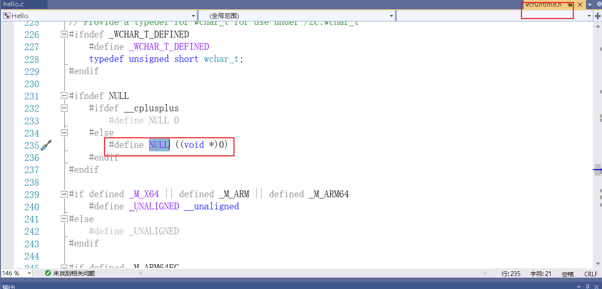

4) 指针使用一览 (见后)

```c
#include <stdio.h>
void main() {
    int *p = NULL; // p 空指针
    int num = 34;
    p = &num;
    printf("*p=%d", *p); // 34
    getchar();
}
```

## 动态内存分配

### C 程序中，不同数据在内存中分配说明

1) **全局变量**——内存中的**静态存储区**

2) **非静态的局部变量**——内存中的**动态存储区**——**stack 栈**

3) **临时使用的数据**---建立**动态内存分配区域**，需要时**随时开辟，不需要时及时释放**——**heap 堆**

4) 根据需要向系统申请所需大小的空间，由于未在声明部分定义其为变量或者数组，不能通过变量名或者数组名
来引用这些数据，只能通过指针来引用）

### 内存动态分配的相关函数

1) 头文件 #include <stdlib.h> 声明了四个关于内存动态分配的函数

2) 函数原型 void * malloc（usigned int size） //**m**emory **alloc**ation

-  作用——在内存的动态存储区(堆区)中分配一个长度为 size 的连续空间。
-  形参 size 的类型为无符号整型，函数返回值是所分配区域的第一个字节的地址，即此函数是一个指针型函数，
  **返回的指针指向该分配域的开头位置**。
- malloc(100); 开辟 100 字节的临时空间，返回值为其第一个字节的地址

3) 函数原型 void *calloc（unsigned n,unsigned size）

- 作用——在内存的动态存储区中分配 **n 个长度为 size 的连续空间**，这个空间一般比较大，**足以保存一个数组**
-  用 calloc 函数可以为一维数组开辟动态存储空间，n 为数组元素个数，每个元素长度为 size. 
-  函数返回指向所分配域的起始位置的指针；分配不成功，返回 NULL。
- p = calloc(50, 4); //开辟 50*4 个字节临时空间，把起始地址分配给指针变量 p

4) 函数原型：void free（void *p）

- 作用——释放变量 p 所指向的动态空间，使这部分空间能重新被其他变量使用。
- p 是最近一次调用 calloc 或 malloc 函数时的函数返回值

- free 函数无返回值
-  free(p); // 释放 p 所指向的已分配的动态空间

5) 函数原型 void *realloc（void *p，unsigned int size)

-  作用——重新分配 malloc 或 calloc 函数获得的动态空间大小，将 p 指向的动态空间大小改变为 size，p 的值不
  变，分配失败返回 NULL
- realloc(p, 50); // 将 p 所指向的已分配的动态空间 改为 50 字节

6) 返回类型说明

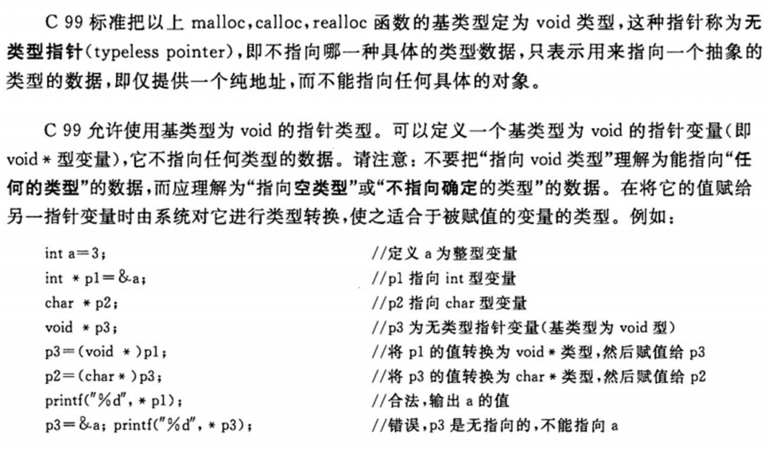

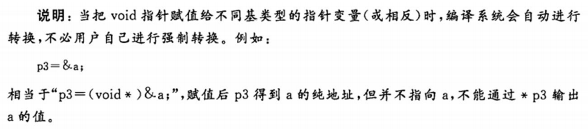

### 应用实例

动态创建数组，输入 5 个学生的成绩，另外一个函数检测成绩低于 60 分的，输出不合格的成绩。

```c
#include <stdlib.h>
#include <stdio.h>
void check(int *p) {
    int i;
    printf("\n 不及格的成绩 有: ");
    for(i =0; i < 5; i++){
        if(p[i] < 60) {
            printf(" %d ", p[i]);
        }
    }
}
int main() {
    void check(int *);
    int * p,i;
    // 在堆区开辟一个 5 * 4 的空间，并将地址 (void *） ， 转成 (int *) , 赋给 p
    p = (int *)malloc(5*sizeof(int));
    for( i = 0; i < 5; i++){
        scanf("%d", p + i);
    }
    check(p);
    free(p); //销毁 堆区 p 指向的空间
    return 0;
}
```

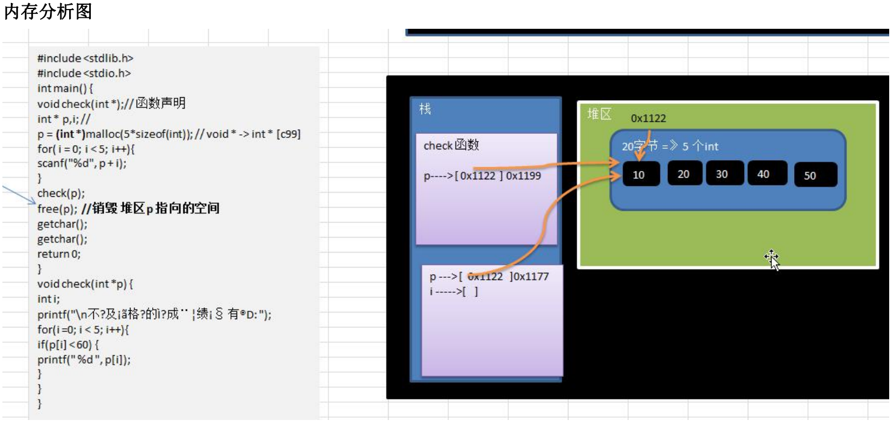

### 动态分配内存的基本原则

1) **避免分配大量的小内存块**。分配堆上的内存有一些系统开销，所以分配许多小的内存块比分配几个大内存块的
系统开销大

2) 仅在需要时分配内存。只要使用完堆上的内存块，就需要**及时释放**它(如果使用动态分配内存，需要遵守原则：
**谁分配，谁释放**)， 否则可能出现**内存泄漏**

3) 总是确保释放以分配的内存。在编写分配内存的代码时，就要确定在代码的什么地方释放内存

4) 在释放内存之前，确保不会无意中覆盖堆上已分配的内存地址，否则程序就会出现内存泄漏。在循环中分配内
存时，要特别小心

5) 指针使用一览

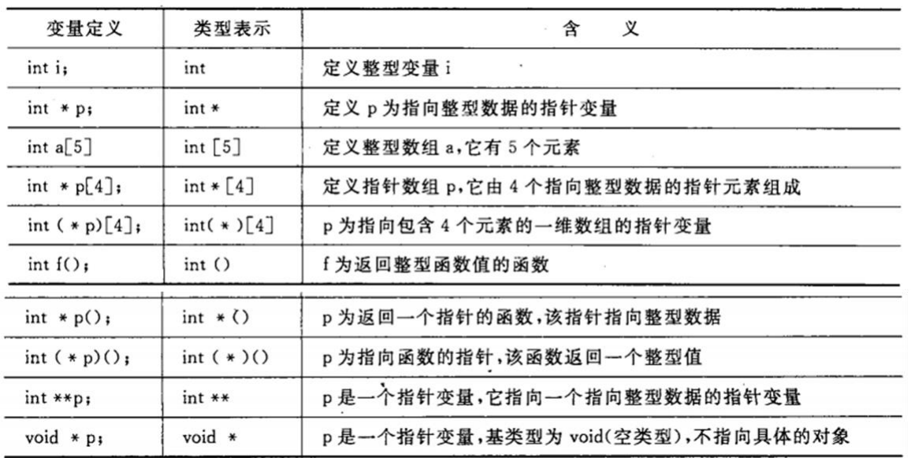

# 结构体和共用体

## 结构体

```c
struct tag { 
    member-list
    member-list 
    member-list  
    ...
} variable-list ;
```

结构体：标签、成员属性、结构变量三者中至少出现2个

```
结构体==>类
结构体名称（标签）==>类名
结构体变量==>类的实例
不写结构体名称==>匿名类
```


### 快速入门

面向对象的方式(struct)解决养猫问题

​		张老太养了两只猫猫:一只名字叫小白,今年 3 岁,白色。还有一只叫小花,今年 100 岁,花色。
请编写一个程序，当用户输入小猫的名字时，就显示该猫的名字，年龄，颜色。
如果用户输入的小猫名错误，则显示 张老太没有这只猫猫。

分析：

 猫猫有 三个成员(变量)组成  使用结构体解决

创建 结构体 Cat 【是数据类型】

```c
#include <stdio.h>
void main() {
    struct Cat { // 结构体名 Cat, Cat 就是我们自己构造的一个数据类型
        char * name; //名字，使用指针，指向一个字符串
        int age; //年龄
        char *color; //颜色
    };
    //使用 Cat 结构体，创建变量
    struct Cat cat1; // cat1 就是 struct Cat 的一个变量
    struct Cat cat2; // cat2 就是 struct Cat 的一个变量
    //给 cat1 的各个成员赋值
    cat1.name = "小白";
    cat1.age = 3;
    cat1.color = "白色";
    //给 cat2 的各个成员赋值
    cat2.name = "小花";
    cat2.age = 100;
    cat2.color = "花色";
    //输出两只猫的信息
    printf("\n 第 1 只猫 name=%s age=%d color=%s", cat1.name, cat1.age, cat1.color);
    printf("\n 第 2 只猫 name=%s age=%d color=%s", cat2.name, cat2.age, cat2.color);
}
```

结构体和结构体变量的区别和联系

1) 结构体是自定义的数据类型，表示的是一种数据类型. 

2) 结构体变量代表一个具体变量，好比

```c
int num1 ; // int 是数据类型, 而 num1 是一个具体的 int 变量
struct Cat cat1; // Cat 是结构体数据类型， 而 cat1 是一个 Cat 变量
```

3) Cat 就像一个“模板”，定义出来的结构体变量都含有相同的成员。也可以将结构体比作“图纸”，将结构体
变量比作“零件”，根据同一张图纸生产出来的零件的特性都是一样的

### 结构体变量在内存的布局

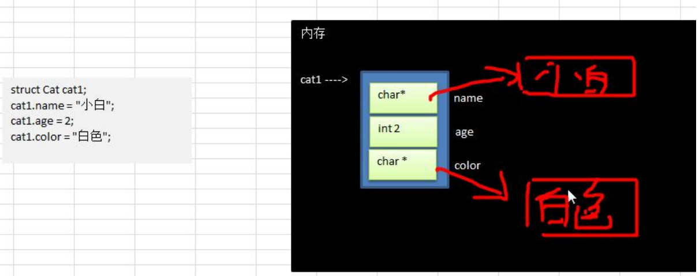

### 如何声明结构体

```c
struct 结构体名称 { // 结构体名首字母大写，比如 Cat, Person
    成员列表;
};
```

举例:

```c
struct Student{
    char *name; //姓名
    int num; //学号
    int age; //年龄
    char group; //所在学习小组
    float score; //成绩
};
```

### 成员

1) 从叫法上看：有些书上称为成员, 有些书说 结构体包含的变量

2) 成员是结构体的一个组成部分，一般是基本数据类型、也可以是数组、指针、结构体等 。比如我们前面定义
Cat 结构体 的 int age 就是一个成员。

注意事项和细节说明

1) 成员声明语法同变量，示例： 数据类型 成员名;

2) 字段的类型可以为**：基本类型、数组或指针、结构体**等

3) 在创建一个结构体变量后，需要给成员赋值，如果没有赋值就使用可能导致程序异常终止。

```c
#include <stdio.h>
int main() {
    struct Cat{ // 结构体名字建议首写字母大写
        char *name; //名字 , 这里需要使用指针类型
        int age; //年龄
        char *color; // 颜色
    };
    struct Cat cat1; //定义了一个结构体变量 cat1
    printf("\n 名字=%s 年龄=%d 颜色=%s ", cat1.name, cat1.age, cat1.color);
    return 0;
}
```

4) 不同结构体变量的成员是独立，互不影响，一个结构体变量的成员 更改，不影响另外一个。

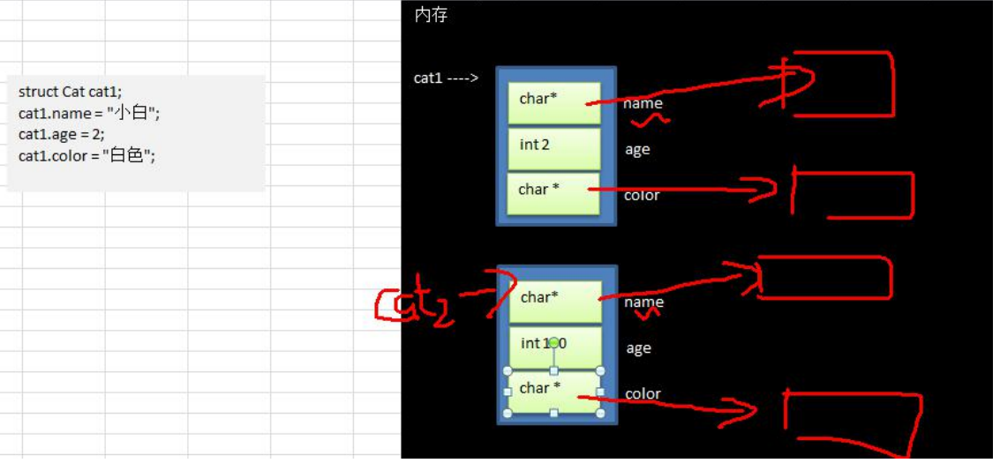

### 创建结构体和结构体变量


1) 方式 1-先定义结构体，然后再创建结构体变量

```c
struct Stu{
    char *name; //姓名
    int num; //学号
    int age; //年龄
    char group; //所在学习小组
    float score; //成绩
};
struct Stu stu1, stu2;//注意关键字 struct 不能少
```

2) 方式 2-在定义结构体的同时定义结构体变量

```c
struct Stu{
    char *name; //姓名
    int num; //学号
    int age; //年龄
    char group; //所在学习小组
    float score; //成绩
} stu1, stu2;
//在定义结构体 Stu 的同时，创建了两个结构体变量 stu1 和 stu2
```

3) 方式 3-如果只需要 stu1、stu2 两个变量，后面不需要再使用结构体数据类型，定义其他变量，在定义时也可
以不给出结构体名

```c
struct { //没有写 Stu
    char *name; //姓名
    int num; //学号
    int age; //年龄
    char group; //所在学习小组
    float score; //成绩
} stu1, stu2;
stu1.name = "tom"; stu1.num = 100;.... //1. 该结构体数据类型，没有名, 匿名结构体
    //2. stu1 和 stu2 就是 该结构体的两个变量
```

### 成员的获取和赋值

​		结构体和数组类似，也是一组数据的集合，整体使用没有太大的意义。数组使用下标[ ]获取单个元素，结构体
使用点号.获取单个成员。获取结构体成员的一般格式为
结构体变量名.成员名;

案例 1

```c
struct{
    char *name; //姓名
    int num; //学号
    int age; //年龄
    char group; //所在小组
    float score; //成绩
} stu1;
stu1.name = "jack";
printf("%s", stu1.name);
```

案例 2

```c
#include <stdio.h>
int main() {
    struct Student{
        char *name; //姓名
        int num; //学号
        int age; //年龄
        char group; //所在小组
        float score; //成绩
    } stu1 = {"贾宝玉", 11, 18, 'B', 90.50}, stu2 = { "林黛玉", 12, 16, 'A', 100 };
    struct Student stu3 = {"林黛玉 2", 12, 16, 'A', 100 }; //在定义结构体变量时，整体赋值，需要对应
    struct Student stu4;
    //stu4 = {"林黛玉 2", 12, 16, 'A', 100 }; // 这样赋值不可以
    //stu4.name = "smith";
    printf("\n stu1.name=%s", stu1.name);
    printf("\n stu3.name=%s", stu3.name);//
    return 0;
}
```

## 结构体应用实例

步骤

1) 声明(定义)结构体，确定结构体名

2) 编写结构体的成员

3) 编写处理结构体的函数

**小狗案例**

1) 编写一个 Dog 结构体，包含 name(char[10])、age(int)、weight(double)属性

2) 编写一个 say 函数，返回字符串，方法返回信息中包含所有成员值。

3) 在 main 方法中，创建 Dog 结构体变量，调用 say 函数，将调用结果打印输出

```c
#include <stdio.h>
//定义 Dog 结构体
struct Dog {
    char * name;
    int age;
    double weight;
};
//say 函数，返回字符串，信息中包含所有成员值
char * say(struct Dog dog) {
    //将这个信息放入到一个字符串(字符数组)
    static char info[50]; //局部静态变量
    sprintf(info, "name=%s age=%d weight=%.2f", dog.name, dog.age, dog.weight);
    dog.name = "小花";
    return info;
}
int main() {
    //测试
    //定义结构体变量
    struct Dog dog;
    char * info = NULL;
    dog.name = "小黄";
    dog.age = 1;
    dog.weight = 3.4;
    info = say(dog); //结构体变量默认是值传递
    printf("\n 小狗信息=%s", info);
    printf("\n main 小狗名字=%s", dog.name);
    return 0;
}
```

**盒子案例**

​		编程创建一个 Box 结构体，在其中定义三个成员表示一个立方体的长、宽和高，长宽高可以通过控制台输入。
定义一个函数获取立方体的体积(volume)。
创建一个结构体，打印给定尺寸的立方体的体积。

```c
#include <stdio.h>
struct Box {
    double len;
    double width;
    double height;
    double volumn;//体积
};
double volume(double len, double width, double height) {
    return len * width * height;
}
int main() {
    struct Box box;
    scanf("%lf%lf%lf",&box.len,&box.width,&box.height);
    box.volumn = volume(box.len, box.width, box.height);
    printf("体积=%.0f\n", box.volumn);
    return 0;
}
```

**景区门票案例**

1) 一个景区根据游人的年龄收取不同价格的门票。

2) 请编写游人结构体(Visitor)，根据年龄段决定能够购买的门票价格并输出

3) 规则：年龄>18 , 门票为 20 元，其它情况免费。

4) 可以循环从控制台输入名字和年龄，打印门票收费情况, 如果名字输入 n ,则退出程序。

```c
#include <stdio.h>
#include <string.h>
struct Visitor {
    char name[10];
    int age;
    double pay; //应付票价
};
//编写函数处理业务
//说明：因为结构体默认是值传递，会拷贝一份完整数据，效率较低
// 因此，为了提高效率，我们直接接收地址(指针)
void ticket(struct Visitor * visitor) {
    //判断
    if( (*visitor).age > 18) {
        (*visitor).pay = 20;
    } else {
        (*visitor).pay = 0;
    }
}
int main() {
    //测试
    //创建结构体变量(创建一个游客)
    struct Visitor visitor;
    //循环的输入名字和年龄
    while(1) {
        printf("\n 请输入游客名字");
        scanf("%s", visitor.name);
        //判断如果名字输入 n ,则退出程序
        if(!strcmp("n", visitor.name) ) {
            break;
        }
        printf("\n 请输入游客年龄");
        scanf("%d", &visitor.age);
        //调用函数 ticket ， 获取应付的票价
        ticket(&visitor);
        printf("\n 该游客应付票价=%.2f", visitor.pay);
    }
    printf("退出程序");
}
```

# 共用体

### 需求

​		现有一张关于学生信息和教师信息的表格。学生信息包括姓名、编号、性别、职业、分数，教师的信息包括姓
名、编号、性别、职业、教学科目。请看下面的表格：

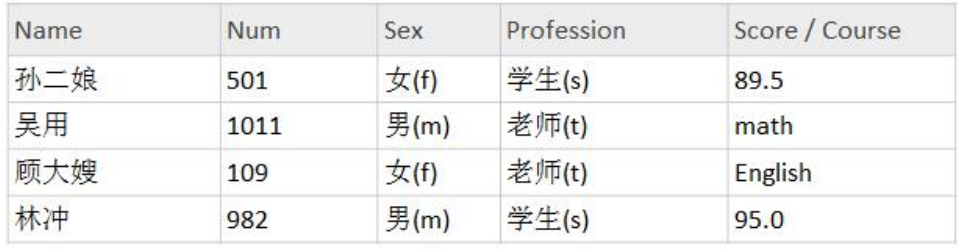

传统的方式来解决

定义结构体，根据人员的职业，使用对应的成员变量。

```c
struct Person{
    char name[20];
    int num;
    char sex;
    char profession;
    float score; // 学生使用 score
    char course[20]; // 老师使用 course
};
```

传统方式的问题分析 : 会造成 空间的浪费 , 比如学生只使用 score ,但是 也占用了 course 成员的 20 个字节. 

解决方案

1) 做 struct Stu 和 struct Teacher [但如果职业很多，就会对应多个结构体类型, 不利于管理]

2) 使用共用体


​		 共用体（Union）属于 构造类型，它可以包含多个类型不同的成员。和结构体非常类似, 但是也有不同的地方. 共用体有时也被称为联合或者联合体, 定义格式为

```c
union 共用体名{
    成员列表
};
```

​		结构体和共用体的区别在于：结构体的各个成员会占用不同的内存，互相之间没有影响；而共用体的**所有成员占用同一段内存，修改一个成员会影响其余所有成员**

### 快速入门

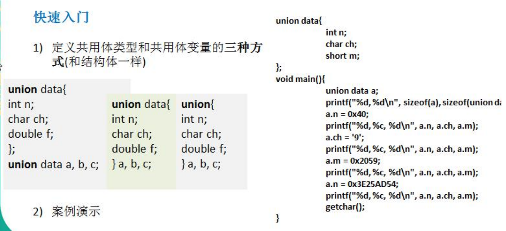

```c
#include <stdio.h>
union data{ // data 就是一个共用体(内存布局)， 包含三个成员, 共享数据空间, 该空间的大小以占用最大的成员为准
    int n;
    char ch;
    short m;
};
int main(){
    union data a; //定义两个一个 共用体变量 a
    printf("%d, %d\n", sizeof(a), sizeof(union data) ); // 4, 4
    a.n = 0x40;//16 进制
    printf("%d, %c, %d\n", a.n, a.ch, a.m);//64, @, 64
    a.ch = '9'; //
    printf("%d, %c, %d\n", a.n, a.ch, a.m);//57, 9, 57
    a.m = 0x2059;
    printf("%d, %c, %d\n", a.n, a.ch, a.m);//8281, Y, 8281
    a.n = 0x3E25AD54;
    printf("%d, %c, %d\n", a.n, a.ch, a.m);//1042656596, T, -21164
}
```

**代码的内存布局**

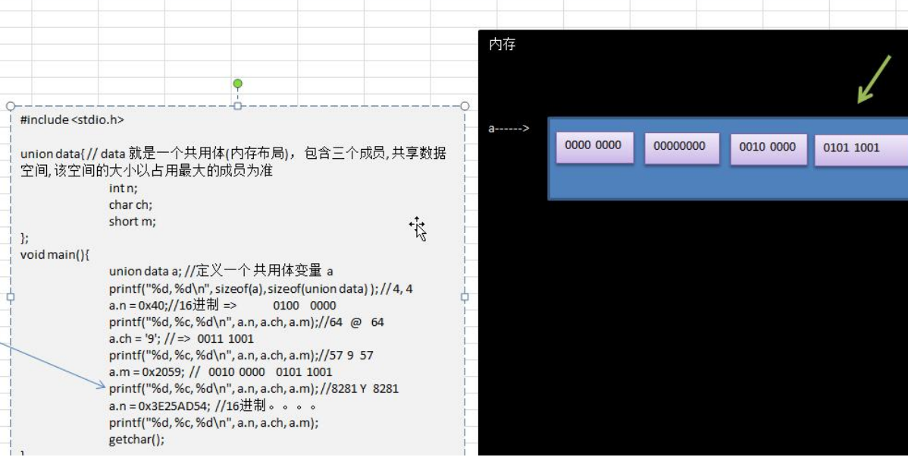

### 共用体内存布局分析

要深入理解为什么前面的案例输出的结果，就需要剖析共用体在内存中是如何布局的.

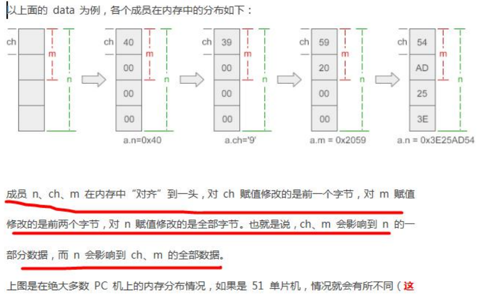

### 最佳实践

​		现有一张关于学生信息和教师信息的表格。学生信息包括姓名、编号、性别、职业、分数，教师的信息包括姓
名、编号、性别、职业、教学科目。请看下面的表格：, 请使用共用体编程完成.


```c
#include <stdio.h>
#define TOTAL 2 //人员总数
//定义了一个结构体 Person
//union MYUNION {
// float score;
// char course[20];
//};
struct Person{
    char name[20]; //name
    int num; //编号
    char sex;//性别 f => 女 m=>男
    char profession;//职员 s=>学生 t=>老师
    union{
        float score;
        char course[20];
    } sc;//sc 是一个共用体变量
};
void main(){
    int i;
    struct Person persons[TOTAL]; // 定义了一个结构体数组
    //输入人员信息
    for(i=0; i<TOTAL; i++){
        printf("Input info: ");
        scanf("%s %d %c %c", persons[i].name, &(persons[i].num), &(persons[i].sex), &(persons[i].profession));
        if(persons[i].profession == 's'){ //如果是学生
            printf("请输入该学生成绩:");
            scanf("%f", &persons[i].sc.score);
        }else{ //如果是老师
            printf("请输入该老师课程:");
            scanf("%s", persons[i].sc.course);
        }
        fflush(stdin);//刷新
    }
    //输出人员信息
    printf("\nName\t\tNum\tSex\tProfession\tScore / Course\n");
    for(i=0; i<TOTAL; i++){
        if(persons[i].profession == 's'){ //如果是学生
            printf("%s\t\t%d\t%c\t%c\t\t%f\n", persons[i].name, persons[i].num, persons[i].sex, persons[i].profession, persons[i].sc.score);
        }else{ //如果是老师
            printf("%s\t\t%d\t%c\t%c\t\t%s\n", persons[i].name, persons[i].num, persons[i].sex, persons[i].profession, persons[i].sc.course);
        }
    }
}
```

# typedef关键字

typedef：给类型起别名，包括基本类型和结构体、共用体

[C语言typedef的用法详解 (biancheng.net)](http://c.biancheng.net/view/2040.html)

起别名的目的不是为了提高程序运行效率，而是为了编码方便。例如有一个结构体的名字是 stu，要想定义一个结构体变量就得这样写：

```c
struct stu stu1;
```

struct 看起来就是多余的，但不写又会报错。如果为 struct stu 起了一个别名 STU，书写起来就简单了：

```c
STU stu1;
```

这种写法更加简练，意义也非常明确，不管是在标准头文件中还是以后的编程实践中，都会大量使用这种别名。

使用关键字 **typedef** 可以为类型起一个新的别名。typedef 的用法一般为：

```c
typedef  oldName  newName;
```

例子：

```c
typedef int INTEGER;
INTEGER a, b;
a = 1;
b = 2;
```

`INTEGER a, b;`等效于`int a, b;`。

typedef 还可以给数组、[指针](http://c.biancheng.net/c/80/)、结构体等类型定义别名。先来看一个给数组类型定义别名的例子：

```c
typedef char ARRAY20[20];
```

表示 ARRAY20 是类型`char [20]`的别名。它是一个长度为 20 的数组类型。接着可以用 ARRAY20 定义数组：

```
ARRAY20 a1, a2, s1, s2;
```

它等价于：

```c
char a1[20], a2[20], s1[20], s2[20];
```

注意，数组也是有类型的。例如`char a1[20];`定义了一个数组 a1，它的类型就是 char [20]

又如，为结构体类型定义别名：

```c
typedef struct stu{
    char name[20];
    int age;
    char sex;
} STU;
```

**STU 是 struct stu 的别名**，可以用 STU 定义结构体变量：

```c
STU body1,body2;
```

它等价于：

```c
struct stu body1, body2;
```

再如，为指针类型定义别名：

```
typedef int (*PTR_TO_ARR)[4];
```

表示 PTR_TO_ARR 是类型`int * [4]`的别名，它是一个[二维数组](http://c.biancheng.net/c/array/)指针类型。接着可以使用 PTR_TO_ARR 定义二维数组指针：

PTR_TO_ARR p1, p2;

按照类似的写法，还可以为函数指针类型定义别名：

```c
typedef int (*PTR_TO_FUNC)(int, int);
PTR_TO_FUNC pfunc;
```

为指针定义别名。

```c
#include <stdio.h>

typedef char (*PTR_TO_ARR)[30];
typedef int (*PTR_TO_FUNC)(int, int);

int max(int a, int b){
    return a>b ? a : b;
}

char str[3][30] = {
    "http://c.biancheng.net",
    "C语言中文网",
    "C-Language"
};

int main(){
    PTR_TO_ARR parr = str;
    PTR_TO_FUNC pfunc = max;
    int i;
   
    printf("max: %d\n", (*pfunc)(10, 20));
    for(i=0; i<3; i++){
        printf("str[%d]: %s\n", i, *(parr+i));
    }

    return 0;
}
```

```
运行结果：
max: 20
str[0]: http://c.biancheng.net
str[1]: C语言中文网
str[2]: C-Language
```

需要强调的是，typedef 是赋予现有类型一个新的名字，而不是创建新的类型。为了“见名知意”，请尽量使用含义明确的标识符，并且尽量大写。


# 项目

## 家庭收支记账软件

•模拟实现一个基于文本界面的《家庭记账软件》

•掌握初步的编程技巧和调试技巧

•主要涉及以下知识点：

–局部变量和基本数据类型

–循环语句

–分支语句

–简单的屏幕输出格式控

**需求说明**

•模拟实现基于文本界面的《家庭记账软件》。

•该软件能够记录家庭的收入、支出，并能够打印收支明细表。

•项目采用分级菜单方式。

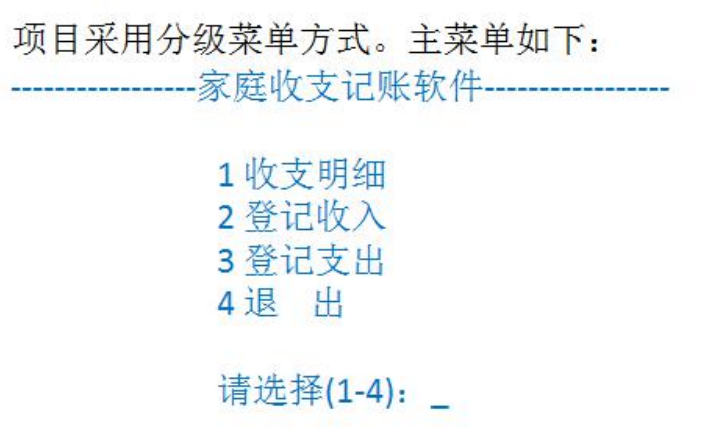


**流程图**

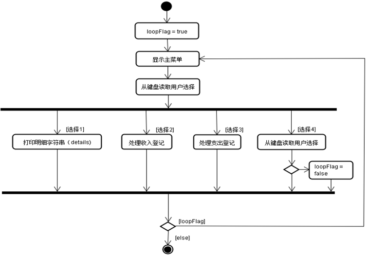


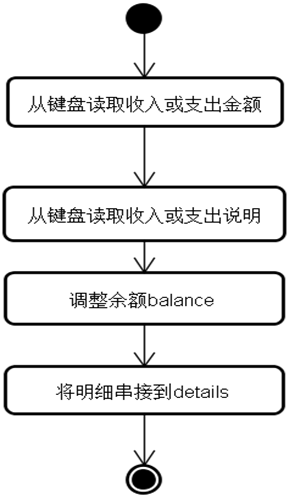

### 实现基本功能

编写文件 myAccount.c 完成功能


```c
#include <stdio.h>
#include <string.h>
int main()
{
    //1.显示菜单
    char key;//用户输入了哪个菜单
    int loop = 1;//控制是否退出菜单
    char details[3000]="-----------------当前收支明细记录-----------------\n\t收支\t收支金额\t账户金额\t说明\n";//记录了所有的收入和支出情况
    char note[20]="";//对收入或支出的说明
    char temp[100]="";//用于格式化每次的收入或支出，然后拼接到details
    double money=0.0;
    double balance = 1000.0;//余额
    char choice;//用户选择的y还是n
    int flag=0;//是否至少有一笔记录
    do {
        printf("-----------------家庭收支记账软件-----------------\n");
        printf("                  1.收支明细\n");
        printf("                  2.登记收入\n");
        printf("                  3.登记支出\n");
        printf("                  4.退    出\n");
        printf("请选择(1-4):\n");
        scanf("%c", &key);
        getchar();//过滤回车
        switch (key) {
        case '1':
        	if (flag){
        		printf("%s\n",details);
        	}else{
        		printf("当前没有任何的明细，来一笔吧\n");
        	}
            break;
        case '2':
            printf("本次收入金额:\n");
            scanf("%lf",&money);
            getchar();//过滤回车
            balance += money;//更新余额
            printf("本次收入说明:\n");
            scanf("%s",note);
            getchar();//过滤回车
            sprintf(temp,"收入\t%.2f\t\t%.2f\t\t\t%s\n",money,balance,note);//将本次信息，写入到temp字符数组
            strcat(details,temp);
            flag=1;
            break;
        case '3':
            printf("本次支出金额：\n");
            scanf("%lf",&money);
            //判断是否够支出
            if (money>balance){
            	printf("余额不足\n");
            	break;
            }
            printf("本次支出说明：\n");
            scanf("%s",note);
            getchar();
            balance -=money;
            sprintf(temp,"支出\t%.2f\t\t%.2f\t\t\t%s\n",money,balance,note);//将本次信息，写入到temp字符数组
            strcat(details,temp);
            flag=1;
            break;
        case '4':
        	printf("你确定要退出吗? y/n\n");
            do{
            	scanf("%c",&choice);
            	getchar();
            	if (choice=='y'||choice=='n'){
            		break;
            	}else{
            		printf("你的输入有误，请重新输入\n");
            	}
            }while(1);
            if (choice=='y'){
            	loop=0;
            }
        }
    } while (loop);
    printf("你退出了家庭财务软件\n");
    return 0;
}
```

### 优化

使用函数、结构体

```c
#include <stdio.h>
#include <string.h>
struct MyFamilyAccount{
    int flag;//是否至少有一笔记录
    char details[3000];//记录了所有的收入和支出情况
    double balance;//余额
};
char key;//用户输入了哪个菜单
int loop = 1;//控制是否退出菜单
char note[20]="";//对收入或支出的说明
char temp[100]="";//用于格式化每次的收入或支出，然后拼接到details
double money=0.0;
char choice;//用户选择的y还是n

//完成退出
void myExit(){
    printf("你确定要退出吗? y/n\n");
    do{
        scanf("%c",&choice);
        getchar();
        if (choice=='y'||choice=='n'){
            break;
        }else{
            printf("你的输入有误，请重新输入\n");
        }
    }while(1);
    if (choice=='y'){
        loop=0;
    }
}

//显示明细
void showDetails(struct MyFamilyAccount *myFamilyAccount){
    if ((*myFamilyAccount).flag){
        printf("%s\n",(*myFamilyAccount).details);
    }else{
        printf("当前没有任何的明细，来一笔吧\n");
    }
}

//完成一个登记收入
void income(struct MyFamilyAccount *myFamilyAccount){
    printf("本次收入金额:\n");
    scanf("%lf",&money);
    getchar();//过滤回车
    (*myFamilyAccount).balance += money;//更新余额
    printf("本次收入说明:\n");
    scanf("%s",note);
    getchar();//过滤回车
    sprintf(temp,"\t收入\t%.2f\t\t%.2f\t\t%s\n",money,(*myFamilyAccount).balance,note);//将本次信息，写入到temp字符数组
    strcat((*myFamilyAccount).details,temp);
    (*myFamilyAccount).flag=1;
}

//完成一个登记支出
void pay(struct MyFamilyAccount *myFamilyAccount){
    printf("本次支出金额：\n");
    scanf("%lf",&money);
    //判断是否够支出
    if (money>(*myFamilyAccount).balance){
        printf("余额不足\n");
        return;
    }
    printf("本次支出说明：\n");
    scanf("%s",note);
    getchar();
    (*myFamilyAccount).balance -=money;
    sprintf(temp,"\t支出\t%.2f\t\t%.2f\t\t%s\n",money,(*myFamilyAccount).balance,note);//将本次信息，写入到temp字符数组
    strcat((*myFamilyAccount).details,temp);
    (*myFamilyAccount).flag=1;    
}

//显示菜单
void mainMenu(struct MyFamilyAccount *myFamilyAccount){
     do {
        printf("-----------------家庭收支记账软件-----------------\n");
        printf("                  1.收支明细\n");
        printf("                  2.登记收入\n");
        printf("                  3.登记支出\n");
        printf("                  4.退   出\n");
        printf("请选择(1-4):\n");
        scanf("%c", &key);
        getchar();//过滤回车
        switch (key) {
        case '1':
            showDetails(myFamilyAccount);
            break;
        case '2':
            income(myFamilyAccount);
            break;
        case '3':
            pay(myFamilyAccount);
            break;
        case '4':
            myExit();
        }
    } while (loop);
}
int main()
{
    struct MyFamilyAccount myFamilyAccount;
    //初始化
    myFamilyAccount.flag=0;
    myFamilyAccount.balance=1000;
    memset(myFamilyAccount.details,3000,0);//清0
    strcpy(myFamilyAccount.details,"-----------------当前收支明细记录-----------------\n\t收支\t收支金额\t账户金额\t说明\n");
    mainMenu(&myFamilyAccount);
    printf("你退出了家庭财务软件\n");
    return 0;
}
```

# 文件操作

​		文件,对我们并不陌生,文件是数据源(保存数据的地方)的一种,比如大家经常使用的 word 文档,txt 文件,excel 文
件...都是文件。文件最主要的作用就是保存数据,它既可以保存一张图片,也可以保持视频,声音...

文件在程序中是以流的形式来操作的。

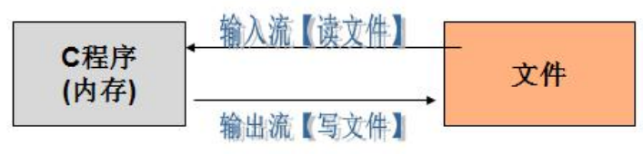

1) 流：数据在数据源(文件)和程序(内存)之间经历的路径

2) 输入流：数据从数据源(文件)到程序(内存)的路径

3) 输出流：数据从程序(内存)到数据源(文件)的路径

相关函数在 stdio.h

C 标准库 - stdio .h 该头文件定义了三个变量类型、一些宏和各种函数来执行输入和输出, 在开发过程中，可
以来查询.

**C 输入 & 输出**

1) 当我们提到输入时，这意味着要向程序写入一些数据。输入可以是以文件的形式或从命令行中进行。C 语言提
供了一系列内置的函数来读取给定的输入，并根据需要写入到程序中。

2) 当我们提到输出时，这意味着要在屏幕上、打印机上或任意文件中显示一些数据。C 语言提供了一系列内置的
函数来输出数据到计算机屏幕上和保存数据到文本文件或二进制文件中

标准文件

1) **C 语言把所有的设备都当作文件**。所以设备（比如显示器）被处理的方式与文件相同。以下三个文件会在程序
执行时自动打开，以便访问键盘和屏幕

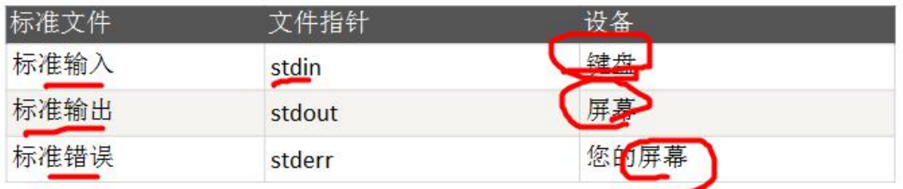

2) **文件指针是访问文件的方式**，我们会讲解如何从屏幕读取值以及如何把结果输出到屏幕上。

3) C 语言中的 I/O (输入/输出) 通常使用 printf() 和 scanf() 两个函数。scanf() 函数用于从标准输入（键盘）读
取并格式化， printf() 函数发送格式化输出到标准输出（屏幕）

4) 案例演示, 将内容输出到屏幕

```c
#include <stdio.h> // 执行 printf() 函数需要该库
int main()
{
    printf("hello"); //显示引号中的内容
    return 0;
}
```

## getchar() & putchar() 函数

1) int getchar(void) 函数**从屏幕读取下一个可用的字符**，并把它**返回为一个整数**。这个函数在同一个时间内只会**读取一个单一的字符**。您可以在循环内使用这个方法，以便从屏幕上读取多个字符。

2) int putchar(int c) 函数**把字符输出到屏幕上**，并返回相同的字符。这个函数在同一个时间内只会输出一个单一的字符。您可以在循环内使用这个方法，以便在屏幕上输出多个字

3) 应用实例：程序会读取一个单一的字符

```c
#include <stdio.h>
int main( )
{
    int c;
    printf( "Enter a value :");
    c = getchar( );
    printf( "\nYou entered: ");
    putchar( c );
    printf( "\n");
    return 0;
}
```

## gets() & puts() 函数

1) char *gets(char *s) 函数从 stdin 读取一行到 s 所指向的缓冲区，直到一个终止符或 EOF。

2) int puts(const char *s) 函数把字符串 s 和一个尾随的换行符写入到 stdout。

3) 应用实例: 程序读取一整行直到该行结束

```c
#include <stdio.h>
int main( )
{
    char str[100];
    printf( "Enter a value :");
    gets( str );
    printf( "\nYou entered: ");
    puts( str );
    return 0;
}
```

## scanf() 和 printf() 函数

1) int scanf(const char *format, ...) 函数从标准输入流 stdin 读取输入，并根据提供的 format 来浏览输入。

2) int printf(const char *format, ...) 函数把输出写入到标准输出流 stdout ，并根据提供的格式产生输出。

3) format 可以是一个简单的常量字符串，但是您可以分别指定 %s、%d、%c、%f 等来输出或读取字符串、整数、
字符或浮点数。还有许多其他可用的格式选项，可以根据需要使用。如需了解完整的细节，可以查看这些函数
的参考手册。现在让我们通过下面这个简单的实例来加深理解

4) 应用实例：您输入一个文本并按下回车键时，程序读取输入， 但是要求格式要匹配

```c
#include <stdio.h>
int main( ) {
    char str[100];
    int i;
    printf( "Enter a value :");
    scanf("%s %d", str, &i);
    printf( "\nYou entered: %s %d ", str, i);
    printf("\n");
    return 0;
}
```

## C文件操作

1) 讲解了 C 语言处理的标准输入和输出设备。我们将介绍 如何创建、打开、关闭文本文件或二进制文件。

2) 一个文件，无论它是文本文件还是二进制文件，都是代表了一系列的字节。C 语言不仅提供了访问顶层的函数，
也提供了底层（OS）调用来处理存储设备上的文件。本章将讲解文件管理的重要调用

### 打开文件

​		使用 **fopen( )** 函数来**创建一个新的文件或者打开一个已有的文件**，这个调用会初始化类型 FILE 的一个对象，
类型 FILE 包含了所有用来控制流的必要的信息。下面是这个函数调用的原型：
FILE *fopen( const char * filename, const char * mode );

1) 说明：在这里，filename 是字符串，用来命名文件，访问模式 mode 的值可以是下列值中的一个

2) 如果处理的是二进制文件(图片，视频..)，则需使用下面的访问模式: "rb", "wb", "ab", "rb+", "r+b", "wb+", "w+b", "ab+", "a+b" //b :binary 二进制
3) 函数的说明

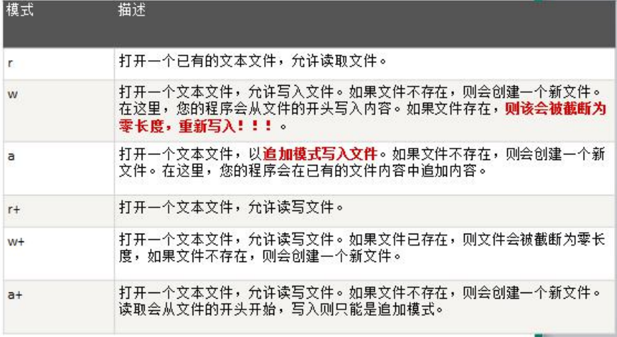

### 关闭文件

关闭文件，使用 **fclose( )** 函数。函数的原型如下：
int fclose( FILE *fp );

1) 如果成功关闭文件，fclose( ) 函数返回零，如果关闭文件时**发生错误，函数返回 EOF**。这个函数实际上，会清
空缓冲区中的数据，关闭文件，并释放用于该文件的所有内存。EOF 是一个定义在头文件 stdio.h 中的常量。

2) C 标准库提供了各种函数来按字符或者以固定长度字符串的形式读写文件。

3) 使用完文件后(读，写)，一定要将该文件关闭

### 写入文件

​		下面是把字符写入到流中的函数
int fputc( int c, FILE *fp );
说明：函数 **fputc()** 把参数 c 的字符值写入到 fp 所指向的输出流中。如果写入成功，它会返回写入的字符，
如果发生错误，则会返回 **EOF**。您可以使用下面的函数来把一个以 null 结尾的字符串写入到流中：
int fputs( const char *s, FILE *fp );

​		说明：函数 fputs() 把字符串 s 写入到 fp 所指向的输出流中。如果写入成功，它会返回一个非负值，如果发生
错误，则会返回 EOF。您也可以使用 int fprintf(FILE *fp,const char *format, ...) 函数来写把一个字符串写入到文件中

```c
#include <stdio.h>
int main() {
    //创建一个文件指针
    FILE *fp = NULL;
    //打开该文件
    fp = fopen("d:/test100.txt", "w+"); //w+ 模式是 文件会被截断为零长度
    //fp = fopen("d:/test100.txt", "a+"); //w+ 模式是 文件会被截断为零长度
    //将内容写入到文件中
    /*fprintf(fp, "你好 北京~~\n");
fputs("你好，上海~~\n", fp);*/
    //关闭文件!!!
    fclose(fp);
    printf("创建， 写入信息完成");
    return 0;
}
```

### 读取文件

下面是从文件读取单个字符的函数

int **fgetc**( FILE * fp );

说明：fgetc() 函数从 fp 所指向的输入文件中读取一个字符。返回值是读取的字符，如果发生错误则返回 EOF。

下面的函数从流中读取一个字符串：
char ***fgets**( char *buf, int n, FILE *fp );

1) 说明：函数 **fgets()** 从 fp 所指向的输入流中**读取 n - 1 个字符**。它会把读取的字符串复制到**缓冲区 buf**，并在
最后**追加一个 null 字符来终止字符串**。
如果这个函数在读取最后一个字符之前就**遇到一个换行符 '\n' 或文件的末尾 EOF，则只会返回读取到的字符，**
**包括换行符。**

2) 也可以使用 int **fscanf(**FILE *fp, const char *format, ...) 函数来从文件中读取字符串，但是在**遇到第一个空格字符**
**时，它会停止读取**。

3) 代码演示

```c
#include <stdio.h>
int main() {
    //创建一个文件指针
    FILE *fp = NULL;
    //定义一个缓冲区
    char buff[1024];
    //打开文件
    fp = fopen("d:/test200.txt", "r");
    //方法 1
    //fscanf(fp, "%s", buff);
    ////输出
    //printf("%s\n", buff);
    //方法 2 读取整个文件
    //说明，循环读取 fp 指向的文件内容，如果读到 NULL,就结束
    while(fgets(buff, 1024,fp)!=NULL) {
        printf("%s", buff);
    }
    //关闭文件
    fclose(fp);
    getchar();
}
```

