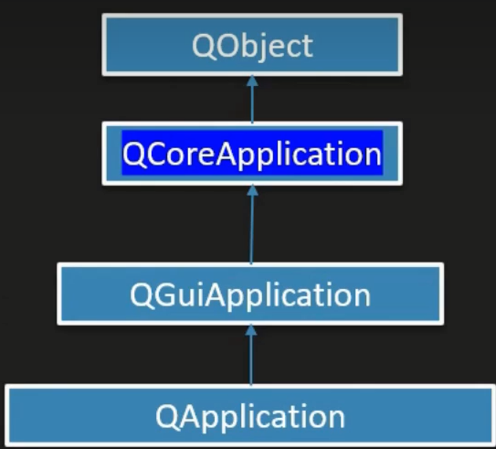

# 主事件循环



QCoreApplication:为非GU应用程序提供**主事件循环**

QGuiApplication:为GUI应用程序提供**主事件循环**

QApplication:为 Qt Widgets模块的应用程序提供**主事件循环**

QCoreApplication包含主事件循环,处理和分发来自操作系统和其他源的所有事件。它还处理应用程序的初始化与终结,以及系统范围和应用程序范围的设置

```c++
#include <QCoreApplication>
int main(int argc, char *argv[])
{
    QCoreApplication a(argc, argv);
    //进入主事件循环并等待，知道调用exit()，返回传递给exit()的值
    return a.exec();
}

```

qDebug，在windows下，如果是控制台应用程序，则将消息发送到控制台，否则，它将被发送到调试器

```c++
#include <QCoreApplication>
int main(int argc, char *argv[])
{
    QCoreApplication a(argc, argv);
    qDebug()<<"应用程序的目录:"<<a.applicationFilePath();
    return a.exec();
}

```

