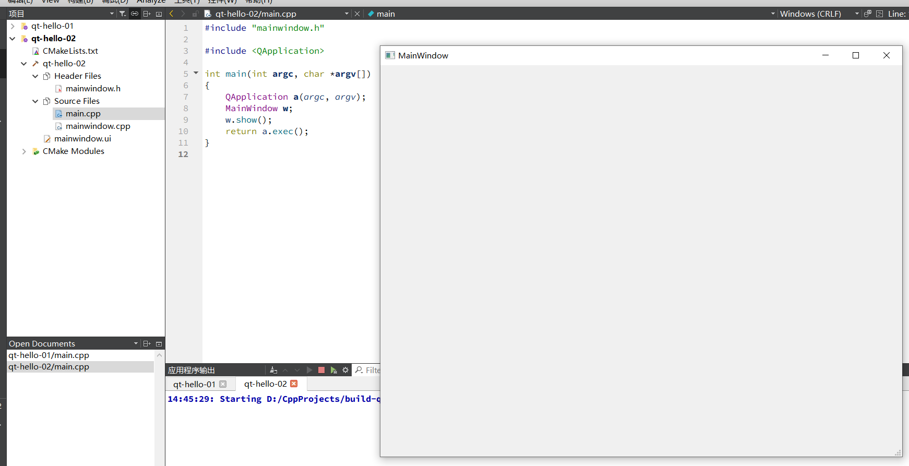
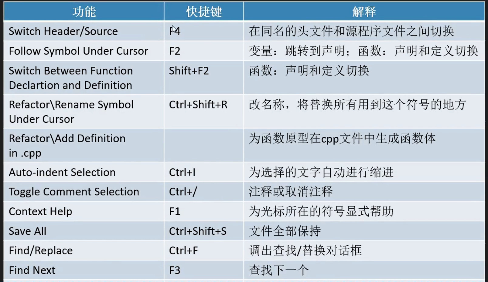
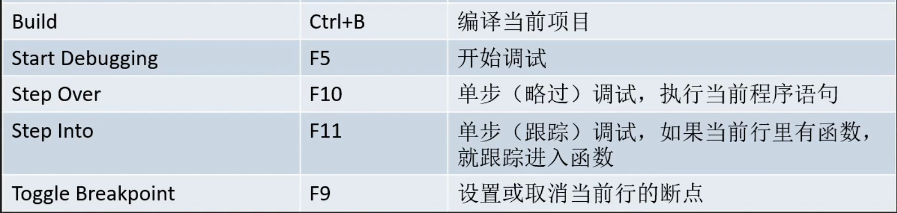
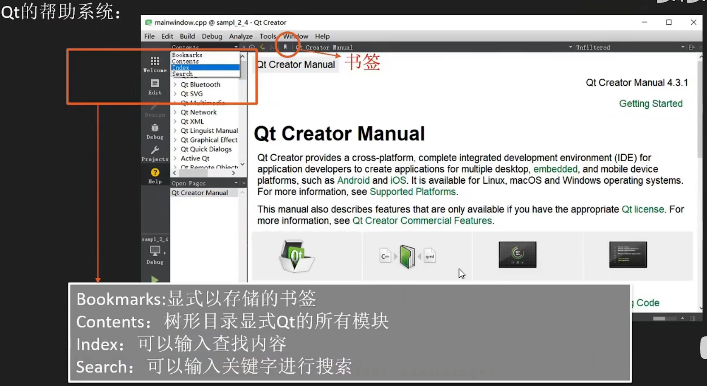

# 安装和简介

[Qt6 在线安装_Quz的博客-CSDN博客](https://blog.csdn.net/u011186532/article/details/126566394)

下载安装器：https://www.qt.io/download-qt-installer

- 根据提示，进行注册账号
- 选择自定义安装

**相关工具**

- Qt Creator是一个IDE、跨平台
- Qt design studio UI设计和开发工具、
- Qt Linguist 支持对Qt应用作快捷无误的翻译，是一组能理顺国际化工作流的工具。
- Qt Assistant  可定制可重发布的帮助文件和文档阅读器。
- QMake  跨平台makefile生成器。
- Qt Installer Framerwork 制作安装包

 **相关概念**

- QML （Qt Meta Language 或者 Qt Modeling Language）Qt 引入的一种**声明式脚本语言**，**基于 JavaScript**，作为 C++ 语言的一种替代，
- Qt Widgets模块提供了一组UI元素来创建**经典**的桌面风格的用户界面。
- Qt Quick  是一个编写QML应用的标准库，提供了两种接口：使用**QML语言**创建应用的QML接口和使用C++语言扩展QML的C++接口

# hello world

## 控制台程序

在Qt Creator中新建控制台应用程序。构建系统选择cmake，其他都默认，创建项目。

main.cpp：

```c++
#include <QCoreApplication>
#include <iostream>
int main(int argc, char *argv[])
{
    QCoreApplication a(argc, argv);
    std::cout<<"Qt Version:"<<qVersion()<<std::endl;
    return a.exec();
}

```

控制台上显示：Qt Version:6.3.1

或者这样：

```c++
#include <QCoreApplication>
int main(int argc, char *argv[])
{

    qDebug()<<"Qt Version:"<<qVersion();
}

```

输出效果是一样的。

## Widgets

在Qt Creator中新建Qt Widgets应用程序，选项默认。运行结果如下：



或者这样也行：

```c++

#include <QApplication>
#include <QMainWindow>
int main(int argc, char *argv[])
{
    QApplication a(argc, argv);
    QMainWindow w;
    w.show();
    return a.exec();
}

```

# Qt Creator

常用快捷键





Qt帮助系统



cmake工程引入Qt Charts

```cmake
find_packages(Qt6 QEUIRED COMPONENTS Charts)

target_link_libraries(项目名 PRIVATE Qt6:Charts)
```

