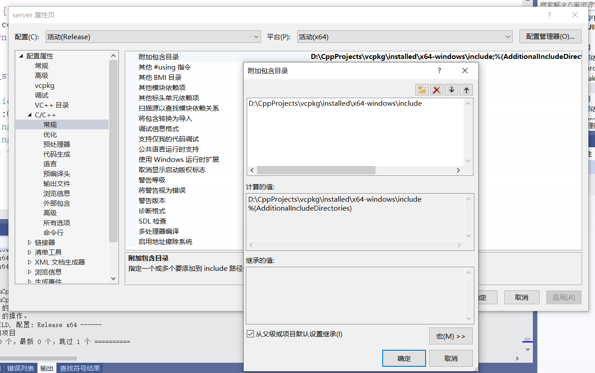
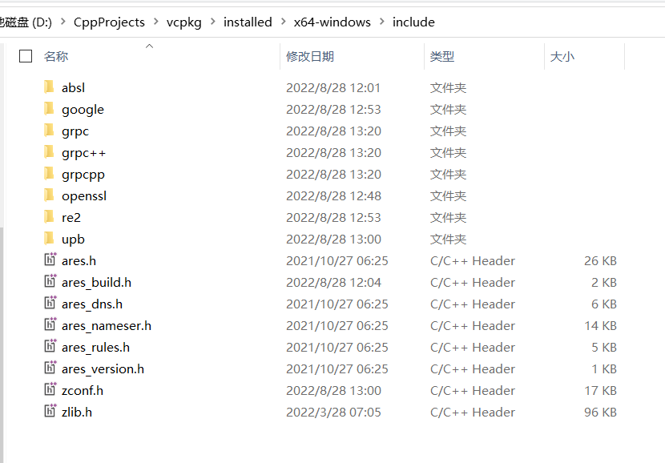
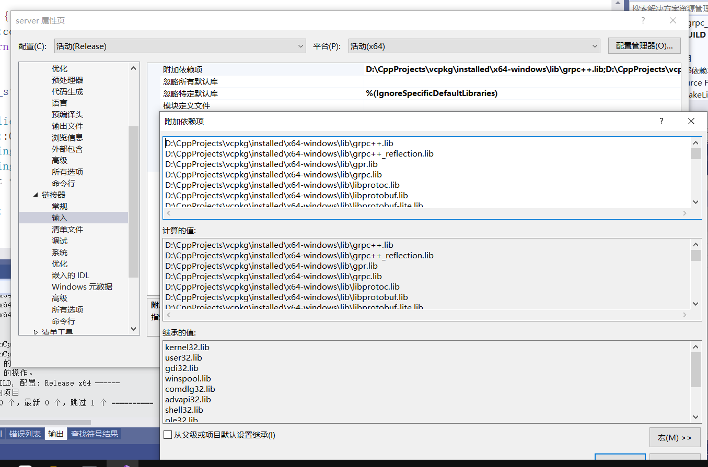

# 编译安装

自己拉代码编译太痛苦了，直接使用**vcpkg** 工具进行自动编译安装。

vcpkg官网：https://vcpkg.io/en/getting-started.html

教程：

- https://zhuanlan.zhihu.com/p/458654983

- https://blog.csdn.net/w13l14/article/details/118155498

步骤如下：

前提环境

- git
- cmake
- VS2019
- 良好的网络（访问github）

**1、安装vcpkg**

```cmd
git clone https://github.com/Microsoft/vcpkg.git
.\vcpkg\bootstrap-vcpkg.bat
```

我自己电脑上的安装目录：D:\CppProjects\vcpkg


**2、**经过漫长的安装后，可以**安装gRPC**了

```cmd
vcpkg install grpc:x64-windows
```

又要等超长的时间，你可以先去睡觉了。

出现如下提示，说明成功了：

```
Elapsed time to handle grpc:x64-windows: 19.86 min

Total elapsed time: 20.26 min

grpc provides CMake targets:
    # this is heuristically generated, and may not be correct
    find_package(gRPC CONFIG REQUIRED)
    # note: 7 additional targets are not displayed.
    target_link_libraries(main PRIVATE gRPC::gpr gRPC::grpc gRPC::grpc++ gRPC::grpc++_alts)

    find_package(modules CONFIG REQUIRED)
    target_link_libraries(main PRIVATE re2::re2 c-ares::cares)
```

**3、安装protobuf**

```cmd
vcpkg install protobuf protobuf:x64-windows
```


**最终的目录： vcpkg 安装目录内的 pkg 文件夹中。**

可以在 vcpkg 安装目录/installed/x64-windows/目录找到可执行文件和dll文件

为了便于使用，将如下路径添加到环境变量Path中：

```cmd
D:\CppProjects\vcpkg
D:\CppProjects\vcpkg\installed\x64-windows\bin
D:\CppProjects\vcpkg\installed\x64-windows\tools\grpc
D:\CppProjects\vcpkg\installed\x64-windows\tools\protobuf
```


**4、** 为了使软件包在系统范围内可用，需要执行命令：

```cmd
//集成到cmake，根据提示把参数加上去
vcpkg integrate install

//集成到 nuget，根据提示进行操作
vcpkg integrate project
```

如果下载nuget.exe很慢甚至失败，就可以把控制台上显示的连接自己粘贴到浏览器里下载，然后重命名

放到D:\CppProjects\vcpkg\downloads\dbb8c13d-nuget.exe中，dbb8c13d-nuget是控制台上显示的名字，根据实际情况来。

然后再执行 vcpkg integrate project 命令，就会提示：

```
A suitable version of nuget was not found (required v6.2.1). Downloading portable nuget v6.2.1...
Created nupkg: "D:\CppProjects\vcpkg\scripts\buildsystems\vcpkg.D.CppProjects.vcpkg.1.0.0.nupkg"
With a project open, go to Tools->NuGet Package Manager->Package Manager Console and paste:
 Install-Package "vcpkg.D.CppProjects.vcpkg" -Source "D:\CppProjects\vcpkg\scripts\buildsystem
```

根据提示，在grpc-demo项目中，打开Tools->NuGet Package Manager->Package Manager Console and paste，在打开的控制台上执行命令：

```cmd
Install-Package "vcpkg.D.CppProjects.vcpkg" -Source "D:\CppProjects\vcpkg\scripts\buildsystems"
```

# HelloWorld

参考：https://blog.csdn.net/weixin_44229257/article/details/124104808

目录结构

```
grpc-demo
--build
--proto
----helloworld.proto
----helloworld.pb.cc
----helloworld.pb.h
----helloworld.grpc.pb.cc
----helloworld.grpc.pb.h
--src
----greeter_client.cc
----greeter_server.cc
--CMakeLists.txt
```


helloworld.proto文件

```protobuf
// Copyright 2015 gRPC authors.
//
// Licensed under the Apache License, Version 2.0 (the "License");
// you may not use this file except in compliance with the License.
// You may obtain a copy of the License at
//
//     http://www.apache.org/licenses/LICENSE-2.0
//
// Unless required by applicable law or agreed to in writing, software
// distributed under the License is distributed on an "AS IS" BASIS,
// WITHOUT WARRANTIES OR CONDITIONS OF ANY KIND, either express or implied.
// See the License for the specific language governing permissions and
// limitations under the License.

syntax = "proto3";

option java_multiple_files = true;
option java_package = "io.grpc.examples.helloworld";
option java_outer_classname = "HelloWorldProto";
option objc_class_prefix = "HLW";

package helloworld;

// The greeting service definition.
service Greeter {
  // Sends a greeting
  rpc SayHello (HelloRequest) returns (HelloReply) {}
}

// The request message containing the user's name.
message HelloRequest {
  string name = 1;
}

// The response message containing the greetings
message HelloReply {
  string message = 1;
}

```

客户端：greeter_client.cc

```c++
/*
 *
 * Copyright 2015 gRPC authors.
 *
 * Licensed under the Apache License, Version 2.0 (the "License");
 * you may not use this file except in compliance with the License.
 * You may obtain a copy of the License at
 *
 *     http://www.apache.org/licenses/LICENSE-2.0
 *
 * Unless required by applicable law or agreed to in writing, software
 * distributed under the License is distributed on an "AS IS" BASIS,
 * WITHOUT WARRANTIES OR CONDITIONS OF ANY KIND, either express or implied.
 * See the License for the specific language governing permissions and
 * limitations under the License.
 *
 */

#include <iostream>
#include <memory>
#include <string>

#include <grpcpp/grpcpp.h>

#ifdef BAZEL_BUILD
#include "examples/protos/helloworld.grpc.pb.h"
#else
#include "../proto/helloworld.grpc.pb.h" //注意路径
#endif

using grpc::Channel;
using grpc::ClientContext;
using grpc::Status;
using helloworld::Greeter;
using helloworld::HelloReply;
using helloworld::HelloRequest;

class GreeterClient {
 public:
  GreeterClient(std::shared_ptr<Channel> channel)
      : stub_(Greeter::NewStub(channel)) {}

  // Assembles the client's payload, sends it and presents the response back
  // from the server.
  std::string SayHello(const std::string& user) {
    // Data we are sending to the server.
    HelloRequest request;
    request.set_name(user);

    // Container for the data we expect from the server.
    HelloReply reply;

    // Context for the client. It could be used to convey extra information to
    // the server and/or tweak certain RPC behaviors.
    ClientContext context;

    // The actual RPC.
    Status status = stub_->SayHello(&context, request, &reply);

    // Act upon its status.
    if (status.ok()) {
      return reply.message();
    } else {
      std::cout << status.error_code() << ": " << status.error_message()
                << std::endl;
      return "RPC failed";
    }
  }

 private:
  std::unique_ptr<Greeter::Stub> stub_;
};

int main(int argc, char** argv) {
  // Instantiate the client. It requires a channel, out of which the actual RPCs
  // are created. This channel models a connection to an endpoint specified by
  // the argument "--target=" which is the only expected argument.
  // We indicate that the channel isn't authenticated (use of
  // InsecureChannelCredentials()).
  std::string target_str;
  std::string arg_str("--target");
  if (argc > 1) {
    std::string arg_val = argv[1];
    size_t start_pos = arg_val.find(arg_str);
    if (start_pos != std::string::npos) {
      start_pos += arg_str.size();
      if (arg_val[start_pos] == '=') {
        target_str = arg_val.substr(start_pos + 1);
      } else {
        std::cout << "The only correct argument syntax is --target="
                  << std::endl;
        return 0;
      }
    } else {
      std::cout << "The only acceptable argument is --target=" << std::endl;
      return 0;
    }
  } else {
    target_str = "localhost:50051";
  }
  GreeterClient greeter(
      grpc::CreateChannel(target_str, grpc::InsecureChannelCredentials()));
  std::string user("world");
  std::string reply = greeter.SayHello(user);
  std::cout << "Greeter received: " << reply << std::endl;

  return 0;
}

```

服务端：greeter_server.cc

```c++
/*
 *
 * Copyright 2015 gRPC authors.
 *
 * Licensed under the Apache License, Version 2.0 (the "License");
 * you may not use this file except in compliance with the License.
 * You may obtain a copy of the License at
 *
 *     http://www.apache.org/licenses/LICENSE-2.0
 *
 * Unless required by applicable law or agreed to in writing, software
 * distributed under the License is distributed on an "AS IS" BASIS,
 * WITHOUT WARRANTIES OR CONDITIONS OF ANY KIND, either express or implied.
 * See the License for the specific language governing permissions and
 * limitations under the License.
 *
 */

#include <iostream>
#include <memory>
#include <string>

#include <grpcpp/ext/proto_server_reflection_plugin.h>
#include <grpcpp/grpcpp.h>
#include <grpcpp/health_check_service_interface.h>

#ifdef BAZEL_BUILD
#include "examples/protos/helloworld.grpc.pb.h"
#else
#include "../proto/helloworld.grpc.pb.h" //注意路径
#endif

using grpc::Server;
using grpc::ServerBuilder;
using grpc::ServerContext;
using grpc::Status;
using helloworld::Greeter;
using helloworld::HelloReply;
using helloworld::HelloRequest;

// Logic and data behind the server's behavior.
class GreeterServiceImpl final : public Greeter::Service {
  Status SayHello(ServerContext* context, const HelloRequest* request,
                  HelloReply* reply) override {
    std::string prefix("Hello ");
    reply->set_message(prefix + request->name());
    return Status::OK;
  }
};

void RunServer() {
  std::string server_address("0.0.0.0:50051");
  GreeterServiceImpl service;

  grpc::EnableDefaultHealthCheckService(true);
  grpc::reflection::InitProtoReflectionServerBuilderPlugin();
  ServerBuilder builder;
  // Listen on the given address without any authentication mechanism.
  builder.AddListeningPort(server_address, grpc::InsecureServerCredentials());
  // Register "service" as the instance through which we'll communicate with
  // clients. In this case it corresponds to an *synchronous* service.
  builder.RegisterService(&service);
  // Finally assemble the server.
  std::unique_ptr<Server> server(builder.BuildAndStart());
  std::cout << "Server listening on " << server_address << std::endl;

  // Wait for the server to shutdown. Note that some other thread must be
  // responsible for shutting down the server for this call to ever return.
  server->Wait();
}

int main(int argc, char** argv) {
  RunServer();

  return 0;
}

```

根据proto生成message：helloworld.pb.h和helloworld.pb.cc

```cmd
protoc --proto_path=. --cpp_out=. helloworld.proto
```

根据proto生成service：helloworld.grpc.pb.h和helloworld.grpc.pb.cc

```cmd
protoc --proto_path=. --grpc_out=. --plugin=protoc-gen-grpc=grpc_cpp_plugin.exe helloworld.proto
```

CMakeLists.txt

```cmake
cmake_minimum_required( VERSION 3.1 )
project( grpc_demo )
find_package(gRPC CONFIG REQUIRED)
find_package( Protobuf REQUIRED )
add_executable( server src/greeter_server.cc proto/helloworld.grpc.pb.cc proto/helloworld.pb.cc)
add_executable( client src/greeter_client.cc proto/helloworld.grpc.pb.cc proto/helloworld.pb.cc)
target_link_libraries( server PRIVATE gRPC::grpc++ gRPC::grpc++_reflection gRPC::gpr gRPC::grpc gRPC::grpc++ protobuf::libprotoc protobuf::libprotobuf protobuf::libprotobuf-lite )
target_link_libraries( client PRIVATE gRPC::grpc++ gRPC::grpc++_reflection gRPC::gpr gRPC::grpc gRPC::grpc++ protobuf::libprotoc protobuf::libprotobuf protobuf::libprotobuf-lite )
```

生成Visual Studio解决方案并编译：

```cmd
cd build
cmake -G "Visual Studio 16 2019" ../ -DCMAKE_TOOLCHAIN_FILE=D:/CppProjects/vcpkg/scripts/buildsystems/vcpkg.cmake
```

**注意事项：**
注意自己对应的Visual Studio的版本号；
注意在目标路径能否找到vcpkg.cmake文件。

创建好项目之后，我们在build路径下进行编译：

```cmd
cmake --build .
```

在Debug文件夹下，找到client.exe与server.exe两个可执行文件。

**分别运行服务端和客户端exe**

```
E:\Gitee\LearnCplusplus\grpc-demo\build\Debug>server.exe
Server listening on 0.0.0.0:50051
```


```
E:\Gitee\LearnCplusplus\grpc-demo\build\Debug>client.exe
Greeter received: Hello world
```

# 小结

- 使用vcpkg进行了grpc的编译安装，省去了很多事
- protoc.exe是根据proto中的message编译成对应的代码
- 需要编译proto中的service时，protoc.exe需要加上--plugin=protoc-gen-grpc=grpc_cpp_plugin.exe 
- 使用cmake的 -DCMAKE_TOOLCHAIN_FILE 选项来关联到vcpkg

推荐阅读：[VS2019 添加本地lib库及其头文件_liyadian的博客-CSDN博客_vs2019添加lib](https://blog.csdn.net/liyadian/article/details/109331374)

现在回过头来看，grpc-demo项目中添加的头文件和lib库是什么样的



这个目录打开看看，里面是vspkg编译安装后，存放各种库的.h头文件的地方




使用到的lib



除去系统环境自带的，使用的grpc及其依赖的库有：

```
grpc++.lib
grpc++_reflection.lib
gpr.lib
grpc.lib
libprotoc.lib
libprotobuf.lib
libprotobuf-lite.lib
upb_json.lib
upb_textformat.lib
upb_reflection.lib
upb.lib
upb_fastdecode.lib
upb_utf8_range.lib
descriptor_upb_proto.lib
zlib.lib
cares.lib
address_sorting.lib
re2.lib
absl_statusor.lib
libssl.lib
libcrypto.lib
abseil_dll.lib
```


