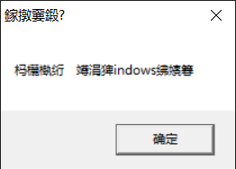

课程地址：https://www.bilibili.com/video/BV1us411A7UE

参考书目：《Windows程序设计 第5版》

**hello world**

```c
#include <stdio.h>

int main() {
    printf("Hello, World!\n");
    return 0;
}
```


**windows版 hello world**

SayHi.c

```c
#include <windows.h>

int WINAPI WinMain(HINSTANCE hInstance, HINSTANCE hPrevInstance, PSTR szCmdLine, int iCmdShow){
    //MB_OK替换成0也可以，1 就是出现两个按钮，一个确定，一个取消
    //使用 | 可以使用多个选项参数
    MessageBox(NULL, TEXT("这是第一个Windows程序"), TEXT("打招呼"), MB_YESNO | MB_ICONASTERISK);
    return 0;
}


```





1