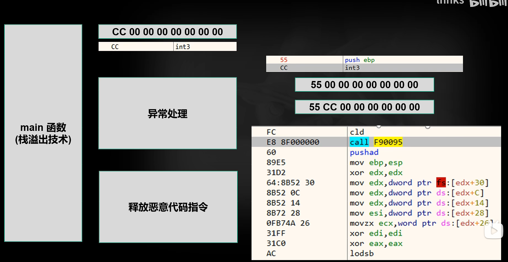

**利用栈溢出来调用函数**

```c++
#include <iostream>
#include <Windows.h>
#pragma comment(linker,"/subsystem:\"windows\" /entry:\"mainCRTStartup\"")

void DecShellCode() {
	MessageBoxA(0, "不要打了!", "我错了", MB_OK);
}
#pragma optimize("",off) //关闭优化
int main() {
	int b = 2020;
    int ary[2] = { 1,2 };
	int ti = 23;
	ary[5] = (int)DecShellCode;
}
#pragma optimize("",on) 
```


**利用异常处理机制**

```c++
#include <iostream>
#include <Windows.h>1
#pragma comment(linker,"/subsystem:\"windows\" /entry:\"mainCRTStartup\"")

#pragma data_seg("ldata")
char trapcode[] = "*";
unsigned long long llcode = 204;//CC 00 00 00 00 00 INT3中断，引发异常

#pragma data_seg()
#pragma comment(linker,"/SECTION:ldata,RWE")

void DecShellCode() {
	MessageBoxA(0, "不要打了!", "我错了", MB_OK);
}
//main函数执行完了后，会执行这里
long _stdcall ExceptionHandler(PEXCEPTION_POINTERS val){
	DecShellCode();
	return -1;
}

#pragma optimize("",off) //关闭优化
int main() {
	AddVectoredExceptionHandler(1, ExceptionHandler);
	int b = 2020;
	int ary[2] = { 1,2 };
	int ti = 23;
	ary[5] = (int)&llcode;
}
#pragma optimize("",on) 
```





```c++
#include <iostream>
#include <Windows.h>1
#pragma comment(linker,"/subsystem:\"windows\" /entry:\"mainCRTStartup\"")

#pragma data_seg("ldata")
char trapcode[] = "*";
unsigned long long llcode = 204;//CC 00 00 00 00 00 INT3中断，发生异常

#pragma data_seg()
#pragma comment(linker,"/SECTION:ldata,RWE")

void DecShellCode() {
	llcode = 0xF333333333333333;
	llcode = llcode << 2;
	char* data = (char*)&llcode;
	/*解密 shellcode 并且执行
	* len 等于解密后的指令长度
	* data 把解密后的指令写入data中
	* 比如push ebp 那么就把data写入 0x55
	* 解密算法自己按照自己的风格自己写
	* 每次解密一条指令，不要用超过7字节的指令，跳转指令
	* 涉及到的常量，变量自己编码解决
	*/
	MessageBoxA(0, "不要打了!", "我错了", MB_OK);
}

long _stdcall ExceptionHandler(PEXCEPTION_POINTERS val) {
	if (val->ExceptionRecord->ExceptionCode == STATUS_BREAKPOINT) {
		DecShellCode();
		val->ContextRecord->Eip = (DWORD)&llcode;
		return EXCEPTION_CONTINUE_EXECUTION;
	}
	else return EXCEPTION_CONTINUE_SEARCH;
	return -1;
}

#pragma optimize("",off) //关闭优化
int main() {
	AddVectoredExceptionHandler(1, ExceptionHandler);
	int b = 2020;
	int ary[2] = { 1,2 };
	int ti = 23;
	ary[5] = (int)&llcode;
}
#pragma optimize("",on) 
```


**不用栈溢出，用更加隐蔽的方式去触发**

