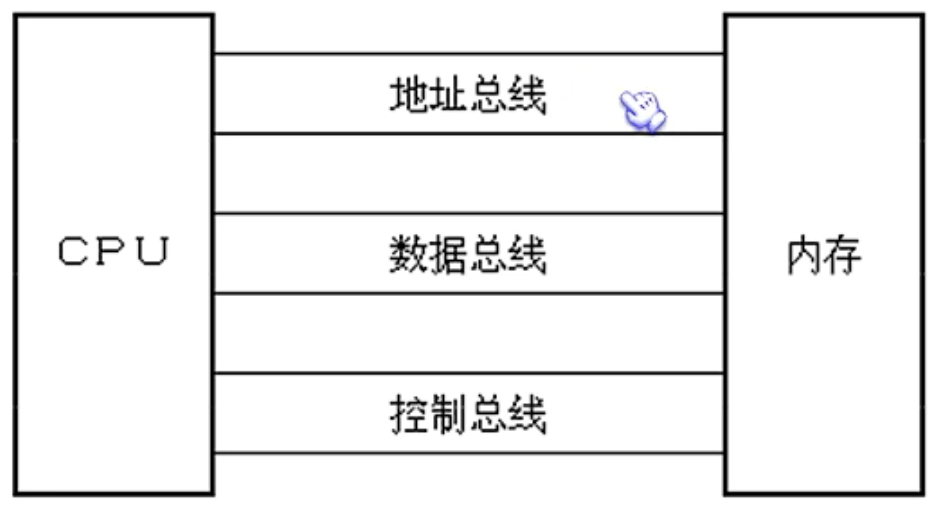
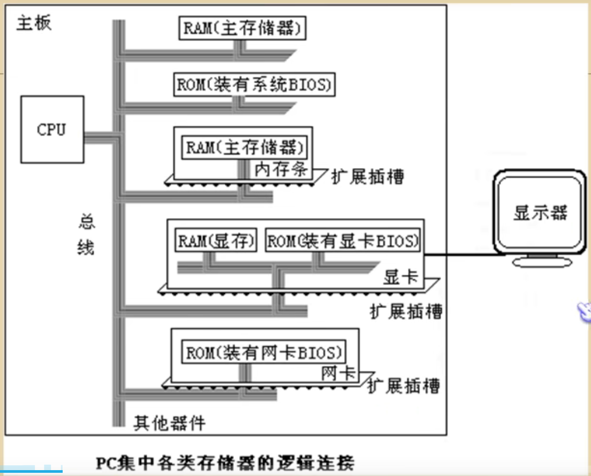
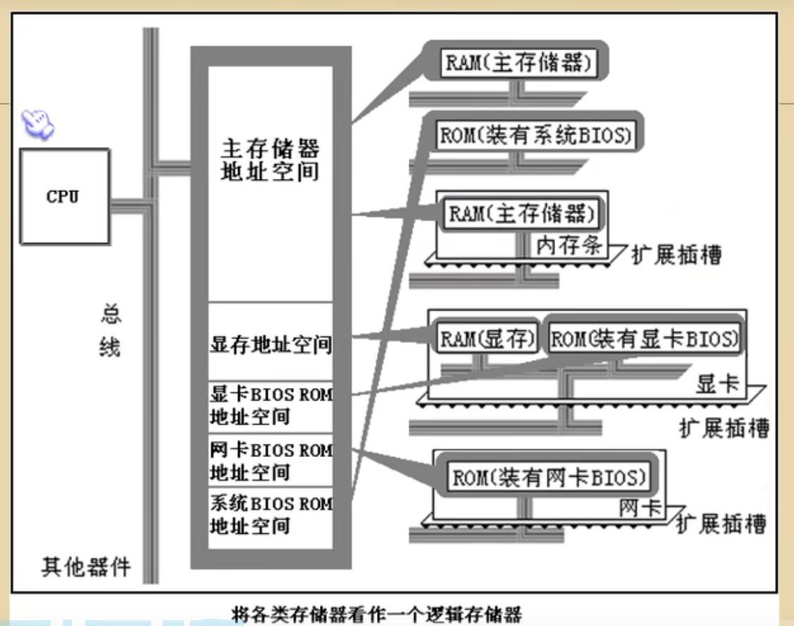
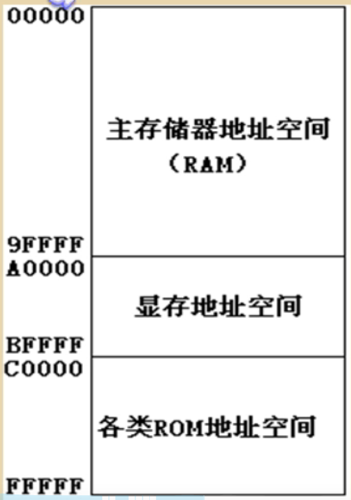

# 简介

## 汇编语言

汇编指令是机器指令的助记符

汇编指令-->编译器-->1000100-->计算机

```c
#include <stdio.h>
int main()
{
	printf("%d", sizeof(short));
}
```

VS2019 debug查看汇编：

```asm
int main()
{
00A51750  push        ebp  
00A51751  mov         ebp,esp  
00A51753  sub         esp,0C0h  
00A51759  push        ebx  
00A5175A  push        esi  
00A5175B  push        edi  
00A5175C  mov         edi,ebp  
00A5175E  xor         ecx,ecx  
00A51760  mov         eax,0CCCCCCCCh  
00A51765  rep stos    dword ptr es:[edi]  
00A51767  mov         ecx,offset _99B9AA43_hello_asm@c (0A5C003h)  
00A5176C  call        @__CheckForDebuggerJustMyCode@4 (0A51307h)  
	printf("%d", sizeof(short));
00A51771  push        2  
00A51773  push        offset string "%d" (0A57BCCh)  
00A51778  call        _printf (0A5139Dh)  
00A5177D  add         esp,8  
}
```

**汇编语言组成**

- 汇编指令：机器码的助记符
- 伪指令：由编译器执行
- 其他符号：由编译器识别


**指令和数据**

指今和数据是应用上的概念  
在内存或磁盘上，指今和数据没有任区别,都是二进制信息。

1000100111011000  --> 89D8H(数据)  
1000100111011000  --> MOV AX,BX(程序)

## 总线

**CPU对存储器的读写**

CPU要想进行数据的读写，必项和外部器件(标准的说法是芯片)进行三类信息的交互：

- 存储单元的地址(地址信息)
- 器件的选择，读或写命会(控制信息)
- 读或写的数据(数据信息)

在计管机中专门有连接CPU和其他芯片的导线,通常称为总线。

物理上：一棍根导线的集合口  
逻辑上划分为：

- 地址总线
- 数据总线
- 控制总线



对于8086CPU，下面的机器码能够完成从3号单元读数据：

机器码：101000000000001100000000

含有：从3号单元读取数据送入寄存器AX

cpu收这条机器码后将完成上面所述的读写互作。


**地址总线**

cpu是涌过地址总线来指定存储单元的。

地址总线上能传送多少个不同的信息，CPU就可以对多少个存储单元进行寻址。

- 一介CPU有N根地址总线，则可以说这个CPU的地址总线的宽度为N。

- 这样的CPU最多可以寻找2的N次方个内存单元


**数据总线**

- CPU与内存或其它器件之间的数据传送是涌过数据总线来进行的。

- 数据总线的宽度定了CPU和外界的数据传送速度。


**控制总线**

控制总线上发送控制信息。

- CPU对外部器件的控制是通过控制总线来进行的。在这里控制总线是个总称，控制总线是些不同控制线的集合。
- 有多少控制总线，就意味着CPU提供了对外部器件的多少种制
- 所以，控制总线的宽度决定了CP对外部器件的控制能力

前面所讲的内存读或写命会是由几根控制线综合发出的：

- 其中有一根名为读信号输出控制线负责由CPU向外传送读信号,CPU向该控制线上输出低电平麦示将要读取数据；

- 有一根名为写信号输出控制线负责由CPU向外传送写信号


**小结**

- 汇编指会是机器指令集的助记符，同机器指会一一对应
- 每一种CPU都有自己的汇编指令集
- CPU可以直接适用的信息在存储器中存放
- 在存储器中指令和数据没有任何区别，都是二进制信息

- 存储单元从零开始顺序编号
- 一个存储单元可以存储8个bit(用作单位写成“b”),即8位二进制数(
- 1B=8b，1KB=1024B， 1MB =1024KB 1GB=1024MB

- 每一个CPU芯片都有许多管脚,这些管脚和总线相连。也可以说,这些管脚引出总线。CPU可以引出三种总线的宽度标志了这CPU的不同方面的性能：
  - 地址总线的宽度定了CPU的寻址能力;
  - 数据总线的宽度定了CPU与其它器件进行数据传送时的一次数据传送量
  - 控制总线宽度决定了CPU对系统中其它器件的控制能力


## 内存地址空间

什么是内存地址空呢？
一个CPU的地址线宽度为10，那么可以寻址1024个内存单元，这1024个可寻到的内存单元就构成这个CPU的内存地址空间。下面深入讨论。


**主板**

在每一台PC机中，都有一个主板，主板上有核心器件和—些主要器件。这些器件桶过总线(地址总线、数据总线、控制总线)相连。


**接口卡**

计算机系统中，所有可用程序控制其互作的设备，必须受到CPU的制。CPU对外部设备不能直接挫制，如显示器、音箱、打印机等。直接控制这些设备进行工作的是插在扩插槽上的接口卡。


**各类存储器芯片**

从读写属性上看分为两类随机存储器(RAM)和只读存储器(ROM)

装有BIOS的ROM:

BIOS: Basic Input/output System，基本输入输出系统

BIOS是由主板和名类接口卡(如:显卡、网卡等)厂商提供的软件系统，可以涌过它利用该硬件设备进行最基本的输入输出。在主板和某些接口上插有存储相应BIOS的ROM。

从功能和连接上分类：

- 随机存储器RAM
- 装有BIOS的ROM
- 接口卡上的RAM

PC机中各类存储器的逻辑连接情况




上述的那些存储器在物理上是独立的器件。

但是它们在以下两点上相同

1、都和CPU的总线相连。

2、CPU对它们进行读或写的时候都通过控制线发出内存读写命令。

将各类存储器看作一个逻辑存储器：

- 所有的物理存储器被看作一个由若干存储单元组成的逻辑存储器
- 每个物理存储器在这个遇辑存储器中占有个地址段，即一段地址空间口
- CPU在这段地址空间中读写数据，实际上就是在相对应的物理存储器中读写数据。



假设，上图中的内存空间地址段分配如下：

- 地址 O~7FFFH的32KB空间为主随机存储器的地址空间；
- 地址8000H~9FFFH的8KB空间为显存地址空间；
- 地址A000H~FFFFH的2KBK空间为各个ROM的地址空间。

不同的计算机系统的内存地址空间分配情况是不同的。8086PC机内存地址空间分配的基本情况：



内存地址空间：

最终运行程序的是CPU，我们用汇编编程的时候，必须要从CPU角度考虑问题。（我们学习这门课程的核心思维）

对CPU来讲，系统中的所有存储器中的存储单元都处于一个统一的逻辑存储器中，它的容量受CPU寻址能力的限制。这个逻辑存储器即是我们所说的**内存地址空间**。


1