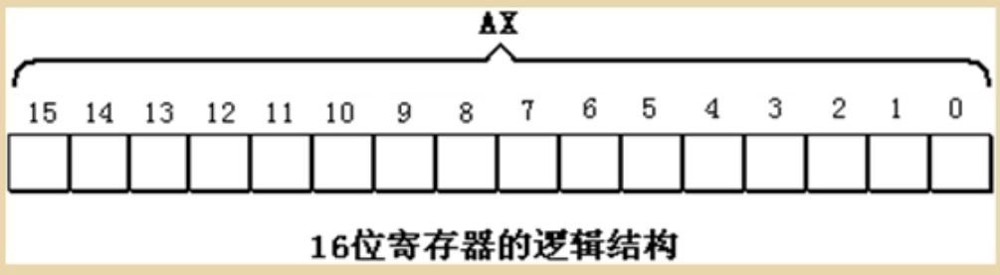
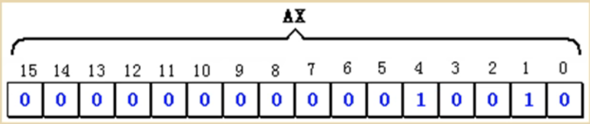
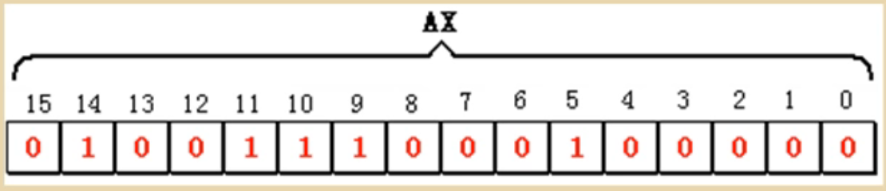
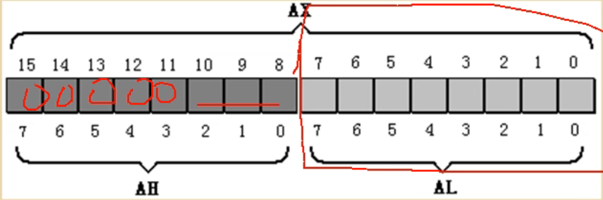
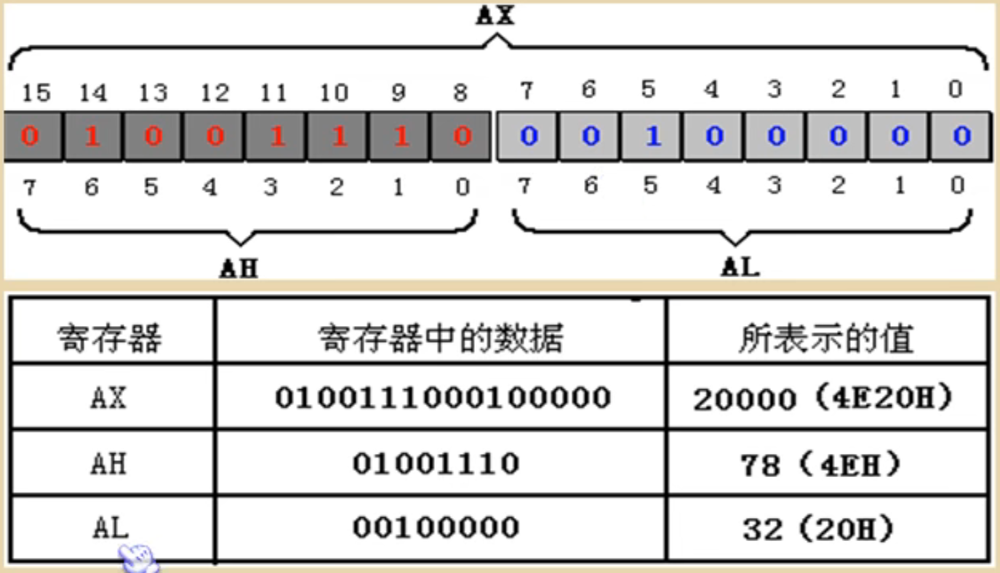
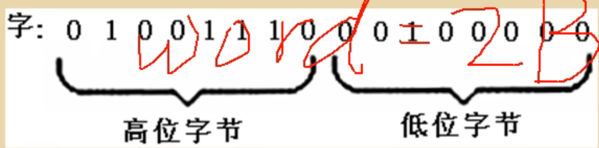

# 寄存器--CPU工作原理

CPU概述

一个典型的CPU由运算器、挫制器、寄存器等器件组成，这些器件靠内部总线相连。

区别：

- **内部总线**实现CPU内部名个器件之间的联系。
- **外部总线**实现CPU和主板上其它器件的联系。

8086CPU有14个寄存器，名称分别为：

AX、BX、CX、DX、SI、DI、SP、BP、IP、CS、SS、DS、ES、PSW

8086CPU所有的寄存器都是16为的，可以存放两个字节。

## 通用寄存器

AX、BX、CX、DX通常存放一些一般性数据被称为通用寄存器。

下面以AX为例，看一下寄存器的逻辑结构。

16位数据在寄存器中的存放情况：

数据：18

二进制表示：10010

在寄存器AX中的存储：

数据：20000

二进制表示：0100111000100000

在寄存器AX中的存储：

最大值：2^16^-1

8086上一代CPU中寄存器都是8位的；

为保证兼容性，这四个寄存器都可以分为两个独立的8位寄存器使用。

- AX可以分为AH和AL；
- BX可以分为BH和BL；
- CX可以分为CH和CL；
- DX可以分为DH和DL。

以AX为例，8086CPU的16位寄存器分为两个8位寄存器的情况：

AX的低8位(0位-7位)构成了AL寄存器,高8位(8位-15位)构成了AH寄存器。

AH和AL寄存器是可以独立用的8位寄存器。

## 字在寄存器中的存储

一个字可以存在一个16位客存器中，这个字的高位字节和低位字节然就存在这个寄存器的高8位寄存器和低8位寄存器中。

由于一个内存单元可以存放8位数据，CPU中的客存器又可存放n个8位数据。也就是说，计算机中的数据大多是由N个8位数据构成的。用十六进制来表示数据可以直观的看出这个数据是由哪些8位数据构成的。**每两位对应一个八进制**!

## 几条汇编指令

汇编指令举例：

| 汇编指令  | 控制CPU完成的操作                  | 用高级语言的语法描述 |
| --------- | ---------------------------------- | -------------------- |
| mov ax,18 | 将18送入AX                         | AX = 18              |
| mov ah,78 | 将78送入AH                         | AH = 78              |
| add ax,8  | 将寄存器AX中的数值加上8            | AX = AX + 8          |
| mov ax,bx | 将寄存器BX中的数据送入寄存器AX中   | AX = BX              |
| add ax,bx | 将AX, BX中的内容相加，结果存在AX中 | AX = AX + BX         |

汇编指令不区分大小写！

CPU执行下表中的程序段的每条指令后，对寄存器中的数据进行的改变。

程序段中指令执行情况之一（原AX中的值：0000H，原BX中的值：0000H）

| 程序段中的指令 | 执行指令后AX中的数据 | 执行指令后BX中的数据 |
| -------------- | -------------------- | -------------------- |
| mov ax,4E20H   | 4E20H                | 0000H                |
| add ax,1406H   | 6226H                | 0000H                |
| mov bx,2000H   | 6226H                | 2000H                |
| add ax,bx      | 8226H                | 2000H                |
| mov bx,ax      | 8226H                | 8226H                |
| add ax,bx      | 044CH ？             | 8226H                |

程序段中指令执行情况之二（原AX中的值：0000H，原BX中的值：0000H）

| 程序段中的指令 | 执行指令后AX中的数据 | 执行指令后BX中的数据 |
| -------------- | -------------------- | -------------------- |
| mov ax,001AH   | 001AH                | 0000H                |
| add ax,0026H   | 001AH                | 0026H                |
| add al,bl      | 0040H                | 0026H                |
| add ah,bl      | 2640H                | 0026H                |
| add bh,al      | 2640H                | 4026H                |
| mov ah,0       | 0040H                | 4026H                |
| add al,85H     | 00C5H                | 4026H                |
| add al,93H     | 0058H ?              | 4026H                |

进位

## 物理地址

16位结构的CPU

8086CPU给出物理地址的方法

短地址×16+偏移地址=物理地址的本质含义

段的概念

段寄存器

CS和IP

代码段

